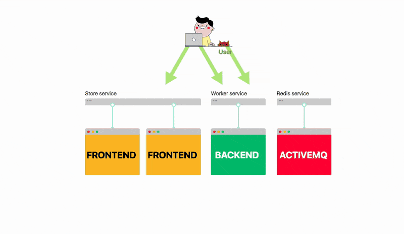

# 使用容器打包应用程序并将应用程序部署到Kubernetes

## 启动`minikube`作为项目集群

你验证了应用程序的工作原理，现在是时候部署它了。

**此时，你可以启动`VPS`，安装`Tomcat`，并花些时间制作自定义脚本来测试，构建，打包和部署应用程序。**

或者你可以编写你希望拥有的描述：**一个消息代理和两个使用负载均衡器部署的应用程序。**

诸如Kubernetes之类的编排器可以阅读你的愿望清单并提供正确的基础设施。

由于花在基础架构上的时间减少意味着更多的时间编码，这次你将把应用程序部署到`Kubernetes`。但在开始之前，你需要一个`Kubernetes`集群。

你可以注册Google云平台或Azure，并使用Kubernetes提供的云提供商服务。或者，你可以在将应用程序移动到云上之前在本地尝试`Kubernetes`。

`minikube`是一个打包为虚拟机的本地Kubernetes集群。如果你使用的是Windows，Linux和Mac，那就太好了，因为创建群集需要五分钟。

你还应该安装`kubectl`，即连接到你的群集的客户端。

你可以从[官方文档](https://kubernetes.io/docs/tasks/tools/)中找到有关如何安装`minikube`和`kubectl`的说明。

**你应该启动一个具有`8GB RAM`和一些额外配置的集群**：

```
minikube start \
  --memory 8096 \
  --extra-config=controller-manager.horizontal-pod-autoscaler-upscale-delay=1m \
  --extra-config=controller-manager.horizontal-pod-autoscaler-downscale-delay=2m \
  --extra-config=controller-manager.horizontal-pod-autoscaler-sync-period=10s
```
请注意，如果你使用的是预先存在的`minikube`实例，则可以通过销毁`VM`来重新调整`VM`的大小。只需添加`--memory8096`就不会有任何影响。

验证安装是否成功。你应该看到以列表形式展示的一些资源。集群已经准备就绪，也许你应该立即开始部署？

**还不行。**

你必须先装好你的东西。

## 将项目代码打包到`docker image`

部署到`Kubernetes`的应用程序必须打包为容器。毕竟，`Kubernetes`是一个容器编排器，所以它本身无法运行你的`jar`。

容器类似于`fat jar`：**它们包含运行应用程序所需的所有依赖项。甚至`JVM`也是容器的一部分。所以他们在技术上是一个更胖的`fat-jar`。**

将应用程序打包为容器的流行技术是Docker。


虽然Docker是最受欢迎的，但它并不是唯一能够运行容器的技术。其他受欢迎的选项包括`rkt`和`lxd`。

如果你没有安装Docker，可以按照[`Docker`官方网站上的说明进行操作](https://docs.docker.com/install/)。

通常，你构建容器并将它们推送到仓库。它类似于向`Artifactory`或`Nexus`推送`jar`包。**但在这种特殊情况下，你将在本地工作并跳过仓库部分。**实际上，你将直接在minikube中创建容器镜像。

首先，按照此命令打印的说明将`Docker`客户端连接到`minikube`：

```
minikube docker-env
```

> 请注意，如果切换终端，则需要重新连接`minikube`内的`Docker`守护程序。每次使用不同的终端时都应遵循相同的说明。

**并从项目的根目录构建容器镜像：**

```
docker build -t spring-k8s-hpa .
```

你可以验证镜像是否已构建并准备好运行：


```
docker images | grep spring
```
很好。

集群已准备好，你打包应用程序，也许你已准备好立即部署？

**是的，你最终可以要求`Kubernetes`部署应用程序。**


## 将你的应用程序部署到Kubernetes

你的应用程序有三个组件：


* **呈现前端的`Spring Boot`应用程序**
* **`ActiveMQ`作为消息代理**
* **处理事务的`Spring Boot`后端**

你应该分别部署这三个组件。

对于每个组件你都应该创建：

* `Deployment`对象，描述部署的容器及其配置
* 一个`Service`对象，**充当`Deployment`部署创建的应用程序的所有实例的负载均衡器**

部署中的每个应用程序实例都称为Pod。




## 部署ActiveMQ

让我们从ActiveMQ开始吧。

你应该创建一个`activemq-deployment.yaml`文件，其中包含以下内容：

```
apiVersion: extensions/v1beta1
kind: Deployment
metadata:
  name: queue
spec:
  replicas: 1
  template:
    metadata:
      labels:
        app: queue
    spec:
      containers:
      - name: web
        image: webcenter/activemq:5.14.3
        imagePullPolicy: IfNotPresent
        ports:
          - containerPort: 61616
        resources:
          limits:
            memory: 512Mi
```

该模板冗长但直接易读：

* 你从名为`webcenter/activemq`的官方仓库中请求了一个`activemq`容器
* 容器在端口`61616`上公开消息代理
* 为容器分配了`512MB`的内存
* **你要求提供单个副本** - 你的应用程序的单个实例

使用以下内容创建`activemq-service.yaml`文件：

```
apiVersion: v1
kind: Service
metadata:
  name: queue
spec:
  ports:
  - port: 61616 
    targetPort: 61616
  selector:
    app: queue
```

这个yaml表示：

* 你创建了一个公开端口`61616`的负载均衡器
* 传入流量分发到所有具有`app：queue`类型标签的`Pod`（请参阅上面的部署）
* `targetPort`是`Pod`暴露的端口

你可以使用以下命令创建资源：

```
kubectl create -f activemq-deployment.yaml
kubectl create -f activemq-service.yaml
```

你可以使用以下命令验证数据库的一个实例是否正在运行：

```
kubectl get pods -l=app=queue
```

## 部署前端

使用以下内容创建`fe-deployment.yaml`文件：

```
apiVersion: extensions/v1beta1
kind: Deployment
metadata:
  name: frontend
spec:
  replicas: 1
  template:
    metadata:
      labels:
        app: frontend
    spec:
      containers:
      - name: frontend
        image: spring-boot-hpa
        imagePullPolicy: IfNotPresent
        env:
        - name: ACTIVEMQ_BROKER_URL
          value: "tcp://queue:61616"
        - name: STORE_ENABLED
          value: "true"
        - name: WORKER_ENABLED
          value: "false"
        ports:
        - containerPort: 8080
        livenessProbe:
          initialDelaySeconds: 5
          periodSeconds: 5
          httpGet:
            path: /health
            port: 8080
        resources:
          limits:
            memory: 512Mi
```

有一些新的字段：

* 有一个`section`可以注入环境变量 `env: name: value:`
* **还有`Liveness探针`，可以告诉你应用程序何时可以接受流量**

使用以下内容创建`fe-service.yaml`文件：

```
apiVersion: v1
kind: Service
metadata:
  name: frontend
spec:
  ports:
  - nodePort: 32000
    port: 80
    targetPort: 8080
  selector:
    app: frontend
  type: NodePort
```

你可以使用以下命令创建资源：

```
kubectl create -f fe-deployment.yaml
kubectl create -f fe-service.yaml
```

你可以使用以下命令验证前端应用程序的一个实例是否正在运行：


```
kubectl get pods -l=app=frontend
```

## 部署后端

```
apiVersion: extensions/v1beta1
kind: Deployment
metadata:
  name: backend
spec:
  replicas: 1
  template:
    metadata:
      labels:
        app: backend
      annotations:
        prometheus.io/scrape: 'true'
    spec:
      containers:
      - name: backend
        image: spring-boot-hpa
        imagePullPolicy: IfNotPresent
        env:
        - name: ACTIVEMQ_BROKER_URL
          value: "tcp://queue:61616"
        - name: STORE_ENABLED
          value: "false"
        - name: WORKER_ENABLED
          value: "true"
        ports:
        - containerPort: 8080
        livenessProbe:
          initialDelaySeconds: 5
          periodSeconds: 5
          httpGet:
            path: /health
            port: 8080
        resources:
          limits:
            memory: 512Mi
```

使用以下内容创建`backend-service.yaml`文件：

```
apiVersion: v1
kind: Service
metadata:
  name: backend
  spec:
    ports:
    - nodePort: 31000
      port: 80
      targetPort: 8080
    selector:
      app: backend
    type: NodePort
```

你可以使用以下命令创建资源：

```
kubectl create -f backend-deployment.yaml
kubectl create -f backend-service.yaml
```

你可以验证后端的一个实例是否正在运行：

```
kubectl get pods -l=app=backend
```

部署完成。

**你可以使用以下命令在浏览器中访问该应用程序：**


```
minikube service backend
```

```
minikube service frontend
```

如果它有效，你应该尝试购买一些物品！

是的，如果有足够的时间，`worker`将处理所有待处理的消息。


你刚刚将应用程序部署到`Kubernetes`！


