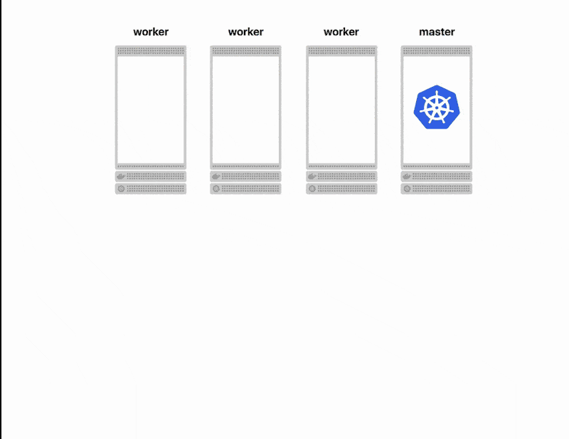

# 在Kubernetes中利用`Prometheus`以及`Metrics`进行自动扩展部署以及负载测试

## 公开应用程序指标

**Kubernetes如何知道何时扩展你的申请？**

很简单，你必须告诉它。

自动调节器通过监控指标来工作。只有这样，它才能增加或减少应用程序的实例。

因此，**你可以将队列长度公开为度量标准**，**并要求`autoscaler`观察该值**。

#### 队列中的待处理消息越多，`Kubernetes`将创建的应用程序实例就越多。

那么你如何公开这些指标呢？

**应用程序具有`/metrics`端点以显示队列中的消息数**。如果你尝试访问该页面，你会注意到以下内容：

```
# HELP messages Number of messages in the queue
# TYPE messages gauge
messages 0
```

应用程序不会将指标公开为`JSON`格式。

格式为纯文本，是公开[`Prometheus`指标的标准](https://prometheus.io/docs/concepts/metric_types/)。不要担心记忆格式。

大多数情况下，你将使用其中一个[`Prometheus`客户端库](https://prometheus.io/docs/instrumenting/clientlibs/)。
	
## 在Kubernetes中使用应用程序指标

你几乎已准备好进行自动缩放——但你应首先安装度量服务器。实际上，默认情况下，**`Kubernetes`不会从你的应用程序中提取指标。如果你愿意，可以启用[`Custom Metrics API`](https://github.com/kubernetes-incubator/custom-metrics-apiserver)**。

要安装Custom Metrics API，你还需要Prometheus - 时间序列数据库。安装`Custom Metrics API`所需的所有文件都可以方便地打包在[`learnk8s/spring-boot-k8s-hpa`](https://github.com/learnk8s/spring-boot-k8s-hpa)中

### 我的关于[HPA-Metrics的文章](https://github.com/Chao-Xi/JacobTechBlog/blob/master/k8s_tutorial/k8s_adv28_hpa_vpa.md#hpa---ingress-custom-metrics)

你应下载该存储库的内容，并将当前目录更改为该项目的monitoring文件夹。

```
cd spring-boot-k8s-hpa/monitoring
```
从那里，你可以创建自定义指标API：

```
kubectl create -f ./metrics-server
kubectl create -f ./namespaces.yaml
kubectl create -f ./prometheus
kubectl create -f ./custom-metrics-api
```

任务完成！

你已准备好使用指标。

实际上，你应该已经找到了队列中消息数量的自定义指标：

```
kubectl get --raw "/apis/custom.metrics.k8s.io/v1beta1" | jq .
```
恭喜，**你有一个公开指标的应用程序和使用它们的指标服务器**。

你最终可以启用自动缩放器！

## 在Kubernetes中进行自动扩展部署

Kubernetes有一个名为`Horizontal Pod Autoscaler`的对象，用于监视部署并上下调整Pod的数量。

你将需要其中一个来自动扩展实例。


你应该创建一个包含以下内容的`hpa.yaml`文件：

```
apiVersion: autoscaling/v2beta1
kind: HorizontalPodAutoscaler
metadata:
  name: spring-boot-hpa
spec:
  scaleTargetRef:
    apiVersion: extensions/v1beta1
    kind: Deployment
    name: backend 
  minReplicas: 1
  maxReplicas: 10
  metrics:
  - type: Pods
    pods:
      metricName: messages
      targetAverageValue: 10
```

这个文件很神秘，所以让我为你翻译一下：


* Kubernetes监视`scaleTargetRef`中指定的部署。在这种情况下，**它是工人(workers)**。
* 你正在使用`messages`指标**(metrics)**来扩展你的`Pod`。**当队列中有超过十条消息时，Kubernetes将触发自动扩展**。
* **至少，部署应该有两个`Pod`。`10`个Pod是上限。**

你可以使用以下命令创建资源：

```
kubectl create -f hpa.yaml
```

**自动定标器表示它能够将Pod扩展到2，并且它已准备好监视部署。**

令人兴奋的东西，但它有效吗？

## 负载测试

只有一种方法可以知道它是否有效：**在队列中创建大量消息。**

**转到前端应用程序并开始添加大量消息**。

在添加消息时，使用以下方法监视`Horizontal Pod Autoscaler`的状态：

```
kubectl describe hpa
```

**Pod的数量从`2`上升到`4`，然后是`8`，最后是`10`。**


该应用程序随消息数量而变化！欢呼！


你刚刚部署了一个完全可伸缩的应用程序，**可根据队列中的待处理消息数进行扩展。**

另外，缩放算法如下：

```
MAX(CURRENT_REPLICAS_LENGTH * 2, 4)
```

在解释算法时，文档没有多大帮助。你可以在代码中找到详细信息。此外，每分钟都会重新评估每个放大，而每两分钟缩小一次。

You can find the [details in the code](https://github.com/kubernetes/kubernetes/blob/bac31d698c1eed2b54374bdabfd120f7319dd5c8/pkg/controller/podautoscaler/horizontal.go#L588).

以上所有都是可以调整的设置。

但是你还没有完成。


## 什么比自动缩放实例更好？ 自动缩放集群

**跨节点缩放Pod非常有效。但是，如果集群中没有足够的容量来扩展`Pod`，该怎么办？**

如果达到峰值容量，`Kubernetes`将使`Pod`处于暂挂状态并等待更多资源可用。

如果你可以使用类似于`Horizontal Pod Autoscaler`的自动缩放器，但对于节点(nodes)则会很棒。


好消息！


**你可以拥有一个集群自动缩放器，可以在你需要更多资源时为`Kubernetes`群集添加更多节点。**



**集群自动缩放器具有不同的形状和大小。它也是特定于云提供商的。** 例如，你可以查看我关于[cluster autoscaler介绍](https://github.com/Chao-Xi/JacobTechBlog/blob/master/k8s_tutorial/k8s_adv28_hpa_vpa.md#clusterautoscaler---%E6%89%A9%E5%AE%B9)的文章


**请注意，你将无法使用`minikube`测试自动缩放器，因为它根据定义是单节点。**


你可以在GitHub上找到有关集群[自动调节器](https://github.com/kubernetes/autoscaler/tree/master/cluster-autoscaler#cluster-autoscaler)和[云提供程序实现](https://github.com/kubernetes/autoscaler/tree/master/cluster-autoscaler#deployment)的更多信息。
