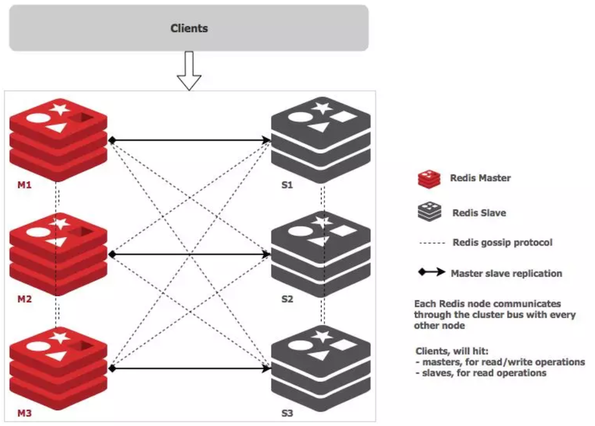
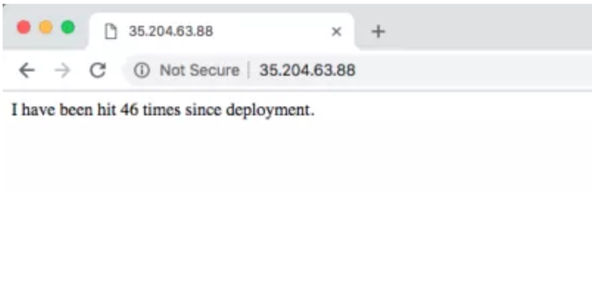
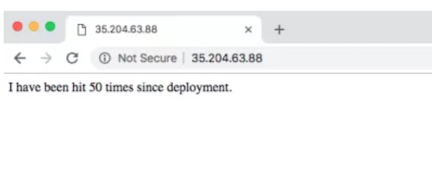

# 如何在Kubernetes上部署Redis集群

## 介绍

`Redis`（`REmote DIctionary Server`的意思）是一个开源的内存数据存储，通常用作数据库、缓存以及消息代理。**它可以存储和操作高级的数据结构类型，比如`lists`、`maps`、`sets`以及排序sets**。Redis接受多种格式的键，因此可以在服务器上执行操作，减少客户端的工作负载。它将数据库完全地保存在内存中，只使用磁盘进行持久化存储。Redis是一种流行的数据存储解决方案，受到了Github、Pinterest、Snapchat、Twitter、StackOverflow、Flickr等科技巨头的青睐。


## 为什么要用Redis？

* 它非常快，它由ANSIC编写，可以在**Linux**、**Mac OS X**和**Solaris**等POSIX系统上运行。
* **`Redis`经常被评为最流行的键值数据库以及在容器上使用最流行的NoSQL数据库。**
* 它的缓存解决方案减少了对云数据库后端的调用。
* **应用程序可以通过客户端API库访问它**。
* **所有流行的编程语言都支持Redis。**
* 它开源且非常稳定的。


## Redis的应用案例

* `Facebook`的一些在线游戏中，游戏分数更新频率非常高。当使用`Redis`排序`set`时，即使每分钟有数百万用户和数百万个新分数，执行这些操作都非常简单。
* `Twitter`在`Redis`集群中存储了所有用户的时间线。
* `Pinterest`将用户关注者图存储在`Redis`集群中，其中的数据分布在数百个实例中。
* `Github`使用`Redis`作为队列


## 什么是Redis集群？

* `Redis`集群是一个多`Redis`实例的集合，**用于通过对数据库分区来扩展数据库，使其更具有弹性**。
* 集群中的每个成员，无论是主副本还是次级副本，都管理哈希槽的一个子集。
* 如果一个主服务器出现不能访问的故障，**那么它的从属服务器会提升为主服务器**。
* 在由三个主节点组成的最小的`Redis`集群中，每个主节点都有一个从属节点（为了至少能保证最低程度的故障转移），每个主节点分配一个范围在`0`至`16383`之间的哈希槽。
* 节点`A`包含哈希槽范围为从`0`到`5000`，节点B为`5001`到`10000`，节点C从`10001`到`18383`。
* **集群内部的通信则通过内部总线进行**，使用`gossip协议`来传播关于集群的信息或者发现新节点。



## 在Kubernetes上部署Redis集群


在Kubernetes中部署Redis集群很有挑战，因为每个Redis实例都依赖于一个配置文件，该文件跟踪其他集群实例及其角色。

### 为此，我们需要结合使用`Kubernetes`状态集（StatefulSets）和持久卷（`PersistentVolumes`）。

### 前期准备

```
$ kubectl get nodes 
NAME                                   STATUS ROLES  AGE VERSION 
gke-c-8dcng-default-pool-08c0a15c-2gpw Ready  <none> lh  v1.11.2-gke.18 
gke-c-8dcng-default-pool-08c0a15c-4q79 Ready  <none> lh  v1.11.2-gke.18 
gke-c-8dcng-default-pool-08c0a15c-g9zv Ready  <none> lh  v1.11.2-gke.18 
```

## 部署Redis


接着部署Redis集群，我们既可以通过`kubectl`来应用YAML文件，下面列出了我们所有需要的YAML文件。

YAML内容如下：

**`redis-sts.yaml`**

```
---
apiVersion: v1 
kind: ConfigMap 
metadata: 
	name: redis-cluster
data: 
	update-node.sh: | 
		#!/bin/sh 
		REDIS_NODES="/data/nodes.conf" 
		sed -i -e "/myself/ s/[0-9]\{1,3\}\.[0-9]\{1,3\}\.[0-9]\{1,3\}/{POD_IP}/" ${REDIS_NODES} 
		exec "$@" 
	redis.conf: |+ 
		cluster-enabled yes 
		cluster-require-full-covcr no 
		cluster-node-timeout 15000 
		cluster-config-file /data/nodes.conf 
		cluster-migration-barrier 1 
		appendonly yes 
		protected-mode no 
---
apiVersion: apps/v1 
kind: StatefulSet 
metadata: 
	name: redis-cluster 
spec: 
	serviceName: redis-cluster 
	replicas: 6 
	selector: 
		matchLabels: 
			app: redis-cluster 
	template: 
		metadata: 
			labels: 
				app: redis-cluster 
		spec: 
			containers: 
			- name: redis 
			  image: redis:5.0.1-alpine 
			  ports: 
			  - containerPort: 6379 
			    name: client
			  - containerPort: 16379 
			    name: gossip 
            command: ["/conf/update-node.sh", "redis-server", "/conf/redis.conf"]
            env: 
            - name: POD_IP 
              valueFrom: 
              	fieldRef: 
              		fieldPath: status.podIP 
            volumeMounts: 
            - name: conf 
              mountPath: /conf 
              readOnly: false 
            - name: data 
              mountPath: /data 
              readOnly: false 
            volumes: 
            - name: conf 
              configMap: 
              	name: redis-cluster 
              	defaultMode: 0755 
	volumeClaimTemplates: 
	- metadata: 
	  	name: data 
	  spec:
	  	accessModes: [ "ReadWriteOnce" ] 
	  	resources: 
	  		requests: 
	  			storage: 1Gi 
```

**`redis-svc.yaml`**

```
---
apiVersion: vi 
kind: Service 
metadata: 
	name: redis-cluster 
spec: 
	type: ClusterlP 
	ports: 
	- port: 6379 
	  targetPort: 6379 
	  name: client 
	- port: 16379 
	  targetPort: 16379 
	  name: gossip 
	selector: 
		app: redis-cluster 
```

```
$ kubectl apply -f redis-sts.yaml 
configmap/redis-cluster created 
statefulset.apps/redis-cluster created
 
$ kubectl apply -f redis-svc.yaml 
service/redis-cluster created 
```

## 验证部署


检查`Redis`节点是否启动并运行：

```
$ kubectl get pods
NAME            READY STATUS RESTARTS AGE 
redis-cluster-0 1/1   Running 0 7m 
redis-cluster-1 1/1   Running 0 7m 
redis-cluster-2 1/1   Running 0 6m 
redis-cluster-3 1/1   Running 0 6m 
redis-cluster-4 1/1   Running 0 6m 
redis-cluster-5 1/1   Running 0 5m 
```

下面的6个卷是我们创建的

```
$ kubectl get pv
NAME                                       CAPACITY   ACCESS MODES   RECLAIM POLICY   STATUS   CLAIM                          STORAGECLASS   REASON   AGE
pvc-ae61ad5c-f0a5-11e8-a6e0-42010aa40039   1Gi        RWO            Delete           Bound    default/data-redis-cluster-0   standard                7m
pvc-b74b6ef1-f0a5-11e8-a6e0-42010aa40039   1Gi        RWO            Delete           Bound    default/data-redis-cluster-1   standard                7m
pvc-c4f9b982-f0a5-11e8-a6e0-42010aa40039   1Gi        RWO            Delete           Bound    default/data-redis-cluster-2   standard                6m
pvc-cd7af12d-f0a5-11e8-a6e0-42010aa40039   1Gi        RWO            Delete           Bound    default/data-redis-cluster-3   standard                6m
pvc-d5bd0ad3-f0a5-11e8-a6e0-42010aa40039   1Gi        RWO            Delete           Bound    default/data-redis-cluster-4   standard                6m
pvc-e3206080-f0a5-11e8-a6e0-42010aa40039   1Gi        RWO            Delete           Bound    default/data-redis-cluster-5   standard                5m
```

我们可以检查任何一个pod，看看它添加的卷：

```
$ kubectl describe pods redis-cluster-0 | grep pvc
  Normal  SuccessfulAttachVolume  29m   attachdetach-controller                          AttachVolume.Attach succeeded for volume "pvc-ae61ad5c-f0a5-11e8-a6e0-42010aa40039"
```


### 部署Redis集群

下一步就是创建Redis集群了。为此，我们需要运行以下命令，输入`yes`接受配置。前三个节点成为主节点，最后三个节点设置为从属节点。

```
$ kubectl exec -it redis-cluster-0 -- redis-cli --cluster create --cluster-replicas 1 $(kubectl get pods -l app=redis-cluster -o jsonpath='{range.items[*]}{.status.podIP}:6379 ')
```

以下是完整的输出命令：

```
M: 754823247cf28af9a2a82f61a8caaa63702275a0 10.60.2.13:6379
   slots:[10923-16383] (5461 slots) master
   1 additional replica(s)
M: 3f119dcdd4a33aab0107409524a633e0d22bac1a 10.60.1.12:6379
   slots:[5461-10922] (5462 slots) master
   1 additional replica(s)
S: e40ae789995dc6b0dbb5bb18bd243722451d2e95 10.60.2.14:6379
   slots: (0 slots) slave
   replicates 3f119dcdd4a33aab0107409524a633e0d22bac1a
S: 8d627e43d8a7a2142f9f16c2d66b1010fb472079 10.60.1.14:6379
   slots: (0 slots) slave
   replicates 754823247cf28af9a2a82f61a8caaa63702275a0
[OK] All nodes agree about slots configuration.
>>> Check for open slots...
>>> Check slots coverage...
[OK] All 16384 slots covered.
```

### 验证集群部署

```
$ kubectl exec -it redis-clusrer-0 -- reddis-cli  cluster info
```

### 测试Redis集群

我们希望使用集群并且模拟节点故障。对于前一个任务，我们将部署一个简单的python应用程序，而后一个任务，我们将删除一个节点来观察集群行为。

### 部署Hit Counter应用

我们将在集群中部署一个简单的应用程序，并在其之前放置一个负载均衡器。该应用程序的目的是在将计数器的值作为HTTP响应返回值返回之前，增加计数器的值，并将值存到Redis集群上。

YAML内容如下：

`app-deployment-service.yaml`

```
---
apiVersion: v1 
kind: Service 
metadata: 
	name: hit-counter-lb 
spec: 
	type: LoadBalancer 
	ports: 
	- port: 80 
	  protocol: TCP 
	  targetPort: 5000 
	selector: 
		app: myapp 
---
apiVersion: apps/v1 
kind: Deployment 
metadata: 
	name: hit-counter-app 
spec: 
	replicas: 1 
	selector: 
		matchLabels: 
			app: myapp 
	template: 
		metadata: 
			labels: 
				app: myapp 
		spec: 
			containers: 
			- name: myapp 
			  image: calinrus/api-redis-ha:1.0 
			  ports: 
			  - containerPort: 5000 
```

使用`kubectl`

```
$ kubectl apply -f app-deployment-service.yaml 
service/hit-counter-lb created 
deployment. apps/hit-counter-app created 
```

到了这一步，我们可以用浏览器访问IP，生成hit counter的值：



### 模拟节点故障

**我们可以通过删除pod（使用kubectl）来模拟集群成员的故障。当我们删除原先是`master`的`redis-cluster-0`时，我们看到`Kubernetes`将`redis-cluster-3`提升为`master`，而当`redis-cluster-0`重新回来时，`redis-cluster-3`会重新恢复从属身份。**

#### 之前


```
$ kubectl describe pods redis-cluster-0 | grep IP 
IP:        10.28.0.5 
    POD_IP:    (v1:status.podIP) 
    
$ kubectl describe pods redis-cluster-3 | grep IP 
IP:        10.28.0.6 
   POD_IP:     (v1:status.podIP)
     
$ kubectl exec -it redis-cluster-0 -- redis-cli role 
1) "master" 
2) (integer) 1859 
3) 1) 1) "10.28.0.6" 
      2) "6379"  
      3) "1859" 

$ kubectl exec -it redis-cluster-3 redis-cli role 
1) "slave" 
2) "10.28.0.5" 
3) (integer) 6379
4) "connected" 
5) (integer) 1859 
```

#### 之后

```
$ kubectl exec -it redis-cluster-O -- redis-cli role 
1) "slave" 
2) "10.28.0.6" 
3) (integer) 6379 
4) "connected" 
5) (integer) 2111 


$ kubectl exec -it redis-cluster-3 redis-cli role 
1) "master" 
2) (integer) 2111 
3) 1) 1) "10.28.2.12" 
      2) "6379" 
      3) "2111"
```

我们可以看到`redis-cluster-0`的IP发生了变化，那么集群是如何恢复的呢？

在创建集群时，我们创建了`ConfigMap`，该`ConfigMap`又在`/conf/update-node.sh`处创建了一个脚本，容器在启动时调用该脚本。该脚本使用本地节点的新IP地址更新`Redis`配置。有了`config`中的新`IP`，集群就可以在新的`pod`中以不同的`IP`地址启动并恢复。

在这个过程中，如果我们继续加载页面，计数器仍会继续增加，在集群收敛之后，我们会看到没有丢失任何数据。




## 结论

Redis是一个强大的数据存储和缓存工具。因为Redis存储数据的方式，Redis集群更是能通过提供分片、相关性能优势、线性扩展和高可用性，来进一步扩展其功能。数据在多个节点之间自动分割，即使节点的子集出现故障或者不能和集群其他部分通信，操作仍然能够继续。

* 有关Redis集群的更多信息，[请访问教程](https://redis.io/topics/cluster-tutorial)或者[文档](https://redis.io/topics/cluster-spec)


