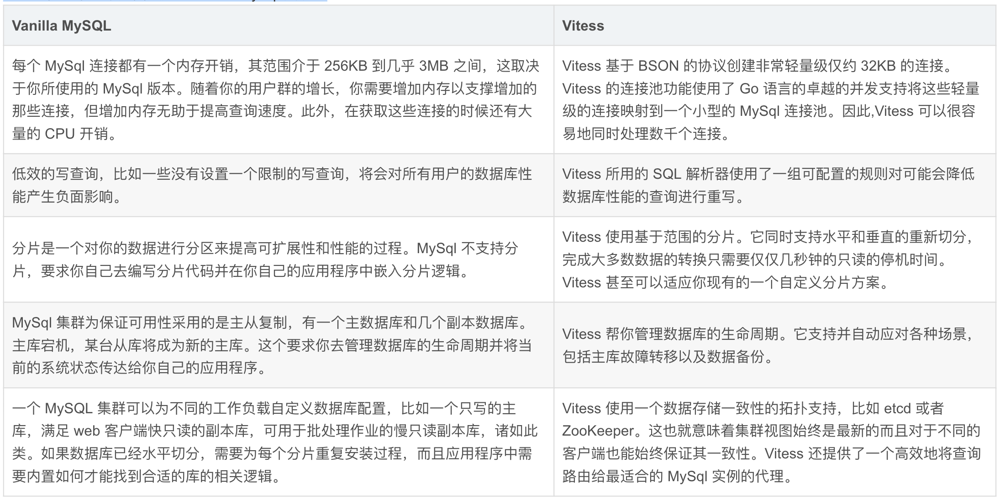
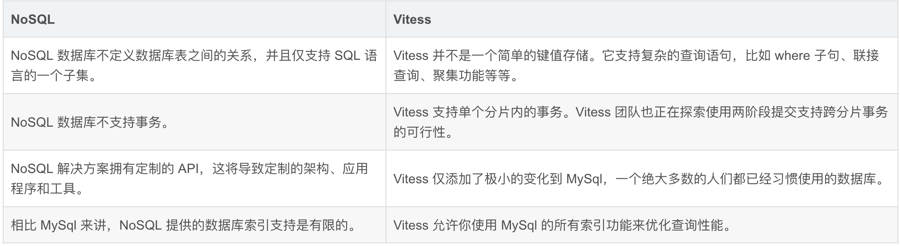
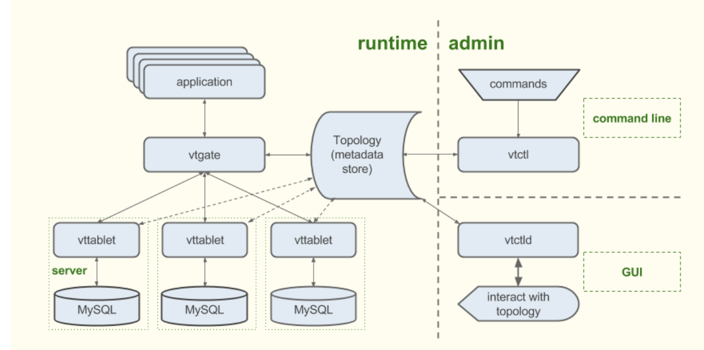

# 深入理解开源数据库中间件 Vitess：核心特性以及如何进行数据存储的堆叠

## 概述

`Vitess` 是一个用于 `MySql` 扩展的数据库解决方案。它以能够像运行在专用硬件上那样有效地运行于云体系。它集 `MySql` 数据库的很多重要特性和 `NoSQL` 数据库的可扩展性于一体。`Vitess` 已经成功侍服了 2011 年以来所有的 YouTube 数据库流量。

### Kubernetes 上的 Vitess

Kubernetes 是 Google 开源的 Docker 容器集群管理系统，Vitess 是 Kubernetes 用户的逻辑存储引擎的一个可选项。
Kubernetes 对一个计算集群中的节点进行调度，对这些节点之上的负载进行管理，并对包含有同一应用的容器进行分组以易于管理和发现。使用 Kubernetes，你可以很容易去创建和管理一个 Vitess 集群，可谓开箱即用。

### 本机硬件上的 Vitess

略

### 与其他存储选择的对比

接下来将 `Vitess` 去对比两种通用解决方案，一个 `vanilla MySQL` 实现和一个 `NoSQL`。

## Vitess vs. Vanilla MySQL

Vitess 在以下几个方面改进了 `vanilla MySql` 实现：

### Vitess

* Vitess 基于 BSON 的协议创建非常轻量级仅约 32KB 的连接。Vitess 的连接池功能使用了 Go 语言的卓越的并发支持将这些轻量级的连接映射到一个小型的 MySql 连接池。因此,Vitess 可以很容易地同时处理数千个连接。
* Vitess 所用的 SQL 解析器使用了一组可配置的规则对可能会降低数据库性能的查询进行重写。
* Vitess 使用基于范围的分片。它同时支持水平和垂直的重新切分，完成大多数数据的转换只需要仅仅几秒钟的只读的停机时间。Vitess 甚至可以适应你现有的一个自定义分片方案。
* Vitess 帮你管理数据库的生命周期。它支持并自动应对各种场景，包括主库故障转移以及数据备份。
* **`Vitess` 使用一个数据存储一致性的拓扑支持，比如 `etcd` 或者 `ZooKeeper`。这也就意味着集群视图始终是最新的而且对于不同的客户端也能始终保证其一致性**。Vitess 还提供了一个高效地将查询路由给最适合的 MySql 实例的代理。

### Vitess vs. NoSQL

如果你主要是因为担心 MySql 的可伸缩性而在考虑一个 NoSQL 的解决方案的话，那么 Vitess 很可能就是你应用程序的一个更合适的选择。尽管 NoSQL 提供了强大的非结构化数据支持，但 Vitess 却提供了更多 NoSQL 数据存储所不具备的优势：

* Vitess 并不是一个简单的键值存储。它支持复杂的查询语句，比如 where 子句、联接查询、聚集功能等等。
* Vitess 支持单个分片内的事务。Vitess 团队也正在探索使用两阶段提交支持跨分片事务的可行性
* Vitess 仅添加了极小的变化到 MySql，一个绝大多数的人们都已经习惯使用的数据库。
* Vitess 允许你使用 MySql 的所有索引功能来优化查询性能。

## 特性

### 性能

* **连接池** - 扩展了前端连接的数量，同时优化了 `MySql` 性能。
* **去除重复查询** - 在动态查询还在执行的时候，对于后续任何完全相同的请求都重用同一个动态查询的结果。
* **事务管理器** - 限制并发事务的数量并管理每个事务的执行最后期限以优化整体吞吐量。
* **行缓存** - 对于需要根据主键随机访问的更有效字段的查询维护了一个基于行的缓存(使用 memcached)，这对于 OLTP 工作负载非常有用。(MySql 的缓冲区缓存优化也只是针对索引和表范围的扫描。)。这一卓越特性可以将在应用程序层自定义的缓存层实现给替换掉了。

### 防御

* **查询重写和净化** - 添加限制并防止不确定性的更新。
* **查询黑名单** - 自定义规则以防止潜在的有问题的查询提交到你的数据库。
* **查询杀手** - <mark>终止那些需要很长时间才能返回数据的查询。</mark>
* **表 ACLs** - 根据连接用户为表定义访问控制列表(ACLs)。

### 监控

* **性能分析** - 提供对你的数据库性能进行监控、诊断和分析的工具。
* **查询流水号** - 使用一张记载传入的查询的列表来侍服 OLAP 负载。
* **更新流水号** - 一个记载了数据库中行的变化流水号的服务器，这可以用来作为一种来将更改传播到其他数据存储的机制。

### 拓扑管理工具

* 主库管理工具(处理重新定义)
* 基于 web 的管理界面
* 设计用于多个数据中心/区域的场合

### 分片

* 几乎无缝的重新分片
* 垂直和水平分片的支持
* 内置的基于范围或应用程序而定义的分片支持

## 架构

Vitess 平台由若干服务器进程、命令行工具和基于 web 的工具组成，**具备一致性元数据存储支持。**

根据你自己应用程序的现状，你可以通过许多个不同的程序流程最终实现一个完整的 `Vitess`。比如，如果你正在从头构建一个服务，你的 `Vitess` 之旅应该起始于定义你自己的数据库拓扑。然而，如果你是需要对自己现有数据库进行扩展，那你首先需要部署一个连接代理。

无论你的数据库集群规模大小，`Vitess` 工具和服务器都旨在对你提供帮助。对于较小的实现，**`vttablet` 的一些特性诸如连接池和行缓存可以帮助你对你现有的硬件获得更充分的利用。**

`Vitess` 的自动化工具则为大型实现提供额外的好处。

下图对 Vitess 的相关组件进行说明：

### Topology

`Topology` 服务是一个包含有关于运行中的服务器、分片方案以及主从库结构等信息的元数据存储。该拓扑具备一个一致性数据存储支持。你可以通过使用 **`vtctl`** (命令行)以及 **`vtctld`** (web 界面)浏览你的拓扑。

`Kubernetes` 中的数据存储是 `etcd` 的。`Vitess` 的源代码中还包含有 `Apache` `ZooKeeper` 支持。

### vtgate (is a router)

**`vtgate` 是一个将流量路由到正确的 `vttablet` 并将合并后的结果返回给客户端的轻量级的代理服务器。**

应用程序发送查询给 `vtgate` 服务器。因此客户端逻辑很简单因为它只需要能够找到一个 `vtgate` 实例。

要对查询进行路由，`vtgate` 需要考虑分片方案、需要的延迟、`tablet` 以及它们背后 `MySql` 实例的可用性。

### vttablet(proxy)

**`vttablet` 是位于某台 `MySql` 数据库前边的一台代理服务器。一个 `Vitess` 实现中，每台 `MySql` 实例都有一个 `vttablet`。**

**`vttablet` 扮演着一个试图将 `MySql` 的吞吐量最大化以及保护 `MySql` 规避有害查询的角色。它的特性包括连接池、查询重写以及查询复制。此外，`vttablet` 还会执行 `vtctl` 启动的任务，并且提供用于主从库请求过滤和数据输出的流量服务。**

一个轻量级的 `Vitess` 实现使用 `vttablet` 作为单台 `MySql` 数据库查询服务的智能连接代理。

**通过在你的 `MySql` 数据库前面运行 `vttablet` 并且改变你的应用程序使用 `Vitess` 的客户端替代 `MySql` 驱动，你的应用程序就可以得到 `vttablet` 的连接池、查询重写以及查询复制等一系列优秀特性。**

一个轻量级的 `Vitess` 实现使用 `vttablet` 作为单台 `MySql` 数据库查询服务的智能连接代理。通过在你的 `MySql` 数据库前面运行 `vttablet` 并且改变你的应用程序使用 `Vitess` 的客户端替代 `MySql` 驱动，你的应用程序就可以得到 `vttablet` 的连接池、查询重写以及查询复制等一系列优秀特性。

### vtctl

`vtctl` 是一个用于管理 `Vitess` 集群命令行工具。它允许一个人或应用程序轻松地与一个 Vitess 实现进行交互。使用 `vtctl`，**你可以识别主从库、建表、启动故障转移、进行分片(以及重新分片)操作，等等**。

**`vtctl` 操作的时候，它会根据需要更新锁定服务器。** 

其 `Vitess` 服务器观察到这些变化并相应地做出反应。例如，如果你使用 `vtctl` 将某台主库故障转移到一台新的主库，`vtgate` 看到这一变化之后就会把后续的写操作发给这台新主库。

### vtctld

`vtctld` 是一台允许你浏览存储在锁定服务器的信息的 HTTP 服务器。它可以用于故障诊断，也可用于获取所有服务器及其当前状态的一个高级概述。

### vtworker

`vtworker` 执行一些需要长时间运行的进程。它支持一个插件式的架构并提供了第三方库，这样你可以轻易选择要使用的 `tablet`。该插件可以用于以下类型的工作：

* **resharding differ**：在水平分片的分割以及合并时核查数据完整性的工作
* **vertical split differ**：在垂直分割以及合并时核查数据完整性的工作

* `vtworker` 还允许您轻松地添加其他验证程序。你可以进行 `in-tablet` 完整性检查以验证外键之类的关联关系或者跨片完整性检查，例如，一个密钥空间里的索引表所指向的数据在另一个密钥空间里。

## 其他支持工具

Vitess 还包含有以下工具：

* `mysqlctl`：管理 MySql 实例
* `zk`：`ZooKeeper` 命令行式的客户端和浏览器
* `zkctl`：管理 `ZooKeeper` 实例

