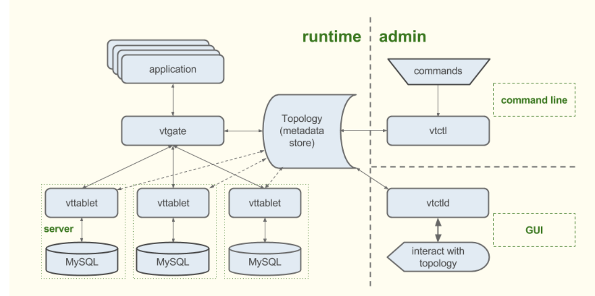

# Kubernetes安装vitess

## 介绍

Vitess是Cloud Native Computing Foundation上的Cloud Native项目的最新毕业生之一。这个项目最初是在YouTube内部开发的，从一开始，它就一直是`MySQL`技术水平扩展数据库集群系统的领先项目。这意味着`Vitess`将`NoSQL`数据库的可伸缩性与`MySQL RDBMS`的所有功能结合在一起。 **`MySQL`本身不包含分片功能，但是使用`Vitess`可以实现此功能，并且应用程序将完全不了解数据库分布式拓扑**。 

`Vitess`的集群功能还将帮助消除`MySQL`高内存连接开销，因为工作量将在多个`MySQL`实例之间分配。 `Vitess`可以安装在裸机服务器上，也可以部署在`Kubernetes Cluster`的云原生环境中。

## Vitess架构

`Vitess`由运行时部分和管理部分组成。管理部分支持管理功能。

主机是`Vitess`的运行时部分，负责将查询从应用程序级别调度到分布式数据后端。通过`vtgate`组件路由应用程序流量，该组件充当轻量级代理。

路由的工作负载在`Tablet`实体之间分配，`Tablet`实体由`vttablet`服务器和大多数位于同一物理服务器上的`mysqld`进程组成。

值得一提的是，在`Kubernetes Vitess`部署中，所有组件都作为独立的`Pod`部署，并通过`Kubernetes`内部网络互连。

根据`Vitess`的术语，该数据库称为**键空间**，**键空间的一部分可以创建多个分片**。

在`Vitess`体系结构中，**表可以分布在水平碎片中，或者不同的表可以位于数据库实例中（垂直拆分）**。

在这两种情况下，数据都存储在多个MySQL副本中，并且当应用程序对幕后真实的数据库拓扑完全不了解时，可以将数据从一个位置移动到另一个位置。有关数据库拓扑的详细信息存储在元数据存储中，`etcd`集群键值数据库支持该元数据存储。



## 如何安装

### 获取`vitessclient`

```
<!--Install go 1.12+-->
go get vitess.io/vitess/go/cmd/vtctlclient

```


### 获取`etcd-operater`

```
git clone https://github.com/coreos/etcd-operator
```

### 获取vitess

```
git clone https://github.com/vitessio/vitess
```


### Create namespace `vitess` 

**ns.yaml**

```
apiVersion: v1
kind: Namespace
metadata:
  name: vitess
```
```
$ kubectl apply -f ns.yaml 
namespace/vitess created
```


执行`create_role.sh`

```
vim etcd-operator/example/rbac

...
NAMESPACE="${NAMESPACE:-vitess}"
...
```

```
$ cd etcd-operator/example/rbac
$ bash create_role.sh 
Creating role with ROLE_NAME=etcd-operator, NAMESPACE=default
clusterrole.rbac.authorization.k8s.io/etcd-operator created
Creating role binding with ROLE_NAME=etcd-operator, ROLE_BINDING_NAME=etcd-operator, NAMESPACE=default
clusterrolebinding.rbac.authorization.k8s.io/etcd-operator created
```
```
$ kubectl get clusterrole | grep etcd
etcd-operator              26s

$ kubectl get clusterrolebindings | grep etcd
etcd-operator             65s
```

### 发布`etcd-operator`

```
kubectl create -f etcd-operator/example/deployment.yaml -n vitess


apiVersion: apps/v1
kind: Deployment
metadata:
  name: etcd-operator
spec:
  replicas: 1
  selector:
    matchLabels:
      name: etcd-operator
  template:
    metadata:
      labels:
        name: etcd-operator
    spec:
      containers:
      - name: etcd-operator
        image: quay.io/coreos/etcd-operator:v0.9.4
        command:
        - etcd-operator
        # Uncomment to act for resources in all namespaces. More information in doc/user/clusterwide.md
        #- -cluster-wide
        env:
        - name: MY_POD_NAMESPACE
          valueFrom:
            fieldRef:
              fieldPath: metadata.namespace
        - name: MY_POD_NAME
          valueFrom:
            fieldRef:
              fieldPath: metadata.name
```

```
$ kubectl get pods -n vitess
NAME                             READY   STATUS    RESTARTS   AGE
etcd-operator-55978c4587-4cdcs   1/1     Running   0          27m
```

## 发布vitess

```
helm install vitess vitess/helm/vitess/ -f vitess/examples/helm/101_initial_cluster.yaml -n vitess


# _orchestrator.tpl, _vtctld.tpl, _vtgate.tpl, _vttablet.tpl

apiVersion: apps/v1
```

确认发布结果：

```
$ helm list -n vitess
NAME    NAMESPACE       REVISION        UPDATED                                 STATUS          CHART           APP VERSION
vitess  vitess          1               2020-03-30 23:09:03.317726 +0800 CST    deployed        vitess-1.0.7-5      
```

```
$ kubectl get pod -n vitess
NAME                             READY   STATUS    RESTARTS   AGE
etcd-global-wrqm9tjmm7           1/1     Running   0          34m
etcd-operator-55978c4587-4cdcs   1/1     Running   0          78m
etcd-zone1-d4zw7t6fnk            1/1     Running   0          34m
vtctld-768d99565d-kq8tv          1/1     Running   6          34m
vtgate-zone1-6457c5fc84-hmlgk    1/1     Running   4          34m
zone1-commerce-0-rdonly-0        4/6     Running   1          34m
zone1-commerce-0-replica-0       4/6     Running   2          34m
zone1-commerce-0-replica-1       4/6     Running   2          34m
```

```
$ kubectl get jobs -n vitess
NAME                                 COMPLETIONS   DURATION   AGE
commerce-apply-schema-initial        1/1           89s        3m47s
commerce-apply-vschema-initial       1/1           83s        3m47s
zone1-commerce-0-init-shard-master   1/1           85s        3m47s
```


### 连接vitess

连接mysql：

`~/k8s_sap/vitess/vitess/examples/helm` there’s a script called `kmysql.sh` which figures out the hostname and port number for this cluster

```
$ ./kmysql.sh
ERROR 2003 (HY000): Can't connect to MySQL server on '127.0.0.1' (61)
```

If you have install mysql client, you can access:

```
/vitess/examples/helm$ ./kmysql.sh
Welcome to the MySQL monitor.  Commands end with ; or \g.
Your MySQL connection id is 1
Server version: 5.5.10-Vitess Percona Server (GPL), Release 23, Revision 500fcf5

Copyright (c) 2000, 2019, Oracle and/or its affiliates. All rights reserved.

Oracle is a registered trademark of Oracle Corporation and/or its
affiliates. Other names may be trademarks of their respective
owners.

Type 'help;' or '\h' for help. Type '\c' to clear the current input statement.

mysql> show tables;
+--------------------+
| Tables_in_commerce |
+--------------------+
| corder             |
| customer           |
| product            |
+--------------------+
3 rows in set (0.02 sec)
```

or manually via

```
~/vitess/examples/helm$ kubectl get svc | grep vtgate-zone1
vtgate-zone1                                             NodePort    10.100.190.111   <none>        15001:31347/TCP,15991:31458/TCP,3306:30114/TCP   19m


/vitess/examples/helm$ mysql -h 10.100.190.111
Welcome to the MySQL monitor.  Commands end with ; or \g.
Your MySQL connection id is 4
Server version: 5.5.10-Vitess Percona Server (GPL), Release 23, Revision 500fcf5

Copyright (c) 2000, 2019, Oracle and/or its affiliates. All rights reserved.

Oracle is a registered trademark of Oracle Corporation and/or its
affiliates. Other names may be trademarks of their respective
owners.

Type 'help;' or '\h' for help. Type '\c' to clear the current input statement.

mysql> show tables
    -> ;
+--------------------+
| Tables_in_commerce |
+--------------------+
| corder             |
| customer           |
| product            |
+--------------------+
```

lets add some data into table

```
vitess/examples/helm$ ./kmysql.sh < ../common/insert_commerce_data.sql

vitess/examples/helm$ mysql -h 10.100.190.111 --table < ../common/select_commerce_data.sql
Using commerce/0
Customer
+-------------+--------------------+
| customer_id | email              |
+-------------+--------------------+
|           1 | alice@domain.com   |
|           2 | bob@domain.com     |
|           3 | charlie@domain.com |
|           4 | dan@domain.com     |
|           5 | eve@domain.com     |
|           6 | alice@domain.com   |
|           7 | bob@domain.com     |
|           8 | charlie@domain.com |
|           9 | dan@domain.com     |
|          10 | eve@domain.com     |
|          11 | alice@domain.com   |
|          12 | bob@domain.com     |
|          13 | charlie@domain.com |
|          14 | dan@domain.com     |
|          15 | eve@domain.com     |
+-------------+--------------------+
Product
+----------+-------------+-------+
| sku      | description | price |
+----------+-------------+-------+
| SKU-1001 | Monitor     |   100 |
| SKU-1002 | Keyboard    |    30 |
+----------+-------------+-------+
COrder
+----------+-------------+----------+-------+
| order_id | customer_id | sku      | price |
+----------+-------------+----------+-------+
|        1 |           1 | SKU-1001 |   100 |
|        2 |           2 | SKU-1002 |    30 |
|        3 |           3 | SKU-1002 |    30 |
|        4 |           4 | SKU-1002 |    30 |
|        5 |           5 | SKU-1002 |    30 |
+----------+-------------+----------+-------+
```

### Vertical Split

Create new keyspace name customer

```
export release=$(helm ls -q)
helm upgrade $release ../../helm/vitess/ -f 201_customer_keyspace.yaml
```

create customer tablets (edit the file first and add storage class configuration)

```
helm upgrade $release ../../helm/vitess/ -f 202_customer_tablets.yaml
vitess/examples/helm$ kubectl get pvc
NAME                                    STATUS   VOLUME                                     CAPACITY   ACCESS MODES   STORAGECLASS           AGE
vtdataroot-zone1-commerce-0-rdonly-0    Bound    pvc-6f6e16c8-4bd9-11e9-b6f9-fa163e20bd2f   2Gi        RWO            gluster-heketi-zufar   48m
vtdataroot-zone1-commerce-0-replica-0   Bound    pvc-6f7a7ab7-4bd9-11e9-b6f9-fa163e20bd2f   2Gi        RWO            gluster-heketi-zufar   48m
vtdataroot-zone1-commerce-0-replica-1   Bound    pvc-6f82b1e3-4bd9-11e9-b6f9-fa163e20bd2f   2Gi        RWO            gluster-heketi-zufar   48m
vtdataroot-zone1-customer-0-rdonly-0    Bound    pvc-33345d5b-4be0-11e9-b6f9-fa163e20bd2f   2Gi        RWO            gluster-heketi-zufar   15s
vtdataroot-zone1-customer-0-replica-0   Bound    pvc-33202393-4be0-11e9-b6f9-fa163e20bd2f   2Gi        RWO            gluster-heketi-zufar   15s
vtdataroot-zone1-customer-0-replica-1   Bound    pvc-33222b82-4be0-11e9-b6f9-fa163e20bd2f   2Gi        RWO   
```

migrating the data by copying from commerce to customer.

```
helm upgrade $release ../../helm/vitess/ -f 203_vertical_split.yaml
```

```
itess/examples/helm$ ./kmysql.sh --table < ../common/select_commerce_data.sql 
Using commerce/0
Customer
+-------------+--------------------+
| customer_id | email              |
+-------------+--------------------+
|           1 | alice@domain.com   |
|           2 | bob@domain.com     |
|           3 | charlie@domain.com |
|           4 | dan@domain.com     |
|           5 | eve@domain.com     |
|           6 | alice@domain.com   |
|           7 | bob@domain.com     |
|           8 | charlie@domain.com |
|           9 | dan@domain.com     |
|          10 | eve@domain.com     |
|          11 | alice@domain.com   |
|          12 | bob@domain.com     |
|          13 | charlie@domain.com |
|          14 | dan@domain.com     |
|          15 | eve@domain.com     |
+-------------+--------------------+
Product
+----------+-------------+-------+
| sku      | description | price |
+----------+-------------+-------+
| SKU-1001 | Monitor     |   100 |
| SKU-1002 | Keyboard    |    30 |
+----------+-------------+-------+
COrder
+----------+-------------+----------+-------+
| order_id | customer_id | sku      | price |
+----------+-------------+----------+-------+
|        1 |           1 | SKU-1001 |   100 |
|        2 |           2 | SKU-1002 |    30 |
|        3 |           3 | SKU-1002 |    30 |
|        4 |           4 | SKU-1002 |    30 |
|        5 |           5 | SKU-1002 |    30 |
+----------+-------------+----------+-------+
```

```
vitess/examples/helm$ ./kmysql.sh --table < ../common/select_customer0_data.sql 
Using customer/0
Customer
+-------------+--------------------+
| customer_id | email              |
+-------------+--------------------+
|           1 | alice@domain.com   |
|           2 | bob@domain.com     |
|           3 | charlie@domain.com |
|           4 | dan@domain.com     |
|           5 | eve@domain.com     |
|           6 | alice@domain.com   |
|           7 | bob@domain.com     |
|           8 | charlie@domain.com |
|           9 | dan@domain.com     |
|          10 | eve@domain.com     |
|          11 | alice@domain.com   |
|          12 | bob@domain.com     |
|          13 | charlie@domain.com |
|          14 | dan@domain.com     |
|          15 | eve@domain.com     |
+-------------+--------------------+
COrder
+----------+-------------+----------+-------+
| order_id | customer_id | sku      | price |
+----------+-------------+----------+-------+
|        1 |           1 | SKU-1001 |   100 |
|        2 |           2 | SKU-1002 |    30 |
|        3 |           3 | SKU-1002 |    30 |
|        4 |           4 | SKU-1002 |    30 |
|        5 |           5 | SKU-1002 |    30 |
+----------+-------------+----------+-------+

```

Once you have verified that the customer and corder tables are being continuously updated from commerce, you can cutover the traffic.

### Cut Over

This is typically performed in three steps: `rdonly`, `replica` and `master`:

```
helm upgrade $release ../../helm/vitess/ -f 204_vertical_migrate_replicas.yaml
helm upgrade $release ../../helm/vitess/ -f 205_vertical_migrate_master.yaml
```

Once this is done, the `customer` and `corder` tables are no longer accessible in the `commerce` keyspace. You can verify this by trying to read from them.


```
itess/examples/helm$ ./kmysql.sh --table < ../common/select_commerce_data.sql
Using commerce/0
Customer
ERROR 1105 (HY000) at line 4: vtgate: http://vtgate-zone1-9c8589688-8nr99:15001/: target: commerce.0.master, used tablet: zone1-1564760600 (zone1-commerce-0-replica-0.vttablet), vttablet: rpc error: code = FailedPrecondition desc = disallowed due to rule: enforce blacklisted tables (CallerID: userData1)
ubuntu@pod20-master:~/vitess/examples/helm$ 
```

### Clean Up

```
helm upgrade $release ../../helm/vitess/ -f 206_clean_commerce.yaml
```

```
itess/examples/helm$ mysql -h 10.100.190.111
Welcome to the MySQL monitor.  Commands end with ; or \g.
Your MySQL connection id is 17
Server version: 5.5.10-Vitess Percona Server (GPL), Release 23, Revision 500fcf5

Copyright (c) 2000, 2019, Oracle and/or its affiliates. All rights reserved.

Oracle is a registered trademark of Oracle Corporation and/or its
affiliates. Other names may be trademarks of their respective
owners.

Type 'help;' or '\h' for help. Type '\c' to clear the current input statement.

mysql> show databases;
+-----------+
| Databases |
+-----------+
| commerce  |
| customer  |
+-----------+
2 rows in set (0.00 sec)
mysql> use commerce/0;
Reading table information for completion of table and column names
You can turn off this feature to get a quicker startup with -A

Database changed
mysql> show tables;
+--------------------+
| Tables_in_commerce |
+--------------------+
| product            |
+--------------------+
1 row in set (0.00 sec)

mysql> use customer/0;
Reading table information for completion of table and column names
You can turn off this feature to get a quicker startup with -A

Database changed
mysql> show tables;
+--------------------+
| Tables_in_customer |
+--------------------+
| corder             |
| customer           |
+--------------------+
2 rows in set (0.01 sec)
```

now table is splited in difference keyspace (virtual database)  handle in difference pod and difference pvc

```
 kubectl get pod
zone1-commerce-0-init-shard-master-xg4fs                        0/1     Completed   0          60m
zone1-commerce-0-rdonly-0                                       6/6     Running     0          60m
zone1-commerce-0-replica-0                                      6/6     Running     0          60m
zone1-commerce-0-replica-1                                      6/6     Running     0          60m
zone1-customer-0-init-shard-master-zrppf                        0/1     Completed   0          11m
zone1-customer-0-rdonly-0                                       6/6     Running     0          11m
zone1-customer-0-replica-0                                      6/6     Running     0          11m
zone1-customer-0-replica-1                                      6/6     Running     0          11m
```

```
$ kubectl get pvc
NAME                                    STATUS   VOLUME                                     CAPACITY   ACCESS MODES   STORAGECLASS           AGE
vtdataroot-zone1-commerce-0-rdonly-0    Bound    pvc-6f6e16c8-4bd9-11e9-b6f9-fa163e20bd2f   2Gi        RWO            gluster-heketi-zufar   61m
vtdataroot-zone1-commerce-0-replica-0   Bound    pvc-6f7a7ab7-4bd9-11e9-b6f9-fa163e20bd2f   2Gi        RWO            gluster-heketi-zufar   61m
vtdataroot-zone1-commerce-0-replica-1   Bound    pvc-6f82b1e3-4bd9-11e9-b6f9-fa163e20bd2f   2Gi        RWO            gluster-heketi-zufar   61m
vtdataroot-zone1-customer-0-rdonly-0    Bound    pvc-33345d5b-4be0-11e9-b6f9-fa163e20bd2f   2Gi        RWO            gluster-heketi-zufar   13m
vtdataroot-zone1-customer-0-replica-0   Bound    pvc-33202393-4be0-11e9-b6f9-fa163e20bd2f   2Gi        RWO            gluster-heketi-zufar   13m
vtdataroot-zone1-customer-0-replica-1   Bound    pvc-33222b82-4be0-11e9-b6f9-fa163e20bd2f   2Gi        RWO 
```


### Uninstall

```
$ helm delete vitess -n vitess
$ kubectl delete pod zone1-commerce-0-rdonly-0 zone1-commerce-0-replica-0 zone1-commerce-0-replica-1 -n vitess --grace-period=0 --force

$ kubectl delete pvc vtdataroot-zone1-commerce-0-rdonly-0 vtdataroot-zone1-commerce-0-replica-0 vtdataroot-zone1-commerce-0-replica-1 -n vitess
```


