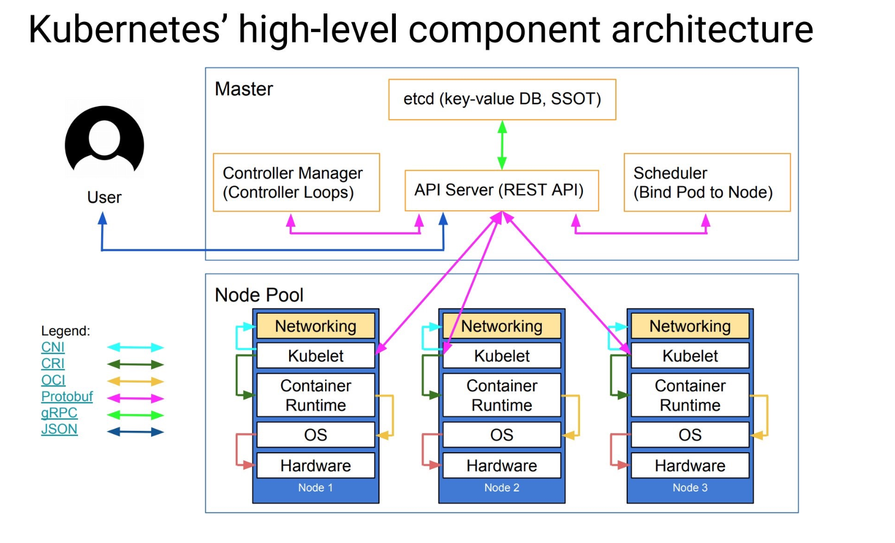
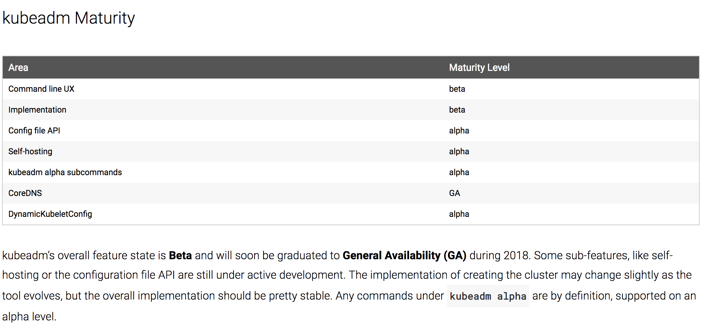
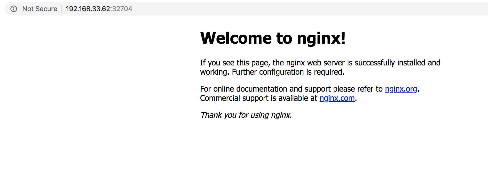

# 用 kubeadm 搭建集群环境



### 1. 核心层：`Kubernetes` 最核心的功能，对外提供 `API` 构建高层的应用，对内提供插件式应用执行环境
### 2. 应用层：部署（无状态应用、有状态应用、批处理任务、集群应用等）和路由（服务发现、DNS 解析等）
### 3. 管理层：系统度量（如基础设施、容器和网络的度量），自动化（如自动扩展、动态 Provision 等）以及策略管理（`RBAC`、`Quota`、`PSP`、`NetworkPolicy` 等）
### 4. 接口层：`kubectl` 命令行工具、客户端 `SDK` 以及集群联邦
### 5. 生态系统：在接口层之上的庞大容器集群管理调度的生态系统，可以划分为两个范畴

* `Kubernetes` 外部：日志、监控、配置管理、`CI`、`CD`、`Workflow`等
* `Kubernetes` 内部：`CRI`、`CNI`、`CVI`、镜像仓库、`Cloud Provider`、集群自身的配置和管理等


`kubeadm`是`Kubernetes`官方提供的用于快速安装`Kubernetes`集群的工具，通过将集群的各个组件进行容器化安装管理，通过`kubeadm`的方式安装集群比二进制的方式安装要方便不少，但是目录`kubeadm`还处于 `beta` 状态，还不能用于生产环境，[Using kubeadm to Create a Cluster](https://kubernetes.io/docs/setup/independent/create-cluster-kubeadm/)文档中已经说明 `kubeadm` 将会很快能够用于生产环境了。




## 环境

我们这里准备两台`Centos7`的主机用于安装，后续节点可以根究需要添加即可：

我的 [Vagrantfile](Vagrantfile)


* 分别在两台机子上

```
$ sudo yum update
```
```
$ sudo vi /etc/hosts
192.168.33.57 master
192.168.33.62 node01
```

* 将`master`上的 `id_rsa.pub` 加到 `node01` 上

```
$ ssh-keygen -t rsa
$ cd .ssh/
$ less id_rsa.pub
```

* 禁用防火墙：

```
$ sudo systemctl stop firewalld
$ sudo systemctl disable firewalld
$ sudo systemctl status firewalld
● firewalld.service - firewalld - dynamic firewall daemon
   Loaded: loaded (/usr/lib/systemd/system/firewalld.service; disabled; vendor preset: enabled)
   Active: inactive (dead)
     Docs: man:firewalld(1)
```

* 禁用SELINUX：

```
$ sudo setenforce 0
$ sudo vi /etc/selinux/config
SELINUX=disabled
```

* 创建`/etc/sysctl.d/k8s.conf`文件，添加如下内容：

```
$ sudo vi /etc/sysctl.d/k8s.conf
net.bridge.bridge-nf-call-ip6tables = 1
net.bridge.bridge-nf-call-iptables = 1
net.ipv4.ip_forward = 1
```

执行如下命令使修改生效：

```
$ sudo modprobe br_netfilter
$ sudo sysctl -p /etc/sysctl.d/k8s.conf
net.bridge.bridge-nf-call-ip6tables = 1
net.bridge.bridge-nf-call-iptables = 1
net.ipv4.ip_forward = 1
```

## 安装 `docker` 在两台机子

1. [Install Docker CE on Centos](https://docs.docker.com/install/linux/docker-ce/centos/)

* Install special version of docker, for instance

```
$ sudo yum install docker-ce-18.06.1.ce
```

* [Post-installation steps for Linux](https://docs.docker.com/install/linux/linux-postinstall/#manage-docker-as-a-non-root-user)

**Manage Docker as a non-root user**

```
$ sudo systemctl enable docker
$ sudo systemctl restart docker
$ sudo systemctl status docker
```

```
$ docker ps 
```

## 安装 kubeadm、kubelet、kubectl

```
$ sudo vi /etc/yum.repos.d/kubernetes.repo

[kubernetes]
name=Kubernetes
baseurl=https://packages.cloud.google.com/yum/repos/kubernetes-el7-x86_64
enabled=1
gpgcheck=1
repo_gpgcheck=1
gpgkey=https://packages.cloud.google.com/yum/doc/yum-key.gpg
        https://packages.cloud.google.com/yum/doc/rpm-package-key.gpg
```

```
$ sudo yum makecache fast
Loaded plugins: fastestmirror
Loading mirror speeds from cached hostfile
 * base: ftp.iij.ad.jp
 * extras: ftp.iij.ad.jp
 * updates: ftp.iij.ad.jp
base                                     | 3.6 kB     00:00
extras                                   | 3.4 kB     00:00
kubernetes                               | 1.4 kB     00:00
updates                                  | 3.4 kB     00:00
kubernetes/primary                         |  37 kB   00:00
kubernetes                                              263/263
Metadata Cache Created

$ sudo yum install -y kubelet kubeadm kubectl
```

```
$ kubeadm version
kubeadm version: &version.Info{Major:"1", Minor:"12", GitVersion:"v1.12.1", GitCommit:"4ed3216f3ec431b140b1d899130a69fc671678f4", GitTreeState:"clean", BuildDate:"2018-10-05T16:43:08Z", GoVersion:"go1.10.4", Compiler:"gc", Platform:"linux/amd64"}
```
顺利安装了现在最新的`kubeadm` 版本 `v1.12.1`

## 配置 `kubelet` 在 `master` 上

### 安装完成后，我们还需要对`kubelet`进行配置，因为用`yum`源的方式安装的`kubelet`生成的配置文件将参数`--cgroup-driver`改成了`systemd`，而`docker`的`cgroup-driver`是`cgroupfs`，这二者必须一致才行，我们可以通过`docker info`命令查看：


```
$ docker info |grep Cgroup
Cgroup Driver: cgroupfs
```

修改文件`kubelet`的配置文件`/etc/systemd/system/kubelet.service.d/10-kubeadm.conf`，将其中的`KUBELET_CGROUP_ARGS`参数更改成`cgroupfs`：

```
Environment="KUBELET_CGROUP_ARGS=--cgroup-driver=cgroupfs"
```

**另外还有一个问题是关于交换分区的**，`Kubernetes`从**1.8**开始要求关闭系统的 `Swap` ，如果不关闭，默认配置的`kubelet`将无法启动，我们可以通过 `kubelet` 的启动参数`--fail-swap-on=false`更改这个限制，所以我们需要在上面的配置文件中增加一项配置(在`ExecStart`之前)：

```
Environment="KUBELET_EXTRA_ARGS=--fail-swap-on=false"
```

当然最好的还是将`swap`给关掉，这样能提高`kubelet`的性能。修改完成后，重新加载我们的配置文件即可：

```
$ cat /etc/systemd/system/kubelet.service.d/10-kubeadm.conf

# Note: This dropin only works with kubeadm and kubelet v1.11+
[Service]
Environment="KUBELET_KUBECONFIG_ARGS=--bootstrap-kubeconfig=/etc/kubernetes/bootstrap-kubelet.conf --kubeconfig=/etc/kubernetes/kubelet.conf"
Environment="KUBELET_CONFIG_ARGS=--config=/var/lib/kubelet/config.yaml"
Environment="KUBELET_CGROUP_ARGS=--cgroup-driver=cgroupfs"
Environment="KUBELET_EXTRA_ARGS=--fail-swap-on=false"
# This is a file that "kubeadm init" and "kubeadm join" generates at runtime, populating the KUBELET_KUBEADM_ARGS variable dynamically
EnvironmentFile=-/var/lib/kubelet/kubeadm-flags.env
# This is a file that the user can use for overrides of the kubelet args as a last resort. Preferably, the user should use
# the .NodeRegistration.KubeletExtraArgs object in the configuration files instead. KUBELET_EXTRA_ARGS should be sourced from this file.
EnvironmentFile=-/etc/sysconfig/kubelet
ExecStart=
ExecStart=/usr/bin/kubelet $KUBELET_KUBECONFIG_ARGS $KUBELET_CONFIG_ARGS $KUBELET_KUBEADM_ARGS $KUBELET_EXTRA_ARGS
```


```
$ sudo systemctl daemon-reload
```

## 集群安装


到这里我们的准备工作就完成了，接下来我们就可以在`master`节点上用`kubeadm`命令来初始化我们的集群了：

### 但是在我利用 `$ kubeadm init` 初始化以后，出现了几个问题，现在需要提前看一下

```
[preflight] running pre-flight checks
	[WARNING Service-Docker]: docker service is not enabled, please run 'systemctl enable docker.service'
	[WARNING SystemVerification]: this Docker version is not on the list of validated versions: 18.09.0-beta3. Latest validated version: 18.06
	[WARNING Service-Kubelet]: kubelet service is not enabled, please run 'systemctl enable kubelet.service'
[preflight] Some fatal errors occurred:
	[ERROR Swap]: running with swap on is not supported. Please disable swap
[preflight] If you know what you are doing, you can make a check non-fatal with `--ignore-preflight-errors=...`
```

```
WARNING Service-Docker]: docker service is not enabled, please run 'systemctl enable docker.service'

$ sudo systemctl enable docker.service
```

```
$ [WARNING SystemVerification]: this Docker version is not on the list of validated versions: 18.09.0-beta3. Latest validated version: 18.06

$ sudo yum install docker-ce-18.06.1.ce
```

```
[WARNING Service-Kubelet]: kubelet service is not enabled, please run 'systemctl enable kubelet.service'

$ sudo systemctl enable kubelet.service
```

```
[ERROR Swap]: running with swap on is not supported. Please disable swap
please disable swap! or set --fail-swap-on flag to false. /proc/swaps contained: [Filename                                T

$ sudo journalctl -u kubelet

$ sudo systemctl status kubelet.service

$ sudo swapoff -a
```

命令非常简单，就是`kubeadm init`，后面的参数是需要安装的集群版本，

### 因为我们这里选择`flannel`作为 `Pod` 的网络插件，所以需要指定`–pod-network-cidr=10.244.0.0/16`，然后是`apiserver`的通信地址，这里就是我们`master`节点的`IP` 地址。

### 执行上面的命令，如果出现 `running with swap on is not supported. Please disable swap`之类的错误，则我们还需要增加一个参数`--ignore-preflight-errors=Swap`来忽略`swap`的错误提示信息：

```
$ sudo kubeadm init --kubernetes-version=v1.12.0-rc.1  --pod-network-cidr=10.244.0.0/16 --apiserver-advertise-address=192.168.33.57 --ignore-preflight-errors=Swap

init] using Kubernetes version: v1.12.0-rc.1
[preflight] running pre-flight checks
[preflight/images] Pulling images required for setting up a Kubernetes cluster
[preflight/images] This might take a minute or two, depending on the speed of your internet connection
[preflight/images] You can also perform this action in beforehand using 'kubeadm config images pull'
[kubelet] Writing kubelet environment file with flags to file "/var/lib/kubelet/kubeadm-flags.env"
[kubelet] Writing kubelet configuration to file "/var/lib/kubelet/config.yaml"
[preflight] Activating the kubelet service
[certificates] Generated ca certificate and key.
[certificates] Generated apiserver certificate and key.
[certificates] apiserver serving cert is signed for DNS names [k8s-node1 kubernetes kubernetes.default kubernetes.default.svc kubernetes.default.svc.cluster.local] and IPs [10.96.0.1 192.168.33.57]
[certificates] Generated apiserver-kubelet-client certificate and key.
[certificates] Generated etcd/ca certificate and key.
[certificates] Generated etcd/peer certificate and key.
[certificates] etcd/peer serving cert is signed for DNS names [k8s-node1 localhost] and IPs [192.168.33.57 127.0.0.1 ::1]
[certificates] Generated etcd/server certificate and key.
[certificates] etcd/server serving cert is signed for DNS names [k8s-node1 localhost] and IPs [127.0.0.1 ::1]
[certificates] Generated etcd/healthcheck-client certificate and key.
[certificates] Generated apiserver-etcd-client certificate and key.
[certificates] Generated front-proxy-ca certificate and key.
[certificates] Generated front-proxy-client certificate and key.
[certificates] valid certificates and keys now exist in "/etc/kubernetes/pki"
[certificates] Generated sa key and public key.
[kubeconfig] Wrote KubeConfig file to disk: "/etc/kubernetes/admin.conf"
[kubeconfig] Wrote KubeConfig file to disk: "/etc/kubernetes/kubelet.conf"
[kubeconfig] Wrote KubeConfig file to disk: "/etc/kubernetes/controller-manager.conf"
[kubeconfig] Wrote KubeConfig file to disk: "/etc/kubernetes/scheduler.conf"
[controlplane] wrote Static Pod manifest for component kube-apiserver to "/etc/kubernetes/manifests/kube-apiserver.yaml"
[controlplane] wrote Static Pod manifest for component kube-controller-manager to "/etc/kubernetes/manifests/kube-controller-manager.yaml"
[controlplane] wrote Static Pod manifest for component kube-scheduler to "/etc/kubernetes/manifests/kube-scheduler.yaml"
[etcd] Wrote Static Pod manifest for a local etcd instance to "/etc/kubernetes/manifests/etcd.yaml"
[init] waiting for the kubelet to boot up the control plane as Static Pods from directory "/etc/kubernetes/manifests"
[init] this might take a minute or longer if the control plane images have to be pulled
[apiclient] All control plane components are healthy after 20.010451 seconds
[uploadconfig] storing the configuration used in ConfigMap "kubeadm-config" in the "kube-system" Namespace
[kubelet] Creating a ConfigMap "kubelet-config-1.12" in namespace kube-system with the configuration for the kubelets in the cluster
[markmaster] Marking the node k8s-node1 as master by adding the label "node-role.kubernetes.io/master=''"
[markmaster] Marking the node k8s-node1 as master by adding the taints [node-role.kubernetes.io/master:NoSchedule]
[patchnode] Uploading the CRI Socket information "/var/run/dockershim.sock" to the Node API object "k8s-node1" as an annotation
[bootstraptoken] using token: cgnjhx.rawqoqy1g4kh0ne2
[bootstraptoken] configured RBAC rules to allow Node Bootstrap tokens to post CSRs in order for nodes to get long term certificate credentials
[bootstraptoken] configured RBAC rules to allow the csrapprover controller automatically approve CSRs from a Node Bootstrap Token
[bootstraptoken] configured RBAC rules to allow certificate rotation for all node client certificates in the cluster
[bootstraptoken] creating the "cluster-info" ConfigMap in the "kube-public" namespace
[addons] Applied essential addon: CoreDNS
[addons] Applied essential addon: kube-proxy

Your Kubernetes master has initialized successfully!

To start using your cluster, you need to run the following as a regular user:

  mkdir -p $HOME/.kube
  sudo cp -i /etc/kubernetes/admin.conf $HOME/.kube/config
  sudo chown $(id -u):$(id -g) $HOME/.kube/config

You should now deploy a pod network to the cluster.
Run "kubectl apply -f [podnetwork].yaml" with one of the options listed at:
  https://kubernetes.io/docs/concepts/cluster-administration/addons/

You can now join any number of machines by running the following on each node
as root:

  kubeadm join 192.168.33.57:6443 --token cgnjhx.rawqoqy1g4kh0ne2 --discovery-token-ca-cert-hash sha256:bd022210a639eb950f67bac956b4b18d6a4443ff69bb2f2851010e1dea784559
```

上面的信息记录了`kubeadm`初始化整个集群的过程，生成相关的各种证书、`kubeconfig`文件、`bootstraptoken`等等，后边是使用`kubeadm join`往集群中添加节点时用到的命令，下面的命令是配置如何使用`kubectl`访问集群的方式：

```
$ mkdir -p $HOME/.kube 
$ sudo cp -i /etc/kubernetes/admin.conf $HOME/.kube/config 
$ sudo chown $(id -u):$(id -g) $HOME/.kube/config 
```

```
$ cd .kube/
[.kube]$ ls
cache  config  http-cache
```

最后给出了将节点加入集群的命令：

```
kubeadm join 192.168.33.57:6443 --token cgnjhx.rawqoqy1g4kh0ne2 --discovery-token-ca-cert-hash sha256:bd022210a639eb950f67bac956b4b18d6a4443ff69bb2f2851010e1dea784559
```

我们根据上面的提示配置好`kubectl`后，就可以使用`kubectl`来查看集群的信息了：

```
$ kubectl get cs
NAME                 STATUS    MESSAGE              ERROR
controller-manager   Healthy   ok
scheduler            Healthy   ok
etcd-0               Healthy   {"health": "true"}
```

```
$ kubectl get csr
NAME                                                   AGE       REQUESTOR                 CONDITION
node-csr-8qygb8Hjxj-byhbRHawropk81LHNPqZCTePeWoZs3-g   1h        system:bootstrap:8xomlq   Approved,Issued
```

```
$ kubectl get nodes
NAME        STATUS     ROLES    AGE   VERSION
k8s-node1   NotReady   master   34m   v1.12.1
```

`Master` 的 `STATUS` 现在是 `NotReady`, 让我们看看出了什么问题

```
$ kubectl describe nodes k8s-node1

runtime network not ready: NetworkReady=false reason:NetworkPluginNotReady message:docker: network plugin is not ready: cni config uninitialized
```

### 解决方法，在我们安装了 `flannel` 之后，就可以解决这个问题

如果你的集群安装过程中遇到了其他问题，我们可以使用下面的命令来进行重置：

```
$ sudo kubeadm reset
$ sudo rm -r /.kube

$ ifconfig cni0 down && ip link delete cni0
$ ifconfig flannel.1 down && ip link delete flannel.1
$ rm -rf /var/lib/cni/
```

## 安装 Pod Network

接下来我们来安装`flannel`网络插件，很简单，和安装普通的`POD`没什么两样：

```
$ mkdir flannel && cd flannel
$ sudo yum install wget
$ wget https://raw.githubusercontent.com/coreos/flannel/master/Documentation/kube-flannel.yml
$ kubectl apply -f  kube-flannel.yml
clusterrole.rbac.authorization.k8s.io "flannel" created
clusterrolebinding.rbac.authorization.k8s.io "flannel" created
serviceaccount "flannel" created
configmap "kube-flannel-cfg" created
daemonset.extensions "kube-flannel-ds" created
```

### 另外需要注意的是如果你的节点有多个网卡的话，需要在`kube-flannel.yml`中使用`--iface`参数指定集群主机内网网卡的名称，否则可能会出现`dns`无法解析。`flanneld`启动参数加上`--iface=<iface-name>`

```
args:
- --ip-masq
- --kube-subnet-mgr
- --iface=eth0
```

安装完成后，我们再查看此时的`node`信息，我们可以看到， `master node`已经 `Ready`了

```
$ kubectl get nodes
NAME        STATUS   ROLES    AGE    VERSION
k8s-node1   Ready    master   5m9s   v1.12.1

$ kubectl describe node  k8s-node1

 Ready            True    Wed, 10 Oct 2018 02:47:39 +0000   Wed, 10 Oct 2018 02:47:25 +0000   KubeletReady                 kubelet is posting ready status

 Normal  NodeAllocatableEnforced  6m48s                  kubelet, k8s-node1     Updated Node Allocatable limit across pods
  Normal  NodeHasSufficientDisk    6m47s (x6 over 6m48s)  kubelet, k8s-node1     Node k8s-node1 status is now: NodeHasSufficientDisk
  Normal  NodeHasSufficientMemory  6m47s (x6 over 6m48s)  kubelet, k8s-node1     Node k8s-node1 status is now: NodeHasSufficientMemory
  Normal  NodeHasNoDiskPressure    6m47s (x6 over 6m48s)  kubelet, k8s-node1     Node k8s-node1 status is now: NodeHasNoDiskPressure
  Normal  NodeHasSufficientPID     6m47s (x5 over 6m48s)  kubelet, k8s-node1     Node k8s-node1 status is now: NodeHasSufficientPID
  Normal  Starting                 6m16s                  kube-proxy, k8s-node1  Starting kube-proxy.
  Normal  NodeReady                103s                   kubelet, k8s-node1     Node k8s-node1 status is now: NodeReady
```

安装完成后使用`kubectl get pods`命令可以查看到我们集群中的组件运行状态，如果都是`Running`状态的话，那么恭喜你，你的master节点安装成功了。

```
 $ kubectl get pods --all-namespaces
NAMESPACE     NAME                                READY   STATUS    RESTARTS   AGE
kube-system   coredns-576cbf47c7-9z9ms            1/1     Running   0          41m
kube-system   coredns-576cbf47c7-z5rwt            1/1     Running   0          41m
kube-system   etcd-k8s-node1                      1/1     Running   0          40m
kube-system   kube-apiserver-k8s-node1            1/1     Running   0          40m
kube-system   kube-controller-manager-k8s-node1   1/1     Running   0          40m
kube-system   kube-flannel-ds-amd64-xj4sc         1/1     Running   0          74s
kube-system   kube-proxy-rxvx8                    1/1     Running   0          41m
kube-system   kube-scheduler-k8s-node1            1/1     Running   0          41m
```

`kubeadm`初始化完成后，默认情况下`Pod`是不会被调度到`master`节点上的，所以现在还不能直接测试普通的`Pod`，需要添加一个工作节点后才可以。

## 添加节点

同样的上面的环境配置、`docker` 安装、`kubeadmin`、`kubelet`、`kubectl` 这些都在`Node(192.168.33.62)`节点安装配置好过后，我们就可以直接在 `Node` 节点上执行`kubeadm join`命令了（上面初始化的时候有），同样加上参数`--ignore-preflight-errors=Swap`:

```
sudo systemctl enable kubelet.service

sudo kubeadm join 192.168.33.57:6443 --token cgnjhx.rawqoqy1g4kh0ne2 --discovery-token-ca-cert-hash sha256:bd022210a639eb950f67bac956b4b18d6a4443ff69bb2f2851010e1dea784559 --ignore-preflight-errors=Swap

[preflight] running pre-flight checks
	[WARNING RequiredIPVSKernelModulesAvailable]: the IPVS proxier will not be used, because the following required kernel modules are not loaded: [ip_vs_wrr ip_vs_sh ip_vs ip_vs_rr] or no builtin kernel ipvs support: map[ip_vs_sh:{} nf_conntrack_ipv4:{} ip_vs:{} ip_vs_rr:{} ip_vs_wrr:{}]
you can solve this problem with following methods:
 1. Run 'modprobe -- ' to load missing kernel modules;
2. Provide the missing builtin kernel ipvs support

[discovery] Trying to connect to API Server "192.168.33.57:6443"
[discovery] Created cluster-info discovery client, requesting info from "https://192.168.33.57:6443"
[discovery] Requesting info from "https://192.168.33.57:6443" again to validate TLS against the pinned public key
[discovery] Cluster info signature and contents are valid and TLS certificate validates against pinned roots, will use API Server "192.168.33.57:6443"
[discovery] Successfully established connection with API Server "192.168.33.57:6443"
[kubelet] Downloading configuration for the kubelet from the "kubelet-config-1.12" ConfigMap in the kube-system namespace
[kubelet] Writing kubelet configuration to file "/var/lib/kubelet/config.yaml"
[kubelet] Writing kubelet environment file with flags to file "/var/lib/kubelet/kubeadm-flags.env"
[preflight] Activating the kubelet service
[tlsbootstrap] Waiting for the kubelet to perform the TLS Bootstrap...
[patchnode] Uploading the CRI Socket information "/var/run/dockershim.sock" to the Node API object "k8s-node2" as an annotation

This node has joined the cluster:
* Certificate signing request was sent to apiserver and a response was received.
* The Kubelet was informed of the new secure connection details.

Run 'kubectl get nodes' on the master to see this node join the cluster.
```

我们可以看到该节点已经加入到集群中去了，然后我们把`master`节点的`~/.kube/config`文件拷贝到当前节点对应的位置即可使用`kubectl`命令行工具了。

```
# node1
$ cd .kube/
# node2
$ mkdie .kube/
# node1
$ scp config vagrant@192.168.33.62:/home/vagrant/.kube/
# node2
$ sudo chown $(id -u):$(id -g) $HOME/.kube/config
```

```
$ kubectl get nodes
NAME        STATUS   ROLES    AGE   VERSION
k8s-node1   Ready    master   19m   v1.12.1
k8s-node2   Ready    <none>   10m   v1.12.1
```

## Let's do some test 

```
$ vi nginx-ds.yaml

apiVersion: v1
kind: Service
metadata:
  name: nginx-ds
  labels:
    app: nginx-ds
spec:
  type: NodePort
  selector:
    app: nginx-ds
  ports:
  - name: http
    port: 80
    targetPort: 80
---
apiVersion: extensions/v1beta1
kind: DaemonSet
metadata:
  name: nginx-ds
  labels:
    addonmanager.kubernetes.io/mode: Reconcile
spec:
  template:
    metadata:
      labels:
        app: nginx-ds
    spec:
      containers:
      - name: my-nginx
        image: nginx:1.7.9
        ports:
        - containerPort: 80
```

```
$ kubectl apply -f nginx-ds.yaml
```

```
$ kubectl get pods --all-namespaces
NAMESPACE     NAME                                READY   STATUS    RESTARTS   AGE
default       nginx-ds-mpt9b                      1/1     Running   0          5h15m
```

```
$ kubectl get svc --all-namespaces
NAMESPACE     NAME         TYPE        CLUSTER-IP      EXTERNAL-IP   PORT(S)         AGE
default       kubernetes   ClusterIP   10.96.0.1       <none>        443/TCP         5h42m
default       nginx-ds     NodePort    10.100.13.114   <none>        80:32704/TCP    5h16m
kube-system   kube-dns     ClusterIP   10.96.0.10      <none>        53/UDP,53/TCP   5h42m
```

```
$ curl 192.168.33.62:32704
<!DOCTYPE html>
<html>
<head>
<title>Welcome to nginx!</title>
<style>
    body {
        width: 35em;
        margin: 0 auto;
        font-family: Tahoma, Verdana, Arial, sans-serif;
    }
</style>
</head>
<body>
<h1>Welcome to nginx!</h1>
<p>If you see this page, the nginx web server is successfully installed and
working. Further configuration is required.</p>

<p>For online documentation and support please refer to
<a href="http://nginx.org/">nginx.org</a>.<br/>
Commercial support is available at
<a href="http://nginx.com/">nginx.com</a>.</p>

<p><em>Thank you for using nginx.</em></p>
</body>
</html>
```
### nginx 1.7.9 pod and service is running on node01, let's cheer up

