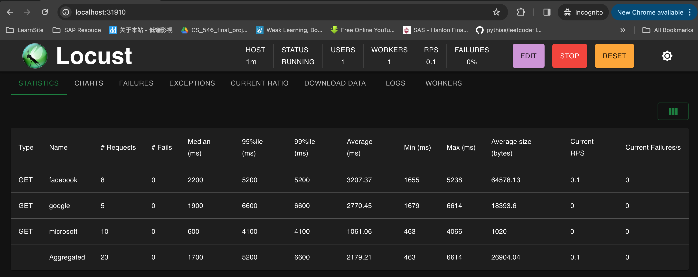
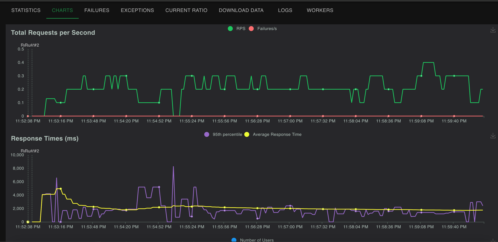

# 1 在 Kubernetes 中使用 Locust 进行性能测试


https://thechief.io/c/cloudplex/kubernetes-distributed-performance-testing-using-locust/

### **问题：**

* 我们过去使用大量单独的 EC2 实例运行负载测试。
* **每个实例都需要拷贝自己的测试脚本（Locust），这设置起来很麻烦。对 API 测试代码（locustfile.py）进行即使是小小的更改都意味着更新大量实例。**

随着我们的测试变得越来越庞大，这变得非常困难。

### **Locust 简介**

性能和负载测试是软件生命周期中应该处理的最热门主题之一。这些测试可以为我们提供有关软件应用程序和基础设施设置的性能和稳健性所需的指标和 KPI。

Locust是可用于执行用户行为负载测试的工具之一。它依赖流行的Python编程语言来定义负载测试场景。这意味着可以执行一些条件行为或进行一些计算。

Locust 还支持在多个工作线程/机器上运行分布式负载测试。该工具附带一个 Web 界面，用于配置和运行具有多种配置的预定义测试。

在这篇博文中，我们将介绍使用 Locust 在分布式模型中测试留言簿应用程序所需的步骤。为了实现这一目标，我们需要实施以下几项工作。

定义测试用例（Locust 文件）
Locust 的 Docker 镜像
部署主从 Locust 工作人员。
允许 Locust Worker 和 Master 之间的通信


**解决方案：**


* 我们转而使用 Kubernetes 来管理我们的 Locust 脚本。
* 现在根据需要轻松扩展或缩减我们的测试，而无需进行大量手动工作。

### 为什么选择 Locust？

* **Python支持**： Locust 使用 Python 定义用户行为，使测试创建直观灵活。如果你会写代码，Locust 就可以模拟它。
* **分布式测试**： 通过以分布模式运行 Locust，轻松模拟大量并发用户。
* **优雅的Web界面**： 通过 Locust 用户友好的界面，实时监视您的测试，深入了解性能指标。


### 为什么选择 Kubernetes？


**可扩展性：** 无缝提供和管理您的 Locust 部署所需的资源。根据需要启动工作节点，并在测试完成时缩减规模。

**弹性**： Kubernetes 保护你的测试环境。如果工作节点崩溃，它将自动重新启动 Pod，最大限度减少测试中断。

**可移植性**： 轻松地在不同环境（测试、暂存、生产）之间复制您的 Locust 测试脚本。

### 使用

将 locustfile.py 添加到 configmap 中，如下所述。

**`configmap.yaml`**

```
apiVersion: v1
kind: ConfigMap
metadata:
  name: locust-script-cm
data:
  locustfile.py: |
    from locust import HttpUser, between, task
    import time


    class Quickstart(HttpUser):
        wait_time = between(1, 5)

        @task
        def google(self):
            self.client.request_name = "google"
            self.client.get("https://google.com/")

        @task
        def microsoft(self):
            self.client.request_name = "microsoft"
            self.client.get("https://microsoft.com/")

        @task
        def facebook(self):
            self.client.request_name = "facebook"
            self.client.get("https://facebook.com/")
```

然后创建一个 master deployment，需要注意的是我们需要声明 3 个端口：

**`master.yaml`**

```
apiVersion: apps/v1
kind: Deployment
metadata:
  labels:
    role: locust-master
    app: locust-master
  name: locust-master
spec:
  replicas: 1
  selector:
    matchLabels:
      role: locust-master
      app: locust-master
  strategy:
    rollingUpdate:
      maxSurge: 1
      maxUnavailable: 1
    type: RollingUpdate
  template:
    metadata:
      labels:
        role: locust-master
        app: locust-master
    spec:
      containers:
      - image: locustio/locust
        imagePullPolicy: Always
        name: master
        args: ["--master"]
        volumeMounts:
          - mountPath: /home/locust
            name: locust-scripts
        ports:
        - containerPort: 5557
          name: bind
        - containerPort: 5558
          name: bind-1
        - containerPort: 8089
          name: web-ui
        resources: {}
        terminationMessagePath: /dev/termination-log
        terminationMessagePolicy: File
      dnsPolicy: ClusterFirst
      restartPolicy: Always
      volumes:
      - name: locust-scripts
        configMap:
          name: locust-script-cm
```

再创建一个 worker deployment：

**`worker.yaml`**

```
apiVersion: apps/v1
kind: Deployment
metadata:
  labels:
    role: locust-worker
    app: locust-worker
  name: locust-worker
spec:
  replicas: 1 # Scale it as per your need
  selector:
    matchLabels:
      role: locust-worker
      app: locust-worker
  strategy:
    rollingUpdate:
      maxSurge: 1
      maxUnavailable: 1
    type: RollingUpdate
  template:
    metadata:
      labels:
        role: locust-worker
        app: locust-worker
    spec:
      containers:
      - image: locustio/locust
        imagePullPolicy: Always
        name: worker
        args: ["--worker", "--master-host=locust-master"]
        volumeMounts:
          - mountPath: /home/locust
            name: locust-scripts
        terminationMessagePath: /dev/termination-log
        terminationMessagePolicy: File
        resources:
          requests:
            memory: "1Gi"
            cpu: "1"
          limits:
            memory: "1Gi"
      dnsPolicy: ClusterFirst
      restartPolicy: Always
      volumes:
      - name: locust-scripts
        configMap:
          name: locust-script-cm
```

然后创建一个 Service 对象：

**service.yaml**

```
apiVersion: v1
kind: Service
metadata:
  labels:
    role: locust-master
  name: locust-master
spec:
  type: ClusterIP
  ports:
  - port: 5557
    name: master-bind-host
  - port: 5558
    name: master-bind-host-1
  selector:
    role: locust-master
    app: locust-master
```

如果您需要暴露 Locust 端点，可以使用 LoadBalancer 或者 NodePort 创建服务：

**web-ui.yaml**

```
---
apiVersion: v1
kind: Service
metadata:
  labels:
    role: locust-ui
  name: locust-ui
spec:
  type: LoadBalancer
  ports:
  - port: 8089
    targetPort: 8089
    name: web-ui
  selector:
    role: locust-master
    app: locust-master
```

直接应用上面的资源清单文件即可：

```

kubectl create ns locust
kubectl apply -f configmap.yaml -n locust
kubectl apply -f master.yaml -n locust
kubectl apply -f worker.yaml -n locust
kubectl apply -f service.yaml -n locust
kubectl apply -f web-ui.yaml -n locust
```

```
 kubectl get all -n locust 
NAME                                 READY   STATUS    RESTARTS   AGE
pod/locust-master-7898d9b6f9-9zm26   1/1     Running   0          3m54s
pod/locust-worker-75f99d58bc-dp7b4   1/1     Running   0          3m40s

NAME                    TYPE           CLUSTER-IP        EXTERNAL-IP    PORT(S)             AGE
service/locust-master   ClusterIP      192.168.194.221   <none>         5557/TCP,5558/TCP   3m20s
service/locust-ui       LoadBalancer   192.168.194.157   198.19.249.2   8089:31910/TCP      3m7s

NAME                            READY   UP-TO-DATE   AVAILABLE   AGE
deployment.apps/locust-master   1/1     1            1           3m55s
deployment.apps/locust-worker   1/1     1            1           3m41s

NAME                                       DESIRED   CURRENT   READY   AGE
replicaset.apps/locust-master-7898d9b6f9   1         1         1       3m55s
replicaset.apps/locust-worker-75f99d58bc   1         1         1       3m41s
```


如果您想扩展更多的 Worker 以支持更多的请求，只需扩展 Worker pods 即可。

```
kubectl scale --replicas=5 deploy/locust-worker -n locust
```

使用 Kubernetes，可以轻松扩展到任意数量的工作节点来支持您的并发请求。仅仅使用 EC2 实例来实现相同的功能将非常困难。

**`http://localhost:31910/`**







测试完成后直接清理即可：

```
kubectl delete ns locust
```
