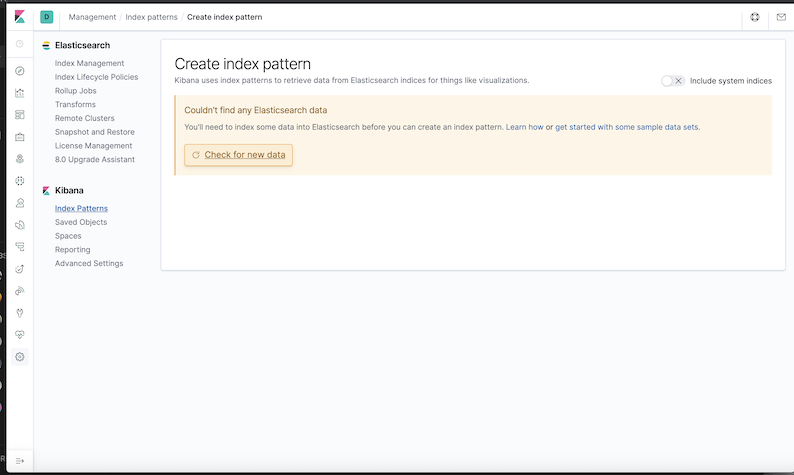
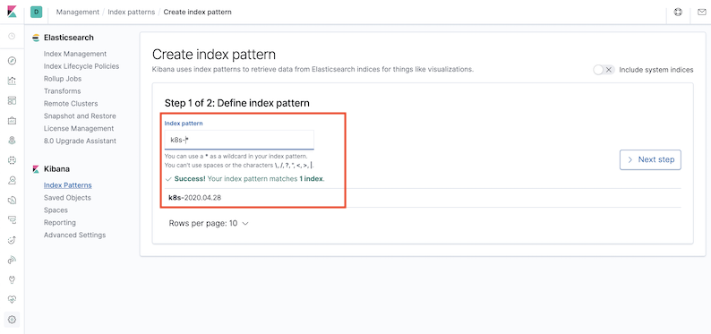
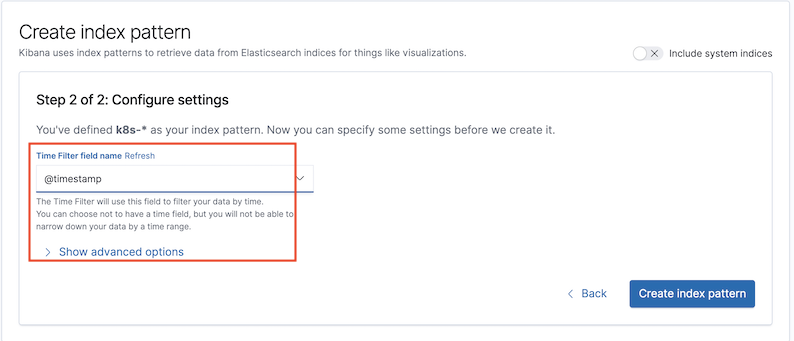
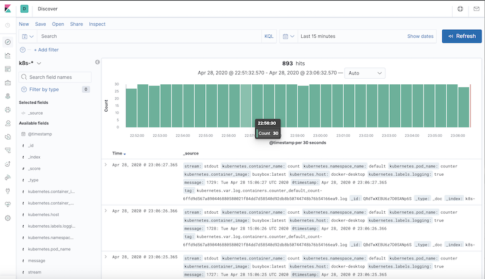
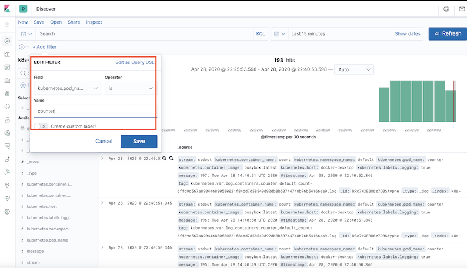

# 在 Kubernetes 安装 EFK 日志收集系统[更新]

[Install and practice code reference](code)

## 创建 Elasticsearch 集群


`elasticsearch-storageclass.yaml`

```
apiVersion: storage.k8s.io/v1
kind: StorageClass
metadata:
  name: es-data-db
provisioner: docker.io/hostpath
```

```
$ kubectl apply -f elasticsearch-storageclass.yaml 
storageclass.storage.k8s.io/es-data-db created

$ kubectl get sc
NAME                 PROVISIONER          AGE
es-data-db           docker.io/hostpath   4s
hostpath (default)   docker.io/hostpath   49d
```

```
kubectl label node docker-desktop es=log 
```


`elasticsearch-statefulset.yaml`

```
apiVersion: apps/v1
kind: StatefulSet
metadata:
  name: es
  namespace: logging
spec:
  serviceName: elasticsearch
  replicas: 1
  selector:
    matchLabels:
      app: elasticsearch
  template:
    metadata:
      labels: 
        app: elasticsearch
    spec:
      nodeSelector:
        es: log    # apply first 
      initContainers:
      - name: increase-vm-max-map
        image: busybox
        command: ["sysctl", "-w", "vm.max_map_count=262144"]
        securityContext:
          privileged: true
      - name: increase-fd-ulimit
        image: busybox
        command: ["sh", "-c", "ulimit -n 65536"]
        securityContext:
          privileged: true
      containers:
      - name: elasticsearch
        image: docker.elastic.co/elasticsearch/elasticsearch:7.6.2
        ports:
        - name: rest
          containerPort: 9200
        - name: inter
          containerPort: 9300
        resources:
          limits:
            cpu: 1000m
          requests:
            cpu: 1000m
        volumeMounts:
        - name: data
          mountPath: /usr/share/elasticsearch/data
        env:
        - name: cluster.name
          value: k8s-logs
        - name: node.name
          valueFrom:
            fieldRef:
              fieldPath: metadata.name
        - name: cluster.initial_master_nodes
          value: "es-0,es-1,es-2"  # changed on my cluster
        - name: discovery.zen.minimum_master_nodes
          value: "2"               # changed on my cluster
        - name: discovery.seed_hosts
          value: "elasticsearch"
        - name: ES_JAVA_OPTS
          value: "-Xms512m -Xmx512m"
        - name: network.host
          value: "0.0.0.0"
  volumeClaimTemplates:
  - metadata:
      name: data
      labels:
        app: elasticsearch
    spec:
      accessModes: [ "ReadWriteOnce" ]
      storageClassName: es-data-db 
      resources:
        requests:
          storage: 2Gi
```

```
$ kubectl get pod -n logging 
NAME   READY   STATUS    RESTARTS   AGE
es-0   1/1     Running   0          27m
```

## 创建 Kibana 服务

```
$ kubectl create -f kibana.yaml
service/kibana created
deployment.apps/kibana created

$ kubectl get pod -n logging 
NAME                      READY   STATUS    RESTARTS   AGE
es-0                      1/1     Running   0          28m
kibana-5c565c47dd-wfgrx   1/1     Running   0          10s

$ kubectl get svc -n logging 
NAME            TYPE        CLUSTER-IP       EXTERNAL-IP   PORT(S)             AGE
elasticsearch   ClusterIP   None             <none>        9200/TCP,9300/TCP   3s
kibana          NodePort    10.102.159.162   <none>        5601:31385/TCP      2m55s
```



## 部署 Fluentd (Updated Config)

### 配置

一般来说我们是通过一个配置文件来告诉 Fluentd 如何采集、处理数据的，下面简单和大家介绍下 Fluentd 的配置方法。

**日志源配置**

比如我们这里为了收集 `Kubernetes` 节点上的所有容器日志，就需要做如下的日志源配置：

```
<source>
  @id fluentd-containers.log
  @type tail                             # Fluentd 内置的输入方式，其原理是不停地从源文件中获取新的日志。
  path /var/log/containers/*.log         # 挂载的服务器Docker容器日志地址
  pos_file /var/log/es-containers.log.pos
  tag raw.kubernetes.*                   # 设置日志标签
  read_from_head true
  <parse>                                # 多行格式化成JSON
    @type multi_format                   # 使用 multi-format-parser 解析器插件
    <pattern>
      format json                        # JSON 解析器
      time_key time                      # 指定事件时间的时间字段
      time_format %Y-%m-%dT%H:%M:%S.%NZ  # 时间格式
    </pattern>
    <pattern>
      format /^(?<time>.+) (?<stream>stdout|stderr) [^ ]* (?<log>.*)$/
      time_format %Y-%m-%dT%H:%M:%S.%N%:z
    </pattern>
  </parse>
</source>
```

上面配置部分参数说明如下：

* `id`：表示引用该日志源的唯一标识符，该标识可用于进一步过滤和路由结构化日志数据
* `type`：`Fluentd `内置的指令，`tail` 表示 `Fluentd` 从上次读取的位置通过 `tail `不断获取数据，另外一个是 `http` 表示通过一个 `GET` 请求来收集数据。
* `path`：`tail `类型下的特定参数，告诉` Fluentd`采集 `/var/log/containers` 目录下的所有日志，这是 `docker` 在 `Kubernetes` 节点上用来存储运行容器 `stdout` 输出日志数据的目录。
* `pos_file`：检查点，如果 `Fluentd` 程序重新启动了，它将使用此文件中的位置来恢复日志数据收集。
* `tag`：用来将日志源与目标或者过滤器匹配的自定义字符串，`Fluentd ` 匹配源/目标标签来路由日志数据。

**路由配置**

上面是日志源的配置，接下来看看如何将日志数据发送到 Elasticsearch：

```
<match **>

@id elasticsearch

@type elasticsearch

@log_level info

include_tag_key true

type_name fluentd

host "#{ENV['OUTPUT_HOST']}"

port "#{ENV['OUTPUT_PORT']}"

logstash_format true

<buffer>

@type file

path /var/log/fluentd-buffers/kubernetes.system.buffer

flush_mode interval

retry_type exponential_backoff

flush_thread_count 2

flush_interval 5s

retry_forever

retry_max_interval 30

chunk_limit_size "#{ENV['OUTPUT_BUFFER_CHUNK_LIMIT']}"

queue_limit_length "#{ENV['OUTPUT_BUFFER_QUEUE_LIMIT']}"

overflow_action block

</buffer>
```

* `match`：标识一个目标标签，后面是一个匹配日志源的正则表达式，我们这里想要捕获所有的日志并将它们发送给 `Elasticsearch`，所以需要配置成`**`。
* `id`：目标的一个唯一标识符。
* `type`：支持的输出插件标识符，我们这里要输出到 `Elasticsearch`，所以配置成 `elasticsearch`，这是 `Fluentd` 的一个内置插件。
* `log_level`：指定要捕获的日志级别，我们这里配置成 `info`，表示任何该级别或者该级别以上（`INFO、WARNING、ERROR`）的日志都将被路由到 `Elsasticsearch`。
* `host/port`：定义 `Elasticsearch` 的地址，也可以配置认证信息，我们的 `Elasticsearch` 不需要认证，所以这里直接指定 host 和 port 即可。
* `logstash_format`：`Elasticsearch `服务对日志数据构建反向索引进行搜索，将 `logstash_format` 设置为 `true`，`Fluentd` 将会以 `logstash` 格式来转发结构化的日志数据。
* `Buffer`： `Fluentd` 允许在目标不可用时进行缓存，比如，如果网络出现故障或者 `Elasticsearch` 不可用的时候。缓冲区配置也有助于降低磁盘的 `IO`。

**过滤**

由于 `Kubernetes` 集群中应用太多，也还有很多历史数据，所以我们可以只将某些应用的日志进行收集，比如我们只采集具有 `logging=true` 这个` Label` 标签的 `Pod` 日志，这个时候就需要使用 `filter`，如下所示：

```
# 删除无用的属性
<filter kubernetes.**>
  @type record_transformer
  remove_keys $.docker.container_id,$.kubernetes.container_image_id,$.kubernetes.pod_id,$.kubernetes.namespace_id,$.kubernetes.master_url,$.kubernetes.labels.pod-template-hash
</filter>
# 只保留具有logging=true标签的Pod日志
<filter kubernetes.**>
  @id filter_log
  @type grep
  <regexp>
    key $.kubernetes.labels.logging
    pattern ^true$
  </regexp>
</filter>
```

### 安装

要收集 `Kubernetes` 集群的日志，直接用 `DasemonSet` 控制器来部署 `Fluentd` 应用，这样，它就可以从 `Kubernetes` 节点上采集日志，确保在集群中的每个节点上始终运行一个 Fluentd 容器。当然可以直接使用 Helm 来进行一键安装，为了能够了解更多实现细节，我们这里还是采用手动方法来进行安装。

首先，我们通过 `ConfigMap` 对象来指定 `Fluentd` 配置文件，新建 `fluentd-configmap.yaml` 文件，文件内容如下：

```
kind: ConfigMap
apiVersion: v1
metadata:
  name: fluentd-config
  namespace: logging
data:
  system.conf: |-
    <system>
      root_dir /tmp/fluentd-buffers/
    </system>
  containers.input.conf: |-
    <source>
      @id fluentd-containers.log
      @type tail                              # Fluentd 内置的输入方式，其原理是不停地从源文件中获取新的日志。
      path /var/log/containers/*.log          # 挂载的服务器Docker容器日志地址
      pos_file /var/log/es-containers.log.pos
      tag raw.kubernetes.*                    # 设置日志标签
      read_from_head true
      <parse>                                 # 多行格式化成JSON
        @type multi_format                    # 使用 multi-format-parser 解析器插件
        <pattern>
          format json                         # JSON解析器
          time_key time                       # 指定事件时间的时间字段
          time_format %Y-%m-%dT%H:%M:%S.%NZ   # 时间格式
        </pattern>
        <pattern>
          format /^(?<time>.+) (?<stream>stdout|stderr) [^ ]* (?<log>.*)$/
          time_format %Y-%m-%dT%H:%M:%S.%N%:z
        </pattern>
      </parse>
    </source>
    # 在日志输出中检测异常，并将其作为一条日志转发 
    # https://github.com/GoogleCloudPlatform/fluent-plugin-detect-exceptions
    <match raw.kubernetes.**>           # 匹配tag为raw.kubernetes.**日志信息
      @id raw.kubernetes
      @type detect_exceptions           # 使用detect-exceptions插件处理异常栈信息
      remove_tag_prefix raw             # 移除 raw 前缀
      message log                       
      stream stream                     
      multiline_flush_interval 5
      max_bytes 500000
      max_lines 1000
    </match>

    <filter **>  # 拼接日志
      @id filter_concat
      @type concat                # Fluentd Filter 插件，用于连接多个事件中分隔的多行日志。
      key message
      multiline_end_regexp /\n$/  # 以换行符“\n”拼接
      separator ""
    </filter> 

    # 添加 Kubernetes metadata 数据
    <filter kubernetes.**>
      @id filter_kubernetes_metadata
      @type kubernetes_metadata
    </filter>

    # 修复 ES 中的 JSON 字段
    # 插件地址：https://github.com/repeatedly/fluent-plugin-multi-format-parser
    <filter kubernetes.**>
      @id filter_parser
      @type parser                # multi-format-parser多格式解析器插件
      key_name log                # 在要解析的记录中指定字段名称。
      reserve_data true           # 在解析结果中保留原始键值对。
      remove_key_name_field true  # key_name 解析成功后删除字段。
      <parse>
        @type multi_format
        <pattern>
          format json
        </pattern>
        <pattern>
          format none
        </pattern>
      </parse>
    </filter>

    # 删除一些多余的属性
    <filter kubernetes.**>
      @type record_transformer
      remove_keys $.docker.container_id,$.kubernetes.container_image_id,$.kubernetes.pod_id,$.kubernetes.namespace_id,$.kubernetes.master_url,$.kubernetes.labels.pod-template-hash
    </filter>

    # 只保留具有logging=true标签的Pod日志
    <filter kubernetes.**>
      @id filter_log
      @type grep
      <regexp>
        key $.kubernetes.labels.logging
        pattern ^true$
      </regexp>
    </filter>
  
  ###### 监听配置，一般用于日志聚合用 ######
  forward.input.conf: |-
    # 监听通过TCP发送的消息
    <source>
      @id forward
      @type forward
    </source>

  output.conf: |-
    <match **>
      @id elasticsearch
      @type elasticsearch
      @log_level info
      include_tag_key true
      host elasticsearch
      port 9200
      logstash_format true
      logstash_prefix k8s  # 设置 index 前缀为 k8s
      request_timeout    30s
      <buffer>
        @type file
        path /var/log/fluentd-buffers/kubernetes.system.buffer
        flush_mode interval
        retry_type exponential_backoff
        flush_thread_count 2
        flush_interval 5s
        retry_forever
        retry_max_interval 30
        chunk_limit_size 2M
        queue_limit_length 8
        overflow_action block
      </buffer>
    </match>
```
上面配置文件中我们只配置了 `docker`` 容器日志目录，收集到数据经过处理后发送到 elasticsearch:9200` 服务。

然后新建一个 `fluentd-daemonset.yaml` 的文件，文件内容如下：

```
$ docker info | grep Root
 Docker Root Dir: /var/lib/docker
```

```
kubectl label node docker-desktop beta.kubernetes.io/fluentd-ds-ready=true
node/docker-desktop labeled
```

这个地方非常重要，当然如果你没有更改 `docker` 根目录则使用默认的`/var/lib/docker/containers`目录即可。

```
apiVersion: v1
kind: ServiceAccount
metadata:
  name: fluentd-es
  namespace: logging
  labels:
    k8s-app: fluentd-es
    kubernetes.io/cluster-service: "true"
    addonmanager.kubernetes.io/mode: Reconcile
---
kind: ClusterRole
apiVersion: rbac.authorization.k8s.io/v1
metadata:
  name: fluentd-es
  labels:
    k8s-app: fluentd-es
    kubernetes.io/cluster-service: "true"
    addonmanager.kubernetes.io/mode: Reconcile
rules:
- apiGroups:
  - ""
  resources:
  - "namespaces"
  - "pods"
  verbs:
  - "get"
  - "watch"
  - "list"
---
kind: ClusterRoleBinding
apiVersion: rbac.authorization.k8s.io/v1
metadata:
  name: fluentd-es
  labels:
    k8s-app: fluentd-es
    kubernetes.io/cluster-service: "true"
    addonmanager.kubernetes.io/mode: Reconcile
subjects:
- kind: ServiceAccount
  name: fluentd-es
  namespace: logging
  apiGroup: ""
roleRef:
  kind: ClusterRole
  name: fluentd-es
  apiGroup: ""
---
apiVersion: apps/v1
kind: DaemonSet
metadata:
  name: fluentd-es
  namespace: logging
  labels:
    k8s-app: fluentd-es
    kubernetes.io/cluster-service: "true"
    addonmanager.kubernetes.io/mode: Reconcile
spec:
  selector:
    matchLabels:
      k8s-app: fluentd-es
  template:
    metadata:
      labels:
        k8s-app: fluentd-es
        kubernetes.io/cluster-service: "true"
      # 此注释确保如果节点被驱逐，fluentd不会被驱逐，支持关键的基于 pod 注释的优先级方案。
      annotations:
        scheduler.alpha.kubernetes.io/critical-pod: ''
    spec:
      serviceAccountName: fluentd-es
      containers:
      - name: fluentd-es
        image: quay.io/fluentd_elasticsearch/fluentd:v3.0.1
        env:
        - name: FLUENTD_ARGS
          value: --no-supervisor -q
        resources:
          limits:
            memory: 500Mi
          requests:
            cpu: 100m
            memory: 200Mi
        volumeMounts:
        - name: varlog
          mountPath: /var/log
        - name: varlibdockercontainers
          mountPath: /var/lib/docker/containers
          readOnly: true
        - name: config-volume
          mountPath: /etc/fluent/config.d
      nodeSelector:
        beta.kubernetes.io/fluentd-ds-ready: "true"
      tolerations:
      - operator: Exists
      terminationGracePeriodSeconds: 30
      volumes:
      - name: varlog
        hostPath:
          path: /var/log
      - name: varlibdockercontainers
        hostPath:
          path: /var/lib/docker/containers
      - name: config-volume
        configMap:
          name: fluentd-config
```

我们将上面创建的 `fluentd-config` 这个` ConfigMap` 对象通过 `volumes` 挂载到了 `Fluentd` 容器中，另外为了能够灵活控制哪些节点的日志可以被收集，所以我们这里还添加了一个 `nodSelector ` 属性：

```
nodeSelector:
  beta.kubernetes.io/fluentd-ds-ready: "true"
```

意思就是要想采集节点的日志，那么我们就需要给节点打上上面的标签

分别创建上面的 ConfigMap 对象和 DaemonSet：

```
$ kubectl apply -f fluentd-configmap.yaml 
configmap/fluentd-config created

$ kubectl create -f fluentd-daemonset.yaml
serviceaccount/fluentd-es created
clusterrole.rbac.authorization.k8s.io/fluentd-es created
clusterrolebinding.rbac.authorization.k8s.io/fluentd-es created
daemonset.apps/fluentd-es created
```
创建完成后，查看对应的 Pods 列表，检查是否部署成功：

```
$ kubectl get pods -n logging
NAME                      READY   STATUS    RESTARTS   AGE
es-0                      1/1     Running   0          59m
fluentd-es-7cl8n          1/1     Running   0          5m6s
kibana-5c565c47dd-wfgrx   1/1     Running   0          30m
```


Fluentd 启动成功后，这个时候就可以发送日志到 ES 了，但是我们这里是过滤了只采集具有 `logging=true` 标签的 Pod 日志，所以现在还没有任何数据会被采集。

下面我们部署一个简单的测试应用， 新建 counter.yaml 文件，文件内容如下：

```
apiVersion: v1
kind: Pod
metadata:
  name: counter
  labels:
    logging: "true"  # 一定要具有该标签才会被采集
spec:
  containers:
  - name: count
    image: busybox
    args: [/bin/sh, -c,
            'i=0; while true; do echo "$i: $(date)"; i=$((i+1)); sleep 1; done']
```

该 Pod 只是简单将日志信息打印到 `stdout`，所以正常来说 `Fluentd` 会收集到这个日志数据，在 Kibana 中也就可以找到对应的日志数据了，使用 `kubectl` 工具创建该` Pod`：

```
$ kubectl get pods | grep counter
counter                                     1/1     Running   0          24s
```

Pod 创建并运行后，回到 `Kibana Dashboard` 页面，点击左侧最下面的 `management` 图标，然后点击 `Kibana` 下面的 `Index Patterns `开始导入索引数据：




在这里可以配置我们需要的 `Elasticsearch` 索引，前面 `Fluentd` 配置文件中我们采集的日志使用的是 `logstash` 格式，定义了一个 `k8s` 的前缀，所以这里只需要在文本框中输入`k8s-*`即可匹配到 `Elasticsearch` 集群中采集的 `Kubernetes` 集群日志数据，然后点击下一步，进入以下页面：




在该页面中配置使用哪个字段按时间过滤日志数据，在下拉列表中，选择`@timestamp`字段，然后点击`Create index pattern`，创建完成后，点击左侧导航菜单中的`Discover`，然后就可以看到一些直方图和最近采集到的日志数据了：



现在的数据就是上面 `Counter` 应用的日志，如果还有其他的应用，我们也可以筛选过滤：



我们也可以通过其他元数据来过滤日志数据，比如您可以单击任何日志条目以查看其他元数据，**如容器名称，Kubernetes 节点，命名空间**等。