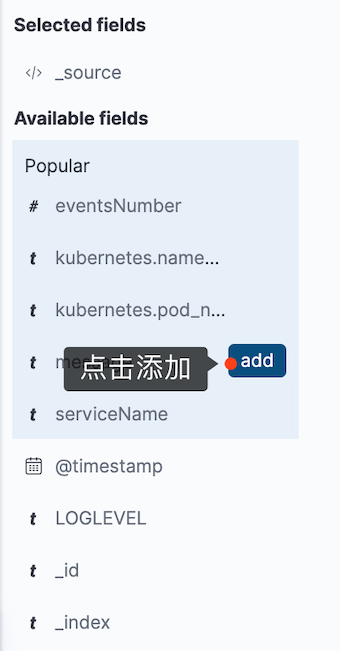

# kibana 日志分析

上面我们已经可以将应用日志收集起来了，下面我们来使用一个应用演示如何分析采集的日志。示例应用会输出如下所示的 `JSON` 格式的日志信息：

```
{"LOGLEVEL":"WARNING","serviceName":"msg-processor","serviceEnvironment":"staging","message":"WARNING client connection terminated unexpectedly."}
{"LOGLEVEL":"INFO","serviceName":"msg-processor","serviceEnvironment":"staging","message":"","eventsNumber":5}
{"LOGLEVEL":"INFO","serviceName":"msg-receiver-api":"msg-receiver-api","serviceEnvironment":"staging","volume":14,"message":"API received messages"}
{"LOGLEVEL":"ERROR","serviceName":"msg-receiver-api","serviceEnvironment":"staging","message":"ERROR Unable to upload files for processing"}
```

因为 `JSON` 格式的日志解析非常容易，当我们将日志结构化传输到 `ES` 过后，我们可以根据特定的字段值而不是文本搜索日志数据，当然纯文本格式的日志我们也可以进行结构化，但是这样每个应用的日志格式不统一，都需要单独进行结构化，非常麻烦，所以建议将日志格式统一成 `JSON` 格式输出。

我们这里的示例应用会定期输出不同类型的日志消息，包含不同日志级别（`INFO/WARN/ERROR`）的日志，一行 `JSON` 日志就是我们收集的一条日志消息，该消息通过 `fluentd` 进行采集发送到 `Elasticsearch`。这里我们会使用到 `fluentd` 里面的自动 `JSON` 解析插件，默认情况下，`fluentd` 会将每个日志文件的一行作为**名为 `log` 的字段进行发送，并自动添加其他字段，比如 `tag` 标识容器，`stream` 标识 `stdout` 或者 `stderr`**。

由于在 fluentd 配置中我们添加了如下所示的过滤器：

```
<filter kubernetes.**>
  @id filter_parser
  @type parser                # multi-format-parser多格式解析器插件
  key_name log                # 在要解析的记录中指定字段名称
  reserve_data true           # 在解析结果中保留原始键值对
  remove_key_name_field true  # key_name 解析成功后删除字段。
  <parse>
    @type multi_format
    <pattern>
      format json
    </pattern>
    <pattern>
      format none
    </pattern>
  </parse>
</filter>
```

该过滤器使用 `json` 和 `none` 两个插件将 `JSON` 数据进行结构化，这样就会把 `JSON` 日志里面的属性解析成一个一个的字段，解析生效过后记得刷新 `Kibana` 的索引字段，否则会识别不了这些字段，通过 **`管理` -> `Index Pattern`** 点击刷新字段列表即可。

下面我们将示例应用部署到 Kubernetes 集群中：(`dummylogs.yaml`)

```
apiVersion: apps/v1
kind: Deployment
metadata:
  name: dummylogs
spec:
  replicas: 3
  selector:
    matchLabels:
      app: dummylogs
  template:
    metadata:
      labels:
        app: dummylogs
        logging: "true"  # 要采集日志需要加上该标签
    spec:
      containers:
      - name: dummy
        image: cnych/dummylogs:latest
        args:
        - msg-processor
---
apiVersion: apps/v1
kind: Deployment
metadata:
  name: dummylogs2
spec:
  replicas: 3
  selector:
    matchLabels:
      app: dummylogs2
  template:
    metadata:
      labels:
        app: dummylogs2
        logging: "true"  # 要采集日志需要加上该标签
    spec:
      containers:
      - name: dummy
        image: cnych/dummylogs:latest
        args:
        - msg-receiver-api
```

直接部署上面的应用即可：

```
$ kubectl get pods -l logging=true
NAME                         READY   STATUS    RESTARTS   AGE
dummylogs-56987f84-fn24f     1/1     Running   0          2m10s
dummylogs-56987f84-nnwfq     1/1     Running   0          2m10s
dummylogs-56987f84-q44lf     1/1     Running   0          2m10s
dummylogs2-97864cdcd-6rlwk   1/1     Running   0          2m10s
dummylogs2-97864cdcd-rd4d5   1/1     Running   0          2m10s
dummylogs2-97864cdcd-tbwfq   1/1     Running   0          2m10s
```

部署完成后 `dummylogs` 和 `dummylogs2` 两个应用就会开始输出不同级别的日志信息了，记得要给应用所在的节点打上 `beta.kubernetes.io/fluentd-ds-ready=true` 的标签，否则 `fluentd` 不会在对应的节点上运行也就不会收集日志了。正常情况下日志就已经可以被采集到 `Elasticsearch` 当中了，我们可以前往 `Kibana` 的 `Dashboard `页面查看:


我们可以看到可用的字段中已经包含我们应用中的一些字段了。找到 `serviceName` 字段点击我们可以查看已经采集了哪些服务的消息：


可以看到我们收到了来自 `msg-processor` 和 `msg-receiver-api` 的日志信息，在最近15分钟之内，`api` 服务产生的日志更多，点击后面的加号就可以只过滤该服务的日志数据：


我们可以看到展示的日志数据的属性比较多，有时候可能不利于我们查看日志，此时我们可以筛选想要展示的字段:



我们可以根据自己的需求选择要显示的字段，现在查看消息的时候就根据清楚了：


比如为了能够更加清晰的展示我们采集的日志数据，还可以将 `eventsNumber` 和 `serviceName` 字段选中添加：

然后同样我们可以根据自己的需求来筛选需要查看的日志数据：


然后同样我们可以根据自己的需求来筛选需要查看的日志数据：


如果你的 `Elasticsearch` 的查询语句比较熟悉的话，使用查询语句能实现的筛选功能更加强大，比如我们要查询 `mgs-processor` 和 `msg-receiver-api` 两个服务的日志，则可以使用如下所示的查询语句：

```
serviceName:msg-processor OR serviceName:msg-receiver-api
```


接下来我们来创建一个图表来展示已经处理了多少 `msg-processor` 服务的日志信息。在 `Kibana` 中切换到 `Visualize` 页面，点击 `Create new visualization` 按钮选择 `Area`，选择 `k8s-*`的索引，首先配置 `Y` 轴的数据，这里我们使用 `eventsNumber` 字段的 `Sum` 函数进行聚合：

`Custom label`:  processed events


**Bucket**


配置完成后点击右上角的 Apply Changes 按钮则就会在右侧展示出对应的图表信息：


这个图表展示的就是最近`15`分钟内被处理的事件总数，当然我们也可以自己选择时间范围。我们还可以将 `msg-receiver-api` 事件的数量和已处理的消息总数进行关联，在该图表上添加另外一层数据，在` Y `轴上添加一个新指标，选择 `Add metrics` 和 `Y-axis`，然后同样选择 `sum` 聚合器，使用 `volume` 字段：

`Custom label`:  API Calls


点击 `Apply Changes` 按钮就可以同时显示两个服务事件的数据了。最后点击顶部的 `save` 来保存该图表，并为其添加一个名称 (API events and Processed message)。


在实际的应用中，我们可能**对应用的错误日志更加关心**，需要了解应用的运行情况，所以对于错误或者警告级别的日志进行统计也是非常有必要的。现在我们回到 `Discover `页面，输入 `LOGLEVEL:ERROR OR LOGLEVEL:WARNING` 查询语句来过滤所有的错误和告警日志：


错误日志相对较少，实际上我们这里的示例应用会每 15-20 分钟左右就会抛出4个错误信息，其余都是警告信息。同样现在我们还是用可视化的图表来展示下错误日志的情况。

同样切换到 `Visualize` 页面，点击 `Create visualization`，选择 `Vertical Bar`，然后选中 `k8s-*` 的 `Index Pattern`。

现在我们忽略 `Y` 轴，使用默认的 `Count` 设置来显示消息数量。首先点击` Buckets` 下面的 `X-axis`，然后同样选择 `Date histogram`，然后点击下方的 `Add`，添加 `Sub-Bueckt`，选择 `Split series:`


然后我们可以通过指定的字段来分割条形图，**选择 `Terms` 作为子聚合方式，然后选择 `serviceName.keyword` 字段，最后点击 `apply` 生成图表**：


现在上面的图表以不同的颜色来显示每个服务消息，接下来我们在搜索框中输入要查找的内容，因为现在的图表是每个服务的所有消息计数，包括正常和错误的日志，我们要过滤告警和错误的日志，同样输入 `LOGLEVEL:ERROR OR LOGLEVEL:WARNING` 查询语句进行搜索即可：


从图表上可以看出来 `msg-processor` 服务问题较多，只有少量的是 `msg-receiver-api` 服务的，当然我们也可以只查看 `ERROR` 级别的日志统计信息：


**从图表上可以看出来基本上出现错误日志的情况下两个服务都会出现，所以这个时候我们就可以猜测两个服务的错误是非常相关的了，**这对于我们去排查错误非常有帮助。最后也将该图表进行保存(Service Error)。


最后我们也可以将上面的两个图表添加到 dashboard 中，这样我们就可以在一个页面上组合各种可视化图表。切换到 dashboard 页面，然后点击 Create New Dashboard 按钮：


选择 `Add an existing` 链接：

然后选择上面我们创建的两个图表，添加完成后同样保存该 `dashboard` 即可：


到这里我们就完成了通过 `Fluentd` 收集日志到 `Elasticsearch`，并通过 `Kibana` 对日志进行了分析可视化操作。

