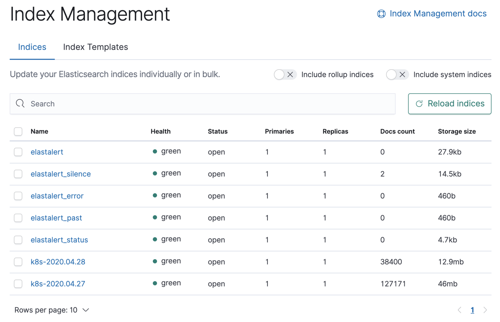
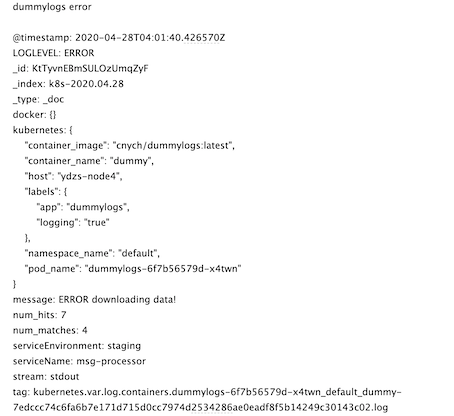

# 基于EKF日志的报警


在生产环境中我们往往都会使用 Promethus 对应用的各项指标进行监控，但是往往应用的日志中也会产生一些错误日志，这些信息并不是都能够通过 metrics 提供数据的，所以为了避免出现太多的错误，我们还需要对错误日志进行监控报警。在 `Elasticsearch` 中，我们可以通过使用 `elastalert` 组件来完成这个工作。

[`elastalert`](https://github.com/Yelp/elastalert) 是 `yelp` 使用` python` 开发的 `elasticsearch` 告警工具。`elastalert` 依照一定频率查询 `ES`，将查询结果对比告警阈值，超过阈值即进行告警。告警方式包括但不局限于邮箱、微信、钉钉等。

我们这里将 `elastalert` 部署到 `Kubernetes` 集群中，对应的资源清单文件如下所示：(`elastalert.yaml`)

我们这里将 `elastalert` 部署到 `Kubernetes` 集群中，对应的资源清单文件如下所示：(`elastalert.yaml`)

```
apiVersion: v1
kind: ConfigMap
metadata:
  name: elastalert-config
  namespace: logging
  labels:
    app: elastalert
data:
  elastalert_config: |-
    ---
    rules_folder: /opt/rules       # 指定规则的目录
    scan_subdirectories: false
    run_every:                     # 多久从 ES 中查询一次
      minutes: 1
    buffer_time:
      minutes: 15
    es_host: elasticsearch
    es_port: 9200
    writeback_index: elastalert
    use_ssl: False
    verify_certs: True
    alert_time_limit:             # 失败重试限制
      minutes: 2880
---
apiVersion: v1
kind: ConfigMap
metadata:
  name: elastalert-rules
  namespace: logging
  labels:
    app: elastalert
data:
  rule_config.yaml: |-
    name: dummylogs error     # 规则名字，唯一值
    es_host: elasticsearch
    es_port: 9200
    
    type: any                 # 报警类型
    index: k8s-*              # es索引
    
    filter:                   # 过滤
    - query:
        query_string:
          query: "LOGLEVEL:ERROR"  # 报警条件

    alert:                    # 报警类型
    - "email"
    smtp_host: smtp.qq.com
    smtp_port: 587
    smtp_auth_file: /opt/auth/smtp_auth_file.yaml
    email_reply_to: ...@qq.com
    from_addr: ...@qq.com
    email:                  # 接受邮箱
    - "...@163.com"
---
apiVersion: apps/v1
kind: Deployment
metadata:
  name: elastalert
  namespace: logging
  labels:
    app: elastalert
spec:
  selector:
    matchLabels:
      app: elastalert
  template:
    metadata:
      labels:
        app: elastalert
    spec:
      containers:
      - name: elastalert
        image: jertel/elastalert-docker:0.2.4
        imagePullPolicy: IfNotPresent
        volumeMounts:
        - name: config
          mountPath: /opt/config
        - name: rules
          mountPath: /opt/rules
        - name: auth
          mountPath: /opt/auth
        resources:
          limits:
            cpu: 50m
            memory: 256Mi
          requests:
            cpu: 50m
            memory: 256Mi
      volumes:
      - name: auth
        secret:
          secretName: smtp-auth
      - name: rules
        configMap:
          name: elastalert-rules
      - name: config
        configMap:
          name: elastalert-config
          items:
          - key: elastalert_config
            path: elastalert_config.yaml
```

使用邮件进行报警的时候，需要指定一个 `smtp_auth_file` 的文件，文件中包含用户名和密码：(`smtp_auth_file.yaml`)

```
user: "xxxxx@qq.com"       # 发送的邮箱地址
password: "ewwghfhdvjwnbjea"   # 不是qq邮箱的登录密码，是授权码
```

然后使用上面的文件创建一个对应的 Secret 资源对象：

```
$ kubectl create secret generic smtp-auth --from-file=smtp_auth_file.yaml -n logging
```

然后直接创建上面的 elastalert 应用：

```
$ kubectl apply -f elastalert.yaml
$ kubectl get pods -n logging -l app=elastalert
NAME                          READY   STATUS    RESTARTS   AGE
elastalert-64ccfbffcf-gd6xz   1/1     Running   0          102s
$ kubectl logs -f elastalert-64ccfbffcf-gd6xz -n logging
Elastic Version: 7.6.2
Reading Elastic 6 index mappings:
Reading index mapping 'es_mappings/6/silence.json'
Reading index mapping 'es_mappings/6/elastalert_status.json'
Reading index mapping 'es_mappings/6/elastalert.json'
Reading index mapping 'es_mappings/6/past_elastalert.json'
Reading index mapping 'es_mappings/6/elastalert_error.json'
Deleting index elastalert_status.
New index elastalert created
Done!
```

看到上面的日志信息就证明 `elastalert` 应用部署成功了。在 `Elasticsearch` 中也可以看到几个相关的 Index ：



由于我们的示例应用会隔一段时间就产生 `ERROR`级别的错误日志，所以正常情况下我们就可以收到如下所示的邮件信息了：



除此之外我们也可以配置将报警信息发往 企业微信 或者 钉钉，还可以安装一个 elastalert 的 [Kibana 插件](https://github.com/bitsensor/elastalert-kibana-plugin)，用于在 Kibana 页面上进行可视化操作。

关于 elastalert 更多的操作和使用说明，大家可以查看官方文档了解更多：https://elastalert.readthedocs.io/en/latest/。