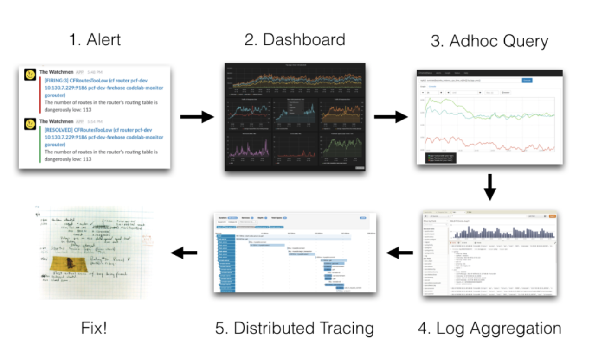
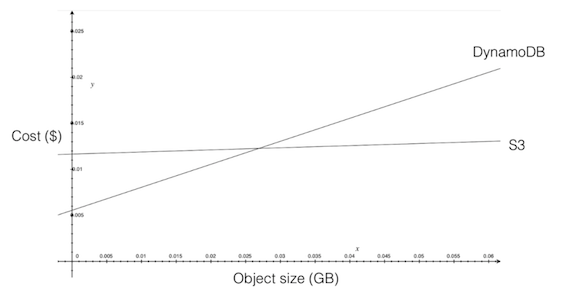

# Grafana Loki 设计文档

本文的目的是为了解释 Grafana  Loki 服务的设计动机。本文档并不会深入描述设计的所有细节，但希望能够对一些关键点进行说明，使我们能够提前发现任何明显的错误。本文主要会回答以下几个相关的问题：我们将如何构建它，为什么还要构建它，可以用于什么场景以及谁会使用它。

## 背景和动机

### 事件响应和上下文切换

Metrics 指标数据是事件响应的关键；通常报警通过时间序列中的条件来编写。但是由于指标数据的性质只能用于暴露一些预期的行为（它们需要预先声明并限制基数）。所以，指标只能说明一半问题；为了获取事件发送原因的完整情况，工程师通常还使用日志来获取更详细的信息。

通常的事件响应首先是从报警开始的，然后通过一些 Dashboard 查看信息，然后再指出错误的服务、主机或者实例。然后，工程师将尝试查找该服务、主机或者实例在该时间范围内的日志，希望能找到根本原因。由于当前的情况是指标和日志存储在两个不同的系统中，所以工程师们需要将查询从一种语言和界面切换到另外一种语言去操作。

所以，该设计的第一个目的是将日志和指标之间的上下文切换成本降到最低，这样有助于减少事件响应的时间并改善用户体验。

### 现有解决方案

日志聚合并不是一个新的 idea，和时间序列监控一样，有许多这方面的 SaaS 服务商和开源项目提供这样的服务。但是几乎所有现有的解决方案都涉及到使用全文搜索来为日志构建索引；乍一看，貌似这是一个很明显的解决方案，它具有丰富而强大的功能，也可以进行复杂的查询。

但是现有的这些解决方案规模都比较庞大，资源消耗太多而且操作起来也比较困难。一种越来越普遍的模式是将监控的时间序列和日志聚合结合使用，因为那些查询系统提供的一些灵活、复杂的功能常常也不使用；大多数的查询也只是关注在一定时间范围内和一些简单的参数（主机、服务等）。使用这些系统进行日志聚合就是杀鸡用宰牛刀。

由于现有系统的复杂性和运维成本导致很多使用者直接购买 SaaS 服务来解决问题。所以，该设计的第二个目的是在易操作性和查询语言的复杂程度之间进行平衡。

### 成本控制

随着向日志聚合的 SaaS 服务迁移，这类系统的成本也是越来越高。这种成本不仅是来自于实现全文搜索的技术 - 缩放和分片的反向索引非常困难；要么写到每个分片，要么必须读，而且还取决于操作的复杂性。

日志聚合系统的购买者，当他们发现现有的报价花费已经超出预算过后，他们往往就是求助工程师减少日志记录。但是又由于日志可以覆盖一些意外的错误，所以工程师们这个时候大都会表现得难以置信：“如果我必须注意我记录的是什么日志，那么记录日志又有什么意义呢？”

最近有一些系统可以来平衡这些问题，Peter Bourgon 开源的 OKLOG 项目（不过现已归档），就避免了基于时间索引的形式，并采用最终一致的、基于网格的分发策略。这两个设计策略可以大幅降低成本并简化操作，但是我们认为这并不能满足我们的其他设计要求 - 查询表达能力不足。但是，我们确实也认为这是一种比较好的本地解决方案。

所以第三个目的就是在权衡索引不同的情况下，成本控制显著提高的解决方案是非常重要的。。。。。。

### Kubernetes

另外一个有趣的是考虑日志在现代的云原生/微服务/容器化方面的变化。现在标准的模式是应用程序将日志简单的直接写入 `STDOUT` 或者 `STDERR`。Kubernetes 和 Docker 等平台都可以提供日志聚合功能；日志存储在本地节点上，并可以使用标签选择器按需获取和汇总。

但是对于这些简单的系统，当 Pod 或者节点不在了，日志通常也会丢失。这常常也是需要日志聚合的一个原因 - Pod 或者节点神秘地死亡了，没有可用的日志来诊断原因。

### Prometheus 和 Cortex

最后，还有必要介绍下 `Prometheus` 如何融入我们的设计中来。`Prometheus` 是一个以时间序列数据库为中心的监控系统。`TSDB `数据库使用一组键值对为样本来建立索引。通过指定这些标签（匹配器）的子集，并返回与这些标签匹配的所有时间序列。这和传统的  `Graphite` 分层标签不同，它对于新标签或者更改标签的查询具有更好的鲁棒性。

在 `Prometheus`（和 `Cortex`）中，这些标签存储在倒排索引中，从而可以快速查询这些标签。Cortext 中的倒排索引保存在内存中来存储最新的数据，并在分布式 `KV` 存储（`BigTable`，`DynamoDB` 或者 `Cassandra`）中来存储历史数据。`Cortex` 索引通过保留率（`retention`）和吞吐量来进行线性缩放，但是任何给点标签的基数都是有限的。

**`Promethues` 系统包含很多组件，但是我们这里讨论中值得关注的一个组件是 `mtail`。`Mtail `允许我们”从应用程序日志中提取白盒监控数据，以将其收集到时间序列数据库中“**。这允许你为不会暴露任何监控指标的应用程序构建时间序列监控和报警。

### 故事

* 在收到有关我的服务的报警并深入研究和该报警相关的查询数据之后，我想快速查看与在报警时产生的这些时间序列的任务相关的日志。
* 在 Pod 或者节点消失后，我希望能够获得其挂掉之前的日志，以便能够诊断其挂掉的原因。
* 当发现服务存在持续性问题后，我想从一些日志中提取一些指标，并将其和现有的时间序列数据结合起来。
* 我有一些比较老的项目，它们没有暴露有关错误的指标数据 - 只会记录日志。我想基于日志中的错误率来构建报警。

### 非目标

日志聚合系统的一个常见方式是存储结构化的，事件驱动的数据。例如针对系统的每个请求都触发一个事件，并包括所有请求的详细信息和元数据。通过这些数据，我们可以提出诸如”向我显示具有最高 99% 延迟的前10位用户“之类的问题，由于用户基数较高，通常我们是无法使用时间序列指标系统来完成这个操作的。尽管该示例是完全有效的需求，但这不是我们的系统设计的目标。

### 解决方案意见

我们将构建一个托管的日志聚合系统，该系统会与那些日志流关联的元数据进行索引，而不是对日志流本身的内容进行索引。该元数据将采用类似于 `Prometheus` 的多维标签形式。这些标签将与从任务中提取的时间序列或指标相关的标签一致，从而可以使用相同的标签从任务中查找日志，也可以从该任务中查找时间序列，从而可以在 `UI` 界面中快速进行上下文切换。

该系统不会解决通常和日志聚合相关的许多复杂的分布式系统和存储难题，而是将他们转移到现有的分布式数据库和对象存储系统中。大多数系统服务都是无状态且临时的，并且允许系统的运维人员使用云服务商提供的托管服务，这将会大大降低运维的复杂性。

通过只索引和日志相关的元数据，系统会将索引的负载减少很多数量级 - 我期望的是 100MB 的日志数据其元数据大概为 1KB。实际的日志数据将存储在托管的对象存储服务（S3、GCS 等）中，由于服务商之间的竞争，我们还能够更加节省费用，可以以比竞争对手低几个数量级的价格提供该系统。比如，`GCS `的价格是 `$0.026/GB/月`，而 `Loggly` 的价格是 ~`$100/GB/月`。

由于这是一个托管系统，所以在客户主机或者 Pods 发生故障后，日志将变得非常简单。Agent 将部署到客户系统中的每个节点，以将日志发送到我们的服务中来，并确保元数据和指标保持一致。

## 架构

### Agent

**第一个挑战是获得与时间序列/指标关联的元数据一致的可靠的元数据**。

为此，**我们将使用和 `Prometheus` 相同的服务发现和标签 `relabelling` 库。这些会被打包到一个守护程序中，该程序可以发现目标、生成元数据标签和 `tails` 日志文件来生成日志流数据，这些日志流会在客户端暂存，然后发送给服务**。考虑到当节点故障时会有部分最新的日志数据，所以可以执行的批处理数量有一个最基本的限制。该组件叫做 `Promtail`。

### 写入请求生命周期

服务端组件上的写入路径将会使用类似 `Cortext` 的架构：

* 写操作将首先到达 `Distributor`组件，该组件负责将写操作分发并复制到 `Ingesters` 组件。我们将使用 `Cortext` 一致性哈希环；我们将将基于整个元数据的哈希值来分发写操作，因为日志流没有方便的指标名称。
* 接下来的写入操作将到达 `”log ingester“`，该记录将内存中同一流的写入分批写入`”log chunks“`。当 `chunk` 达到了预定义的大小或者期限时，它们会定期刷新到 `Cortext` 的 `chunk` 存储中。
* 然后会更新 `Cortext `的 `chunk` 存储，以减少在读写路径上复制 `chunk` 数据，并增加对写入 `GCS` 的支持。

### 日志块

`chunk（日志块`） 格式对于系统的成本和性能至关重要。一个 `chunk` 是特定期间内给定标签集的所有日志。`chunks` 必须支持追加、查找和流式读取。假设平均一个节点每天产生 `10GB `的日志，并且平均运行在`30`个容器上，那么每个日志流将以 `4KB/s `的速度写入。预期压缩率为`10`倍左右。

当选择一个最优的 `chunk` 大小时我们需要考虑下面的一些情况：

* 每次运维成本和存储成本；在对象较小的情况下，主要是运维成本，将它们存储在数据库比如 `Bigtable` 中的成本较低。
* 每个 `chunk` 索引的负载 - 每个 `chunk` 都需要索引中的数据；运行 `Cortex` 的经验告诉我们，这是运行系统中最大的成本部分，但是如果考虑到 `chunk` 较大的时候，可能情况并不一定是这样的。
* 用于构建 `chunks`的内存成本和丢失的风险，这可能成为限制因素。我们应该期望每台机器能够处理`1000`个主机的日志流，以便能够经济高效地运行该服务；如果每个流需要 `1MB` 的内存，而没给主机需要`30`个流，则意味着每个` ingester` 组件需要 `30GB` 的内存（和 `WAL` 类似）。`1000`个主机还意味着 `130MB/s` 的入站和出站带宽以及正在进行的压缩。
* 压缩效果 - 当非常小的时候，压缩是没有效果的；日志行需要一起进行批处理，以实现接近最佳压缩效果。

例如，12小时的日志数据将产生约 100MB 的未压缩块和约 10MB 的压缩块。12小时也是我们在 Cortex 中使用的块长度的上限。考虑到构建这些的内存需要，一个块大小看起来更可能接近 1MB（压缩）。

该提案是将一个 `chunk` 由一系列的` blocks` 来组成；第一个` block` 是一个 `gorilla `样式的编码时间索引，随后的 `blocks` 包含压缩的日志数据。一旦产生足够的 `blocks` 来形成足够大的 `chunk`，它们将被附加到一起形成一个 `chunk`。

### 查询请求生命周期

由于 `chunks` 要比 `Prometheus/Cortex` 的 `chunks` 大很多个数量级（`Cortext` 的块最大为 `1KB`），所以无法加载和完整解压缩它们。所以我们需要支持流传输并对其进行循环迭代操作，只在我们需要的时候再解压所需要的部分。当然这里有很多细节需要解决，但是我觉得使用 gRPC 流和堆会是正确的选择（可以查看最新的 `Cortex` 迭代查询的 `PR`）。

*TBD：如何实现类似 mtail 的功能 - 额外的 PromQL 函数？ruler？*

### API

* Log 写入
* Log 范围查询
	* 返回与选择器和时间范围匹配的日志流
	* 请求参数
		* selector：用于表示日志流的标签，比如{job="webapp2"}，如果没有指定选择器，则返回所有流
		* start：开始时间，以秒为单位
		* end：结束时间，以秒为单位
	* 返回字段
		* streams: 日志流列表，每个流都有一个元数据和数据子字段
* Log 流查询
	* 应该使用 websockets 吗？
	* 可以用日志范围查询建模吗？
* 标签查询
	* 返回给定时间范围内可用的标签
	* 请求参数
		* start: 开始时间
		* end: 结束时间
	* 返回字段
		* keys: 可用标签 keys 的集合
* 标签匹配查询
	* 返回给定选择器和时间范围的可用标签集合
	* 请求参数
		* selector: 可以对标签进行预过滤的标签集，例如`{job="webapp2"}  `
		* start: 开始时间
		* end: 结束时间
	* 返回字段
		* 返回字段

  