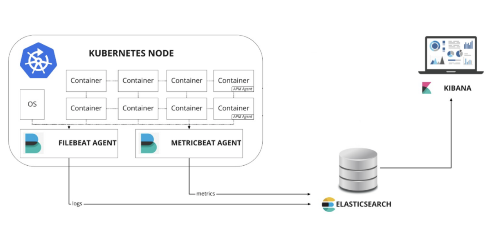
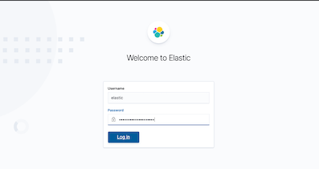
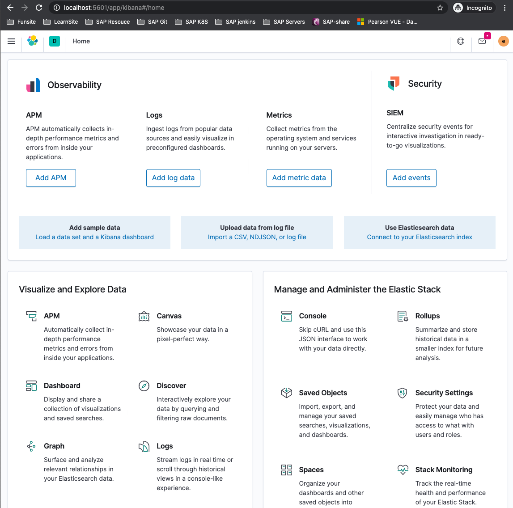
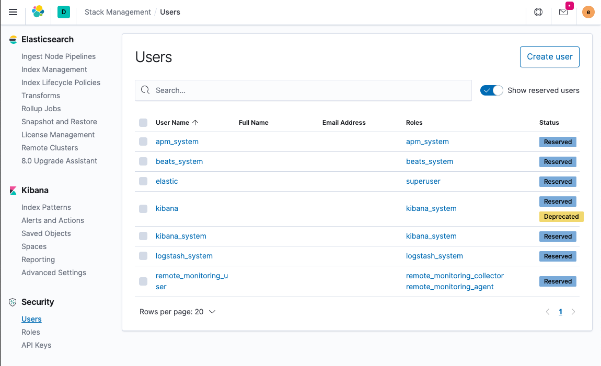
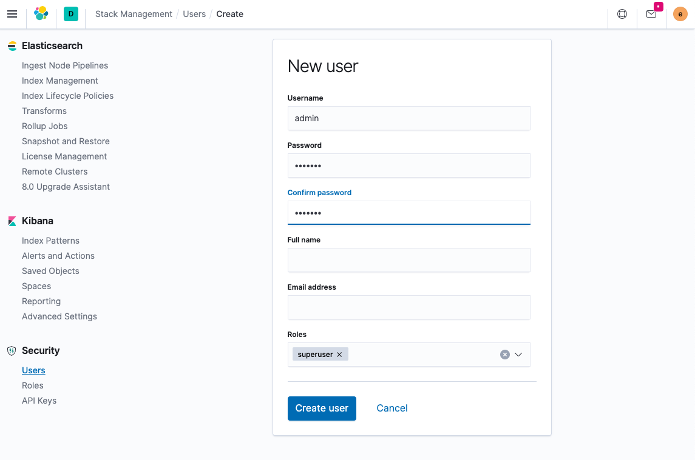
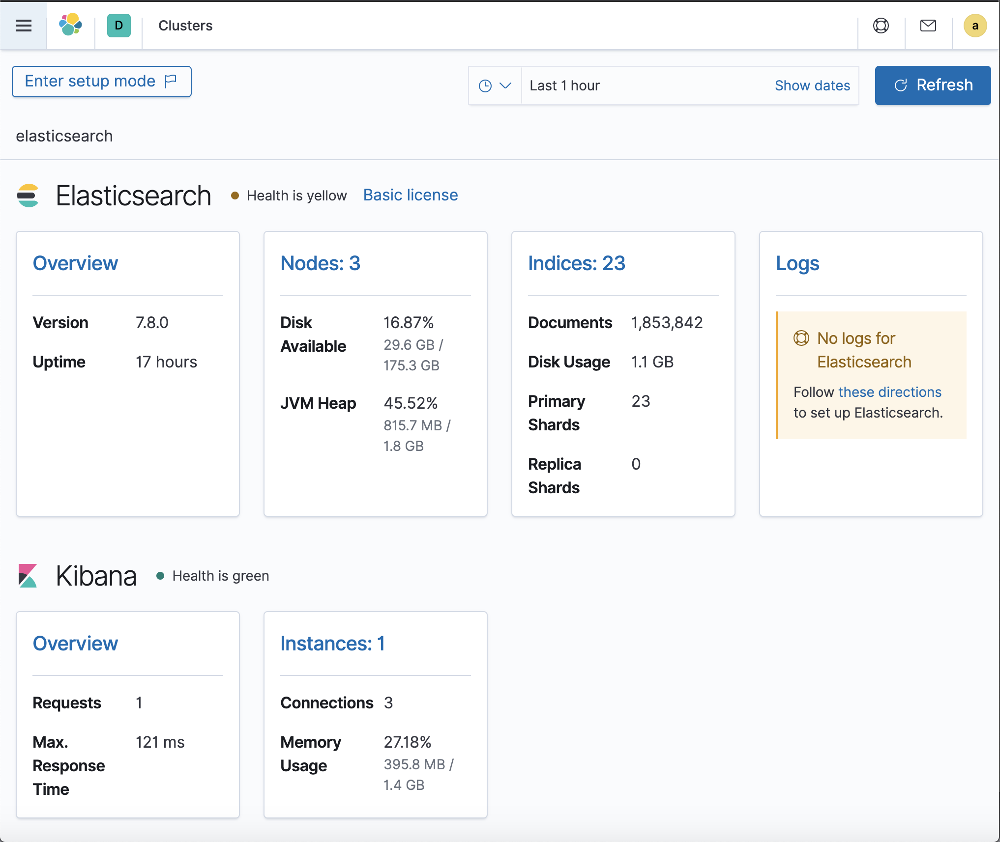

# 使用 Elastic Stack 全栈监控 —ElasticSearch 的集群安装

我们将学习如何使用 Elastic 技术栈来为 Kubernetes 构建监控环境。可观测性的目标是为生产环境提供运维工具来检测服务不可用的情况（比如服务宕机、错误或者响应变慢等），并且保留一些可以排查的信息，以帮助我们定位问题。总的来说主要包括3个方面：

* **监控指标**提供系统各个组件的时间序列数据，比如 CPU、内存、磁盘、网络等信息，通常可以用来显示系统的整体状况以及检测某个时间的异常行为
* **日志**为运维人员提供了一个数据来分析系统的一些错误行为，通常将系统、服务和应用的日志集中收集在同一个数据库中
* **追踪或者 APM（应用性能监控Application Performance Monitoring）** 提供了一个更加详细的应用视图，**可以将服务执行的每一个请求和步骤都记录下来（比如 HTTP 调用、数据库查询等），通过追踪这些数据，我们可以检测到服务的性能，并相应地改进或修复我们的系统**


本文我们就将在 `Kubernetes` 集群中使用由 `ElasticSearch`、`Kibana`、`Filebeat`、`Metricbeat` 和 `APM-Server` 组成的 `Elastic` 技术栈来监控系统环境。为了更好地去了解这些组件的配置，我们这里将采用手写资源清单文件的方式来安装这些组件，当然我们也可以使用 Helm 等其他工具来快速安装配置。



接下来我们就来学习下如何使用 Elastic 技术构建 Kubernetes 监控栈。我们这里的试验环境是 `Kubernetes v1.16.6` 版本的集群，为方便管理，我们将所有的资源对象都部署在一个名为 `elastic` 的命名空间中：

```
$ kubectl create ns elastic
namespace/elastic created
```

```
$ kubectl get sc
NAME                 PROVISIONER          AGE
hostpath (default)   docker.io/hostpath   31d
```

## 1. 示例应用

这里我们先部署一个使用 `SpringBoot` 和 `MongoDB` 开发的示例应用。首先部署一个 `MongoDB` 应用，对应的资源清单文件如下所示：

**`mongo.yml`**

```
---
apiVersion: v1
kind: Service
metadata:
  name: mongo
  namespace: elastic
  labels:
    app: mongo
spec:
  ports:
  - port: 27017
    protocol: TCP
  selector:
    app: mongo
---
apiVersion: apps/v1
kind: StatefulSet
metadata:
  namespace: elastic
  name: mongo
  labels:
    app: mongo
spec:
  serviceName: "mongo"
  selector:
    matchLabels:
      app: mongo
  template:
    metadata:
      labels:
        app: mongo
    spec:
      containers:
      - name: mongo
        image: mongo
        ports:
        - containerPort: 27017
        volumeMounts:
        - name: data
          mountPath: /data/db
  volumeClaimTemplates:
  - metadata:
      name: data
    spec:
      accessModes: [ "ReadWriteOnce" ]
      storageClassName: hostpath  # 使用支持 RWO 的 StorageClass
      resources:
        requests:
          storage: 1Gi
```

这里我们使用了一个名为 `docker-desktop`: `hostpath`的 `StorageClass` 对象来自动创建 `PV`，可以替换成自己集群中支持 `RWO` 的 `StorageClass` 对象即可。直接使用上面的资源清单创建即可：

```
$ kubectl apply -f mongo.yml
service/mongo created
statefulset.apps/mongo created

$ kubectl get pods -n elastic -l app=mongo
NAME      READY   STATUS    RESTARTS   AGE
mongo-0   1/1     Running   0          3m44s
```

直到 `Pod` 变成 `Running` 状态证明 `mongodb` 部署成功了。接下来部署 `SpringBoot` 的 `API` 应用，这里我们通过 `NodePort` 类型的 `Service` 服务来暴露该服务，对应的资源清单文件如下所示：

**`spring-boot-simple.yml`**

```
---
apiVersion: v1
kind: Service
metadata:
  namespace: elastic
  name: spring-boot-simple
  labels:
    app: spring-boot-simple
spec:
  type: NodePort
  ports:
  - port: 8080
    protocol: TCP
  selector:
    app: spring-boot-simple
---
apiVersion: apps/v1
kind: Deployment
metadata:
  namespace: elastic
  name: spring-boot-simple
  labels:
    app: spring-boot-simple
spec:
  replicas: 1
  selector:
    matchLabels:
      app: spring-boot-simple
  template:
    metadata:
      labels:
        app: spring-boot-simple
    spec:
      containers:
      - image: cnych/spring-boot-simple:0.0.1-SNAPSHOT
        name: spring-boot-simple
        env:
        - name: SPRING_DATA_MONGODB_HOST  # 指定MONGODB地址
          value: mongo
        ports:
        - containerPort: 8080
```

同样直接创建上面的应用的应用即可：

```
$ kubectl apply -f spring-boot-simple.yaml
service/spring-boot-simple created
deployment.apps/spring-boot-simple created

$ kubectl get pods -n elastic -l app=spring-boot-simple
NAME                                  READY   STATUS    RESTARTS   AGE
spring-boot-simple-6c4f87bf79-bbb7w   1/1     Running   0          3m40s

$ kubectl get svc -n elastic -l app=spring-boot-simple
NAME                 TYPE       CLUSTER-IP    EXTERNAL-IP   PORT(S)          AGE
spring-boot-simple   NodePort   10.111.2.65   <none>        8080:30024/TCP   5m54s
```

当应用部署完成后，我们就可以通过地址 `http://<nodeip>:30024` 访问应用，可以通过如下命令进行简单测试：

```
$ curl -X GET  http://127.0.0.1:30024/
Greetings from Spring Boot!
```

发送一个 POST 请求：

```
$ curl -X POST http://127.0.0.1:30024/message -d 'hello world'
{"id":"5f03e4da217e8e0001591daa","message":"hello+world=","postedAt":"2020-07-07T02:58:34.568+0000"}
```

获取所以消息数据：

```
$ curl -X GET http://127.0.0.1:30024/message
[{"id":"5f03e4da217e8e0001591daa","message":"hello+world=","postedAt":"2020-07-07T02:58:34.568+0000"}]
```

## 2. ElasticSearch 集群

要建立一个 Elastic 技术的监控栈，当然首先我们需要部署 `ElasticSearch`，它是用来存储所有的指标、日志和追踪的数据库，这里我们通过3个不同角色的可扩展的节点组成一个集群。

### 2.1 安装 ElasticSearch 主节点

设置集群的第一个节点为 `Maste`r 主节点，来负责控制整个集群。首先创建一个 `ConfigMap` 对象，用来描述集群的一些配置信息，以方便将 `ElasticSearch` 的主节点配置到集群中并开启安全认证功能。对应的资源清单文件如下所示：

**`elasticsearch-master.configmap.yaml`**

```
---
apiVersion: v1
kind: ConfigMap
metadata:
  namespace: elastic
  name: elasticsearch-master-config
  labels:
    app: elasticsearch
    role: master
data:
  elasticsearch.yml: |-
    cluster.name: ${CLUSTER_NAME}
    node.name: ${NODE_NAME}
    discovery.seed_hosts: ${NODE_LIST}
    cluster.initial_master_nodes: ${MASTER_NODES}

    network.host: 0.0.0.0

    node:
      master: true
      data: false
      ingest: false

    xpack.security.enabled: true
    xpack.monitoring.collection.enabled: true
---
```

然后创建一个 `Service` 对象，在 `Master` 节点下，我们只需要通过用于集群通信的 `9300` 端口进行通信。资源清单文件如下所示：


**`elasticsearch-master.service.yaml`**

```
---
apiVersion: v1
kind: Service
metadata:
  namespace: elastic
  name: elasticsearch-master
  labels:
    app: elasticsearch
    role: master
spec:
  ports:
  - port: 9300
    name: transport
  selector:
    app: elasticsearch
    role: master
---
```
最后使用一个 Deployment 对象来定义 Master 节点应用，资源清单文件如下所示：

**`elasticsearch-master.deployment.yaml`**

```
# elasticsearch-master.deployment.yaml
---
apiVersion: apps/v1
kind: Deployment
metadata:
  namespace: elastic
  name: elasticsearch-master
  labels:
    app: elasticsearch
    role: master
spec:
  replicas: 1
  selector:
    matchLabels:
      app: elasticsearch
      role: master
  template:
    metadata:
      labels:
        app: elasticsearch
        role: master
    spec:
      containers:
      - name: elasticsearch-master
        image: docker.elastic.co/elasticsearch/elasticsearch:7.8.0
        env:
        - name: CLUSTER_NAME
          value: elasticsearch
        - name: NODE_NAME
          value: elasticsearch-master
        - name: NODE_LIST
          value: elasticsearch-master,elasticsearch-data,elasticsearch-client
        - name: MASTER_NODES
          value: elasticsearch-master
        - name: "ES_JAVA_OPTS"
          value: "-Xms512m -Xmx512m"
        ports:
        - containerPort: 9300
          name: transport
        volumeMounts:
        - name: config
          mountPath: /usr/share/elasticsearch/config/elasticsearch.yml
          readOnly: true
          subPath: elasticsearch.yml
        - name: storage
          mountPath: /data
      volumes:
      - name: config
        configMap:
          name: elasticsearch-master-config
      - name: "storage"
        emptyDir:
          medium: ""
---
```

直接创建上面的3个资源对象即可：

```
kubectl apply  -f elasticsearch-master.configmap.yaml
kubectl apply  -f elasticsearch-master.service.yaml
kubectl apply  -f elasticsearch-master.deployment.yaml

$  kubectl get pods -n elastic -l app=elasticsearch
NAME                                    READY   STATUS    RESTARTS   AGE
elasticsearch-master-6f666cbbd-2xncp    1/1     Running   0          2d3h
```

直到 Pod 变成 Running 状态就表明 master 节点安装成功。

### 2.2 安装 ElasticSearch 数据节点

现在我们需要安装的是集群的数据节点，**它主要来负责集群的数据托管和执行查询**。

和 `master` 节点一样，我们使用一个 `ConfigMap `对象来配置我们的数据节点：

**`elasticsearch-data.configmap.yaml`**

```
---
apiVersion: v1
kind: ConfigMap
metadata:
  namespace: elastic
  name: elasticsearch-data-config
  labels:
    app: elasticsearch
    role: data
data:
  elasticsearch.yml: |-
    cluster.name: ${CLUSTER_NAME}
    node.name: ${NODE_NAME}
    discovery.seed_hosts: ${NODE_LIST}
    cluster.initial_master_nodes: ${MASTER_NODES}

    network.host: 0.0.0.0

    node:
      master: false
      data: true
      ingest: false

    xpack.security.enabled: true
    xpack.monitoring.collection.enabled: true
---
```

可以看到和上面的 master 配置非常类似，**不过需要注意的是属性 `node.data=true`。**

同样只需要通过 `9300` 端口和其他节点进行通信：

**`elasticsearch-data.service.yaml`**

```
---
apiVersion: v1
kind: Service
metadata:
  namespace: elastic
  name: elasticsearch-data
  labels:
    app: elasticsearch
    role: data
spec:
  ports:
  - port: 9300
    name: transport
  selector:
    app: elasticsearch
    role: data
---
```

最后创建一个 `StatefulSet` 的控制器，因为可能会有多个数据节点，每一个节点的数据不是一样的，需要单独存储，所以也使用了一个 `volumeClaimTemplates` 来分别创建存储卷，对应的资源清单文件如下所示：

**`elasticsearch-data.statefulset.yaml`**

```
---
apiVersion: apps/v1
kind: StatefulSet
metadata:
  namespace: elastic
  name: elasticsearch-data
  labels:
    app: elasticsearch
    role: data
spec:
  serviceName: "elasticsearch-data"
  selector:
    matchLabels:
      app: elasticsearch
      role: data
  template:
    metadata:
      labels:
        app: elasticsearch
        role: data
    spec:
      containers:
      - name: elasticsearch-data
        image: docker.elastic.co/elasticsearch/elasticsearch:7.8.0
        env:
        - name: CLUSTER_NAME
          value: elasticsearch
        - name: NODE_NAME
          value: elasticsearch-data
        - name: NODE_LIST
          value: elasticsearch-master,elasticsearch-data,elasticsearch-client
        - name: MASTER_NODES
          value: elasticsearch-master
        - name: "ES_JAVA_OPTS"
          value: "-Xms1024m -Xmx1024m"
        ports:
        - containerPort: 9300
          name: transport
        volumeMounts:
        - name: config
          mountPath: /usr/share/elasticsearch/config/elasticsearch.yml
          readOnly: true
          subPath: elasticsearch.yml
        - name: elasticsearch-data-persistent-storage
          mountPath: /data/db
      volumes:
      - name: config
        configMap:
          name: elasticsearch-data-config
  volumeClaimTemplates:
  - metadata:
      name: elasticsearch-data-persistent-storage
    spec:
      accessModes: [ "ReadWriteOnce" ]
      storageClassName: hostpath
      resources:
        requests:
          storage: 1Gi
---
```

直接创建上面的资源对象即可：

```
kubectl apply -f elasticsearch-data.configmap.yaml
kubectl apply -f elasticsearch-data.service.yaml
kubectl apply  -f elasticsearch-data.statefulset.yaml
```

直到 Pod 变成 Running 状态证明节点启动成功：

```
$  kubectl get pods -n elastic -l app=elasticsearch
NAME                                    READY   STATUS    RESTARTS   AGE
elasticsearch-data-0                    1/1     Running   0          2d
elasticsearch-master-6f666cbbd-2xncp    1/1     Running   0          2d3h
```

### 2.3 安装 ElasticSearch 客户端节点

最后来安装配置 ElasticSearch 的客户端节点，该节点主要负责暴露一个 HTTP 接口将查询数据传递给数据节点获取数据。

同样使用一个 ConfigMap 对象来配置该节点：

**`elasticsearch-client.configmap.yaml`**

```
---
apiVersion: v1
kind: ConfigMap
metadata:
  namespace: elastic
  name: elasticsearch-client-config
  labels:
    app: elasticsearch
    role: client
data:
  elasticsearch.yml: |-
    cluster.name: ${CLUSTER_NAME}
    node.name: ${NODE_NAME}
    discovery.seed_hosts: ${NODE_LIST}
    cluster.initial_master_nodes: ${MASTER_NODES}

    network.host: 0.0.0.0

    node:
      master: false
      data: false
      ingest: true

    xpack.security.enabled: true
    xpack.monitoring.collection.enabled: true
---
```

客户端节点需要暴露两个端口，`9300`端口用于与集群的其他节点进行通信，`9200`端口用于 `HTTP API`。对应的 `Service` 对象如下所示：

**`elasticsearch-client.service.yaml`**

```
---
apiVersion: v1
kind: Service
metadata:
  namespace: elastic
  name: elasticsearch-client
  labels:
    app: elasticsearch
    role: client
spec:
  ports:
  - port: 9200
    name: client
  - port: 9300
    name: transport
  selector:
    app: elasticsearch
    role: client
---
```

使用一个 Deployment 对象来描述客户端节点：

**`elasticsearch-client.deployment.yaml`**

```
---
apiVersion: apps/v1
kind: Deployment
metadata:
  namespace: elastic
  name: elasticsearch-client
  labels:
    app: elasticsearch
    role: client
spec:
  selector:
    matchLabels:
      app: elasticsearch
      role: client
  template:
    metadata:
      labels:
        app: elasticsearch
        role: client
    spec:
      containers:
      - name: elasticsearch-client
        image: docker.elastic.co/elasticsearch/elasticsearch:7.8.0
        env:
        - name: CLUSTER_NAME
          value: elasticsearch
        - name: NODE_NAME
          value: elasticsearch-client
        - name: NODE_LIST
          value: elasticsearch-master,elasticsearch-data,elasticsearch-client
        - name: MASTER_NODES
          value: elasticsearch-master
        - name: "ES_JAVA_OPTS"
          value: "-Xms256m -Xmx256m"
        ports:
        - containerPort: 9200
          name: client
        - containerPort: 9300
          name: transport
        volumeMounts:
        - name: config
          mountPath: /usr/share/elasticsearch/config/elasticsearch.yml
          readOnly: true
          subPath: elasticsearch.yml
        - name: storage
          mountPath: /data
      volumes:
      - name: config
        configMap:
          name: elasticsearch-client-config
      - name: "storage"
        emptyDir:
          medium: ""
---
```

同样直接创建上面的资源对象来部署 client 节点：

```
kubectl apply  -f elasticsearch-client.configmap.yaml
kubectl apply  -f elasticsearch-client.service.yaml
kubectl apply  -f elasticsearch-client.deployment.yaml
```

直到所有的节点都部署成功后证明集群安装成功：

```
$  kubectl get pods -n elastic -l app=elasticsearch
NAME                                    READY   STATUS    RESTARTS   AGE
elasticsearch-client-788bffcc98-k8s6h   1/1     Running   0          2d
elasticsearch-data-0                    1/1     Running   0          2d
elasticsearch-master-6f666cbbd-2xncp    1/1     Running   0          2d3h
```

可以通过如下所示的命令来查看集群的状态变化：

```
$ kubectl logs -f -n elastic \
>   $(kubectl get pods -n elastic | grep elasticsearch-master | sed -n 1p | awk '{print $1}') \
>   | grep "Cluster health status changed from"
{"type": "server", "timestamp": "2020-07-07T06:21:26,580Z", "level": "INFO", "component": "o.e.c.r.a.AllocationService", "cluster.name": "elasticsearch", "node.name": "elasticsearch-master", "message": "Cluster health status changed from [YELLOW] to [GREEN] (reason: [shards started [[.monitoring-es-7-2020.07.07][0]]]).", "cluster.uuid": "9M92bFTATjytwhDV33KRLA", "node.id": "_Ih4rde0QViBkkoCXOkH-w"  }
```


### 2.4 生成密码

我们启用了 `xpack` 安全模块来保护我们的集群，所以我们需要一个初始化的密码。我们可以执行如下所示的命令，在客户端节点容器内运行 `bin/elasticsearch-setup-passwords` 命令来生成默认的用户名和密码：

```
$ kubectl exec $(kubectl get pods -n elastic | grep elasticsearch-client | sed -n 1p | awk '{print
 $1}') \
>     -n elastic \
>     -- bin/elasticsearch-setup-passwords auto -b
Changed password for user apm_system
PASSWORD apm_system = rsp9mVwMDVC86cCt7Pfs

Changed password for user kibana_system
PASSWORD kibana_system = dRgI7bBbhO1aJETJKPrX

Changed password for user kibana
PASSWORD kibana = dRgI7bBbhO1aJETJKPrX

Changed password for user logstash_system
PASSWORD logstash_system = S3f5ztMGTKMSsMqeEL3T

Changed password for user beats_system
PASSWORD beats_system = Y15AQ5Rh4N0Wj9cFWAh1

Changed password for user remote_monitoring_user
PASSWORD remote_monitoring_user = pcvZhxfhrAncUmyBSdqz

Changed password for user elastic
PASSWORD elastic = fhuoUCY5pXAtnYUi5d5d
```

注意需要将 `elastic` 用户名和密码也添加到 `Kubernetes` 的 `Secret` 对象中：


```
kubectl create secret generic elasticsearch-pw-elastic \
    -n elastic \
    --from-literal password=fhuoUCY5pXAtnYUi5d5d
secret/elasticsearch-pw-elastic created
```

## 3. Kibana

`ElasticSearch` 集群安装完成后，接着我们可以来部署 `Kibana`，这是 `ElasticSearch` 的数据可视化工具，它提供了管理 `ElasticSearch` 集群和可视化数据的各种功能。

同样首先我们使用 `ConfigMap` 对象来提供一个文件文件，其中包括对 `ElasticSearch` 的访问（主机、用户名和密码），这些都是通过环境变量配置的。对应的资源清单文件如下所示：

**`kibana.configmap.yaml`**

```
---
apiVersion: v1
kind: ConfigMap
metadata:
  namespace: elastic
  name: kibana-config
  labels:
    app: kibana
data:
  kibana.yml: |-
    server.host: 0.0.0.0

    elasticsearch:
      hosts: ${ELASTICSEARCH_HOSTS}
      username: ${ELASTICSEARCH_USER}
      password: ${ELASTICSEARCH_PASSWORD}
---
```

然后通过一个 `ClusterIP` 类型的服务来暴露 `Kibana` 服务：

**`kibana.service.yaml`**

```
---
apiVersion: v1
kind: Service
metadata:
  namespace: elastic
  name: kibana
  labels:
    app: kibana
spec:
  type: ClusterIP
  ports:
  - port: 5601
    name: webinterface
  selector:
    app: kibana
---
```

最后通过 `Deployment `来部署 `Kibana` 服务，由于需要通过环境变量提供密码，这里我们使用上面创建的 `Secret` 对象来引用：

```
---
apiVersion: apps/v1
kind: Deployment
metadata:
  namespace: elastic
  name: kibana
  labels:
    app: kibana
spec:
  selector:
    matchLabels:
      app: kibana
  template:
    metadata:
      labels:
        app: kibana
    spec:
      containers:
      - name: kibana
        image: docker.elastic.co/kibana/kibana:7.8.0
        ports:
        - containerPort: 5601
          name: webinterface
        env:
        - name: ELASTICSEARCH_HOSTS
          value: "http://elasticsearch-client.elastic.svc.cluster.local:9200"
        - name: ELASTICSEARCH_USER
          value: "elastic"
        - name: ELASTICSEARCH_PASSWORD
          valueFrom:
            secretKeyRef:
              name: elasticsearch-pw-elastic
              key: password
        volumeMounts:
        - name: config
          mountPath: /usr/share/kibana/config/kibana.yml
          readOnly: true
          subPath: kibana.yml
      volumes:
      - name: config
        configMap:
          name: kibana-config
---
```

同样直接创建上面的资源清单即可部署：

```
kubectl apply  -f kibana.configmap.yaml
kubectl apply  -f kibana.service.yaml
kubectl apply  -f kibana.deployment.yaml
```

```
$ kubectl get svc kibana -n elastic
NAME     TYPE        CLUSTER-IP       EXTERNAL-IP   PORT(S)    AGE
kibana   ClusterIP   10.106.225.109   <none>        5601/TCP   2d
```

```
$  kubectl get pods -n elastic 
NAME                                    READY   STATUS    RESTARTS   AGE
elasticsearch-client-788bffcc98-k8s6h   1/1     Running   0          35m
elasticsearch-data-0                    1/1     Running   0          37m
elasticsearch-master-6f666cbbd-2xncp    1/1     Running   0          3h34m
kibana-6b9947fccb-x85tz                 1/1     Running   0          22m
mongo-0                                 1/1     Running   0          4h13m
spring-boot-simple-6c4f87bf79-bbb7w     1/1     Running   0          4h5m
```

```
$ kubectl get svc -n elastic
NAME                   TYPE        CLUSTER-IP       EXTERNAL-IP   PORT(S)             AGE
elasticsearch-client   ClusterIP   10.101.156.167   <none>        9200/TCP,9300/TCP   36m
elasticsearch-data     ClusterIP   10.97.89.186     <none>        9300/TCP            45m
elasticsearch-master   ClusterIP   10.97.118.198    <none>        9300/TCP            3h51m
kibana                 ClusterIP   10.106.225.109   <none>        5601/TCP            20m
mongo                  ClusterIP   10.107.101.7     <none>        27017/TCP           4h13m
spring-boot-simple     NodePort    10.111.2.65      <none>        8080:30024/TCP      4h5m
```

部署成功后，可以通过查看 Pod 的日志来了解 Kibana 的状态：

```
$ kubectl logs -f -n elastic $(kubectl get pods -n elastic | grep kibana | sed -n 1p | awk '{print
 $1}') \
>      | grep "Status changed from yellow to green"
{"type":"log","@timestamp":"2020-07-07T06:55:07Z","tags":["status","plugin:elasticsearch@7.8.0","info"],"pid":6,"state":"green","me
ssage":"Status changed from yellow to green - Ready","prevState":"yellow","prevMsg":"Waiting for Elasticsearch"}
```


当状态变成 `green` 后，我们就可以通过 `port-forward` 的方式访问端口 `5601` 去浏览器中访问 Kibana 服务了：

```
kubectl port-forward svc/kibana -n elastic 5601:5601
elastic
fhuoUCY5pXAtnYUi5d5d
```

如下图所示，使用上面我们创建的 `Secret` 对象的 `elastic` 用户和生成的密码即可登录：




登录成功后会自动跳转到 Kibana 首页：



同样也可以自己创建一个新的超级用户，`Management → Stack Management → Create User`：



使用新的用户名和密码，**选择 `superuser` 这个角色来创建新的用户**：

* admin
* admin12



创建成功后就可以使用上面新建的用户登录 Kibana，最后还可以通过 `Management → Stack Monitoring` 页面查看整个集群的健康状态：



到这里我们就安装成功了 `ElasticSearch` 与 `Kibana`，它们将为我们来存储和可视化我们的应用数据（监控指标、日志和追踪）服务。

在下一篇文章中，我们将来学习如何安装和配置 `Metricbea`t，通过 `Elastic Metribeat` 来收集指标监控 `Kubernetes` 集群。

