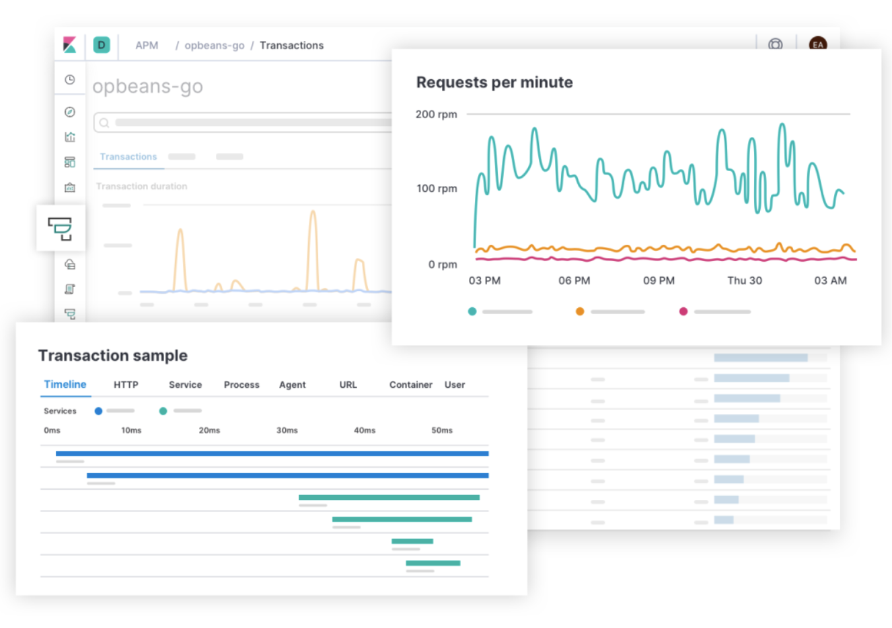
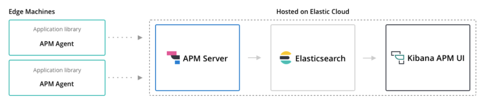
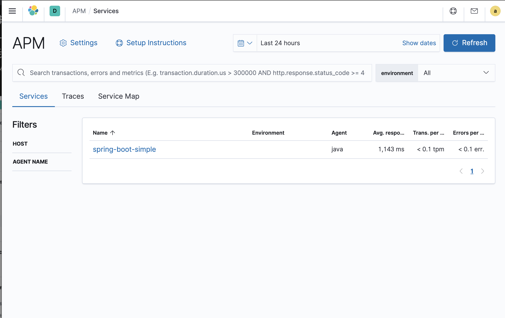
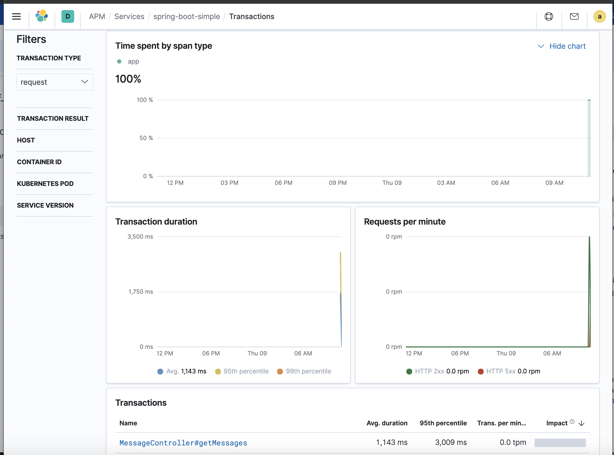
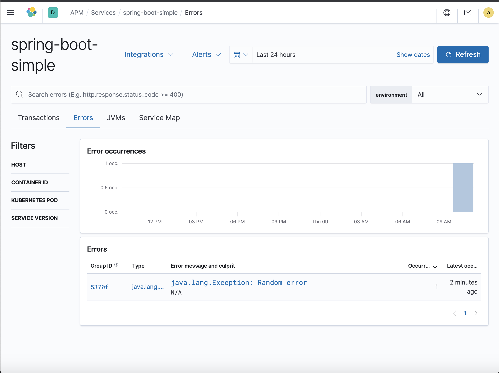
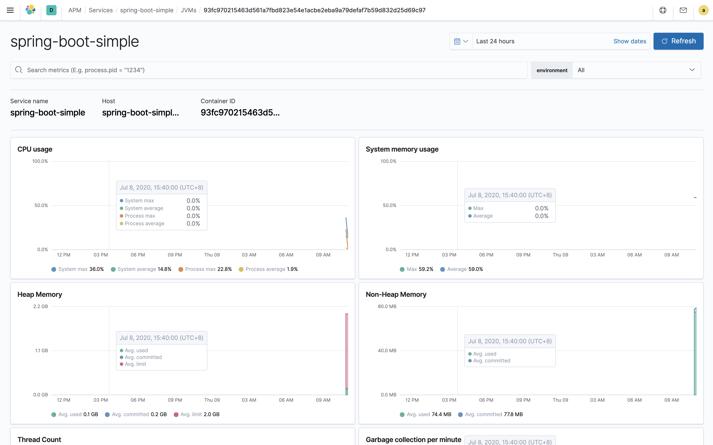

# 使用 Elastic Stack 全栈监控 4 — Elastic APM 应用性能监控的工具安装

**Elastic APM（应用性能监控Application Performance Monitoring） 是 Elastic Stack 上用于应用性能监控的工具**，它允许我们通过收集传入请求、数据库查询、缓存调用等方式来实时监控应用性能。这可以让我们更加轻松快速定位性能问题。

**Elastic APM 是兼容 OpenTracing 的，所以我们可以使用大量现有的库来跟踪应用程序性能。比如我们可以在一个分布式环境（微服务架构）中跟踪一个请求，并轻松找到可能潜在的性能瓶颈**。



Elastic APM 通过一个名为 `APM-Server` 的组件提供服务，用于收集并向 `ElasticSearch` 以及和应用一起运行的 `agent` 程序发送追踪数据。



## 安装 APM-Server

首先我们需要在 `Kubernetes` 集群上安装 `APM-Server` 来收集 `agent` 的追踪数据，并转发给 `ElasticSearch`，这里同样我们使用一个 `ConfigMap` 来配置：

**`apm.configmap.yml`**

```
---
apiVersion: v1
kind: ConfigMap
metadata:
  namespace: elastic
  name: apm-server-config
  labels:
    app: apm-server
data:
  apm-server.yml: |-
    apm-server:
      host: "0.0.0.0:8200"

    output.elasticsearch:
      hosts: ['${ELASTICSEARCH_HOST:elasticsearch}:${ELASTICSEARCH_PORT:9200}']
      username: ${ELASTICSEARCH_USERNAME}
      password: ${ELASTICSEARCH_PASSWORD}

    setup.kibana:
      host: '${KIBANA_HOST:kibana}:${KIBANA_PORT:5601}'
---
```

`APM-Server` 需要暴露 `8200` 端口来让 `agent` 转发他们的追踪数据，新建一个对应的 `Service` 对象即可：

**`apm.service.yml`**

```
---
apiVersion: v1
kind: Service
metadata:
  namespace: elastic
  name: apm-server
  labels:
    app: apm-server
spec:
  ports:
  - port: 8200
    name: apm-server
  selector:
    app: apm-server
---
```

然后使用一个 Deployment 资源对象管理即可：

**`apm.deployment.yml`**

```
---
apiVersion: apps/v1
kind: Deployment
metadata:
  namespace: elastic
  name: apm-server
  labels:
    app: apm-server
spec:
  replicas: 1
  selector:
    matchLabels:
      app: apm-server
  template:
    metadata:
      labels:
        app: apm-server
    spec:
      containers:
      - name: apm-server
        image: docker.elastic.co/apm/apm-server:7.8.0
        env:
        - name: ELASTICSEARCH_HOST
          value: elasticsearch-client.elastic.svc.cluster.local
        - name: ELASTICSEARCH_PORT
          value: "9200"
        - name: ELASTICSEARCH_USERNAME
          value: elastic
        - name: ELASTICSEARCH_PASSWORD
          valueFrom:
            secretKeyRef:
              name: elasticsearch-pw-elastic
              key: password
        - name: KIBANA_HOST
          value: kibana.elastic.svc.cluster.local
        - name: KIBANA_PORT
          value: "5601"
        ports:
        - containerPort: 8200
          name: apm-server
        volumeMounts:
        - name: config
          mountPath: /usr/share/apm-server/apm-server.yml
          readOnly: true
          subPath: apm-server.yml
      volumes:
      - name: config
        configMap:
          name: apm-server-config
---
```

直接部署上面的几个资源对象：

```
kubectl apply  -f apm.configmap.yml
kubectl apply  -f apm.deployment.yml
kubectl apply  -f apm.service.yml
```

当 Pod 处于 Running 状态证明运行成功：

```
$ kubectl get pods -n elastic -l app=apm-server
NAME                          READY   STATUS    RESTARTS   AGE
apm-server-667bfc5cff-jsl8q   1/1     Running   0          3m56s
```

接下来我们可以在第一节中部署的 Spring-Boot 应用上安装一个 agent 应用。

## 配置 Java Agent

接下来我们在示例应用程序 `spring-boot-simple` 上配置一个 Elastic APM Java agent。


首先我们需要把 `elastic-apm-agent-1.8.0.jar` 这个 `ja`r 包程序内置到应用容器中去，在构建镜像的 `Dockerfile` 文件中添加一行如下所示的命令直接下载该 JAR 包即可：

```
RUN wget -O /apm-agent.jar https://search.maven.org/remotecontent?filepath=co/elastic/apm/elastic-apm-agent/1.8.0/elastic-apm-agent-1.8.0.jar
```

完整的 `Dockerfile` 文件如下所示：

```
FROM openjdk:8-jdk-alpine

ENV ELASTIC_APM_VERSION "1.8.0"
RUN wget -O /apm-agent.jar https://search.maven.org/remotecontent?filepath=co/elastic/apm/elastic-apm-agent/$ELASTIC_APM_VERSION/elastic-apm-agent-$ELASTIC_APM_VERSION.jar

COPY target/spring-boot-simple.jar /app.jar

CMD java -jar /app.jar
```

然后需要在示例应用中添加上如下依赖关系，这样我们就可以集成 `open-tracing` 的依赖库或者使用 `Elastic APM API` 手动检测。

```
<dependency>
    <groupId>co.elastic.apm</groupId>
    <artifactId>apm-agent-api</artifactId>
    <version>${elastic-apm.version}</version>
</dependency>
<dependency>
    <groupId>co.elastic.apm</groupId>
    <artifactId>apm-opentracing</artifactId>
    <version>${elastic-apm.version}</version>
</dependency>
<dependency>
    <groupId>io.opentracing.contrib</groupId>
    <artifactId>opentracing-spring-cloud-mongo-starter</artifactId>
    <version>${opentracing-spring-cloud.version}</version>
</dependency>
```


然后需要修改第一篇文章中使用` Deployment` 部署的 `Spring-Boot` 应用，需要开启 `Java agent`并且要连接到 `APM-Server`。

**`spring-boot-simple-apm.deployment.yml`**

```
---
apiVersion: apps/v1
kind: Deployment
metadata:
  namespace: elastic
  name: spring-boot-simple
  labels:
    app: spring-boot-simple
spec:
  selector:
    matchLabels:
      app: spring-boot-simple
  template:
    metadata:
      labels:
        app: spring-boot-simple
    spec:
      containers:
      - image: gjeanmart/spring-boot-simple:0.0.1-SNAPSHOT
        imagePullPolicy: Always
        name: spring-boot-simple
        command:
          - "java"
          - "-javaagent:/apm-agent.jar"
          - "-Delastic.apm.active=$(ELASTIC_APM_ACTIVE)"
          - "-Delastic.apm.server_urls=$(ELASTIC_APM_SERVER)"
          - "-Delastic.apm.service_name=spring-boot-simple"
          - "-jar"
          - "app.jar"
        env:
          - name: SPRING_DATA_MONGODB_HOST
            value: mongo
          - name: ELASTIC_APM_ACTIVE
            value: "true"
          - name: ELASTIC_APM_SERVER
            value: http://apm-server.elastic.svc.cluster.local:8200
        ports:
        - containerPort: 8080
---
```

**`spring-boot-simple-apm.service.yml`**

```
---
apiVersion: v1
kind: Service
metadata:
  namespace: elastic
  name: spring-boot-simple
  labels:
    app: spring-boot-simple
spec:
  type: NodePort
  ports:
  - port: 8080
    protocol: TCP
  selector:
    app: spring-boot-simple
```

然后重新部署上面的示例应用：

```
$ kubectl get pods -n elastic -l app=spring-boot-simple
NAME                                 READY   STATUS    RESTARTS   AGE
spring-boot-simple-fb5564885-wshkl   1/1     Running   0          11s

$ kubectl get svc -n elastic -l app=spring-boot-simple
NAME                 TYPE       CLUSTER-IP       EXTERNAL-IP   PORT(S)          AGE
spring-boot-simple   NodePort   10.101.230.168   <none>        8080:32734/TCP   95s
```

当示例应用重新部署完成后，执行如下几个请求：

**get messages**

获取所有发布的 messages 数据：

```
$ curl -X GET http://localhost:32734/message
[{"id":"5f03e4da217e8e0001591daa","message":"hello+world=","postedAt":"2020-07-07T02:58:34.568+0000"}]
```

**get messages (慢请求)**

使用 `sleep=<ms>` 来模拟慢请求：

```
$ curl -X GET http://localhost:32734/message?sleep=3000
[{"id":"5f03e4da217e8e0001591daa","message":"hello+world=","postedAt":"2020-07-07T02:58:34.568+0000"}]
```

**get messages (error)**

使用 `error=true` 来触发一异常：

```
 curl -X GET http://localhost:32734/message?error=true
{"timestamp":"2020-07-09T03:00:22.095+0000","status":500,"error":"Internal Server Error","message":"java.lang.Exception: Random error","path":"/message"}
```


现在我们去到 Kibana 页面中路由到 APM 页面，我们应该就可以看到 spring-boot-simple 应用的数据了。




点击应用就可以查看到当前应用的各种性能追踪数据：



可以查看现在的错误数据：



还可以查看 JVM 的监控数据：



除此之外，我们还可以添加报警信息，就可以在第一时间掌握应用的性能状况了。

