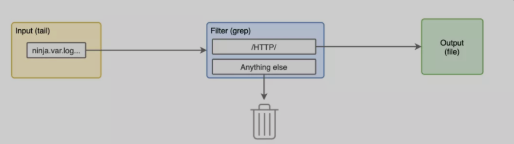
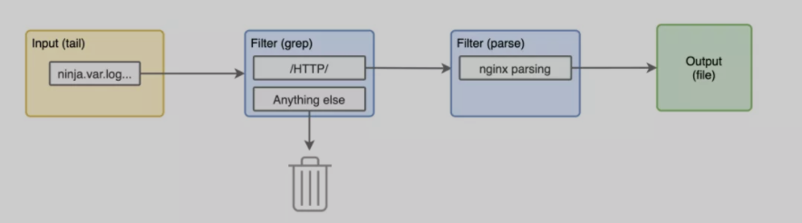

# Fluentd 简明教程


如果你的应用运行在分布式架构上，你很可能会使用集中式日志系统来收集它们的日志，其中我们使用比较广泛的一个工具就是 `fluentd`，包括在容器化时代用来收集 `Kubernetes` 集群应用日志 `fluentd` 也是使用非常多的。本我们将解释它是如何工作的，以及如何根据需求来调整配置 `fluentd`。

## 基本概念


我们可能有在 `bash` 中执行过` tail -f myapp.log | grep "what I want" > example.log` 这样的命令，这其实就是 `fluentd` 比较擅长做的事情，`tail` 日志或者接收某种形式的数据，然后过滤转换，最后发送到后端存储中，我们可以将上面的命令分成多段来分析。

> 输入

```
tail -f myapp.log
```

我们要对一个文件进行长期的 `tail`，每当有什么日志信息被添加到文件中，它就会显示在屏幕上。这在 `fluentd` 中叫做**输入插件**，`tail` 只是其中之一，但还有很多其他可用的插件。

> 过滤

```
| grep "what I want"
```

在这里，我们从尾部 `-f ` 的输出中，只过滤包含我们想要的字符串的日志行，在 `fluentd` 中这叫做**过滤插件**。

> 输出

```
> example.log
```

在这里，我们将 `grep` 命令过滤后的输出保存到一个名为 `example.log` 的文件中。在 `fluentd` 中，这就是**输出插件，**除了写到文件之外，`fluentd` 还有很多插件可以把你的日志输出到其他地方。

这就是 `fluentd` 的最基本的运行流程，你可以读取日志，然后处理，然后把它发送到另一个地方做进一步的分析。接下来让我们用一个小 `demo` 来实践这些概念，看看这3个插件是如何在一起工作的。

## Demo

在这个`demo` 中，我们将使用` fluentd` 来读取` docker` 应用日志。

> 设置

这里我们将 `demo` 相关的配置放置到了 `Github` 仓库：https://github.com/r1ckr/fluentd-simplified ，克隆后最终会得到以下目录结构。

```
$ tree .
.
├── etc
│   ├── fluentd.conf
│   ├── fluentd-plitting-logs-finished.conf
│   └── fluentd-simplified-finished.conf
├── log
│   └── kong.log
├── output
│   └── dummy
└── README.md

3 directories, 6 files
```

其中的 `output/` 是 `fluentd` 写入日志文件的目录，在 `log/kong.log` 中，有一些来自本地运行的 `kong` 容器的日志，它们都是 docker 格式的日志。

```
{
    "log":"2019/07/31 22:19:52 [notice] 1#0: start worker process 32\n",
    "stream":"stderr",
    "time":"2019-07-31T22:19:52.3754634Z"
}
```

> 运行 fluentd

```
$ chmod 777 output/
```

注意上面的运行命令和我们要挂载的卷

* `etc/` 是挂载在容器内部的 `/fluentd/etc/` 目录下的，以覆盖 fluentd 的默认配置。
* `log/` 挂载到 `/var/log/`，最后在容器里面挂载到 `/var/log/kong.log`。
* `output/` 挂载到 `/output`，以便能够看到 `fluentd` 写入磁盘的内容。

运行容器后，会出现如下所示的错误信息：

```
2020-10-14 06:05:30 +0000 [info]: #0 fluent/log.rb:329:info: fluentd worker is now running worker=0
2020-10-14 06:05:30 +0000 [debug]: #0 fluent/log.rb:308:debug: Created new chunk chunk_id="5b19b519422a3223234577d2204844b3" metadata=#<struct Fluent::Plugin::Buffer::Metadata timekey=1602633600, tag=nil, variables=nil, seq=0>
```

这意味着 fluentd 已经启动并运行了。现在我们知道了 fluentd 是如何运行的了，接下来我们来看看配置文件的一些细节。


## Fluentd 配置

### 输入输出


首先查看 `input` 部分

```
<source>
    @type tail
    path "/var/log/*.log"
    tag "ninja.*"
    read_from_head true
    <parse>
      @type "json"
      time_format "%Y-%m-%dT%H:%M:%S.%NZ"
      time_type string
      unmatched_lines 
    </parse>
  </source>
```

我们来仔细查看下这几个配置：

* `@type tail`：是我们想要的输入类型, 这和` tail -f` 非常相似。
* `path "/var/log/*.log"`：表示它将跟踪任何以` .log `结尾的文件，每个文件都会产生自己的标签，比如：`var.log.kong.log`。
* `tag "ninja.*"`：这将在这个源创建的每个标签前加上 `ninja.` ，本例中，我们只有一个以 `ninja.var.log.kong.log` 结束的文件。
* `read_from_head true`：表示读取整个文件，而不只是新的日志行。
* 部分：由于 `docker` 日志的每一行都是一个 `json` 对象，所以我们将以 `json` 的方式进行解析。

然后是输出 output 部分的配置。

```
<match **>
    @type file
    path "/output/example"
    append true
    <buffer>
      timekey 1d
      timekey_use_utc true
      timekey_wait 1m
      path "/output/example"
    </buffer>
  </match>
```


在这个配置中，有两个重要的部分。

* `**<match >`：这表示我们要匹配 fluentd 中的所有标签，我们这里只有一个，就是上面输入插件创建的那个。
* `path /output/example`：这是保存缓冲区的目录名，也是每个日志文件的开头名称。

```
output
├── example
│   ├── buffer.b5b1c174b5e82c806c7027bbe4c3e20fd.log
│   └── buffer.b5b1c174b5e82c806c7027bbe4c3e20fd.log.meta
├── example.20190731.log
└── example.20200510.log
```
有了这个配置，我们就有了一个非常简单的输入/输出管道了。


现在我们可以来看看 `fluentd` 创建的一个文件中的一些日志 `example.20200510.log`s。

```
2020-05-10T17:04:17+00:00 ninja.var.log.kong.log {"log":"2020/05/10 17:04:16 [warn] 35#0: *4 [lua] globalpatches.lua:47: sleep(): executing a blocking 'sleep' (0.004 seconds), context: init_worker_by_lua*\n","stream":"stderr"}
2020-05-10T17:04:17+00:00 ninja.var.log.kong.log {"log":"2020/05/10 17:04:16 [warn] 33#0: *2 [lua] globalpatches.lua:47: sleep(): executing a blocking 'sleep' (0.008 seconds), context: init_worker_by_lua*\n","stream":"stderr"}
2020-05-10T17:04:17+00:00 ninja.var.log.kong.log {"log":"2020/05/10 17:04:17 [warn] 32#0: *1 [lua] mesh.lua:86: init(): no cluster_ca in declarative configuration: cannot use node in mesh mode, context: init_worker_by_lua*\n","stream":"stderr"}
2020-05-10T17:04:30+00:00 ninja.var.log.kong.log {"log":"172.17.0.1 - - [10/May/2020:17:04:30 +0000] \"GET / HTTP/1.1\" 404 48 \"-\" \"curl/7.59.0\"\n","stream":"stdout"}
2020-05-10T17:05:38+00:00 ninja.var.log.kong.log {"log":"172.17.0.1 - - [10/May/2020:17:05:38 +0000] \"GET /users HTTP/1.1\" 401 26 \"-\" \"curl/7.59.0\"\n","stream":"stdout"}
2020-05-10T17:06:24+00:00 ninja.var.log.kong.log {"log":"172.17.0.1 - - [10/May/2020:17:06:24 +0000] \"GET /users HTTP/1.1\" 499 0 \"-\" \"curl/7.59.0\"\n","stream":"stdout"}
```

注意上面的日志，每行都有3列，格式为：

```
<time of the log>    <tag of the log>    <the content of the log>
```

> 注意：标签都是 "ninja" 字符串加上目录路径和文件名，之间使用". "分隔。

> 过滤

现在我们已经在 fluentd 中实现了日志的收集，接下来让我们对它进行一些过滤操作。

到目前为止，我们已经实现了前面那条命令的2个部分，`tail -f /var/log/*.log` 和 `> example.log` 工作正常，但是如果你看一下输出，我们有访问日志和应用日志混合在一起，现在我们需要实现 `grep 'what I want'` 过滤。

在这个例子中，我们只想要访问日志，丢弃其他的日志行。比如说，通过 HTTP 进行 grepping 会给我们提供所有的访问日志，并将应用日志排除在外，下面的配置就可以做到这一点。

```
<filter ninja.var.log.kong**>
  @type grep
  <regexp>
    key log
    pattern /HTTP/
  </regexp>
</filter>
```
我们来分析下这个过滤配置：

* `<filter ninja.var.log.kong>**`：表示我们将只过滤以 `ninja.var.log.kong` 开头的标签日志。
* `@type grep`：使用 grep 这个插件进行过滤。
* **部分**：这里我们要在日志内容的记录键中提取 "HTTP"， 通过这个配置，我们的 fluentd 管道中添加了一个新的块。



现在我们停止并再次运行容器。我们应该在输出日志中看到一些不同的日志了，没有应用日志，只有访问日志数据。

```
2020-05-10T17:04:30+00:00 ninja.var.log.kong.log {"log":"172.17.0.1 - - [10/May/2020:17:04:30 +0000] \"GET / HTTP/1.1\" 404 48 \"-\" \"curl/7.59.0\"\n","stream":"stdout"}
2020-05-10T17:05:38+00:00 ninja.var.log.kong.log {"log":"172.17.0.1 - - [10/May/2020:17:05:38 +0000] \"GET /users HTTP/1.1\" 401 26 \"-\" \"curl/7.59.0\"\n","stream":"stdout"}
2020-05-10T17:06:24+00:00 ninja.var.log.kong.log {"log":"172.17.0.1 - - [10/May/2020:17:06:24 +0000] \"GET /users HTTP/1.1\" 499 0 \"-\" \"curl/7.59.0\"\n","strea
```

> 解析访问日志

为了熟悉我们的配置，下面让我们添加一个解析器插件来从访问日志中提取一些其他有用的信息。在 grep 过滤器后使用下面配置。

```
<filter ninja.var.log.kong** >
  @type parser
  key_name log
  <parse>
    @type nginx
  </parse>
</filter>
```

同样我们来仔细查看下这个配置：

* `<filter ninja.var.log.kong>**`：我们将解析所有以 `ninja.var.log.kong` 开头的标签，就像上面的一样。
* `@type parser`：过滤器的类型是 parser 解析器。
* 我们将对日志内容的 `log key` 进行解析。
* 由于这些都是 `nginx `的访问日志，我们将使用 `@type nginx` 的解析器。

现在我们的管道是下面这个样子了。



我们再次重新运行容器，现在的访问日志应该是这样的了。

```
2020-05-10T17:04:30+00:00 ninja.var.log.kong.log {"remote":"172.17.0.1","host":"-","user":"-","method":"GET","path":"/","code":"404","size":"48","referer":"-","agent":"curl/7.59.0","http_x_forwarded_for":""}
```

这是之前日志中的第一个访问日志，现在日志内容完全不同了，我们的键从日志流，变成了 remote、host、user、method、path、code、size、referer、agent 以及 `http_x_forwarded_fo`r。如果我们要把这个保存到 `Elasticsearch` 中，我们将能够通过 `method=GET` 或其他组合进行过滤了。


当然我们还可以更进一步，在 remote 字段中使用 geoip 插件来提取我们我们 API 的客户端的地理位置信息，大家可以自行测试，不过需要注意的时候需要我们的镜像中包含这些插件。

**总结**

现在我们知道了如何用 docker 来让 fluentd 读取配置文件，我们了解了一些常用的 fluentd 配置，我们能够从一些日志数据中来过滤、解析提取有用的信息。
