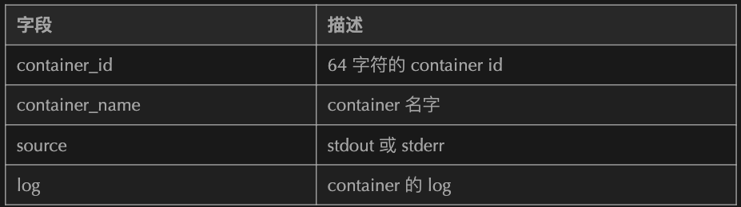

# **Fluentd 详细教程**


Imagefluentd 是一个实时的数据收集系统，不仅可以收集日志，还可以收集定期执行的命令输出和 HTTP 请求内容。**数据被收集后按照用户配置的解析规则，形成一系列 event。每一个 event 包含如下内容：**

```
tag = xxx
time = xxx
record = {
    "key1": "value1",
    "key2": "value2"
}
```

其中：


* tag：为数据流的标记。fluentd 中可以具有多个数据源，解析器，过滤器和数据输出。他们之前使用 tag 来对应。类似于数据流按照 tag 分组。数据流向下游的时候只会进入 tag 相匹配的处理器。
* time：event 产生的时间，该字段通常由日志内的时间字段解析出来。
* record：日志的内容，为 JSON 格式。

fluentd 支持多种数据的解析过滤和输出操作。其中常用的有：

* tail 输入：增量读取日志文件作为数据源，支持日志滚动。
* exec 输入：定时执行命令，获取输出解析后作为数据源。
* syslog 输出：解析标准的 syslog 日志作为输入。
* forward 输入：接收其他 fluentd 转发来的数据作为数据源。
* dummy：虚拟数据源，可以定时产生假数据，用于测试。
* regexp 解析器：使用正则表达式命名分组的方式提取出日志内容为 JSON 字段。
* record_transformer 过滤器：人为修改 record 内的字段。
* file 输出：用于将 event 落地为日志文件。
* stdout：将 event 输出到 stdout。如果 fluentd 以 daemon 方式运行，输出到 fluentd 的运行日志中。
* forward：转发 event 到其他 fluentd 节点。
* copy：多路输出，复制 event 到多个输出端。
* kafka：输出 event 到 Kafka。
* webhdfs：输出 event 到 HDFS。
* elasticsearch：输出 event 到 HDFS。

### 安装启动方法

官网安装步骤链接：https://docs.fluentd.org/installation/install-by-rpm

下面是精简的在 CentOS 下的安装步骤。打开 shell，执行如下命令：

```
curl -L https://toolbelt.treasuredata.com/sh/install-redhat-td-agent3.sh | sh

systemctl start td-agent
```
可以安装并启动 fluentd。

### 配置文件位置

编辑 fluentd 配置文件的方法：

```
vim /etc/td-agent/td-agent.conf
```

### 修改运行用户和组

默认来说 fluentd 使用 td-agent 用户启动。如果需要修改 fluentd 的用户，需要执行：

```
vim /usr/lib/systemd/system/td-agent.service
```

文件内容如下所示：

```
[Unit]
Description=td-agent: Fluentd based data collector for Treasure Data
Documentation=https://docs.treasuredata.com/articles/td-agent
After=network-online.target
Wants=network-online.target

[Service]
User=td-agent
Group=td-agent
LimitNOFILE=65536
Environment=LD_PRELOAD=/opt/td-agent/embedded/lib/libjemalloc.so
Environment=GEM_HOME=/opt/td-agent/embedded/lib/ruby/gems/2.4.0/
Environment=GEM_PATH=/opt/td-agent/embedded/lib/ruby/gems/2.4.0/
Environment=FLUENT_CONF=/etc/td-agent/td-agent.conf
Environment=FLUENT_PLUGIN=/etc/td-agent/plugin
Environment=FLUENT_SOCKET=/var/run/td-agent/td-agent.sock
Environment=TD_AGENT_LOG_FILE=/var/log/td-agent/td-agent.log
Environment=TD_AGENT_OPTIONS=
EnvironmentFile=-/etc/sysconfig/td-agent
PIDFile=/var/run/td-agent/td-agent.pid
RuntimeDirectory=td-agent
Type=forking
ExecStart=/opt/td-agent/embedded/bin/fluentd --log $TD_AGENT_LOG_FILE --daemon /var/run/td-agent/td-agent.pid $TD_AGENT_OPTIONS
ExecStop=/bin/kill -TERM ${MAINPID}
ExecReload=/bin/kill -HUP ${MAINPID}
Restart=always
TimeoutStopSec=120

[Install]
WantedBy=multi-user.target
```

修改`Service`部分`User`和`Group`配置项可以更改 fluentd 进程的用户和组。

### 检测配置文件是否正确的方法

在 shell 中运行：

```
/opt/td-agent/embedded/bin/fluentd -c /etc/td-agent/td-agent.conf
```

观察输出，如果有错误会给出对应提示。

### 数据流逻辑

fluentd 以 tag 值为基准，决定数据的流经哪些处理器。

数据的流向为：`source -> parser -> filter -> output`

### input 配置

## tail

增量读取日志文件。需要提供一个用于标记已经读取到位置的文件（position file）所在的路径。

**tail 针对日志滚动的支持：tail 方式采用跟踪文件 inode 的方式进行。**

**比如日志名为`app.log`，如果日志发生滚动，被重命名为`app.log.1`。文件重命名的时候 `inode` 是不会改变的。**

**因此发生滚动时写入到旧文件末尾的日志也可以被收集到。`tail` 会跟踪旧文件的 `inode` 一段时间（`rotate_wait`配置），这段时间过去之后，tail 不再监听`app.log.1`，开始监听新的`app.log`文件。**

tail 方式的示例配置：

```
<source>
  @type tail
  path /var/log/httpd-access.log
  pos_file /var/log/td-agent/httpd-access.log.pos
  tag apache.access
  <parse>
    @type apache2
  </parse>
</source>
```

注意：如果文件发生修改会输出全量文件内容。

### 配置项解释

* tag：数据源的 tag 值。`*`号可以扩展为 `path`（`/`替换为`.`）。例如

```
path /path/to/file
tag foo.*
```

tag 会被扩展为`foo.path.to.file`

* `path`：配置读取的路径。可以使用`*`或者是`strftime`。例如：

```
path /path/to/%Y/%m/%d/*
```

如果今天是 2020 年 1 月 2 日，`fluentd`会读取`/path/to/2020/01/02`目录下的内容。也可以配置多个路径，使用逗号分隔：

```
path /path/to/a/*,/path/to/b/c.log
```

* `exclude_path`：排除部分目录或文件，使用数组格式配置。


```
path /path/to/*
exclude_path ["/path/to/*.gz", "/path/to/*.zip"]
```

* `refresh_interval`：多长时间刷新一次文件监听列表，配合`*`使用才有意义。

* `pos_file`：位置文件地址。这个文件保存了监听的日志文件已经读取到第几行。

该项一定要配置。注意，不要在多个 `source` 之间共用 `pos file`，否则会出现问题。

* `pos_file_compaction_interval`：pos file 文件压缩时间间隔。用于压缩 pos file 中不再监听的记录，不可解析的记录以及重复的记录。

* parse 标签：用于指定 log 的解析器（必须的配置项）。例如：

```
# json
<parse>
  @type json
</parse>

# regexp
<parse>
  @type regexp
  expression ^(?<name>[^ ]*) (?<user>[^ ]*) (?<age>\d*)$
</parse>
```

* **`path_key`：如果配置此项，监控文件的 path 会在 event 中，此项的 key 为`path_key`**。例如：

```
path /path/to/access.log
path_key tailed_path
```

生成的数据如下所示：

```
{"tailed_path":"/path/to/access.log","k1":"v1",...,"kN":"vN"}
```

* `rotate_wait`：日志发生滚动的时候，可能会有部分日志仍然输出在旧的日志文件，此时需要保持监听旧日志文件一段时间，这个时间配置就是`rotate_wait`。

## exec

周期性执行命令，抽取命令输出为 event。

示例配置：

```
<source>
  @type exec
  command cmd arg arg
  <parse>
    keys k1,k2,k3
  </parse>
  <extract>
    tag_key k1
    time_key k2
    time_format %Y-%m-%d %H:%M:%S
  </extract>
  run_interval 10s
</source>
```


以上命令的含义为每 10 秒钟执行`cmd arg arg`命令，提取命令执行结果，以空白字符分隔三个字段的值为` k1,k2,k3`。

其中 k1 的值作为 tag，k2 作为时间字段，使用`%Y-%m-%d %H:%M:%S`格式。

一个例子，周期获取系统的平均负载。配置方法如下：

```
<source>
  @type exec
  tag system.loadavg
  command cat /proc/loadavg | cut -d ' ' -f 1,2,3
  run_interval 1m
  <parse>
    @type tsv
    keys avg1,avg5,avg15
    delimiter " "
  </parse>
</source>
```

输出的日志格式为：

```
2018-06-29 17:27:35.115878527 +0900 system.loadavg: {"avg1":"0.30","avg5":"0.20","avg15":"0.05"}
```

## syslog

连接 rsyslog。可以作为 rsyslog 的接收端。

一个配置的例子：

```
<source>
  @type syslog
  port 5140
  bind 0.0.0.0
  tag system
</source>
```

fluentd 打开 `5140` 端口监听 `rsyslog` 发来的` log`。

**rsyslog 配置文件`/etc/rsyslog.conf`设置为：**

```
# Send log messages to Fluentd
*.* @127.0.0.1:5140
```

**fluentd 解析到的 event 格式如下**：

```
tag = "#{@tag}.#{facility}.#{priority}"
time = 1353436518,
record = {
  "host": "host",
  "ident": "ident",
  "pid": "12345",
  "message": "text"
}
```

## dummy

专用于测试的数据源。周期产生假数据。

配置举例：

```
<source>
  @type dummy
  dummy {"hello":"world"}
</source>
```

dummy 常用参数：

* tag: 标记值
* size：每次发送的 event 数量
* rate：每秒产生多少个 event
* `auto_increment_key`：自增键名。如果配置了此项，会有一个 key 为该配置项值的自增键
* suspend：重启后自增值是否重新开始
* dummy：测试数据内容


## forward


用于接收其他 fluentd forward 过来的 event。

示例配置：

```
<source>
  @type forward
  port 24224
  bind 0.0.0.0
</source>
```

**output 配置**


## file

输出 event 为文件。默认每天输出一个日志文件。

示例配置：

```
<match pattern>
  @type file
  path /var/log/fluent/myapp
  compress gzip
  <buffer>
    timekey 1d
    timekey_use_utc true
    timekey_wait 10m
  </buffer>
</match>
```


包含的参数类型：

* path：**path 支持 `placeholder`，可以在日志路径中嵌入时间，`tag` 和 `record` 中的字段值**。例如：

```
path /path/to/${tag}/${key1}/file.%Y%m%d
<buffer tag,time,key1>
  # buffer parameters
</buffer>
```

注意：buffer 标签后面的内容为 buffer chunk key。Buffer 根据这些 key 分段。

* append：flush 的 chuck 是否追加到已存在的文件后。默认为 false，便于文件的并行处理。
* format 标签，用来规定文件内容的格式，默认值为 out_file。
* inject 标签，用来为 event 增加 time 和 tag 等字段。
* `add_path_suffix`：是否增加 path 后缀
* `path_suffix`：path 后缀内容，默认为`.log`。
* compress：采用什么压缩格式，默认不压缩。
* recompress：是否在 buffer chunk 已经压缩的情况再次压缩，默认为 false。

## forward

**将 event 转发到其他的 `fluentd` 节点。如果配置了多个 fluentd 节点，会使用负载均衡和支持容错的方式发送。如果需要发送多份数据，需要使用 `copy`**。

配置示例：

```
<match pattern>
  @type forward
  send_timeout 60s
  recover_wait 10s
  hard_timeout 60s

  <server>
    name myserver1
    host 192.168.1.3
    port 24224
    weight 60
  </server>
  <server>
    name myserver2
    host 192.168.1.4
    port 24224
    weight 60
  </server>
  ...

  <secondary>
    @type file
    path /var/log/fluent/forward-failed
  </secondary>
</match>
```

server 标签内可以配置如下字段：


* host
* name
* port
* `shared_key
* username
* password
* standby 标记 server 为备用，只有其他 node 不可用的时候才会启用 standby 的 node
* weight 负载均衡的权重配置

## copy

多路输出（复制 event 到多个输出端）

示例配置

```
<match pattern>
  @type copy
  <store>
    @type file
    path /var/log/fluent/myapp1
    ...
  </store>
  <store>
    ...
  </store>
  <store>
    ...
  </store>
</match>
```

其中每一个 store 是一路输出。


* `copy_mode`：复制模式。可选值有
	* `no_copy`：每路输出共享 event。
	* shallow：浅拷贝，如果不修改嵌套字段可以使用。
	* deep：深拷贝，使用`msgpack-ruby`方式。
	* marshal：深拷贝，使用marshal方式。
* store 标签的 `ignore_error` 参数：如果被标记 `ignore_error` 的 store 出现错误，不会影响其他的 store。官网的例子为：

```
<match app.**>
  @type copy
  <store>
    @type plugin1
  </store>
  <store>
    @type plugin2
  </store>
</match>
```

**假如 plugin1 出现错误，plugin2 也不会执行**。如果在 plugin1 的 store 添加上 ignore_error 参数，如下所示：

```
<match app.**>
  @type copy
  <store ignore_error>
    @type plugin1
  </store>
  <store>
    @type plugin2
  </store>
</match>
```

**上述情况 plugin2 的运行不受影响。通常为不重要的 store 添加 `ignore_error` 参数。**

## http

**通过 http 请求的方式发送 event。payload 的格式由 format 标签决定**。

示例配置：

```
<match pattern>
  @type http

  endpoint http://logserver.com:9000/api
  open_timeout 2

  <format>
    @type json
  </format>
  <buffer>
    flush_interval 10s
  </buffer>
</match>
```

该例子使用 http 方式将 event 发送到[http://logserver.com:9000/api](http://logserver.com:9000/api)，**使用 post 方式，连接超时时间为 2 秒。输出格式为 json，每 10 秒钟输出一次**。

注意：

如果使用 JSON 的方式发送，HTTP 请求的 content-type 为 `application/x-ndjson （newline-delimited JSONs）`。如果用` spring mvc` 接收会提示不支持。可以使用`HTTPServletRequest`接收 `request body`。

## stdout

标准输出的模式，如果使用后台模式运行 fluentd，输出到 fluentd 的日志。多用于 debug 的时候。

配置方法：

```
<match pattern>
  @type stdout
</match>
```

## elasticsearch

输出 event 到 elasticsearch。

示例配置：

```
<match my.logs>
  @type elasticsearch
  host localhost
  port 9200
  logstash_format true
</match>
```

可选参数：


* host：单个 elasticsearch 节点地址
* port：单个 elasticsearch 节点的端口号
* hosts：elasticsearch 集群地址。格式为 ip1:port1,ip2:port2...
* user 和 password：elasticsearch 的认证信息
* scheme：使用 https 还是 http。默认为 http 模式
* path：REST 接口路径，默认为空
* `index_name`：index 名称
* `logstash_format`：index 是否使用 logstash 命名方式（logstash-%Y.%m.%d），默认不启用
* `logstash_prefix`：`logstash_format` 启用的时候，index 命名前缀是什么。默认为logstash

## kafka

把 event 输出到 kafka。

示例配置如下：

```
<match pattern>
  @type kafka2

  # list of seed brokers
  brokers <broker1_host>:<broker1_port>,<broker2_host>:<broker2_port>
  use_event_time true

  # buffer settings
  <buffer topic>
    @type file
    path /var/log/td-agent/buffer/td
    flush_interval 3s
  </buffer>

  # data type settings
  <format>
    @type json
  </format>

  # topic settings
  topic_key topic
  default_topic messages

  # producer settings
  required_acks -1
  compression_codec gzip
</match>
```

重要的参数为：

* brokers：Kafka brokers 的地址和端口号
* `topic_key`：record 中哪个 key 对应的值用作 Kafka 消息的 key
* `default_topic`：如果没有配置 topic_key，默认使用的 topic 名字
* format 标签：确定发送的数据格式
* `use_event_time`：是否使用 fluentd event 的时间作为 Kafka 消息的时间。默认为 false。意思为使用当前时间作为发送消息的时间
* `required_acks`：producer acks 的值
* `compression_codec`：压缩编码方式

## webhdfs

event 通过 REST 方式写入到 HDFS。


## HADOOP 启用 webhdfs 的方法

`core-site.xml`

```
<configuration>
    <property>
        <name>fs.defaultFS</name>
        <value>hdfs://10.180.210.172:9000</value>
    </property>
</configuration>
```

`hdfs-site.xml`

```
<configuration>
    <property>
        <name>dfs.replication</name>
        <value>1</value>
    </property>
    <property>
      <name>dfs.http.address</name>
      <value>0.0.0.0:50070</value>
    </property>

    <property>
      <name>dfs.webhdfs.enabled</name>
      <value>true</value>
    </property>
    <property>
      <name>dfs.support.append</name>
      <value>true</value>
    </property>
    <property>
      <name>dfs.support.broken.append</name>
      <value>true</value>
    </property>
</configuration>
```

最后执行`$HADOOP_HOME/sbin/httpfs.sh start`命令启动 `webhdfs` 支持。

**注意：此时 webhdfs 的端口号为 50070。**

### **示例配置和参数**

示例配置：

```
<match access.**>
  @type webhdfs
  host namenode.your.cluster.local
  port 50070
  path "/path/on/hdfs/access.log.%Y%m%d_%H.#{Socket.gethostname}.log"
  <buffer>
    flush_interval 10s
  </buffer>
</match>
```

注意：需要保证 HDFS 的目标目录具有写入权限。debug 过程发现 fluentd 请求 webhdfs 没有使用 `user proxy`，HDFS 认为操作的用户为 dr.who，无法创建文件。为了解决这个问题，设置` HDFS` 目标目录的权限为 `777`。

重要参数：

* host：namenode 的地址
* port：namenode 的端口号
* path：写入文件路径。可以使用占位符或者 ruby 表达式。可以使用如下方式表示时间：

```
\%Y: year including the century (at least 4 digits)
\%m: month of the year (01..12)
\%d: Day of the month (01..31)
\%H: Hour of the day, 24-hour clock (00..23)
\%M: Minute of the hour (00..59)
\%S: Second of the minute (00..60)
```

输出参数：

* timekey：多久输出一次文件到 HDFS。如果 path 中没有配置占位符，默认为 86400（1 天）。如果指定了和时间相关的占位符，则文件输出周期自动和最小的时间占位符单位一致
* `timekey_wait`：允许等待来迟日志的最长时间
* `flush_interval`：flush 间隔时间，默认为不设置
* `flush_at_shutdown`：关闭的时候是否 flush。如果使用内存类型的 buffer，需要配置为 true


### parser 配置

## regexp

使用正则表达式命名分组的方式从日志(一行或多行)中提取信息。可以通过 `time_key` 指定 event 的 time 字段的名字。名字为 time 字段名的分组内容会被抽取为 event 时间。

一个在线测试正则表达式的工具：http://fluentular.herokuapp.com/

基本配置格式：

```
<parse>
  @type regexp
  expression /.../
</parse>
```

正则表达式可以添加额外的参数：忽略大小写：`/.../i `多行匹配：`/.../m`。注意，此时.匹配新行 同时使用忽略大小写和多行匹配：`/.../im`

一个例子，示例配置如下：

```
<parse>
  @type regexp
  expression /^\[(?<logtime>[^\]]*)\] (?<name>[^ ]*) (?<title>[^ ]*) (?<id>\d*)$/
  time_key logtime
  time_format %Y-%m-%d %H:%M:%S %z
  types id:integer
</parse>
```

如下的数据：


```
[2013-02-28 12:00:00 +0900] alice engineer 1
```

会被解析为：

```
time:
1362020400 (2013-02-28 12:00:00 +0900)

record:
{
  "name" : "alice",
  "title": "engineer",
  "id"   : 1
}
```

## filter 配置


### record_transformer

`record_transformer` 用来修改 event 的结构，增加或修改字段。


一个 `record_transformer `的例子：

```
<filter foo.bar>
  @type record_transformer
  <record>
    hostname "#{Socket.gethostname}"
    tag ${tag}
  </record>
</filter>
```

这个 filter 匹配 tag 为`foo.bar`的` source`。`event` 增加了两个新的字段：`hostname` 和 `tag`。


其中 hostname 这里使用了 ruby 表达式。tag 使用了字符串插值。

如果数据为：

```
{ "message": "hello world!" }
```

会被转换为：

```
{
  "message": "hello world!",
  "hostname": "db001.internal.example.com",
  "tag": "foo.bar"
}
```

可以通过添加 `enable_ruby` 配置，在`${}`中使用` ruby` 表达式。

例如：

```
<filter foo.bar>
  @type record_transformer
  enable_ruby
  <record>
    avg ${record["total"] / record["count"]}
  </record>
</filter>
```

如下输入：


```
{ "total": 100, "count": 10 }
```
会被转换为：

```
{ "total": 100, "count": 10, "avg": "10" }

```

注意，可以启用`auto_typecast true`配置实现自动类型转换。


修改字段的例子：


```
<filter foo.bar>
  @type record_transformer
  <record>
    message yay, ${record["message"]}
  </record>
</filter>
```

如下输入：

```
{ "total": 100, "count": 10 }
```

会被转换为：


```
{ "total": 100, "count": 10, "avg": "10" }

```

注意，可以启用`auto_typecast true`配置实现自动类型转换。

修改字段的例子：

```
<filter foo.bar>
  @type record_transformer
  <record>
    message yay, ${record["message"]}
  </record>
</filter>
```
如下输入：

```
{ "message": "hello world!" }
```

会被修改为：

```
{ "message": "yay, hello world!" }
```

可以在表达式中配置 `tag_parts` 变量，引用 tag 的第 n 部分。如下所示：

```
<filter web.*>
  @type record_transformer
  <record>
    service_name ${tag_parts[1]}
  </record>
</filter>
```

如果遇到 tag 为web.auth的数据：

```
{ "user_id": 1, "status": "ok" }
```

会被转换为：

```
{ "user_id": 1, "status": "ok", "service_name": "auth" }
```

### record 标签

record 标签的语法为：

```
<record>
  NEW_FIELD NEW_VALUE
</record>
```


表达式中可以配置如下变量：

* record：获取 record 中某些字段的内容。例如record["count"]
* tag：获取 tag 的内容
* time：获取日志的时间戳
* hostname：获取主机名字，和#{Socket.gethostname}作用一样
* `tag_parts[N]`：tag 以.分隔，获取 tag 的第 N 部分
* `tag_prefix[N]`：获取 tag 的 `0-N` 部分
* `tag_suffix[N]`：获取 tag 的 `N-`结尾部分


例如 `tag` 为`debug.my.app`，`tag_parts[1]`返回my。`tag_prefix`和`tag_suffix`的结果如下：

```
tag_prefix[0] = debug          tag_suffix[0] = debug.my.app
tag_prefix[1] = debug.my       tag_suffix[1] = my.app
tag_prefix[2] = debug.my.app   tag_suffix[2] = app
```

### 配置文件使用通配符和扩展

`<match>`和`<filter>`标签可以使用通配符和扩展。

tag 以`.`为分隔符，分隔为多个部分。

fluentd 支持的通配符和扩展有：`*`：只匹配一个部分。比如`a.*`匹配`a.b`，但是不匹配`a`或`a.b.c`。


`**`：匹配 0 个或多个部分。比如`a.**`匹配`a`，`a.b`和`a.b.c`。

`{X,Y,Z}`：匹配 X 或 Y 或 Z。

`#{expression}`：使用嵌入的 ruby 表达式。

有一些快捷变量可以直接使用，例如`#{hostname}`和`#{worker_id}`。

`${..}`：使用变量值，tag，record 可以使用如下的方式指定默认值。例如：`#{ENV["FOOBAR"] || use_default}`。如果 `FOOBAR` 环境变量不存在，则使用`use_default`这个值。

注意：match 标签的匹配过程是有顺序的。比如说下面的例子：

```
<match **>
  @type blackhole_plugin
</match>

<match myapp.access>
  @type file
  path /var/log/fluent/access
</match>
```

因为上面的 match 总是能被匹配到，下面的 match 永远没有机会执行。


### Buffer

buffer 为 fluentd 很关键的配置，意为缓冲区。可以决定收集的数据存入什么介质，多长时间输出一次等。

buffer 标签必须配置在 match 标签内（即在输出端配置）。

buffer 具有一个@type 属性，用来配置 buffer 的储存介质：

```
<buffer>
  @type file
</buffer>
```

`@type `有两个值：

* file：存入文件
* memory：存入内存，这个是默认值

buffer 标签后面可以跟随 chunk keys，用来决定 buffer 以 record 的什么字段来分段存放。例如：


```
<buffer ARGUMENT_CHUNK_KEYS>
  # ...
</buffer>
```

注意：

* 可以指定多个 buffer chunk keys，使用逗号分隔。
* 如果没有配置 chunk key，所有的 event 都会写入同一个 chunk file，直到 buffer 滚动。

buffer 如果使用 time 作为 chunk key，可以按照时间对 buffer 进行分段。其中：

* timekey：时间的跨度
* `timekey_wait`：flush 延迟时间，用于等待迟到的数据


官网的例子如下：

```
<match tag.**>
  # ...
  <buffer time>
    timekey      1h # chunks per hours ("3600" also available)
    timekey_wait 5m # 5mins delay for flush ("300" also available)
  </buffer>
</match>

# Time chunk key: events will be separated for hours (by timekey 3600)

11:59:30 web.access {"key1":"yay","key2":100}  ------> CHUNK_A

12:00:01 web.access {"key1":"foo","key2":200}  --|
                                                 |---> CHUNK_B
12:00:25 ssh.login  {"key1":"yay","key2":100}  --|
```

部分经常用到的配置参数：

* `imekey_use_utc`：使用国际标准时间还是当地时间，默认是使用当地时间。
* `timekey_zone`：指定时区。
* `chunk_limit_size`：chunk 大小限制，默认 8MB。
* `chunk_limit_records`：chunk event 条数限制。
* `total_limit_size`：总 buffer 大小限制。
* `chunk_full_threshold`：chunk 大小超过 chunk_limit_size * chunk_full_threshold 时会自动 flush。
* `queued_chunks_limit_size`：限制队列中的 chunk 数目，防止频繁 flush 产生过多的 chunk。
* compress：压缩格式，可使用 text 或 gzip。默认为 text。
* `flush_at_shutdown`：关闭时候是否 flush。对于非持久化 buffer 默认值为 true，持久化 buffer 默认值为 false。
* `flush_interval`：多长时间 flush 一次。
* `retry_timeout`：重试 flush 的超时时间。在这个时间后不再会 retry。
* `retry_forever`：是否永远尝试 flush。如果设置为 true 会忽略 retry_timeout 的配置。
* `retry_max_times`：重试最大次数。
* `retry_type`：有两个配置值：retry 时间间隔，指数级增长或者是固定周期重试。
* `retry_wait`：每次重试等待时间。
* `retry_exponential_backoff_base`：retry 时间指数扩大倍数。
* `retry_max_interval`：最长 retry 时间间隔。
* `retry_randomize`：是否随机 retry 时间间隔。

### 配置文件重用


可以通过`@include 配置文件路径` 方式，引用其他配置文件片段到 fluentd 主配置文件中。

配置文件路径可以使用绝对路径或相对路径。相对路径的基准路径为 fluentd 主配置文件所在的路径。

`@include` 可以出现在主配置文件的任何位置。

### Docker 日志输出到 fluentd


通过配置 `fluentd logging driver `的方式实现。该 driver 发送的 log 信息包含：



## 全局配置方式

修改`/etc/docker/daemon.json`，增加如下内容：

```
{
  "log-driver": "fluentd",
  "log-opts": {
    "fluentd-address": "fluentdhost:24224"
  }
}
```

然后重启 docker daemon 使配置生效。

也可以通过添加`--log-driver`和`--log-opt`参数的方式指定某个 `container` 使用` fluentd logging driver`。如下所示：

```
docker run --log-driver=fluentd --log-opt fluentd-address=fluentdhost:24224
```

可以通过在`--log-opt`后指定 tag 的方式，确定 source 的 tag。

Docker 官网参考链接：https://docs.docker.com/config/containers/logging/fluentd/

## 配置实例

### 实例 1

采集`/root/my.txt`文件（内容格式为 key value），并发送到`http://localhost:9090/`。

fluentd 的配置文件如下：

```
<source>
  @type tail
  path /root/my.txt
  pos_file /root/my.txt.pos
  tag my
  <parse>
    @type regexp
    expression /(?<key>\w+)\s(?<value>\w+)/
  </parse>
</source>

<match my>
  @type http

  endpoint http://localhost:9090/
  open_timeout 2
  http_method post

  <format>
    @type json
  </format>
  <buffer>
    flush_interval 3s
  </buffer>
</match>
```

### 实例 2

提取用户操作记录，打印到 fluentd 日志。

```

<source>
  @type tail
  # 这里使用HISTFILE环境变量，如果没有设置，使用默认值/root/.bash_history
  path "#{ENV["HISTFILE"] || /root/.bash_history}"
  pos_file /root/.bash_history.pos
  tag history
  <parse>
    @type none
  </parse>
</source>

<filter history>
  @type record_transformer
  <record>
    hostname ${hostname}
  </record>
</filter>

<match history>
  @type stdout
</match>
```

### 实例 3

收集用户操作记录转发到另一个 fluentd 节点，同时将数据发送到 Kafka 和存入 HDFS。

数据流为：fluentd 采集端 -> fluentd 收集端 -> kafka 和 HDFS

示例用户操作记录数据为：

```
root pts/1 2020-03-26 10:59 (10.180.206.1):root 2020-03-26 11:00:09 130  tail -f /var/log/command.his.log
```

采集节点的配置：


```
<source>
  @type tail
  path /var/log/command.his.log
  pos_file /var/log/command.his.log.pos
  tag history
  <parse>
    @type regexp
    # 使用正则解析日志文件
    expression /^(?<who_user>\w+)\s(?<pts>\S+)\s(?<who_time>\d{4}-\d{2}-\d{2}\s\d{2}:\d{2})\s\((?<remote_ip>\d+\.\d+\.\d+\.\d+)\):(?<user>\w+)\s(?<time>\d{4}-\d{2}-\d{2}\s\d{2}:\d{2}:\d{2})\s(?<res>\d+)\s(?<command>.+)$/
    time_key time
  </parse>
</source>
<filter history>
  @type record_transformer
  <record>
    # event内容增加hostname这一行
    hostname ${hostname}
  </record>
</filter>

<match history>
  @type forward
  send_timeout 60s
  recover_wait 10s
  hard_timeout 60s
  <buffer>
    # 1秒钟向另一个fluentd节点转发一次
    flush_interval 1s
  </buffer>
  <server>
    name myserver1
    host 10.180.210.172
    port 24225
    weight 60
  </server>
</match>
```

fluentd 收集节点的配置：

```
<source>
  @type forward
  port 24225
  bind 0.0.0.0
  tag remote
</source>

<match remote>
  # 使用copy方式，分两路输出
  @type copy
  <store>
    @type kafka2

    brokers 10.180.210.172:9092
    use_event_time true

    <buffer topic>
        @type file
        path /var/log/td-agent/buffer/td
        flush_interval 3s
    </buffer>

    <format>
        @type json
    </format>

    default_topic history

    required_acks -1
  </store>
  <store>
    @type webhdfs
    host 10.180.210.172
    port 50070
    path "/history/access.log.%Y%m%d_%H.#{Socket.gethostname}.log"
    <buffer>
        flush_interval 60s
    </buffer>
  </store>
</match>
```