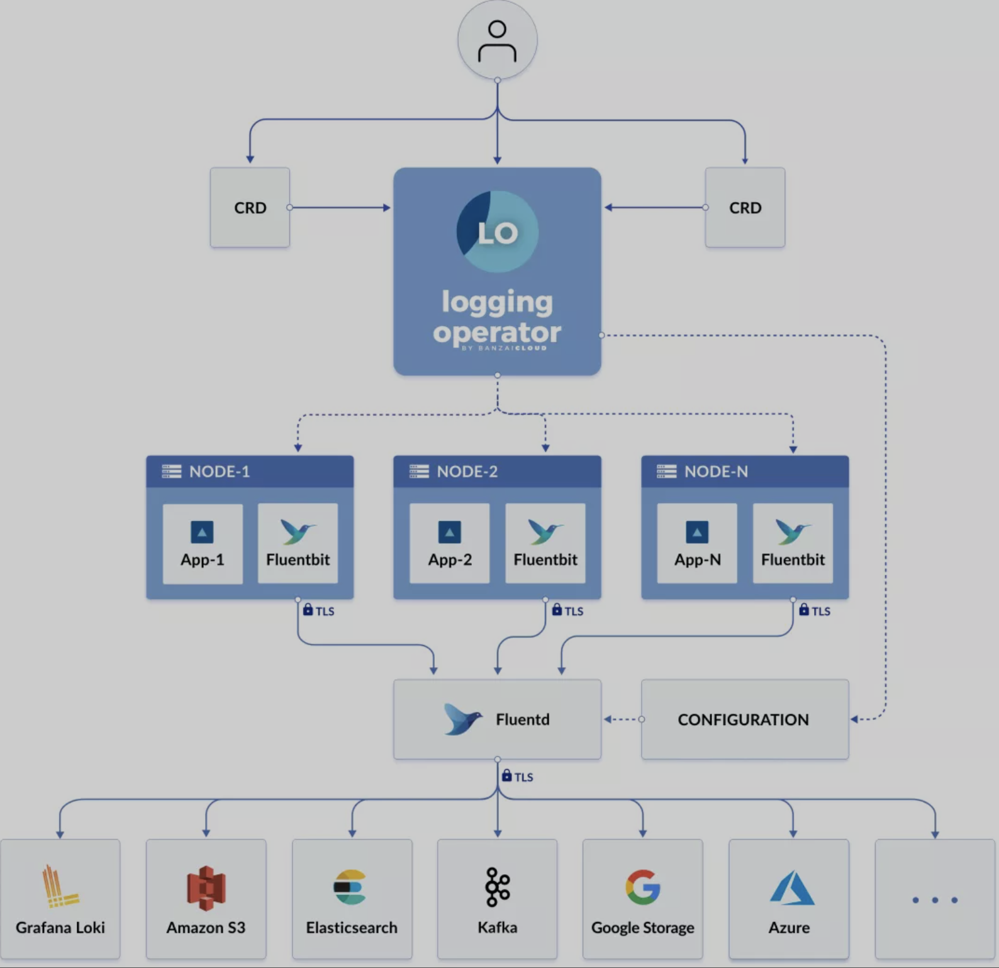

# Logging Operator - 优雅的云原生日志管理方案 1


Logging Operator是BanzaiCloud下开源的一个云原生场景下的日志采集方案。



可以看到Logging Operator利用CRD的方式介入了日志从采集、路由、输出这三个阶段的配置。

它本质上来说还是利用DaemonSet和StatefulSet在集群内分别部署了FluentBit和Fluentd两个组件，

**FluentBit将容器日志采集并初步处理后转发给Fluentd做进一步的解析和路由，最终由Fluentd将日志结果转发给不同的服务**。

除了管理日志工作流外，Logging Operator还可以让管理者开启TLS来加密日志在集群内部的网络传输，以及默认集成了ServiceMonitor来暴露日志采集端的状态。

**当然最重要的还是由于配置CRD化，我们的日志策略终于可以实现在集群内的多租户管理了。**

## **1.Logging Operator CRD**

整个Logging Operator的核心CRD就只有5个，它们分别是

* **logging：用于定义一个日志采集端(FleuntBit)和传输端(Fleuntd)服务的基础配置**；
* **flow：用于定义一个namespaces级别的日志过滤、解析和路由等规则**。
* **clusterflow：用于定义一个集群级别的日志过滤、解析和路由等规则**。
* **output：用于定义namespace级别的日志的输出和参数**；
* **clusteroutput：用于定义集群级别的日志输出和参数，它能把被其他命名空间内的flow关联**；

通过这5个CRD，**我们就可以自定义出一个Kubernetes集群内每个命名空间中的容器日志流向**


## 2.Logging Operator 安装

Logging Operator 依赖Kuberentes1.14之后的版本，可以分别用helm和mainfest两种方式安装。


### Helm(v3.21.0+)安装

```
$ helm repo add banzaicloud-stable https://kubernetes-charts.banzaicloud.com

$ helm repo update

$ helm upgrade --install --wait --create-namespace --namespace logging logging-operator banzaicloud-stable/logging-operator --set createCustomResource=false


Release "logging-operator" does not exist. Installing it now.
NAME: logging-operator
LAST DEPLOYED: Wed Apr 28 19:54:34 2021
NAMESPACE: logging
STATUS: deployed
REVISION: 1
TEST SUITE: None
```

### Mainfest安装

```
$ kubectl create ns logging

# RBAC
$ kubectl -n logging create -f https://raw.githubusercontent.com/banzaicloud/logging-operator-docs/master/docs/install/manifests/rbac.yaml

# CRD
$ kubectl -n logging create -f https://raw.githubusercontent.com/banzaicloud/logging-operator/master/config/crd/bases/logging.banzaicloud.io_clusterflows.yaml
$ kubectl -n logging create -f https://raw.githubusercontent.com/banzaicloud/logging-operator/master/config/crd/bases/logging.banzaicloud.io_clusteroutputs.yaml
$ kubectl -n logging create -f https://raw.githubusercontent.com/banzaicloud/logging-operator/master/config/crd/bases/logging.banzaicloud.io_flows.yaml
$ kubectl -n logging create -f https://raw.githubusercontent.com/banzaicloud/logging-operator/master/config/crd/bases/logging.banzaicloud.io_loggings.yaml
$ kubectl -n logging create -f https://raw.githubusercontent.com/banzaicloud/logging-operator/master/config/crd/bases/logging.banzaicloud.io_outputs.yaml

# Operator
$ kubectl -n logging create -f https://raw.githubusercontent.com/banzaicloud/logging-operator-docs/master/docs/install/manifests/deployment.yaml
```

当安装完成后，我们需要验证下服务的状态

```
# Operator状态
$ kubectl -n logging get pods
NAME                               READY   STATUS    RESTARTS   AGE
logging-operator-9c48d444b-t4rnj   1/1     Running   0          48s

# CRD状态
$ kubectl get crd |grep banzaicloud.io
clusterflows.logging.banzaicloud.io         2021-04-28T11:54:28Z
clusteroutputs.logging.banzaicloud.io       2021-04-28T11:54:28Z
flows.logging.banzaicloud.io                2021-04-28T11:54:28Z
loggings.logging.banzaicloud.io             2021-04-28T11:54:28Z
outputs.logging.banzaicloud.io              2021-04-28T11:54:29Z
```

## 3.Logging Operator 配置

### 3.1 logging

**LoggingSpec**

**LoggingSpec定义了收集和传输日志消息的日志基础架构服务，其中包含Fluentd和Fluent-bit的配置。**

**它们都署在controlNamespace指定的命名空间内。**

一个简单的样例如下：

**`default-logging-simple.yaml`**


```
apiVersion: logging.banzaicloud.io/v1beta1
kind: Logging
metadata:
  name: default-logging-simple
  namespace: logging
spec:
  fluentd: {}
  fluentbit: {}
  controlNamespace: logging
```

这份样例告诉了Operator在logging命名空间内创建一个默认配置的日志服务，其中包含FluentBit和Fluentd两个服务


当**然实际上我们在生产环境上部署FluentBit和Fluentd不会只用默认的配置，通常我们要考虑很多方面，比如：**

* 自定义镜像
* 日志采集位点文件的数据持久化
* Buffer数据持久化
* CPU/内存资源限制
* 状态监控
* Fluentd副本数以及负载均衡
* 网络参数优化
* 容器运行安全

**好在Loggingspec里对上述支持得都比较全面，我们可以参考文档来个性化定制自己的服务**

### watchNamespaces

制定让Operator监听Flow和OutPut资源的命名空间，**如果你是多租户场景，且每个租户都用logging定义了日志架构化**，可以用**watchNamespaces**来关联租户的命名空间来缩小资源过滤范围

### allowClusterResourcesFromAllNamespaces

`ClusterOutput`和`ClusterFlow`这样的全局资源默认只在`controlNamespace`关联的命名空间中生效，如果在其他命名空间中定义都会被忽略，除非将`allowClusterResourcesFromAllNamespaces`设置为`true`

> LoggingSpec描述文档：https://banzaicloud.com/docs/one-eye/logging-operator/configuration/crds/v1beta1/logging_types/

### FluentbitSpec

* filterKubernetes

用来获取日志的Kubernetes元数据的插件，使用样例如下：

```
apiVersion: logging.banzaicloud.io/v1beta1
kind: Logging
metadata:
  name: default-logging-simple
spec:
  fluentd: {}
  fluentbit:
    filterKubernetes:
       Kube_URL: "https://kubernetes.default.svc:443"
       Match: "kube.*"
  controlNamespace: logging
```

也可以用disableKubernetesFilter将该功能禁止，样例如下：

```
apiVersion: logging.banzaicloud.io/v1beta1
kind: Logging
metadata:
  name: default-logging-simple
spec:
  fluentd: {}
  fluentbit:
    disableKubernetesFilter: true
  controlNamespace: logging
```

> **filterKubernetes描述文档**: https://banzaicloud.com/docs/one-eye/logging-operator/configuration/crds/v1beta1/fluentbit_types/#filterkubernetes


* inputTail

**定义FluentBit的日志tail采集配置，这里面有很多细节的参数来控制,现在在用的配置样例**：

```
apiVersion: logging.banzaicloud.io/v1beta1
kind: Logging
metadata:
  name: default-logging-simple
spec:
  fluentbit:
    inputTail:
      Skip_Long_Lines: "true"
      #Parser: docker
      Parser: cri
      Refresh_Interval: "60"
      Rotate_Wait: "5"
      Mem_Buf_Limit: "128M"
      #Docker_Mode: "true"
      Docker_Mode: "false
```

如果Kubernetes集群的容器运行时是Containerd或者其他CRI，就需要把Parser改成cri，同时禁用`Docker_Mode`

> inputTail描述文档: https://banzaicloud.com/docs/one-eye/logging-operator/configuration/crds/v1beta1/fluentbit_types/#inputtail

* buffers

定义了FluentBit的缓冲区设置，这个比较重要。**由于`FluentBit`是以`DaemonSet`的方式部署在Kubernetes集群中，所以我们可以直接采用hostPath的卷挂载方式来给它提供数据持久化的配置，样例如下：**

```
apiVersion: logging.banzaicloud.io/v1beta1
kind: Logging
metadata:
  name: default-logging-simple
spec:
  fluentbit:
    bufferStorage:
      storage.backlog.mem_limit: 10M
      storage.path: /var/log/log-buffer
    bufferStorageVolume:
      hostPath:
        path: "/var/log/log-buffer"
```
 
> bufferStorage描述文档: https://banzaicloud.com/docs/one-eye/logging-operator/configuration/crds/v1beta1/fluentbit_types/#bufferstorage

* positiondb

定义了FluentBit采集日志的文件位点信息，同理我们可以用hostPath方式支持，样例如下：

```
apiVersion: logging.banzaicloud.io/v1beta1
kind: Logging
metadata:
  name: default-logging-simple
spec:
  fluentbit:
    positiondb:
      hostPath:
        path: "/var/log/positiondb"
```

* image

提供自定义的FluentBit的镜像信息，这里我强烈推荐使用FluentBit-1.7.3之后的镜像，它修复了采集端众多网络连接超时的问题,它的样例如下：


```
apiVersion: logging.banzaicloud.io/v1beta1
kind: Logging
metadata:
  name: default-logging-simple
spec:
  fluentbit:
    image:
      repository: fluent/fluent-bit
      tag: 1.7.3
      pullPolicy: IfNotPresent
```

* metrics

定义了FluentBit的监控暴露端口，以及集成的ServiceMonitor采集定义，它的样例如下：

```
apiVersion: logging.banzaicloud.io/v1beta1
kind: Logging
metadata:
  name: default-logging-simple
spec:
  fluentbit:
    metrics:
      interval: 60s
      path: /api/v1/metrics/prometheus
      port: 2020
      serviceMonitor: true
```

* resources

定义了FluentBit的资源分配和限制信息，样例如下：

```
apiVersion: logging.banzaicloud.io/v1beta1
kind: Logging
metadata:
  name: default-logging-simple
spec:
  fluentbit:
    resources:
      limits:
        cpu: "1"
        memory: 512Mi
      requests:
        cpu: 200m
        memory: 128Mi
```

* security

定义了FluentBit运行期间的安全设置，其中包含了PSP、RBAC、securityContext和podSecurityContext。他们共同组成控制了FluentBit容器内的权限，它们的样例如下：

```
apiVersion: logging.banzaicloud.io/v1beta1
kind: Logging
metadata:
  name: default-logging-simple
spec:
  fluentbit:
    security:
      podSecurityPolicyCreate: true
      roleBasedAccessControlCreate: true
      securityContext:
        allowPrivilegeEscalation: false
        readOnlyRootFilesystem: true
      podSecurityContext:
        fsGroup: 101
```

* 性能参数

这里面定义了FluentBit的一些运行性能方面的参数，其中包含：

1.开启forward转发上游应答响应

```
apiVersion: logging.banzaicloud.io/v1beta1
kind: Logging
metadata:
  name: default-logging-simple
spec:
  fluentbit:
    forwardOptions:
      Require_ack_response: true
 ```
 
 2.TCP连接参数

```
apiVersion: logging.banzaicloud.io/v1beta1
kind: Logging
metadata:
  name: default-logging-simple
spec:
  fluentbit:
    network:
      connectTimeout: 30
      keepaliveIdleTimeout: 60
```

3.开启负载均衡模式

```
apiVersion: logging.banzaicloud.io/v1beta1
kind: Logging
metadata:
  name: default-logging-simple
spec:
  fluentbit:
    enableUpstream: true
```

4.调度污点容忍

```
apiVersion: logging.banzaicloud.io/v1beta1
kind: Logging
metadata:
  name: default-logging-simple
spec:
  fluentbit:
    tolerations:
    - effect: NoSchedule
      key: node-role.kubernetes.io/master
```

### FluentdSpec

* buffers

这里主要定义Fluentd的buffer数据持久化配置，由于Fluentd是以StatefulSet的方式部署的，所以我们用hostPath就不太合适，这里我们应该用PersistentVolumeCliamTemplate的方式为每一个fluentd实例创建一块专门的buffer数据卷，样例如下：

```
apiVersion: logging.banzaicloud.io/v1beta1
kind: Logging
metadata:
  name: default-logging-simple
spec:
  fluentd:
    bufferStorageVolume:
      pvc:
        spec:
          accessModes:
            - ReadWriteOnce
          resources:
            requests:
              storage: 50Gi
          storageClassName: csi-rbd
          volumeMode: Filesystem
```

这里如果不指定storageClassName的话，Operator将通过StorageClass为default的存储插件创建pvc

* FluentOutLogrotate

定义了Fluentd的标准输出重定向到文件配置，这主要是为了避免在出现错误时Fluentd产生连锁反应，并且错误消息作为日志消息返回系统生成另一个错误，样例如下：

```
apiVersion: logging.banzaicloud.io/v1beta1
kind: Logging
metadata:
  name: default-logging-simple
spec:
  fluentd:
    fluentOutLogrotate:
      enabled: true
      path: /fluentd/log/out
      age: 10
      size: 10485760
 ```
 
这里表达的意思就是将fluentd日志重定向到`/fluentd/log/out`目录，同时保留10天，文件最大不超过10M

> FluentOutLogrotate描述文档：https://banzaicloud.com/docs/one-eye/logging-operator/configuration/crds/v1beta1/fluentd_types/#fluentoutlogrotate


* Scaling

这里主要定义fluentd的副本数，如果FluentBit开启UpStraem的支持，调整Fluentd的副本数会导致FluentBit滚动更新，它的样例如下：

```
apiVersion: logging.banzaicloud.io/v1beta1
kind: Logging
metadata:
  name: default-logging-simple
spec:
  fluentd:
    scaling:
      replicas: 4
```

> scaling描述文档：https://banzaicloud.com/docs/one-eye/logging-operator/configuration/crds/v1beta1/fluentd_types/#fluentdscaling

* Worker

这里定义了Fluentd内部的Worker数量，由于Fluentd受限于ruby，它还是以单进程的方式处理日志工作流，增加worker数可以显著提高Fluentd的并发，样例如下：

```
apiVersion: logging.banzaicloud.io/v1beta1
kind: Logging
metadata:
  name: default-logging-simple
spec:
  fluentd:
    workers: 2
```

> 当Worker数大于1时，Operator-3.9.2之前的版本，对Fluentd的buffer数据持久化存储不够友好，可能会造成Fluentd容器Crash

* image

定义了FluentD的镜像信息，这里必须要用Logging Operator定制的镜像，可以自定义镜像版本，结构和FluetBit类似。

* security

定义了FluentD运行期间的安全设置，其中包含了PSP、RBAC、securityContext和podSecurityContext，结构和FluetBit类似。


* metrics

定义了FluentD的监控暴露端口，以及集成的ServiceMonitor采集定义，结构和FluetBit类似。

* resources

定义了FluentD的资源分配和限制信息，结构和FluetBit类似。


