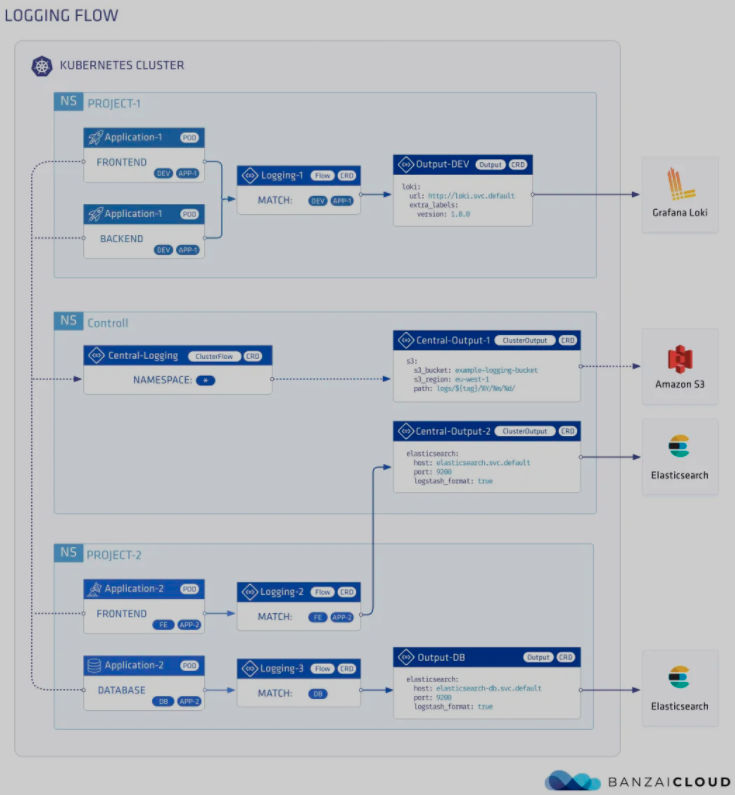

# Logging Operator - 优雅的云原生日志管理方案 2



Logging Operator核心的逻辑主要就两个Flow和Output。简单来说，Flow的作用是用来处理日志流的，Output用来定义日志的输出方式。掌握了这个，至于ClusterFlow和ClusterOutput无外乎就是一个全局的声明罢了。

## 3.2 Flow && ClusterFlow


**Flow定义了日志的filters和outputs**，它是一个namespaces级别的CRD资源。因此，我们可以在应用所在的命名空间内根据Kubernetes标签来决定日志是否被采集，同时也能定义多个filter来对日志进行处理。举个简单的例子：

```
kind: Flow
metadata:
  name: flow-sample
  namespace: default
spec:
  filters:
    - parser:
        remove_key_name_field: true
        parse:
          type: nginx
    - tag_normaliser:
        format: ${namespace_name}.${pod_name}.${container_name}
  localOutputRefs:
    - loki-output
  match:
    - select:
        labels:
```

这条Flow的意思是，让日志采集端只处理来自default命名空间下，标签`app=nginx`的容器日志。同时并对采集的日志按照nginx的格式进行解析，并把这条日志流的tag在fluentd内部重定向为`${namespace_name}.${pod_name}.${container_name}`格式。

这个例子里面，我们着重注意三个地方match,filters和localOutputRefs

### match

match是处理日志的第一步，我们需要利用Kubernetes标签来定义哪些日志需要被采集。当前可用的字段如下：

* namespaces， 匹配命名空间
* labels，匹配labels
* hosts，匹配host机器
* `container_names`，匹配容器名字

我们通过select和exclude来选择或排除我们要匹配的资源类型。比如下面例子：

```
apiVersion: logging.banzaicloud.io/v1beta1
kind: Flow
  metadata:
    name: flow-sample
    namespace: default
  spec:
    match:
      - exclude:
          labels:
            componnet: reloader
      - select:
          labels:
            app: nginx
            componnet: nginx
```

这条Flow就声明让客户端只处理default命名空间下标签为`app=nginx`, `componnet: nginx`，排除`componnet: reloader`的容器日志。

对于ClusterFlow，我们可以通过更负责的select来控制多个namespaces下的日志采集。比如

```
apiVersion: logging.banzaicloud.io/v1beta1
kind: ClusterFlow
metadata:
  name: clusterflow-sample
spec:
  match:
    - exclude:
        namespaces:
          - dev
          - test
    - select:
        labels:
          app: nginx
```

这条声明就告诉了客户端只处理命名空间是dev和test下，标签为app=nginx的容器日志。

> ClusterFlow的声明默认只在`controlNamespace`定义的namespace下生效，如果要定义到其他命名空间，你需要在定义`logging CRD`时打开`allowClusterResourcesFromAllNamespaces`

如果我们需要简单粗暴的采集指定namespaces下所有容器的日志，那么只需要定义一个如下内容的ClusterFlow即可

```
apiVersion: logging.banzaicloud.io/v1beta1
kind: ClusterFlow
metadata:
  name: clusterflow-sample
spec:
  match:
  - select:
      namespaces:
      - prod
      - dev
      - test
```
 
* filters

Logging Operator的filter支持一些常见的日志处理插件。可以参考下面这个表格


> filter插件文档：https://banzaicloud.com/docs/one-eye/logging-operator/configuration/plugins/filters/


* Parser插件


Parser插件比较常见，通常我们用它来解析采集的日志内容，比如我们要解析的docker日志是json格式就可以按照如下方式配置：

```
apiVersion: logging.banzaicloud.io/v1beta1
kind: Flow
metadata:
  name: flow-sample
  filters:
    - parser:
        remove_key_name_field: true
        reserve_data: true
        key_name: "log"
        parse:
          type: json
          time_key: time
          time_format: "%Y-%m-%dT%H:%M:%S.%NZ"
```
甚至，我们也可以在日志里定义多种类型的格式，如下：

```
apiVersion: logging.banzaicloud.io/v1beta1
kind: Flow
metadata:
 name: flow-sample
spec:
 filters:
   - parser:
       remove_key_name_field: true
       reserve_data: true
       parse:
         type: multi_format
         patterns:
         - format: nginx
         - format: regexp
           expression: /foo/
         - format: none
```

这会生成fluentd的如下的fluentd配置

```
<filter **>
 @type parser
 @id test_parser
 key_name message
 remove_key_name_field true
 reserve_data true
 <parse>
   @type multi_format
   <pattern>
     format nginx
   </pattern>
   <pattern>
     expression /foo/
     format regexp
   </pattern>
   <pattern>
     format none
   </pattern>
 </parse>
</filter>
```

> parser插件文档：https://banzaicloud.com/docs/one-eye/logging-operator/configuration/plugins/filters/parser/

* `record_modifier`插件

record_modifier允许我们从已解析的日志字段里面提取和修改字段。比如我们在采集kubernetes的容器日志时，希望修改部分元数据时，就可以使用这个插件。

```
apiVersion: logging.banzaicloud.io/v1beta1
kind: Flow
metadata:
 name: flow-sample
spec:
 filters:
  - record_modifier:
      records:
      - host: ${record.dig('kubernetes', 'host')}
```

这条filter规则就定义了让fluentd在处理日志元数据时，新加一个字段host，它的值来自于`.kubernetes.host`。它最终在fluentd中操作的配置是这样的。

```
<filter **>
 @type record_modifier
 @id test_record_modifier
  <record>
    host ${record.dig('kubernetes', 'host')}
  </record>
</filter>
```

* prometheus插件

prometheus是用来统计进入fluentd日志流并处理的日志基数，比如我们想统计标签`app=nginx`这个打印了多少日志时，就可以用该插件处理，

```
apiVersion: logging.banzaicloud.io/v1beta1
kind: Flow
metadata:
 name: flow-sample
spec:
 filters:
   - parser:
       remove_key_name_field: true
       reserve_data: true
       parse:
         type: nginx
   - prometheus:
       metrics:
       - name: total_counter
         desc: The total number of nginx in message.
         type: counter
         labels:
           app: nginx
       labels:
         host: ${hostname}
         tag: ${tag}
         namespace: $.kubernetes.namespace
```


这个就表示了nginx日志在fluentd共计处理了多少行消息，这对我们统计业务日志资源使用来说比较方便的。

> prometheus插件文档：https://banzaicloud.com/docs/one-eye/logging-operator/configuration/plugins/filters/prometheus/


### OutputRefs

OutputRefs定义了日志的输出路径。它分为`locallOutputRefs和globallOutputRefs`。

故名思义，`locallOutputRefs`是跟flow一样作用在namespace级别，其他ns下的Flow看不到当前ns下的output定义。globallOutputRefs为集群级别的日志输出声明，它能被所有ns下的Flow和ClusterFlow引用。

## 3.3 Output && ClusterOutput

Output定义了日志的输出方式，目前Logging Operator支持的日志输出插件非常多，包含如下内容：

```
- Alibaba Cloud 
- Amazon CloudWatch 
- Amazon Elasticsearch
- Amazon Kinesis 
- Amazon S3 
- Azure Storage 
- Buffer 
- Datadog 
- Elasticsearch 
- File 
- Format 
- Format rfc5424 
- Forward 
- GELF 
- Google Cloud Storage
- Grafana Loki
- Http
- Kafka
- LogDNA
- LogZ
- NewRelic
- Splunk
- SumoLogic
- Syslog
```

这里面我们日常工作中用到的日志存储或架构大概就包含Loki,ElasticSearch,Kafka或S3。

* Grafana Loki

Grafana Loki插件用来定义fluentd将日志输出到Loki当中，我们可以定义一些特定的参数来控制和优化日志输出，比如下面这个样例：


```
apiVersion: logging.banzaicloud.io/v1beta1
kind: Output
metadata:
 name: loki-output
spec:
  loki:
    buffer:
      chunk_limit_size: 8M
      flush_at_shutdown: true
      flush_interval: 10s
      flush_mode: interval
      flush_thread_count: 4
      overflow_action: throw_exception
      queued_chunks_limit_size: 64
      retry_max_interval: 60s
      retry_timeout: 1h
      retry_type: exponential_backoff
      retry_wait: 10s
      total_limit_size: 10G
      type: file
    configure_kubernetes_labels: false
    drop_single_key: true
    extra_labels:
      cluster: cluster-xxx
    extract_kubernetes_labels: false
    labels:
      namespace: ""
      pod: ""
      images: ""
      host: ""
      container: ""
      tream: ""
    remove_keys:
    - time
    - kubernetes
    - logtag
    - docker
    - metadata
    url: http://loki:3100
```


在多租户的场景下，我们甚至也可以将Loki的多租户功能打开，这样我们可以在定义output的时候指定租户信息，比如:

```
apiVersion: logging.banzaicloud.io/v1beta1
kind: Output
metadata:
 name: loki-output
spec:
  loki:
    url: http://loki:3100
    username: test
    password: test
    tenant: test
```

这样我们就可以灵活的在kubernets集群中定义多租户的日志输出问题。

* Kafka

Fluentd的kafka输出插件

```
apiVersion: logging.banzaicloud.io/v1beta1
kind: Output
metadata:
 name: kafka-output
spec:
 kafka:
   brokers: kafka-headless.kafka.svc.cluster.local:29092
   topic_key: topic
   default_topic: topic
   required_acks：1
   format: 
     type: json    
   buffer:
     tags: topic
     timekey: 1m
     timekey_wait: 30s
     timekey_use_utc: true
```

> kafka插件文档：https://banzaicloud.com/docs/one-eye/logging-operator/configuration/plugins/outputs/kafka/

* ElasticSearch

Fluentd的ES输出插件

```
apiVersion: logging.banzaicloud.io/v1beta1
kind: Output
metadata:
  name: es-output
spec:
  elasticsearch:
    host: elasticsearch.logging.svc.cluster.local
    port: 9200
    scheme: https
    ssl_verify: false
    ssl_version: TLSv1_2
    user: elastic
    logstash_format: true
    password:
      valueFrom:
        secretKeyRef:
          name: quickstart-es-elastic-user
          key: elastic
    buffer:
      timekey: 1m
      timekey_wait: 30s
      timekey_use_utc: true
```

> elasticsearch插件文档：https://banzaicloud.com/docs/one-eye/logging-operator/configuration/plugins/outputs/elasticsearch/


另外值得提醒的是，Output和ClusterOutput都可以被OutputRefs引用，比如我们需要将日志同时发送给kafka和elastichsearch时，我们就可以如下定义：

```
apiVersion: logging.banzaicloud.io/v1beta1
kind: Flow
metadata:
  name: nginx-flow
  namespace: default
spec:
 filters:
   - parser:
       remove_key_name_field: true
       reserve_data: true
       parse:
         type: nginx
  match:
    - select:
        labels:
          app: nginx
  localOutputRefs:
    - kafka-output
    - es-output
```
 
 文简单总结了Logging Operator的Flow、ClusterFlow、Output和ClusterOutput资源使用。可以了解到我们可以通过Flow&ClusterFlow来快速声明和解析需要采集的日志的容器。通过Output&ClusterOutput来定义多样的日志输出渠道。在实际的工作中，我们往往需要对运行在kubernetes中的容器日志流向做定向管理，用Logging Operator可以轻松实现这类工作。

