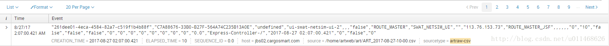
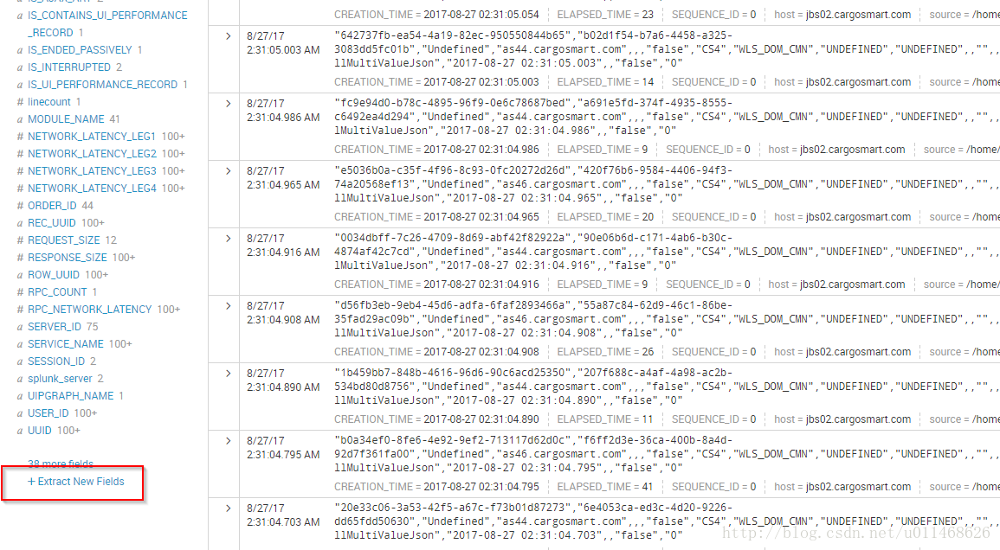

# **splunk 基础**

## **1 Splunk**

用来处理数据的，主要包含5个功能

#### **Index Data**

* 将所有数据进行处理，索引，将数据包装成一个个的event，并存储在指定的位置中；
* 在检索的时候，通过输入的检索条件，从指定的位置中去读取数据；

#### **Search & Investigate**

* 在搜索框中输入指定的条件，从而实现数据搜索功能；

#### **Add Knowledge**

对于已经存储好的event数据，可以再对event数据加上一些定制化的标签，从而方便后续数据处理；

#### **Monitor & Alert**

对于有些错误数据，可以进行设定，从而在这种数据刚刚产生的时候，就报警显示出来；

#### **Report & Analyze**

将event数据处理，变为可视化的dashboard；


### **1-1 三个主要组件**

#### **Indexer**

* 将机器数据整理成为event，并存放在指定的，不同的目录中，按照日期进行排列；
* **可以将数据保存在不同的indexer中，实现提高效率，保存不同时间，开启不同的查看权限功能；**

#### **Search Head**

* 搜索框，提供搜索语法，将搜索指令传递给 Indexer；
* Indexer 检索完结果后，将目标event返回给Search Head;
* Serach Head 对数据进行处理，可以以列表，图表等各种方式展现出来；

#### **Forwarder**

**该应用一般安装在目标应用服务器上，起到对该应用的监控作用，从而将该应用的数据，推送给Indexer来进行处理；**


### **1-2 数据录入**

#### **uploaded**

* 通过将数据文件上传，然后对数据进行分析；
* 适用于数据文件不变的一些测试用例，不适合于企业用例；


#### **monitor**

* 监控文件，文件夹
* Http Event;
* 端口；
* script脚本；

#### **forwarder**

最常用的一种数据录入方式

### **1-3 搜索**

#### **基本搜索**

* 用时间过滤效率最高；
* 一次查询，10分钟有效，10分钟后就会再次运行该查询
* 分享的job数据，7天内有效，及其他人查看的结果和本次job第一次展示的数据相同；
* `zoom in` 和 挑选时间线，是在原有的job结果中过滤，不会再次查询；
* `zoom out`时，是重新运行一次job；
* `fail *` ： 通配符搜索
* `NOT`, `AND` ,`OR` 几种必须大写，通过`（）` 进行优先级排序；
* `failed password `和 `failed and password` 相同效果;

#### **fields**

* selected fields: 对于搜索作者本人，至关重要的一些字段，可以高亮现实，可以改变哪些字段能成为该类型字段；
* `interested fields`： 最少20的event中都包含的字段，可以加入到`selected fields`中去；
* 一个字段可以包含多个值，并会显示每个值在所有event中所占数目及比例；
* `a`： 指的是该字段的值是string类型；
* `#`： 指的是该字段的值类型是numrical类型；
* 字段名称大小写敏感，字段具体的值大小写不敏感；
* `=，！=，>=, <= `;
* `in`;

#### **搜索规则**

* 一般先指定时间，然后依次为**index， source， host， sourcetype**；
* inclusion 比 exclusion好；

**搜索语法(command)**

```
# 1. pipeline： 将搜索结果通过不同的pipeline进行多次过滤  commond+\ 进行换行
#   同时可以切换search bar的窗口 
｜ content1 ｜ content2 ｜

# 2. fields 属性
#包含字段： 发生在检索之前，筛选出其中两个字段，提升了效率
index = main ｜ fields firstfield secondfield
# 排除字段： 发生在检索之后，排除其中两个字段，对效率没影响，只是影响了页面展示的字段
index = main ｜ fields - firstfield secondfield

# table 属性： 展示了其中的三个字段
index = main ｜ table field1 field2 field3

# rename 属性： 展示了其中的三个字段
# rename某个字段后，就不能在后续的pipeline中用该字段了，应该用rename后的那个字段
index = main ｜ table field1 field2 field3 ｜ rename field1 as “haha” fields2 as “heihei”

# 去重
index = main ｜ table field1 field2 field3 ｜ dedup fields1

# 排序:    + 升序列   - 降序列       limit指定返回行数
index = main ｜ table field1 field2 field3 ｜ sort +（-） fields1  limit = 20
```

**函数**

```
# 1. top rare ：  top为前多少个， rare为最后多少个
index = main ｜ top field1    # 默认为前10个最多的
index = main ｜ top field1 limit = 20  # 可以手动设定前多少个
index = main ｜ top field1 limit = 0  # 将该字段从前到后排序  

# 2. 函数
# count   distinct count  sum average   min max  list
index = main ｜ stats count   # 统计总数
index = main ｜ stats count as wholenumber   # 统计总数并起别名
index = main ｜ stats count（fields） as number   # 统计总数并起别名
```


## **2 Splunk的基本使用心得**

### **2-1 Concept**

`event`: **其实是一条记录，跟数据库表的一条记录是类似的**，不同之处在于这些数据原来都是没有字段名，而`Splunk`规范一些`field`来标记这条记录，像`host`,`source`,`sourcetype`,`time`这些`filed`,这些`filed`是在数据源提取时候利用定义的。




* `host`： 标记来源于那台虚拟或物理机子。

` host!=pc10jamutil01 host!=pc10jamutil03 host!=pc10jamutil02 host!=pc10jamutil04`

* **`source`: 标记来源那个数据流,比如一个文件。**

```
source="/app/jam/log/rails.err"
```

* **`sourcetype`: 归类source类型**。


* **`field`： 由于数据一般是以逗号做分割，然后没有明确表示每个值是什么意思，你可以在这个页面对**

```
NOT GbaasBaseService  NOT SF ct  NOT "ActionController::RoutingError"  NOT RabbitMQ  NOT SfsfError
```

* **N个值给N个`filed name`，方便可读和查询。可以类似`index=”artraw” sourcetype=”artraw-csv”`查出最原始的Event之后，点击这个做自定flitter。**

* **Index： 类似数据库的表，virtual index还包含提取程序定义等。**


```
source="/app/jam/log/rails.err"  NOT GbaasBaseService  NOT SF ct  NOT "ActionController::RoutingError"  NOT RabbitMQ  NOT SfsfError host!=pc10jamutil01 host!=pc10jamutil03 host!=pc10jamutil02 host!=pc10jamutil04
```




### **2-2 Core Features**

* `Search`: 通过SPL从index里获取，判断，转换等形成想要的数据。
* `Pivot`: 不直接用SPL去生成结果，这个feature可在UI生成想要的report或图表等,但需要预先提供dataset,datamodel.
* `Report`: 由前面两个features形成，可以在特殊情况（可定时）下生成Alert.
* `Alert`: 在特殊情况下想做一些action，如发Email，调用script，python，Java都可以。
* `Dashboard`: 由多个panel组成，用于将多个report或图表放在一起，还提供一个全局变量存储，里面定义的search 可以以这些变量做为条件等做关联。
* `other`： splunk还提供一些分布式查询，instance之间的数据forward等分布式功能的feature.


### **2-3 Search Example**

SPL（Search Processing Language）: SPL其实是从每个index里面拿出数据，处理一个阶段的结果再通过`”|”`将结果作为input交给下个阶段做处理，这样就变成串行的处理，如果你希望从不同两个数据流获取结果，可以子查询达到并行效果，Splunk的features基本都是以它作为基石。

SQL与SPL转换可参考这个:

http://docs.splunk.com/Documentation/Splunk/6.5.0/SearchReference/SQLtoSplunk


具体查询规则其实splunk有提供很好的文档，而且也提供了中文文档，改改版本号就可以：

* http://docs.splunk.com/Documentation/Splunk/6.6.3
* http://docs.splunk.com/Documentation/Splunk/6.6.3/Translated/SimplifiedChinesemanuals

Splunk Search Manual 里面由很详细， 包括search 机制，UI操作，语法，优化等， Search Reference里由讲解可用的方法来配合search 文档。

对于生成图表类型，可以在可视化哪里选择，你只需生成所需的数据就好。
像这条就可以生成柱状图，饼状图

```
source="data.json" host="test" index="testloginstatus" sourcetype="_json" | chart count by staus| eval status=if(status=="true", "Normal Login","Abnormal Login") | rename count as "Amount"
```
**还有一些比较复杂的report SPL的example**

这里面的变量的值都是来自于Dashboard里的UI绑定的，主要是弄一些summary，总数，比率等，这种写法从相同的流里做多种判断，合出多个结果，不用从重新提取，也不需要用子查询（会比父先查，而且是隔开的，最后合并）。

```
index="artraw" sourcetype="artraw-csv"| where !isnull(ELAPSED_TIME) | where APPLICATION_NAME = if($INPUT_APPLICATION_NAME$=="*",APPLICATION_NAME,$INPUT_APPLICATION_NAME$) | where MODULE_NAME = if($INPUT_MODULE_NAME$=="*",MODULE_NAME,$INPUT_MODULE_NAME$) | where SERVICE_NAME = if($INPUT_SERVICE_NAME$=="*",SERVICE_NAME,$INPUT_SERVICE_NAME$) |  stats count as "TOTAL_TRANSATION", avg(ELAPSED_TIME) as "AVERAGE_RESPONSE_TIME", count(eval(if(ELAPSED_TIME <= 5,1,NULL))) AS "LESS_THAN_5s", count(eval(if(ELAPSED_TIME <= 10 AND ELAPSED_TIME >= 5,1,NULL))) AS "BETWEEN_5s_TO_10s", count(eval(if(ELAPSED_TIME <= 15 AND ELAPSED_TIME >= 10,1,NULL))) AS "BETWEEN_10s_TO_15s", count(eval(if(ELAPSED_TIME <= 20 AND ELAPSED_TIME >= 15,1,NULL))) AS "BETWEEN_15s_TO_20s",count(eval(if(ELAPSED_TIME >= 20,1,NULL))) AS "MORE_THAN_20s" by APPLICATION_NAME,MODULE_NAME,SERVICE_NAME | where TOTAL_TRANSATION >= $INPUT_TOTAL_TRANSATION$ | eval RATE_LESS_THAN_5s=substr(tostring(LESS_THAN_5s/TOTAL_TRANSATION*100),1,4)+"%" | eval RATE_BETWEEN_5s_TO_10s=substr(tostring(BETWEEN_5s_TO_10s/TOTAL_TRANSATION*100),1,4)+"%" |  eval RATE_BETWEEN_10s_TO_15s=substr(tostring(BETWEEN_10s_TO_15s/TOTAL_TRANSATION*100),1,4)+"%" |  eval RATE_BETWEEN_15s_TO_20s=substr(tostring(BETWEEN_15s_TO_20s/TOTAL_TRANSATION*100),1,4)+"%" | eval RATE_MORE_THAN_20s=substr(tostring(MORE_THAN_20s/TOTAL_TRANSATION*100),1,4)+"%"  | table APPLICATION_NAME,MODULE_NAME,SERVICE_NAME,TOTAL_TRANSATION,AVERAGE_RESPONSE_TIME,LESS_THAN_5s,RATE_LESS_THAN_5s,BETWEEN_5s_TO_10s,RATE_BETWEEN_5s_TO_10s,BETWEEN_10s_TO_15s,RATE_BETWEEN_10s_TO_15s,BETWEEN_15s_TO_20s,RATE_BETWEEN_15s_TO_20s,MORE_THAN_20s,RATE_MORE_THAN_20s
```

这个是每条数据的细节

```
index="artraw" sourcetype="artraw-csv" | where APPLICATION_NAME = if($INPUT_APPLICATION_NAME$=="*",APPLICATION_NAME,$INPUT_APPLICATION_NAME$) | where MODULE_NAME = if($INPUT_MODULE_NAME$=="*",MODULE_NAME,$INPUT_MODULE_NAME$) | where SERVICE_NAME = if($INPUT_SERVICE_NAME$=="*",SERVICE_NAME,$INPUT_SERVICE_NAME$)  | eval CREATION_TIME(HKT)=strftime((strptime(CREATION_TIME, "%Y-%m-%d %H:%M:%S.%N") + 28800),"%Y-%m-%d %H:%M:%S.%N")  | table UUID SERVER_ID APPLICATION_NAME MODULE_NAME SERVICE_NAME USER_ID CLIENT_ID ELAPSED_TIME IS_INTERRUPTED CREATION_TIME(HKT)
```

这个是用来比较不同时期之间的数据

```
index="artraw" sourcetype="artraw-csv" earliest=-3w | where !isnull(ELAPSED_TIME) | where APPLICATION_NAME=if($APPLICATION_NAME$=="*",APPLICATION_NAME,$APPLICATION_NAME$) | where MODULE_NAME=if($MODULE_NAME$=="*",MODULE_NAME,$MODULE_NAME$) | where SERVICE_NAME=if("$SERVICE_NAME$"=="*",SERVICE_NAME,"$SERVICE_NAME$") | eval CREATION_TIME=strptime(CREATION_TIME, "%Y-%m-%d %H:%M:%S.%N") + 28800 | eval CREATION_TIME_CURR_START=mvindex(split("$COMPARISON_TIME_RANGE$","#"),0) | eval CREATION_TIME_PERV_END=mvindex(split("$COMPARISON_TIME_RANGE$","#"),1) |  stats count(eval(if(CREATION_TIME > now() - tonumber(CREATION_TIME_CURR_START),1,NULL))) as "CURRENT_TOTAL_TRANSATION", avg(eval(if(CREATION_TIME > now() - tonumber(CREATION_TIME_CURR_START),ELAPSED_TIME,NULL))) as "CURRENT_AVERAGE_RESPONSE_TIME", count(eval(if(CREATION_TIME < now() - tonumber(CREATION_TIME_CURR_START) AND CREATION_TIME > now() - tonumber(CREATION_TIME_PERV_END),1,NULL))) as "PERVIOUS_TOTAL_TRANSATION", avg(eval(if(CREATION_TIME < now() - tonumber(CREATION_TIME_CURR_START) AND CREATION_TIME > now() - tonumber(CREATION_TIME_PERV_END),ELAPSED_TIME,NULL))) as "PERVIOUS_AVERAGE_RESPONSE_TIME"  by APPLICATION_NAME,MODULE_NAME,SERVICE_NAME   | table APPLICATION_NAME,MODULE_NAME,SERVICE_NAME,CURRENT_TOTAL_TRANSATION,CURRENT_AVERAGE_RESPONSE_TIME,PERVIOUS_TOTAL_TRANSATION,PERVIOUS_AVERAGE_RESPONSE_TIME
```


