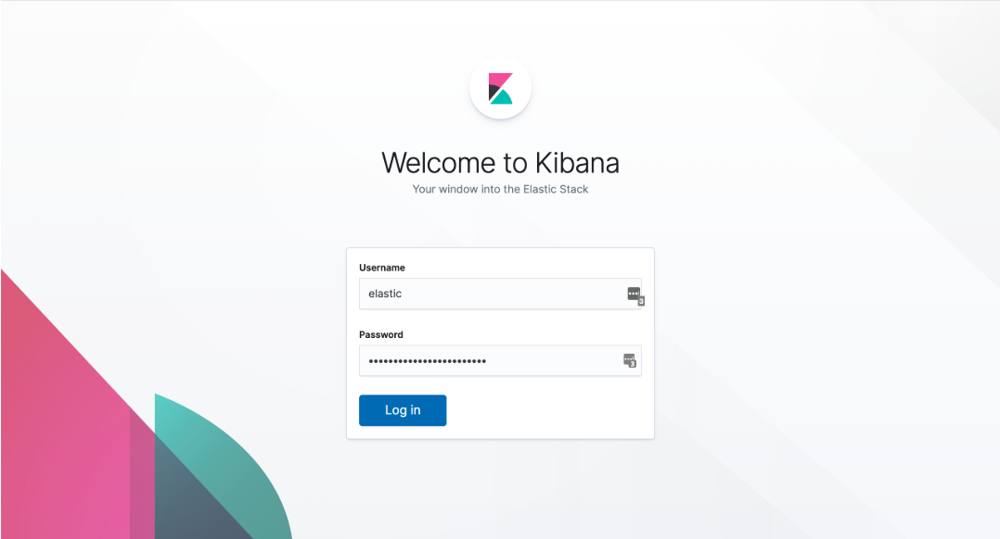
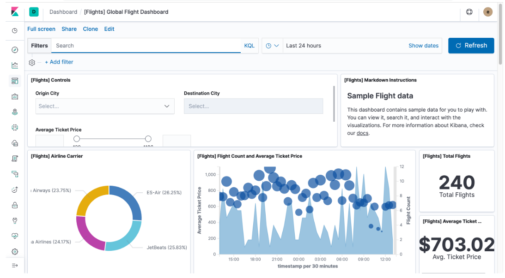

# 使用Elasticsearch Operator快速部署Elasticsearch集群


随着 `kubernetes` 的快速发展，很多应用都在往 `kubernetes` 上面迁移，现阶段对于无状态应用的迁移是非常容易做到的，但是对于有状态应用的迁移还是有一定门槛的，主要是有状态应用的运行方式各有不同，比如 `MySQL`、`MongoDB`、`Redis` 这些应用运行的方式方法都不太相同，特别是对于线上环境需要高可用的集群模式的时候，则差别就更大了，这就导致了有状态应用向 `Kubernetes` 的迁移必然进度会很慢。

现在比较好的解决方案就是针对有状态应用开发对应的 `Operator` 应用，比如 `prometheus-operator`、`etcd-operator` 等等，关于 `Operator` 的开发，可以查看前面的一篇入门文章：[`Kubernetes Operator`](https://github.com/Chao-Xi/JacobTechBlog/blob/master/k8s_tutorial/k8s_adv63_operator.md) 快速入门教程以了解更多信息。


同样的，对于 `Elasticsearch` 应用，现在官方也推出了基于 `Kubernetes Operator`的应用：`Elastic Cloud on Kubernetes (ECK)`，用户可使用该产品在 Kubernetes 上配置、管理和运行 `Elasticsearch` 集群。

## Elastic Cloud on Kubernetes

`Elastic Cloud on Kubernetes(ECK)` 是一个 `Elasticsearch Operator`，但远不止于此。 `ECK` 使用 `Kubernetes Operator` 模式构建而成，需要安装在您的 `Kubernetes` 集群内，其功能绝不仅限于简化 `Kubernetes` 上 `Elasticsearch` 和 `Kibana` 的部署工作这一项任务。ECK 专注于简化所有后期运行工作，例如：

* 管理和监测多个集群
* 轻松升级至新的版本
* 扩大或缩小集群容量
* 更改集群配置
* 动态调整本地存储的规模（包括 `Elastic Local Volume`（一款本地存储驱动器））
* 备份

`ECK` 不仅能自动完成所有运行和集群管理任务，还专注于简化在 `Kubernetes` 上使用 `Elasticsearch` 的完整体验。`ECK `的愿景是为 `Kubernetes` 上的 `Elastic` 产品和解决方案提供 `SaaS` 般的体验。

在 `ECK` 上启动的所有 `Elasticsearch` 集群都默认受到保护，这意味着在最初创建的那一刻便已启用加密并受到默认强密码的保护。

> 从 `6.8` 和 `7.1` 版本开始，`Elasticsearch` 核心安全功能（TLS 加密、基于角色的访问控制，以及文件和原生身份验证）会免费提供。


通过 `ECK` 部署的所有集群都包括强大的基础（免费）级功能，例如可实现密集存储的冻结索引、`Kibana Spaces`、`Canvas`、`Elastic Maps`，等等。您甚至可以使用 `Elastic Logs` 和 `Elastic Infrastructure` 应用监测 `Kubernetes` 日志和基础设施。您可以获得在 `Kubernetes` 上使用 `Elastic Stack` 完整功能的体验。

`ECK` 内构建了 `Elastic Local Volume`，这是一个适用于 `Kubernetes` 的集成式存储驱动器。`ECK` 中还融入了很多最佳实践，例如在缩小规模之前对节点进行 `drain` 操作，在扩大规模的时候对分片进行再平衡，等等。从确保在配置变动过程中不会丢失数据，到确保在规模调整过程中实现零中断。

## 安装 ECK


当然前提是你要有一个已经可运行的 `kubernetes` 集群（1.11版本以上），最好确保你的每个节点上至少有4GB内存可以使用，因为我们知道 `Elasticsearch` 是比较消耗资源的。

首先在集群中安装 `ECK` 对应的 `Operator` 资源对象：

```
$ kubectl apply -f https://download.elastic.co/downloads/eck/0.8.1/all-in-one.yaml
customresourcedefinition.apiextensions.k8s.io/apmservers.apm.k8s.elastic.co created
customresourcedefinition.apiextensions.k8s.io/clusterlicenses.elasticsearch.k8s.elastic.co created
customresourcedefinition.apiextensions.k8s.io/elasticsearches.elasticsearch.k8s.elastic.co created
customresourcedefinition.apiextensions.k8s.io/enterpriselicenses.elasticsearch.k8s.elastic.co created
customresourcedefinition.apiextensions.k8s.io/remoteclusters.elasticsearch.k8s.elastic.co created
customresourcedefinition.apiextensions.k8s.io/trustrelationships.elasticsearch.k8s.elastic.co created
customresourcedefinition.apiextensions.k8s.io/users.elasticsearch.k8s.elastic.co created
customresourcedefinition.apiextensions.k8s.io/kibanas.kibana.k8s.elastic.co created
clusterrole.rbac.authorization.k8s.io/elastic-operator created
clusterrolebinding.rbac.authorization.k8s.io/elastic-operator created
namespace/elastic-system created
statefulset.apps/elastic-operator created
secret/webhook-server-secret created
serviceaccount/elastic-operator created
```

安装成功后，会自动创建一个 `elastic-system` 的 `namespace` 以及一个 `operator` 的 `Pod`：

```
$ kubectl get ns
NAME             STATUS   AGE
elastic-system   Active   40s
```
```
$ kubectl get pods -n elastic-system
NAME                 READY   STATUS    RESTARTS   AGE
elastic-operator-0   1/1     Running   1          2m
```

这个时候会安装上若干个 `CRD `对象，当然这些 `CRD` 资源的控制器就在上面的 `elastic-operator-0` 这个 `Pod` 中：

```
$ kubectl get crd  | grep elastic
apmservers.apm.k8s.elastic.co                     2019-07-03T06:52:56Z
clusterlicenses.elasticsearch.k8s.elastic.co      2019-07-03T06:53:00Z
elasticsearches.elasticsearch.k8s.elastic.co      2019-07-03T06:53:00Z
enterpriselicenses.elasticsearch.k8s.elastic.co   2019-07-03T06:53:00Z
kibanas.kibana.k8s.elastic.co                     2019-07-03T06:53:00Z
remoteclusters.elasticsearch.k8s.elastic.co       2019-07-03T06:53:00Z
trustrelationships.elasticsearch.k8s.elastic.co   2019-07-03T06:53:00Z
users.elasticsearch.k8s.elastic.co                2019-07-03T06:53:00Z
```

然后我们可以利用 `CRD` 对象来创建一个非常简单的单个 `Elasticsearch` 集群：(`elastic.yaml`)

```
apiVersion: elasticsearch.k8s.elastic.co/v1alpha1
kind: Elasticsearch
metadata:
  name: elastic
  namespace: elastic-system
spec:
  version: 7.2.0
  nodes:
  - nodeCount: 1
    config:
      node.master: true
      node.data: true
      node.ingest: true
```

声明了要创建一个 `7.2.0` 版本的单节点的 `Elasticsearch` 资源对象：

```
$ kubectl create -f elastic.yaml
```

但是执行上面的命令会出现超时的情况：`Error from server (Timeout): error when creating "STDIN": Timeout: request did not complete within requested timeout 30s`，创建不成功。这主要是因为 `ECK` 添加了一个 `validation webhook` 的 `Admission`，我们可以临时将这个对象删除：

```
# Hi, get backup firstly
$ kubectl get ValidatingWebhookConfiguration -o yaml > ValidatingWebhookConfiguration.yaml
# Delete ValdiationWebhook
$ kubectl delete ValidatingWebhookConfiguration validating-webhook-configuration
```

然后重新执行上面的创建命令即可成功。创建成功后需要等一小会儿待镜像拉取成功，然后就可以看到一个前缀为`elastic`的 `Pod ` 运行成功：

**Image still pulling problem**

```
$ kubectl get pods -n elastic-system
NAME                    READY   STATUS     RESTARTS   AGE
elastic-es-7rkw2xzdbw   0/1     Init:0/4   0          54s
elastic-operator-0      1/1     Running    1          5m
```
```
$ docker pull elasticsearch:7.2.0
```

然后重新执行上面的创建命令即可成功。创建成功后需要等一小会儿待镜像拉取成功，然后就可以看到一个前缀为`elastic`的 `Pod` 运行成功：

```
$ get pods -n elastic-system
NAME                             READY   STATUS    RESTARTS   AGE
elastic-es-h4xns977f5            1/1     Running   0          3h10m
elastic-operator-0               1/1     Running   1          15h
```

同样可以查看自定义的`Elasticsearch`这个 `CRD` 资源对象：

```
$ kubectl get elasticsearch -n elastic-system
NAME      HEALTH   NODES   VERSION   PHASE         AGE
elastic   green    1       7.2.0     Operational   16h
```

我们可以看到集群的相关信息。

同样，也可以用 `CRD` 对象 `Kibana` 来部署 `kibana` 应用：(`kibana.yaml`)

```
apiVersion: kibana.k8s.elastic.co/v1alpha1
kind: Kibana
metadata:
  name: kibana
  namespace: elastic-system
spec:
  version: 7.2.0
  nodeCount: 1
  elasticsearchRef:
    name: elastic
```
 
注意属性`spec.elasticsearchRef.name`的值为上面我们创建的 `Elasticsearch` 对象的 `name：elastic`。直接添加这个资源对象即可：


`docker pull docker.elastic.co/kibana/kibana:7.2.0`

```
$ kubectl create -f kibana.yaml
$ kubectl get pods -n elastic-system
NAME                             READY   STATUS    RESTARTS   AGE
elastic-es-h4xns977f5            1/1     Running   0          3h15m
elastic-operator-0               1/1     Running   1          15h
kibana-kibana-79479c64bc-zpdr7   1/1     Running   0          162m
$ kubectl get svc -n elastic-system
NAME                      TYPE        CLUSTER-IP       EXTERNAL-IP   PORT(S)    AGE
elastic-es                ClusterIP   10.103.72.176    <none>        9200/TCP   22h
elastic-es-discovery      ClusterIP   None             <none>        9300/TCP   22h
elastic-webhook-service   ClusterIP   10.110.255.150   <none>        443/TCP    22h
kibana-kibana             ClusterIP   10.101.233.229   <none>        5601/TCP   6h21m
```

```
$ kubectl get svc -n elastic-system
NAME                      TYPE        CLUSTER-IP       EXTERNAL-IP   PORT(S)    AGE
elastic-es                ClusterIP   10.103.72.176    <none>        9200/TCP   22h
elastic-es-discovery      ClusterIP   None             <none>        9300/TCP   22h
elastic-webhook-service   ClusterIP   10.110.255.150   <none>        443/TCP    22h
kibana-kibana             ClusterIP   10.101.233.229   <none>        5601/TCP   6h25m
```

最后我们可以去访问 kibana 来验证我们的集群，比如我们可以再添加一个 Ingress 对象：(ingress.yaml)

```
apiVersion: extensions/v1beta1
kind: Ingress
metadata:
  name: kibana
  namespace: elastic-system
  annotations:
    kubernetes.io/ingress.class: nginx
spec:
  rules:
  - host: kibana.jacob-test.com
    http:
      paths:
      - backend:
          serviceName: kibana-kibana
          servicePort: 5601
        path: /

```

创建上面的 Ingress 对象：


```
$ kubectl create -f ingress.yaml
ingress.extensions/kibana created

$ kubectl get ingress -n elastic-system
NAME     HOSTS                   ADDRESS   PORTS   AGE
kibana   kibana.jacob-test.com             80      7s
```
> 将上面的域名做好 DNS 解析或者 hosts 映射。


然后我们需要获取访问 `kibana` 的用户名和密码，用户名默认是`elastic`，可以通过如下方式获取访问密码：

```
$ PASSWORD=$(kubectl get secret elastic-elastic-user -n elastic-system -o=jsonpath='{.data.elastic}' | base64 --decode)
$ echo $PASSWORD
...这是访问密码..
vz8flb8z8m92dfk5z4j472pp
```
接下来在浏览器中打开上面的`kibana.jacob-test.com`地址，正常就会跳转到登录页面了：



使用上面的用户名和密码登录即可进入 `kibana dashboard` 页面：



## 更新集群

上面我们部署的 `Elasticsearch` 集群是一个单节点的，我们可以直接修改 `Elasticsearch` 的资源清单文件来修改集群配置。ECK 会确保我们在现有集群上进行修改不会中断应用。

比如，我们将集群升级到2个节点，只需要设置`spec.nodes[0].nodeCount=2`即可：

```
apiVersion: elasticsearch.k8s.elastic.co/v1alpha1
kind: Elasticsearch
metadata:
  name: elastic
  namespace: elastic-system
spec:
  version: 7.2.0
  nodes:
  - nodeCount: 2
    config:
      node.master: true
      node.data: true
      node.ingest: true
```

直接更新集群信息即可：


```
$ kubectl apply -f elastic.yaml
$ kubectl get pods -n elastic-system
NAME                             READY   STATUS    RESTARTS   AGE
elastic-es-7pz8pv5ztj            1/1     Running   0          7m56s
elastic-es-h4xns977f5            1/1     Running   0          3h36m
elastic-operator-0               1/1     Running   1          15h
kibana-kibana-79479c64bc-zpdr7   1/1     Running   0          3h3m
$ kubectl get elasticsearch -n elastic-system
NAME      HEALTH   NODES   VERSION   PHASE         AGE
elastic   green    2       7.2.0     Operational   3h37m
```


## 持久化

上面我们部署的集群默认是使用的`emptyDir volume`，我们知道`emptyDir`和 `Pod` 的生命周期是一致的，Pod 重建后数据肯定就没有了，在生产环境中肯定是不行的。

我们可以在集群中使用 `PV/PVC` 来进行持久化，同样，在上面的 `Elasticsearch` 资源对象中添加存储相关数据：

```
apiVersion: elasticsearch.k8s.elastic.co/v1alpha1
kind: Elasticsearch
metadata:
  name: elastic
  namespace: elastic-system
spec:
  version: 7.2.0
  nodes:
  - nodeCount: 2
    config:
      node.master: true
      node.data: true
      node.ingest: true
    volumeClaimTemplates:
    - metadata:
        name: data
      spec:
        accessModes:
        - ReadWriteOnce
        resources:
          requests:
            storage: 10Gi
        #storageClassName: standard # 可以指定可用的storage class
```

为了能够获得磁盘的最佳性能，`ECK` 支持每个节点使用 `local volume`，关于在 `ECK` 中使用 `local volume` 的方法可以查看下面几篇资料：


* [persistent volumes storage classes](https://kubernetes.io/docs/concepts/storage/storage-classes)
* [elastic local volume dynamic provisioner to setup dynamic local volumes based on LVM.](https://github.com/elastic/cloud-on-k8s/tree/master/local-volume)
* [kubernetes-sigs local volume static provisioner to setup static local volumes.](https://github.com/kubernetes-sigs/sig-storage-local-static-provisioner)

关于定制 `Elasticsearch` 资源对象的一些方法，我们可以直接去查看 ECK 的 git 仓库中的介绍即可，当然我们也可以直接在集群中通过describe命令去获取` Elastisearch CRD `的资源声明：


```
$ kubectl describe crd elasticsearch
```
