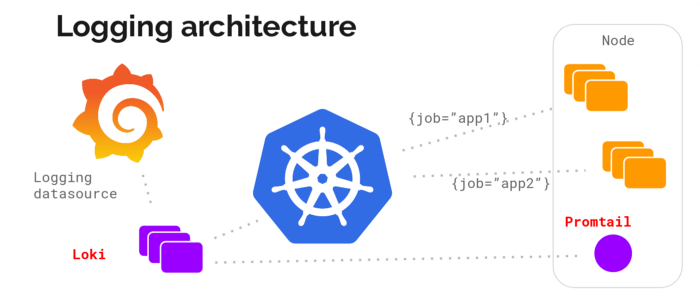
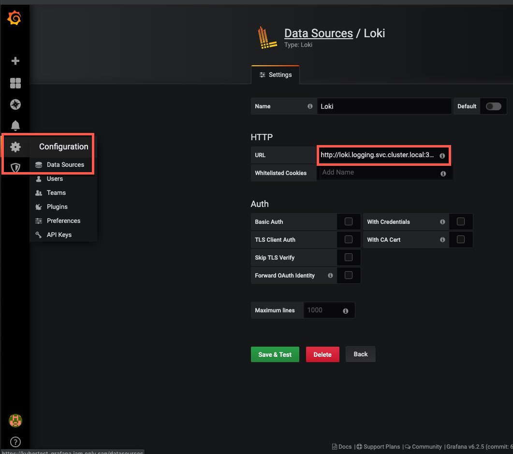
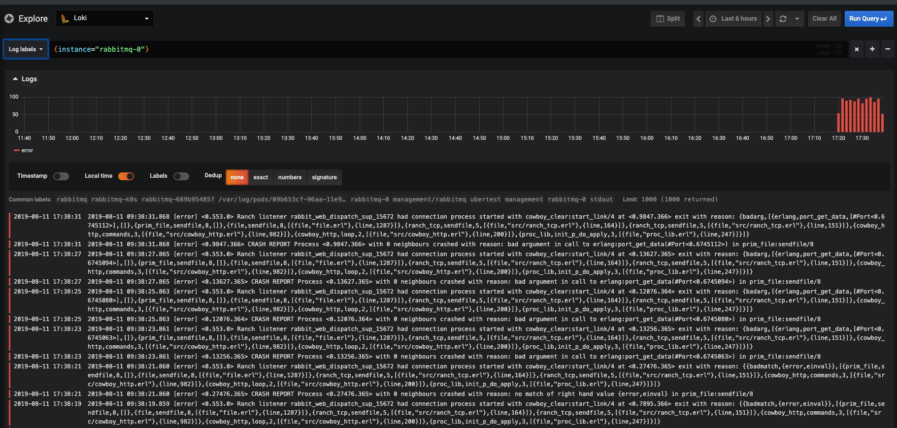

# Grafana Logging using Loki

**Reference**: `https://itnext.io/grafana-logging-using-loki-45665916aec9`

Loki is a Prometheus-inspired logging service for cloud native infrastructure.

## What is Loki?


Open sourced by Grafana Labs during KubeCon Seattle 2018, Loki is a logging backend optimized for users running Prometheus and Kubernetes with great logs search and visualization in Grafana 6.0.


Loki was built for efficiency alongside the following goals:

* Logs should be cheap. Nobody should be asked to log less.
* Easy to operate and scale.
* Metrics, logs (and traces later) need to work together.


## Loki vs other logging solutions

As said, Loki is designed for efficiency to work well in the Kubernetes context in combination with Prometheus metrics.

The idea is to switch easily between metrics and logs based on Kubernetes labels you already use with Prometheus.

**Unlike most logging solutions, Loki does not parse incoming logs or do full-text indexing.**

Instead, it indexes and groups log streams using the same labels you’re already using with Prometheus. This makes it significantly more efficient to scale and operate.


## Loki components

**Loki is a TSDB (Time-series database), it stores logs as split and gzipped chunks of data.**


**The logs are ingested via the API and an agent, called Promtail (Tailing logs in Prometheus format)**, will scrape Kubernetes logs and add label metadata before sending it to Loki.

This metadata addition is exactly the same as Prometheus, so you will end up with the exact same labels for your resources.




[https://grafana.com/blog/2018/12/12/loki-prometheus-inspired-open-source-logging-for-cloud-natives/](https://grafana.com/blog/2018/12/12/loki-prometheus-inspired-open-source-logging-for-cloud-natives/)


## How to deploy Loki on your Kubernetes cluster


### Deploy Loki on your cluster


The easiest way to deploy Loki on your Kubernetes cluster is by using the Helm chart available in the official repository.

[You can follow the setup guide from the official repo.](4Install_Logging_loki_SAP_CC.md)

This will deploy Loki and Promtail.

## Add Loki datasource in Grafana (built-in support for Loki is in 6.0 and newer releases)

1. Log into your Grafana.
2. Go to `Configuration` > `Data Sources` via the cog icon in the left sidebar.
3. Click the big `+ Add data source` button.
4. Choose Loki from the list.
5. The http URL field should be the address of your Loki server: `http://loki:3100`



## See your logs in the “Explore” view


1. Select the “Explore” view on the sidebar.
2. Select the Loki data source.
3. Choose a log stream using the “Log labels” button.



## Promtail configuration

*Promtail is the metadata appender and log sending agent*

The Promtail configuration you get from the Helm chart is already configured to get all the logs from your Kubernetes cluster and append labels on it as Prometheus does for metrics.


However, you can tune the configuration for your needs.


Here are two examples:

**1.Get logs only for specific namespace**


You can use the `action: keep`for your namespace and add a new `relabel_configs` for each `scrape_config` in [promtail/configmap.yaml](https://github.com/grafana/loki/blob/master/production/helm/promtail/templates/configmap.yaml)

For example, if you want to get logs only for the `kube-system` namespace:

```
scrape_configs:
- job_name: kubernetes-pods         
  kubernetes_sd_configs:         
  - role: pod         
  relabel_configs:         
  - source_labels: [__meta_kubernetes_namespace]           
    action: keep           
    regex: kube-system
# [...]
         
- job_name: kubernetes-pods-app         
  kubernetes_sd_configs:         
  - role: pod         
  relabel_configs:         
  - source_labels: [__meta_kubernetes_namespace]           
    action: keep           
    regex: kube-system
```

**2.Exclude logs from specific namespace**

For example, if you want to exclude logs from `kube-system` namespace:

You can use the `action: drop` for your namespace and add a new `relabel_configs ` for each `scrape_config` in [promtail/configmap.yaml](https://github.com/grafana/loki/blob/master/production/helm/promtail/templates/configmap.yaml)

```
scrape_configs:
- job_name: kubernetes-pods         
  kubernetes_sd_configs:         
  - role: pod         
  relabel_configs:         
  - source_labels: [__meta_kubernetes_namespace]           
    action: drop           
    regex: kube-system
# [...]
       
- job_name: kubernetes-pods-app         
  kubernetes_sd_configs:         
  - role: pod         
  relabel_configs:         
  - source_labels: [__meta_kubernetes_namespace]           
    action: drop           
    regex: kube-system
```


For more info on the configuration, you can refer to the [official Prometheus configuration documentation](https://prometheus.io/docs/prometheus/latest/configuration/configuration/).


## Promtail as a sidecar

**By default, Promtail is configured to automatically scrape logs from containers and send them to Loki. Those logs come from stdout.**


But sometimes, **you may like to be able to send logs from an external file to Loki.**

In this case, you can set up **Promtail as a sidecar,** i.e. a **second container in your pod, share the log file with it through a shared volume, and scrape the data to send it to Loki**

Assuming you have an application `simple-logger`. The application logs into `/home/slog/creator.log`

Your kubernetes deployment will look like this :

#### 1.Add Promtail as a sidecar

```
apiVersion: apps/v1  
kind: Deployment  
metadata:
  name: my-app
spec:
  template:
    metadata:
      name: my-app
spec:
  containers:        
  - name: simple-logger         
    image: giantswarm/simple-logger:latest
    
apiVersion: apps/v1
kind: Deployment  
metadata:
  name: my-app
spec:
  template:
    metadata:
      name: my-app
spec:
  containers:
  - name: simple-logger          
  image: giantswarm/simple-logger:latest        
  - name: promtail          
  image: grafana/promtail:master          
  args:
    - "-config.file=/etc/promtail/promtail.yaml"            
    - "-client.url=http://loki:3100/api/prom/push"
```

#### 2. Use a shared data volume containing the log file

```
apiVersion: apps/v1  
kind: Deployment  
metadata:
  name: my-app
spec:
  template:
    metadata:
      name: my-app
spec:
  containers:        
  - name: simple-logger         
    image: giantswarm/simple-logger:latest
    volumeMounts:
      - name: shared-data
        mountPath: /home/slog
  - name: promtail          
    image: grafana/promtail:master          
    args:
      - "-config.file=/etc/promtail/promtail.yaml"            
      - "-client.url=http://loki:3100/api/prom/push"
volumeMounts:
      - name: shared-data
        mountPath: /home/slog
volumes:
- name: shared-data
  emptyDir: {}
```

#### 3. Configure Promtail to read your log file


```
scrape_configs:
  - job_name: system          
    entry_parser: raw          
    static_configs:
      - targets:
          - localhost
        labels:
          job: my-app               
          my-label: awesome               
          __path__: /home/slog/creator.log
```


[Simple logger to demo the use of Promtail as a sidecar to send logs to Loki](https://github.com/giantswarm/simple-logger)

