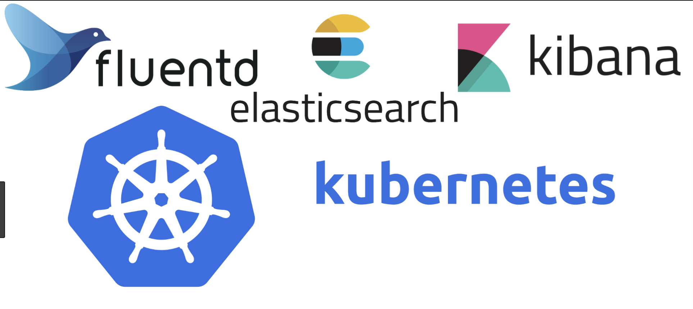

# kubernetes 日志收集

1. [kubernetes 日志架构](1log_architecture.md)
2. [在 K8S 上搭建 EFK 日志收集系统](2EFK_log.md)
3. [使用Elasticsearch Operator快速部署Elasticsearch集群](3ECK_operator.md)

1. [Grafana 日志聚合工具 Loki](https://github.com/Chao-Xi/JacobTechBlog/blob/master/k8s_dev/prometheus/12Adv_Grafana_Loki.md)
2. [Grafana Logging using Loki](5Grafana_using_loki.md)
3. [Install Grafana-Loki in Ubertest Cluster](4Install_Logging_loki_SAP_CC.md)

