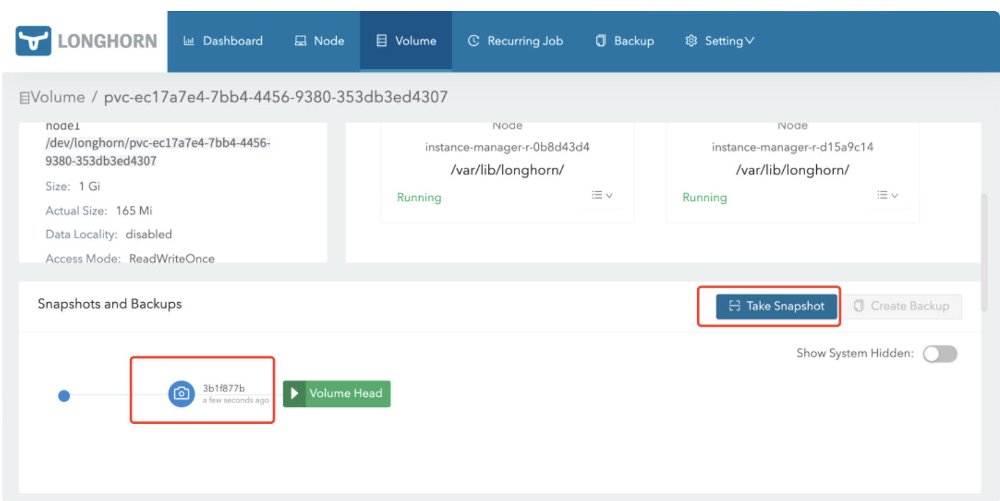
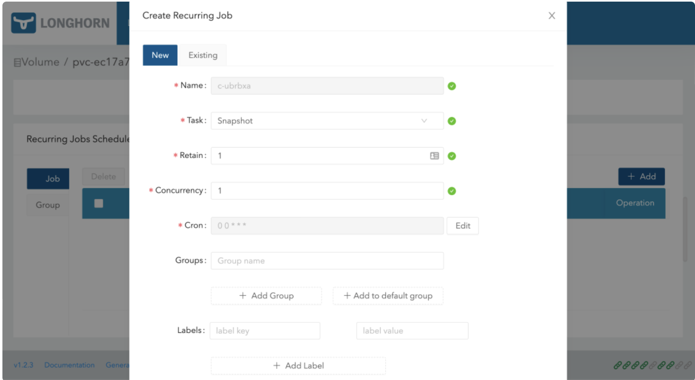
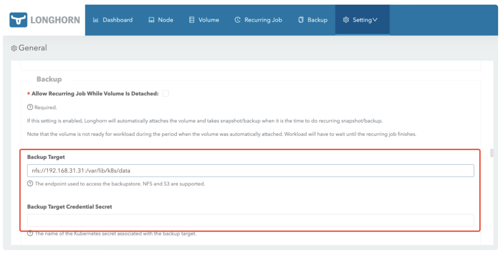
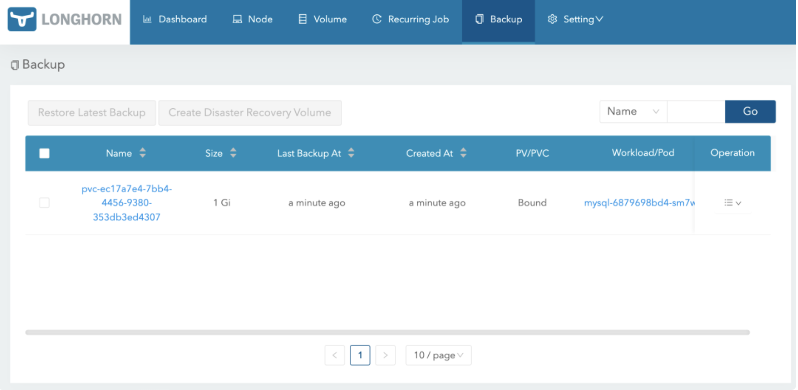
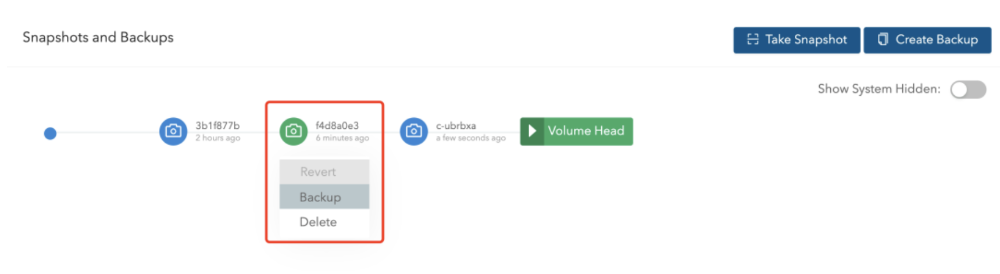
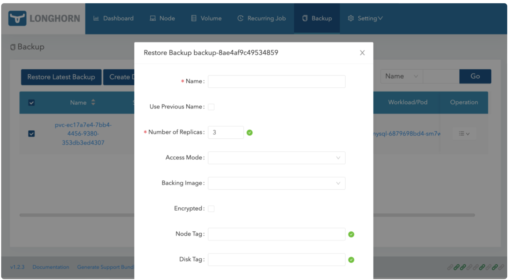
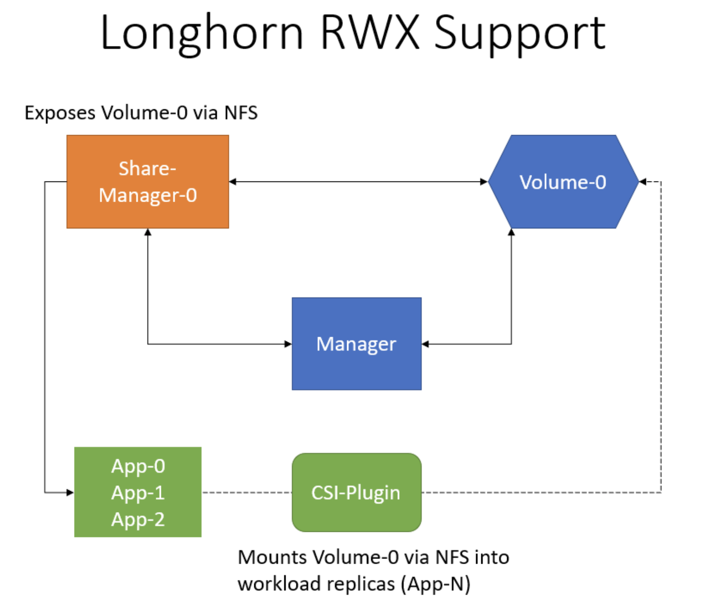
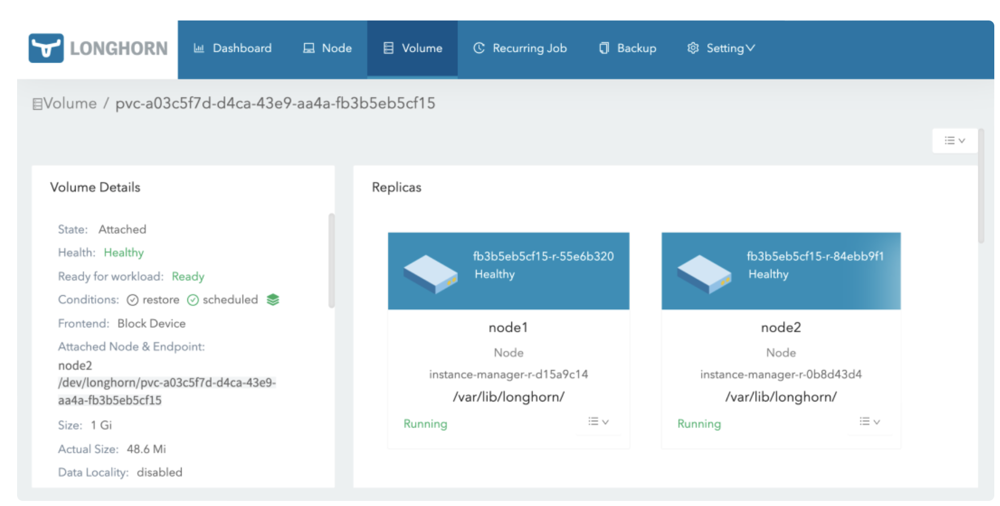

# **2 Longhorn 高级使用之备份恢复与 ReadWriteMany**

## **1 备份恢复**

Longhorn 提供了备份恢复功能，要使用这个功能我们需要给卷创建一个 snapshot 快照，快照是 Kubernetes Volume 在任何指定时间点的状态。

在 Longhorn UI 的 Volume 页面中点击要创建快照的卷，进入卷的详细信息页面，**点击下方的 Take Snapshot 按钮即可创建快照了，创建快照后，将在卷头(Volume Head)之前的快照列表中可以看到它，比如这里我们会前面测试使用的 mysql 卷创建一个快照**



同样在节点的数据目录下面也可以看到创建的快照数据：

```
➜ tree /var/lib/longhorn/replicas/pvc-ec17a7e4-7bb4-4456-9380-353db3ed4307-fbf72396/
/var/lib/longhorn/replicas/pvc-ec17a7e4-7bb4-4456-9380-353db3ed4307-fbf72396/
├── revision.counter
├── volume-head-002.img
├── volume-head-002.img.meta
├── volume.meta
├── volume-snap-3b1f877b-24ba-44ec-808e-ab8d4b15f8dd.img
├── volume-snap-3b1f877b-24ba-44ec-808e-ab8d4b15f8dd.img.meta
├── volume-snap-5d403e8e-65e8-46d1-aa54-70aa3280dac4.img
└── volume-snap-5d403e8e-65e8-46d1-aa54-70aa3280dac4.img.meta

0 directories, 8 files
```

其中的 `volume-snap-xxx` 后面的数据和页面上的快照名称是一致的，比如页面中我们刚刚创建的快照名称为 `3b1f877b-24ba-44ec-808e-ab8d4b15f8dd`，其中的 `img` 文件是镜像文件，而 `img.meta` 是保持当前快照的元信息：


```
➜ cat volume-snap-3b1f877b-24ba-44ec-808e-ab8d4b15f8dd.img.meta
{"Name":"volume-head-001.img","Parent":"volume-snap-5d403e8e-65e8-46d1-aa54-70aa3280dac4.img","Removed":false,"UserCreated":true,"Created":"2022-02-22T07:36:48Z","Labels":null}
```

元信息里面包含父级的文件镜像，这其实表面快照是增量的快照。

此外除了手动创建快照之外，**从 Longhorn UI 上还可以进行周期性快照和备份，同样在卷的详细页面可以进行配置，在 Recurring Jobs Schedule 区域点击 Add 按钮即可创建一个定时的快照。**



创建任务的时候可以选择任务类型是备份(backup)或快照(snapshot)，任务的时间以 CRON 表达式的形式进行配置，还可以配置要保留的备份或快照数量以及标签。

为了避免当卷长时间没有新数据时，recurring jobs 可能会用相同的备份和空快照覆盖旧的备份/快照的问题，Longhorn 执行以下操作：

* `Recurring backup job` 仅在自上次备份以来卷有新数据时才进行新备份
* `Recurring snapshot job` 仅在卷头(volume head)中有新数据时才拍摄新快照

此外我们还可以通过使用 Kubernetes 的 StorageClass 来配置定时快照，**可以通过 `StorageClass `的 `recurringJobs` 参数配置定时备份和快照，`recurringJobs` 字段应遵循以下 JSON 格式**：

```
apiVersion: storage.k8s.io/v1
kind: StorageClass
metadata:
  name: longhorn
provisioner: driver.longhorn.io
parameters:
  numberOfReplicas: "3"
  staleReplicaTimeout: "30"
  fromBackup: ""
  recurringJobs: '[
    {
      "name":"snap",
      "task":"snapshot",
      "cron":"*/1 * * * *",
      "retain":1
    },
    {
      "name":"backup",
      "task":"backup",
      "cron":"*/2 * * * *",
      "retain":1
    }
  ]'
```

应为每个 recurring job 指定以下参数：

* `name`：任务的名称，不要在一个 `recurringJobs` 中使用重复的名称，并且 name 的长度不能超过 8 个字符
* `task`：任务的类型，它仅支持 `snapshot` 或 `backup`
* `cron`：Cron 表达式，指定任务的执行时间
* `retain`：Longhorn 将为一项任务保留多少快照/备份，不少于 1
* 使用这个 `StorageClass` 创建的任何卷都将自动配置上这些 `recurring jobs`。


要备份卷就需要在` Longhorn` 中配置一个备份目标，可以是一个 `NFS` 服务或者 `S3` 兼容的对象存储服务，用于存储 `Longhorn` 卷的备份数据，备份目标可以在 `Settings/General/BackupTarget` 中配置，我们这里使用 `Helm Chart `安装的，最好的方式是去定制 `values` 文件中的 `defaultSettings.backupTarget`，当然也可以直接去通过 Longhorn UI 进行配置，比如这里我们先配置备份目标为 `nfs` 服务，Backup Target 值设置为 `nfs://192.168.31.31:/var/lib/k8s/data`（要确保目录存在），`Backup Target Credential Secret` 留空即可，然后拉到最下面点击 Save：


备份目标配置后，就可以开始备份了，同样导航到 Longhorn UI 的 Volume 页面，选择要备份的卷，点击 Create Backup，然后添加合适的标签点击 OK 即可。



备份完成后导航到 Backup 页面就可以看到对应的备份数据了：


这些备份的数据也会对应一个 `backupvolumes crd` 对象：



```
➜ kubectl get backupvolumes -n longhorn-system
NAME                                       CREATEDAT              LASTBACKUPNAME            LASTBACKUPAT           LASTSYNCEDAT
pvc-ec17a7e4-7bb4-4456-9380-353db3ed4307   2022-02-22T09:23:24Z   backup-8ae4af9c49534859   2022-02-22T09:23:24Z   2022-02-22T09:41:09Z
```
然后我们去到 NFS 服务器上查看会在挂载目录下面创建一个 backupstore 目录，下面会保留我们备份的数据：

```
➜ tree /var/lib/k8s/data/backupstore
/var/lib/k8s/data/backupstore
└── volumes
    └── 5e
        └── b6
            └── pvc-ec17a7e4-7bb4-4456-9380-353db3ed4307
                ├── backups
                │   └── backup_backup-8ae4af9c49534859.cfg
                ├── blocks
                │   ├── 02
                │   │   └── 2e
                │   │       └── 022eefc6526cd3d8fc3a9f9a4ba253a910c61a1c430a807403f60a2f233fa210.blk
                ......
                │   └── f7
                │       └── e3
                │           └── f7e3ae1f83e10da4ece5142abac1fafc0d0917370f7418874c151a66a18bfa15.blk
                └── volume.cfg

51 directories, 25 files
```

同样这个时候我们也可以去快照列表选择要备份的快照：



有了备份数据后要想要恢复数据，只需要选择对应的备份数据，点击 Restore Latest Backup 恢复数据即可：



## **ReadWriteMany**

Longhorn 可以通过 NFSv4 服务器暴露 Longhorn 卷，原生支持 RWX 工作负载，使用的 RWX 卷 会在 longhorn-system 命名空间下面创建一个 `share-manager-<volume-name>` 的 Pod，该 Pod 负责通过在 Pod 内运行的 NFSv4 服务器暴露 Longhorn 卷。



要能够使用 RWX 卷，每个客户端节点都需要安装 NFSv4 客户端，对于 Ubuntu，可以通过以下方式安装 NFSv4 客户端：

```
➜ apt install nfs-common
```

对于基于 RPM 的发行版，可以通过以下方式安装 NFSv4 客户端：

```
➜ yum install nfs-utils
```

现在我们来创建一个如下所示的 PVC 对象，访问模式配置为 ReadWriteMany：

```

# html-vol.yaml
kind: PersistentVolumeClaim
apiVersion: v1
metadata:
  name: html
spec:
  accessModes:
    - ReadWriteMany
  storageClassName: longhorn
  resources:
    requests:
      storage: 1Gi
```

直接创建上面的资源对象就会动态创建一个 PV 与之绑定：

```
➜ kubectl get pvc html
NAME   STATUS   VOLUME                                     CAPACITY   ACCESS MODES   STORAGECLASS   AGE
html   Bound    pvc-a03c5f7d-d4ca-43e9-aa4a-fb3b5eb5cf15   1Gi        RWX            longhorn       15s
➜ kubectl get pv pvc-a03c5f7d-d4ca-43e9-aa4a-fb3b5eb5cf15
NAME                                       CAPACITY   ACCESS MODES   RECLAIM POLICY   STATUS   CLAIM          STORAGECLASS   REASON   AGE
pvc-a03c5f7d-d4ca-43e9-aa4a-fb3b5eb5cf15   1Gi        RWX            Delete           Bound    default/html   longhorn                63s
```

然后创建一个如下所示的名为 writer 的 Deployment 资源对象，使用上面创建的 PVC 来持久化数据：

```
# html-writer.yaml
apiVersion: apps/v1
kind: Deployment
metadata:
  name: writer
spec:
  selector:
    matchLabels:
      app: writer
  template:
    metadata:
      labels:
        app: writer
    spec:
      containers:
      - name: content
        image: alpine:latest
        volumeMounts:
        - name: html
          mountPath: /html
        command: ["/bin/sh", "-c"]
        args:
        - while true; do
          date >> /html/index.html;
          sleep 5;
          done
      volumes:
      - name: html
        persistentVolumeClaim:
          claimName: html
```

部署后上面创建的 Longhorn 的卷就变成 Attached 状态了：



并且这个时候会自动启动一个 share-manager 的 Pod，通过该 Pod 内运行的 NFSv4 服务器来暴露 Longhorn 卷：

```
 kubectl get pods -n longhorn-system -l longhorn.io/component=share-manager
NAME                                                     READY   STATUS    RESTARTS   AGE
share-manager-pvc-a03c5f7d-d4ca-43e9-aa4a-fb3b5eb5cf15   1/1     Running   0          2m16s
➜ kubectl logs -f share-manager-pvc-a03c5f7d-d4ca-43e9-aa4a-fb3b5eb5cf15 -n longhorn-system
time="2022-02-22T10:07:42Z" level=info msg="starting RLIMIT_NOFILE rlimit.Cur 1048576, rlimit.Max 1048576"
time="2022-02-22T10:07:42Z" level=info msg="ending RLIMIT_NOFILE rlimit.Cur 1048576, rlimit.Max 1048576"
time="2022-02-22T10:07:42Z" level=debug msg="volume pvc-a03c5f7d-d4ca-43e9-aa4a-fb3b5eb5cf15 device /dev/longhorn/pvc-a03c5f7d-d4ca-43e9-aa4a-fb3b5eb5cf15 contains filesystem of format " encrypted=false volume=pvc-a03c5f7d-d4ca-43e9-aa4a-fb3b5eb5cf15
I0222 10:07:42.432630       1 mount_linux.go:425] Disk "/dev/longhorn/pvc-a03c5f7d-d4ca-43e9-aa4a-fb3b5eb5cf15" appears to be unformatted, attempting to format as type: "ext4" with options: [-F -m0 /dev/longhorn/pvc-a03c5f7d-d4ca-43e9-aa4a-fb3b5eb5cf15]
I0222 10:07:42.981928       1 mount_linux.go:435] Disk successfully formatted (mkfs): ext4 - /dev/longhorn/pvc-a03c5f7d-d4ca-43e9-aa4a-fb3b5eb5cf15 /export/pvc-a03c5f7d-d4ca-43e9-aa4a-fb3b5eb5cf15
time="2022-02-22T10:07:43Z" level=info msg="starting nfs server, volume is ready for export" encrypted=false volume=pvc-a03c5f7d-d4ca-43e9-aa4a-fb3b5eb5cf15
time="2022-02-22T10:07:43Z" level=info msg="Running NFS server!"
time="2022-02-22T10:07:43Z" level=info msg="starting health check for volume" encrypted=false volume=pvc-a03c5f7d-d4ca-43e9-aa4a-fb3b5eb5cf15
```

然后我们再创建一个如下所示的 Deployment：

```
# html-reader.yaml
apiVersion: apps/v1
kind: Deployment
metadata:
  name: reader
spec:
  replicas: 3
  selector:
    matchLabels:
      app: reader
  template:
    metadata:
      labels:
        app: reader
    spec:
      containers:
      - name: nginx
        image: nginx:stable-alpine
        ports:
        - containerPort: 80
        volumeMounts:
        - name: html
          mountPath: /usr/share/nginx/html
      volumes:
      - name: html
        persistentVolumeClaim:
          claimName: html
---
apiVersion: v1
kind: Service
metadata:
  name: reader
spec:
  selector:
    app: reader
  type: NodePort
  ports:
  - protocol: TCP
    port: 80
    targetPort: 80
```


上面的 reader Pods 可以引用 writer Pod 相同的 PVC，是因为上面我们创建的 PV 和 PVC 是 ReadWriteMany 访问模式，直接创建上面的资源对象，我们可以通过 NodePort 来访问应用：

```

➜ kubectl get pods -l app=reader
NAME                     READY   STATUS    RESTARTS   AGE
reader-b54c4749d-4bjxf   1/1     Running   0          11s
reader-b54c4749d-5thwz   1/1     Running   0          4m11s
reader-b54c4749d-drcfk   1/1     Running   0          5m35s
➜ kubectl get svc reader
NAME     TYPE       CLUSTER-IP     EXTERNAL-IP   PORT(S)        AGE
reader   NodePort   10.101.54.19   <none>        80:31800/TCP   84s
➜ curl http://192.168.31.31:31800
......
Tue Feb 22 10:18:39 UTC 2022
Tue Feb 22 10:18:44 UTC 2022
Tue Feb 22 10:18:49 UTC 2022
Tue Feb 22 10:18:54 UTC 2022
Tue Feb 22 10:18:59 UTC 2022
......
```

现在我们尝试从一个 reader Pod 中去产生一些数据，然后再去访问应用验证数据是否正确：


```
➜ kubectl exec reader-b54c4749d-4bjxf-- /bin/sh -c "echo longhorn rwx access mode >> /usr/share/nginx/html/index.html"
➜ curl http://192.168.31.31:31800
......
Tue Feb 22 10:23:49 UTC 2022
longhorn rwx access mode
```

这里我们就验证了在 Longhorn 中使用 ReadWriteMany 访问模式的 Volume 卷