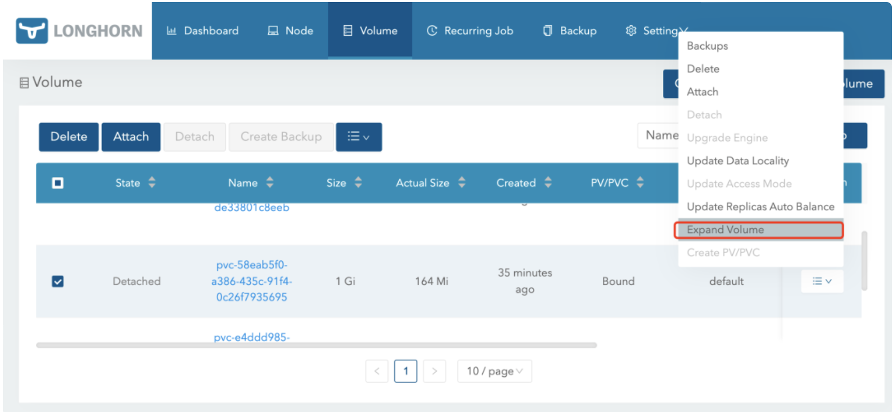

# **3 通过 Kubernetes CSI 实现 Longhorn 卷快照备份、恢复、克隆与扩容功能**

此外我们还可以通过 Kubernetes 来实现对卷的管理，比如可以在集群上通过 CSI 来实现快照、备份恢复、克隆、扩容等功能支持。

## **CSI 卷快照**

Kubernetes 从 1.12 版本开始引入了存储卷快照功能，在 1.17 版本进入 Beta 版本，和 PV、PVC 两个资源对象类似，Kubernetes 提供了 VolumeSnapshotContent、VolumeSnapshot、VolumeSnapshotClass 三个资源对象用于卷快照管理。


### **概念**

VolumeSnapshotContent 是基于某个 PV 创建的快照，类似于 PV 的资源概念；VolumeSnapshot 是用户对卷快照的请求，类似于持久化声明 PVC 的概念；VolumeSnapshotClass 对象可以来设置快照的特性，屏蔽 VolumeSnapshotContent 的细节，为 VolumeSnapshot 绑定提供动态管理，就像 StorageClass 的“类”概念。

卷快照能力为 Kubernetes 用户提供了一种标准的方式来在指定时间点复制卷的内容，并且不需要创建全新的卷，比如数据库管理员可以在执行编辑或删除之类的修改之前对数据库执行备份。

但是在使用该功能时，需要注意以下几点：

* **VolumeSnapshot、VolumeSnapshotContent 和 VolumeSnapshotClass** 资源对象是 CRDs， 不属于核心 API。
* **VolumeSnapshot** 支持仅可用于 CSI 驱动。
* 作为 **VolumeSnapshot** 部署过程的一部分，Kubernetes 团队提供了一个部署于控制平面的快照控制器，并且提供了一个叫做 **csi-snapshotter** 的 Sidecar 容器，和 CSI 驱动程序一起部署，快照控制器会去监听 **VolumeSnapshot** 和 **VolumeSnapshotContent** 对象，并且负责创建和删除 **VolumeSnapshotContent** 对象。**csi-snapshotter** 监听 **VolumeSnapshotContent** 对象，并且触发针对 **CSI** 端点的 **CreateSnapshot** 和 **DeleteSnapshot** 的操作，完成快照的创建或删除。
* CSI 驱动可能实现，也可能没有实现卷快照功能，CSI 驱动可能会使用 **csi-snapshotter** 来提供对卷快照的支持，详见 CSI 驱动程序文档([https://kubernetes-csi.github.io/docs/external-snapshotter.html](https://kubernetes-csi.github.io/docs/external-snapshotter.html))。


**VolumeSnapshotContents** 和 **VolumeSnapshots** 的生命周期包括资源供应、资源绑定、对使用 PVC 的保护机制和资源删除等各个阶段，这两个对象会遵循这些生命周期。

**资源供应**：与 PV 的资源供应类似，VolumeSnapshotContent 也可以以静态或动态两种方式供应资源。

* 静态供应：集群管理员会预先创建好一组 VolumeSnapshotContent 资源，类似于手动创建 PV
* 动态供应：基于 VolumeSnapshotClass 资源，当用户创建 VolumeSnapshot 申请时自动创建 VolumeSnapshotContent，类似于 StorageClass 动态创建 PV

**资源绑定**：快照控制器负责将 VolumeSnapshot 与一个合适的 VolumeSnapshotContent 进行绑定，包括静态和动态供应两种情况，VolumeSnapshot 和 VolumeSnapshotContent 之间也是一对一进行绑定的，不会存在一对多的情况。


**对使用中的PVC的保护机制**：当存储快照 VolumeSnapshot 正在被创建且还未完成时，相关的 PVC 将会被标记为正被使用中，如果用户对 PVC 进行删除操作，系统不会立即删除 PVC，以避免快照还未做完造成数据丢失，删除操作会延迟到 VolumeSnapshot 创建完成（readyToUse 状态）或被终止（aborted 状态）的情况下完成。

**资源删除**：对 **VolumeSnapshot** 发起删除操作时，对与其绑定的后端 **VolumeSnapshotContent** 的删除操作将基于删除策略 **DeletionPolicy** 的设置来决定，可以配置的删除策略有：

* **Delete**：自动删除 **VolumeSnapshotContent** 资源对象和快照的内容。
* **Retain**：**VolumeSnapshotContent** 资源对象和快照的内容都将保留，需要手动清理。


我们这里的 Longhorn 系统在部署完成后创建了3个 csi-snapshotter 的 Pod：

```
➜ kubectl get pods -n longhorn-system
NAME                                                     READY   STATUS      RESTARTS       AGE
csi-snapshotter-86f65d8bc-9t7dd                          1/1     Running     5 (126m ago)   2d17h
csi-snapshotter-86f65d8bc-d6xbj                          1/1     Running     5 (126m ago)   2d17h
csi-snapshotter-86f65d8bc-dncwv                          1/1     Running     5 (126m ago)   2d17h
......
```

这其实是启动的3个副本，同一时间只有一个 Pod 提供服务，通过 `leader-election `来实现的选主高可用，比如当前这里提供服务的是 `csi-snapshotter-86f65d8bc-dncwv`，我们可以查看对应的日志信息：

```
➜ kubectl logs -f csi-snapshotter-86f65d8bc-dncwv -n longhorn-system
......
E0223 04:36:33.570567       1 reflector.go:127] github.com/kubernetes-csi/external-snapshotter/client/v3/informers/externalversions/factory.go:117: Failed to watch *v1beta1.VolumeSnapshotClass: failed to list *v1beta1.VolumeSnapshotClass: the server could not find the requested resource (get volumesnapshotclasses.snapshot.storage.k8s.io)
E0223 04:37:03.773447       1 reflector.go:127] github.com/kubernetes-csi/external-snapshotter/client/v3/informers/externalversions/factory.go:117: Failed to watch *v1beta1.VolumeSnapshotContent: failed to list *v1beta1.VolumeSnapshotContent: the server could not find the requested resource (get volumesnapshotcontents.snapshot.storage.k8s.io)
```

可以看到提示没有 `VolumeSnapshotClass` 和 `VolumeSnapshotContent` 资源，这是因为这两个资源都是 `CRDs`，并不是 `Kubernetes` 内置的资源对象，而我们在安装 `Longhorn` 的时候也没有安装这两个 `CRDs`，所以找不到，要通过 `CSI` 来实现卷快照功能自然就需要先安装 CRDs，我们可以从 [https://github.com/kubernetes-csi/external-snapshotter](https://github.com/kubernetes-csi/external-snapshotter) 项目中来获取：

```
➜ git clone https://github.com/kubernetes-csi/external-snapshotter
➜ cd external-snapshotter && git checkout v5.0.1
➜ kubectl kustomize client/config/crd | kubectl create -f -
```

上面的命令会安装上面提到的3个 Snapshot CRDs:

```
➜ kubectl get crd |grep snapshot
volumesnapshotclasses.snapshot.storage.k8s.io    2022-02-23T05:31:34Z
volumesnapshotcontents.snapshot.storage.k8s.io   2022-02-23T05:31:34Z
volumesnapshots.snapshot.storage.k8s.io          2022-02-23T05:31:34Z
```

安装完成后再去查看上面的 `csi-snapshotter` 相关的 Pod 日志就正常了。CRDs 安装完成后还不够，我们还需要一个快照控制器来监听 `VolumeSnapshot` 和 `VolumeSnapshotContent` 对象，同样 external-snapshotter 项目中也提供了一个 `Common Snapshot Controller`，执行下面的命令一键安装：

```
# 修改 deploy/kubernetes/snapshot-controller/setup-snapshot-controller.yaml 镜像地址为 cnych/csi-snapshot-controller:v5.0.0，默认为 gcr 镜像
➜ kubectl -n kube-system kustomize deploy/kubernetes/snapshot-controller | kubectl create -f -
```

这里我们将快照控制器安装到了 kube-system 命名空间下，启动两个副本，同样同一时间只有一个 Pod 提供服务：

```
➜ kubectl get pods -n kube-system -l app=snapshot-controller
NAME                                   READY   STATUS    RESTARTS   AGE
snapshot-controller-677b65dc6c-288w9   1/1     Running   0          3m22s
snapshot-controller-677b65dc6c-zgdcm   1/1     Running   0          39s
```

到这里就将使用 CSI 来配置快照的环境准备好了。

### **测试**

下面我们仍然以前面的 `mysql-pvc` 这个卷为例来说明下如何使用卷快照功能：

```
➜ kubectl get pvc mysql-pvc
NAME        STATUS   VOLUME                                     CAPACITY   ACCESS MODES   STORAGECLASS   AGE
mysql-pvc   Bound    pvc-ec17a7e4-7bb4-4456-9380-353db3ed4307   1Gi        RWO            longhorn       2d18h
```

要创建 `mysql-pvc` 的快照申请，首先需要创建一个 `VolumeSnapshot` 对象：

```
# snapshot-mysql.yaml
apiVersion: snapshot.storage.k8s.io/v1
kind: VolumeSnapshot
metadata:
  name: mysql-snapshot-demo
spec:
  volumeSnapshotClassName: longhorn
  source:
    persistentVolumeClaimName: mysql-pvc
    # volumeSnapshotContentName: test-content
```

其中就两个主要配置参数：

* `volumeSnapshotClassName`：指定 VolumeSnapshotClass 的名称，这样就可以动态创建一个对应的 VolumeSnapshotContent 与之绑定，如果没有指定该参数，则属于静态方式，需要手动创建 VolumeSnapshotContent。
* `persistentVolumeClaimName`：指定数据来源的 PVC 名称。
* `volumeSnapshotContentName`：如果是申请静态存储快照，则需要通过该参数来指定一个 VolumeSnapshotContent。

上面我们指定了一个存储快照类 longhorn，当然需要创建这个对象：

```
# snapshotclass.yaml
apiVersion: snapshot.storage.k8s.io/v1
kind: VolumeSnapshotClass
metadata:
  name: longhorn
  # annotations:  # 如果要指定成默认的快照类
  #   snapshot.storage.kubernetes.io/is-default-class: "true"
driver: driver.longhorn.io
deletionPolicy: Delete
```

每个 VolumeSnapshotClass 都包含 driver、deletionPolicy 和 parameters 字段，在需要动态配置属于该类的 VolumeSnapshot 时使用。

* driver：表示 CSI 存储插件驱动的名称，这里我们使用的是 Longhorn 插件，名为 `driver.longhorn.io`
* deletionPolicy：删除策略，可以设置为 Delete 或 Retain，如果删除策略是 Delete，那么底层的存储快照会和 VolumeSnapshotContent 对象一起删除，如果删除策略是 Retain，那么底层快照和 VolumeSnapshotContent 对象都会被保留。
* parameters：存储插件需要配置的参数，由 CSI 驱动提供具体的配置参数。

如果想将当前快照类设置成默认的则需要添加 `snapshot.storage.kubernetes.io/is-default-class: "true"` 这样的 `annotations`。

现在我们直接创建上面的两个资源对象：

```
➜ kubectl apply -f snapshotclass.yaml
volumesnapshotclass.snapshot.storage.k8s.io/longhorn created

➜ kubectl apply -f snapshot-mysql.yaml
volumesnapshot.snapshot.storage.k8s.io/mysql-snapshot-demo created

➜ kubectl get volumesnapshotclass
NAME       DRIVER               DELETIONPOLICY   AGE
longhorn   driver.longhorn.io   Delete           43s

➜ kubectl get volumesnapshot
NAME                  READYTOUSE   SOURCEPVC   SOURCESNAPSHOTCONTENT   RESTORESIZE   SNAPSHOTCLASS   SNAPSHOTCONTENT                                    CREATIONTIME   AGE
mysql-snapshot-demo   true         mysql-pvc                           1Gi           longhorn        snapcontent-1119649a-d4f2-447f-a21a-e527f202e43e   43s            43s
```

这个时候会动态为我们创建一个 VolumeSnapshotContent 对象：

```

➜ kubectl get volumesnapshotcontent
NAME                                               READYTOUSE   RESTORESIZE   DELETIONPOLICY   DRIVER               VOLUMESNAPSHOTCLASS   VOLUMESNAPSHOT        VOLUMESNAPSHOTNAMESPACE   AGE
snapcontent-1119649a-d4f2-447f-a21a-e527f202e43e   true         1073741824    Delete           driver.longhorn.io   longhorn              mysql-snapshot-demo   default                   97s
```

自动创建的 VolumeSnapshotContent 对象内容如下所示：

```
apiVersion: snapshot.storage.k8s.io/v1
kind: VolumeSnapshotContent
metadata:
  name: snapcontent-1119649a-d4f2-447f-a21a-e527f202e43e
spec:
  deletionPolicy: Delete
  driver: driver.longhorn.io
  source:
    volumeHandle: pvc-ec17a7e4-7bb4-4456-9380-353db3ed4307
  volumeSnapshotClassName: longhorn
  volumeSnapshotRef:
    apiVersion: snapshot.storage.k8s.io/v1
    kind: VolumeSnapshot
    name: mysql-snapshot-demo
    namespace: default
    resourceVersion: "4967456"
    uid: 1119649a-d4f2-447f-a21a-e527f202e43e
status:
  creationTime: 1645597546000000000
  readyToUse: true
  restoreSize: 1073741824
  snapshotHandle: bs://pvc-ec17a7e4-7bb4-4456-9380-353db3ed4307/backup-f5f28fd624a148ed
```

其中的 `source.volumeHandle` 字段的值是在后端存储上创建并由 CSI 驱动在创建存储卷期间返回的 Volume 的唯一标识符，在动态供应模式下需要该字段，指定的是快照的来源 Volume 信息，`volumeSnapshotRef` 下面就是和关联的 `VolumeSnapshot `对象的相关信息。

当然这个时候我们在 `Longhorn UI` 界面上也可以看到上面我们创建的这个快照了，快照名称为 `snapshot-1119649a-d4f2-447f-a21a-e527f202e43e`，后面的 ID 与上面的 `VolumeSnapshotContent` 名称保持一致：


并且也会进行一次对应的 Backup 操作，备份的信息通过 snapshotHandle 进行指定的，格式为 `bs://backup-<volume>/backup-<name>`：


这样我们就完成了通过 CSI 实现卷的快照管理功能。

## **CSI 卷恢复**

Kubernetes 对基于快照创建存储卷在 1.17 版本更新到了 Beta 版本，要启用该特性，就需要在 kube-apiserver、`kube-controller-manager` 和 kubelet 的 Feature Gate 中启用 `--feature-gates=...,VolumeSnapshotDataSource`（我们这里是1.22版本默认已经启用了），然后就可以基于某个快照创建一个新的 PVC 存储卷了，比如现在我们来基于上面创建的 `mysql-snapshot-demo`这个对象来创建一个新的 PVC：

```
# restore-mysql.yaml
apiVersion: v1
kind: PersistentVolumeClaim
metadata:
  name: mysql-restore-pvc
spec:
  storageClassName: longhorn
  accessModes:
  - ReadWriteOnce
  resources:
    requests:
      storage: 1Gi
  dataSource:
    apiGroup: snapshot.storage.k8s.io
    kind: VolumeSnapshot
    name: mysql-snapshot-demo
```

上面的 PVC 对象和我们平时声明的方式基本一致，唯一不同的是通过一个 dataSource 字段配置了基于名为 mysql-snapshot-demo 的存储快照进行创建，创建上面的资源对象后同样会自动创建一个 PV 与之绑定：

```
➜ kubectl get pvc mysql-restore-pvc
NAME                STATUS   VOLUME                                     CAPACITY   ACCESS MODES   STORAGECLASS   AGE
mysql-restore-pvc   Bound    pvc-e4ddd985-31a8-4570-b393-dcedec3b0d95   1Gi        RWO            longhorn       17s
```


在 Longhorn UI 中去查看该卷，可以看到该卷的实际大小并不为0，这是因为我们是从快照中创建过来的，相当于从上面的快照中恢复的数据：


## **卷克隆**

除了基于快照创建新的 PVC 对象之外，CSI 类型的存储还支持存储的克隆功能，可以基于已经存在的 PVC 克隆一个新的 PVC，实现方式也是通过在 dataSource 字段中来设置源 PVC 来实现。


克隆一个 PVC 其实就是对已存在的存储卷创建一个副本，唯一的区别是，系统在为克隆 PVC 提供后端存储资源时，不是新建一个空的 PV，而是复制一个与原 PVC 绑定 PV 完全一样的 PV。

从 Kubernetes API 的角度看，克隆的实现只是在创建新的 PVC 时， 增加了指定一个现有 PVC 作为数据源的能力。源 PVC 必须是 bound 状态且可用的（不在使用中）。

用户在使用该功能时，需要注意以下事项：

* 克隆仅适用于 CSI 驱动
* 克隆仅适用于动态供应
* 克隆功能取决于具体的 CSI 驱动是否实现该功能
* 要求目标 PVC 和源 PVC 必须处于同一个命名空间
* 只支持在相同的 StorageClass 中（可以使用默认的）
* 两个存储卷的存储模式（VolumeMode）要一致

同样我们来对前面的 mysql-pvc 这个存储卷进行克隆操作，对应的 PVC 声明如下所示：

```
apiVersion: v1
kind: PersistentVolumeClaim
metadata:
  name: mysql-clone-pvc
spec:
  accessModes:
  - ReadWriteOnce
  storageClassName: longhorn
  resources:
    requests:
      storage: 1Gi  # 必须大于或等于源的值
  dataSource:
    kind: PersistentVolumeClaim
    name: mysql-pvc
```

该 PVC 和源 PVC 声明一样的配置，唯一不同的是通过 dataSource 指定了源 PVC 的名称，直接创建这个资源对象，结果是 mysql-clone-pvc 这个新的 PVC 与源 mysql-pvc 拥有相同的数据。

```
➜ kubectl get pvc mysql-clone-pvc
NAME              STATUS   VOLUME                                     CAPACITY   ACCESS MODES   STORAGECLASS   AGE
mysql-clone-pvc   Bound    pvc-58eab5f0-a386-435c-91f4-0c26f7935695   1Gi        RWO            longhorn       31s
```

在 Longhorn UI 页面中也可以看到对应的卷：


一旦新的 PVC 可用，被克隆的 PVC 就可以像其他 PVC 一样被使用了，也可以对其进行克隆、快照、删除等操作。

## **卷动态扩容**

我们知道对于存储来说扩容是一个非常重要的需求，对于 Kubernetes 中的卷动态扩容同样也是需要的基本功能，PV 要做扩容操作是需要底层存储支持该操作才能实现，Longhorn 底层是支持卷扩容操作的，但是要求扩展的卷必须处于 detached 状态才能操作，有两种方法可以扩容 Longhorn 卷：修改 PVC 和使用 Longhorn UI。

通过 Longhorn UI 操作比较简单，直接在页面中选择要扩容的卷，在操作中选择 Expand Volume 进行操作即可：



要通过 PVC 来进行扩容首先需要 `PVC` 由 `Longhorn StorageClass` 进行动态供应，并且在 StorageClass 中 `allowVolumeExpansion` 属性设置为 `true`，建议使用这种方法，因为 PVC 和 PV 会自动更新，并且在扩容后都会保持一致。比如上面使用的 `mysql-clone-pvc` 这个卷（处于 detached 状态）使用的 longhorn 这个 StorageClass 中就已经配置了 `allowVolumeExpansion: true`，然后直接修改 `mysql-pvc` 这个卷下面的 `spec.resources.requests.storage` 值即可：

```
➜ kubectl get pvc mysql-clone-pvc
NAME              STATUS   VOLUME                                     CAPACITY   ACCESS MODES   STORAGECLASS   AGE
mysql-clone-pvc   Bound    pvc-58eab5f0-a386-435c-91f4-0c26f7935695   1Gi        RWO            longhorn       40m
➜ kubectl patch pvc mysql-clone-pvc -p '{"spec":{"resources":{"requests":{"storage":"2Gi"}}}}}'
```

修改后可以查看该 PVC 的 events 信息：

```
➜ kubectl describe pvc mysql-clone-pvc
......
Events:
  Type     Reason                  Age                From                                                                                      Message
  ----     ------                  ----               ----                                                                                      -------
  ......
  Normal   Resizing                14s                external-resizer driver.longhorn.io                                                       External resizer is resizing volume pvc-58eab5f0-a386-435c-91f4-0c26f7935695
  Warning  ExternalExpanding       14s                volume_expand                                                                             Ignoring the PVC: didn't find a plugin capable of expanding the volume; waiting for an external controller to process this PVC.
  Normal   VolumeResizeSuccessful  2s                 external-resizer driver.longhorn.io          
```

可以看到通过 external-resizer 组件实现了 Resize 操作，查看 PVC 和 PV 的大小验证：

```
➜ kubectl get pvc mysql-clone-pvc
NAME              STATUS   VOLUME                                     CAPACITY   ACCESS MODES   STORAGECLASS   AGE
mysql-clone-pvc   Bound    pvc-58eab5f0-a386-435c-91f4-0c26f7935695   2Gi        RWO            longhorn       43m
➜ kubectl get pv pvc-58eab5f0-a386-435c-91f4-0c26f7935695
NAME                                       CAPACITY   ACCESS MODES   RECLAIM POLICY   STATUS   CLAIM                     STORAGECLASS   REASON   AGE
pvc-58eab5f0-a386-435c-91f4-0c26f7935695   2Gi        RWO            Delete           Bound    default/mysql-clone-pvc   longhorn                43m
```

可以看到 PVC 和 PV 中的容量都变成了 2Gi，证明扩容成功了，通过 Longhorn UI 也可以查看到卷扩容成功了：

