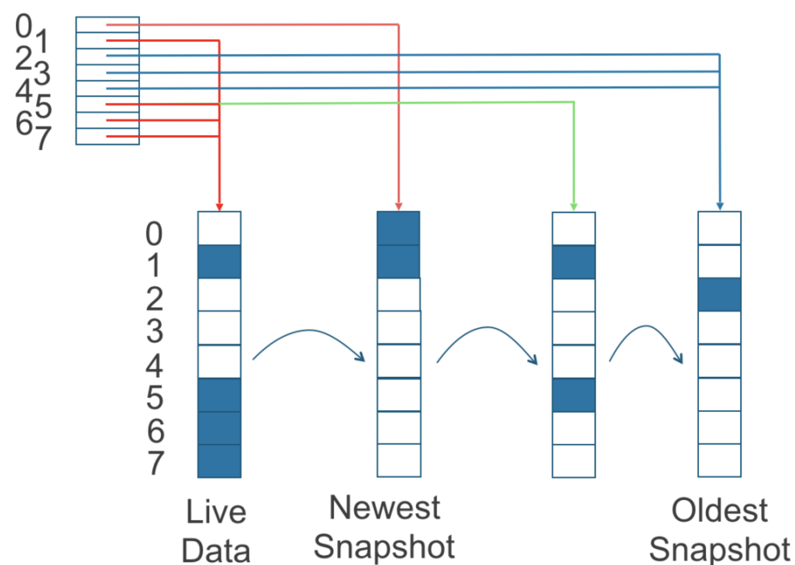
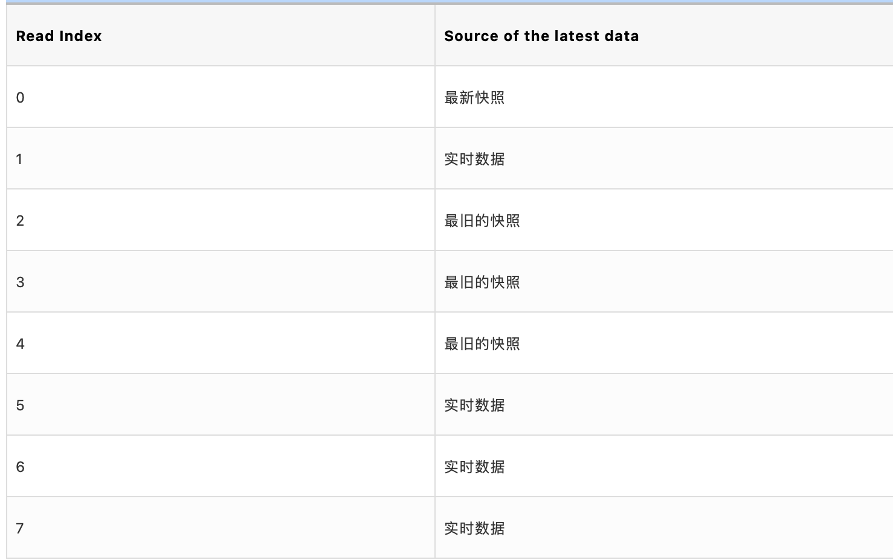
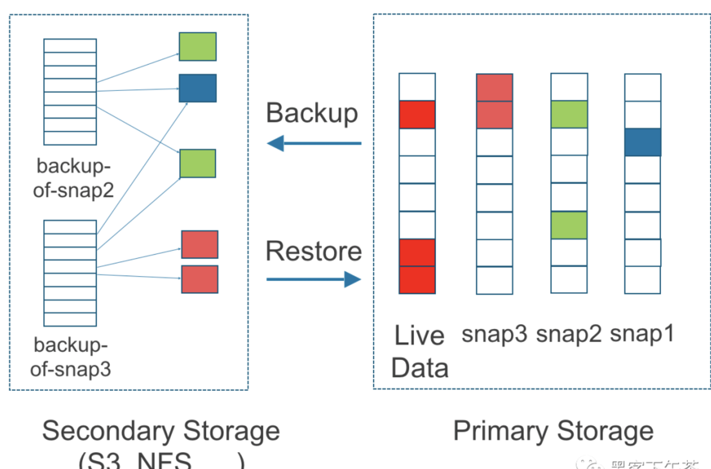

# **0 Longhorn 云原生分布式块存储解决方案设计架构和概念**

## **1. 设计**

Longhorn 设计有两层：数据平面(data plane)和控制平面(control plane)。Longhorn Engine 是存储控制器对应数据平面，Longhorn Manager 对应控制平面。

### **1.1. Longhorn Manager 和 Longhorn Engine**

·Longhorn Manager Pod 作为 Kubernetes DaemonSet 在 Longhorn 集群中的每个节点上运行。它负责在 Kubernetes 集群中创建和管理卷，并处理来自 UI 或 Kubernetes 卷插件的 API 调用。**它遵循 Kubernetes controller pattern，有时也称为 operator pattern。**

Longhorn Manager 与 Kubernetes API 服务器通信以创建新的 Longhorn 卷 CRD。

**然后 Longhorn Manager 观察 API 服务器的响应，当看到 Kubernetes API 服务器创建了一个新的 Longhorn volume CRD 时，Longhorn Manager 就创建了一个新的卷。**

当 Longhorn Manager 被要求创建一个卷时，它会在该卷所连接的节点上创建一个 Longhorn Engine 实例，并在每个将放置副本的节点上创建一个副本。副本应放置在不同的主机上以确保最大的可用性。

副本的多条数据路径确保了 Longhorn 卷的高可用性。即使某个副本或引擎出现问题，问题也不会影响所有副本或 Pod 对卷的访问。Pod 仍将正常运行。

**Longhorn Engine 始终在与使用 Longhorn volume 的 Pod 相同的节点中运行。它跨存储在多个节点上的多个副本同步复制卷。**

引擎(Engine)和副本(replicas)使用 Kubernetes 进行编排。

在下图中，

> 图 1. 卷、Longhorn 引擎、副本实例和磁盘之间的读/写数据流

* Longhorn volumes 有三个实例。
* 每个卷都有一个专用控制器，称为 Longhorn Engine 并作为 Linux 进程运行。
* 每个 Longhorn 卷有两个副本(replica)，每个副本是一个 Linux 进程。
* 图中的箭头表示卷(volume)、控制器实例(controller instance)、副本实例(replica instances)和磁盘之间的读/写数据流。
* 通过为每个卷创建单独的 Longhorn Engine，如果一个控制器出现故障，其他卷的功能不会受到影响。

### **1.2. 基于微服务的设计的优势**

在 Longhorn 中，每个 Engine 只需要服务一个卷，简化了存储控制器的设计。由于控制器软件的故障域与单个卷隔离，因此控制器崩溃只会影响一个卷。

Longhorn Engine 足够简单和轻便，因此我们可以创建多达 100,000 个独立的引擎。 Kubernetes 调度这些独立的引擎，从一组共享的磁盘中提取资源，并与 Longhorn 合作形成一个弹性的分布式块存储系统。

因为每个卷都有自己的控制器，所以每个卷的控制器和副本实例也可以升级，而不会导致 IO 操作明显中断。

Longhorn 可以创建一个长时间运行的作业(long-running job)来协调所有实时卷的升级，而不会中断系统的持续运行。为确保升级不会导致不可预见的问题，Longhorn 可以选择升级一小部分卷，并在升级过程中出现问题时回滚到旧版本。

### **1.3. CSI Driver**

Longhorn CSI driver 获取块设备(block device)，对其进行格式化，然后将其挂载到节点上。然后 kubelet 将设备绑定挂载到 Kubernetes Pod 中。这允许 Pod 访问 Longhorn volume。

所需的 Kubernetes CSI 驱动程序镜像将由 longhorn driver deployer 自动部署。

### **1.4. CSI Plugin**

Longhorn 通过 CSI Plugin 在 Kubernetes 中进行管理。这允许轻松安装 Longhorn 插件。

Kubernetes CSI plugin 调用 Longhorn 创建卷，为 Kubernetes 工作负载创建持久数据(persistent data)。 CSI plugin 使您能够创建(create)、删除(delete)、附加(attach)、分离(detach)、挂载(mount)卷，并对卷进行快照。Longhorn 提供的所有其他功能都是通过 Longhorn UI 实现的。

Kubernetes 集群内部使用 CSI interface 与 Longhorn CSI plugin 进行通信。Longhorn CSI plugin 使用 Longhorn API 与 Longhorn Manager 通信。

**Longhorn 确实利用了 iSCSI，因此可能需要对节点进行额外配置。这可能包括根据发行版安装 `open-iscsi` 或 `iscsiadm`。**

### **1.5. Longhorn UI**

Longhorn UI 通过 Longhorn API 与 Longhorn Manager 进行交互，并作为 Kubernetes 的补充。通过 Longhorn 界面可以管理快照(snapshots)、备份(backups)、节点(nodes)和磁盘(disks)。

此外，集群工作节点的空间使用情况由 Longhorn UI 收集和说明。有关详细信息，请参见此处。

## **2. Longhorn 卷和主存储**

**创建 volume 时，Longhorn Manager 将为每个 volume 创建 Longhorn Engine 微服务和副本作为微服务。这些微服务一起构成了一个 Longhorn volume。每个复制副本应放置在不同的节点或不同的磁盘上。**

Longhorn Manager 创建 Longhorn Engine 后，它将连接到副本(replicas)。引擎在 Pod 运行的节点上暴露块设备(block device)。

kubectl 支持创建 Longhorn 卷。

### **2.1. 精简配置和卷大小**

Longhorn 是一个精简配置(thin-provisioned)的存储系统。**这意味着 Longhorn volume 只会占用它目前需要的空间。例如，如果您分配了 20 GB 的卷，但只使用了其中的 1 GB，则磁盘上的实际数据大小将为 1 GB。您可以在 UI 的卷详细信息中查看实际数据大小。**

**如果您从卷中删除了内容，则 Longhorn 卷本身的大小不会缩小**。例如，如果您创建了一个 20 GB 的卷，使用了 10 GB，然后删除了 9 GB 的内容，则磁盘上的实际大小仍然是 10 GB 而不是 1 GB。发**生这种情况是因为 Longhorn 在块级别(block level)而不是文件系统级别(filesystem level)上运行， 因此 Longhorn 不知道内容是否已被用户删除。该信息主要保存在文件系统级别。**

### **2.2. 在维护模式下恢复卷**

从 Longhorn UI 附加卷时，会有一个维护模式复选框。它主要用于从快照恢复卷。

该选项将导致在不启用前端（块设备或 iSCSI）的情况下附加卷，以确保在附加卷时没有人可以访问卷数据。

v0.6.0 之后，快照恢复操作要求卷处于维护模式。这是因为如果在挂载或使用卷时修改了块设备的内容，则会导致文件系统损坏。

检查卷状态而不必担心数据被意外访问也很有用。

### **2.3. 副本**

每个副本都包含 Longhorn 卷的一系列快照。快照就像镜像(image)的一层，最旧的快照用作基础层，较新的快照在顶部。如果数据覆盖旧快照中的数据，则数据仅包含在新快照中。一系列快照一起显示了数据的当前状态。

对于每个 Longhorn 卷，该卷的多个副本应该在 Kubernetes 集群中运行，每个副本位于单独的节点上。所有副本都被同等对待，Longhorn Engine 始终运行在与 pod 相同的节点上，pod 也是卷的消费者。通过这种方式，我们可以确保即使 Pod 宕机，引擎也可以被转移到另一个 Pod，您的服务将不会中断。

默认的副本数(replica count)可以在 settings 中更改。当附加一个卷时，可以在 UI 中更改卷的副本计数。

如果当前运行良好的副本计数小于指定的副本计数，Longhorn 将开始重新生成新的副本。

如果当前正常的副本计数大于指定的副本计数，Longhorn 将不执行任何操作。在这种情况下，如果副本失败或被删除，Longhorn 将不会开始重新构建新的副本，除非健康的副本计数低于指定的副本计数。

Longhorn 副本使用支持精简配置的 Linux sparse files 构建。

#### **2.3.1. 副本读写操作的工作原理**

从卷的副本读取数据时，如果可以在实时数据中找到数据，则使用该数据。如果没有，将读取最新的快照。如果在最新的快照中找不到数据，则读取次早的快照，依此类推，直到读取最旧的快照。

在创建快照时，会创建一个差异(differencing)磁盘。随着快照数量的增加，差异磁盘链（也称为快照链）可能会变得很长。因此，为了提高读取性能，Longhorn 维护了一个读取索引，该索引记录哪个差异磁盘为每个 4K 存储块保存有效数据。

在下图中，卷有八个块。读取索引(read index)有八个条目，并且在读取操作发生时被惰性填充。

写操作重置读索引，使其指向实时数据。实时数据由某些索引上的数据和其他索引上的空白空间组成。

除了读取索引之外，我们目前没有维护额外的元数据来指示使用了哪些块。

**读取索引如何跟踪保存最新数据的快照**

上图用颜色编码(color-coded)，根据读取索引显示哪些块包含最新的数据，最新数据的来源也列在下表中：

请注意，如上图绿色箭头所示，读取索引的 Index 5 之前指向第二个最旧的快照作为最近数据的来源，然后在 4K 块时更改为指向实时数据 Index 5 的存储被实时数据覆盖。

读取索引保存在内存中，每个 4K 块消耗一个字节。字节大小的读取索引意味着您可以为每个卷创建多达 254 个快照。

读取索引为每个副本消耗一定数量的内存数据结构。例如，一个 1 TB 的卷消耗 256 MB 的内存读取索引。

#### **2.3.2 如何添加新副本**

添加新副本时，现有副本将同步到新副本。第一个副本是通过从实时数据中获取新快照来创建的。

以下步骤显示了 Longhorn 如何添加新副本的更详细细分：

1. Longhorn Engine 暂停。
2. 假设副本中的快照链由实时数据和快照组成。创建新副本后，实时数据将成为最新（第二个）快照，并创建新的空白版本的实时数据。
3. 新副本以 WO（只写）模式创建。
4. Longhorn Engine 取消暂停。
5. 所有快照均已同步。
6. 新副本设置为 RW（读写）模式。

#### **2.3.3. 如何重建有故障的副本**

Longhorn 将始终尝试为每个卷维护至少给定数量的健康副本。

当控制器在其副本之一中检测到故障时，它会将副本标记为处于错误状态(error state)。Longhorn Manager 负责启动和协调重建故障副本的过程。

为了重建故障副本，Longhorn Manager 创建一个空白副本并调用 Longhorn Engine 将空白副本添加到卷的副本集中。

为了添加空白副本，Engine 执行以下操作：

1. 暂停所有读取和写入操作。
2. 以 WO（只写）模式添加空白副本。
3. 创建所有现有副本的快照，现在它的头部有一个空白的差异磁盘(differencing disk)。
4. 取消暂停所有读取写入操作。只有写操作会被分派到新添加的副本。
5. 启动后台进程以将除最近的差异磁盘之外的所有磁盘从良好副本同步到空白副本。
6. 同步完成后，所有副本现在都拥有一致的数据，卷管理器将新副本设置为 RW (读写)模式。

最后，Longhorn Manager 调用 Longhorn Engine 从其副本集中移除故障副本。

### **2.4. 快照**

快照功能使卷能够恢复到历史中的某个点。辅助存储中的备份也可以从快照构建。

从快照还原卷时，它会反映创建快照时卷的状态。

快照功能也是 Longhorn 重建过程的一部分。每次 Longhorn 检测到一个副本宕机时，它会自动创建（系统）快照并开始在另一个节点上重建它。

#### **2.4.1. 快照的工作原理**

快照就像镜像(image)的一层，最旧的快照用作基础层，较新的快照在顶部。如果数据覆盖旧快照中的数据，则数据仅包含在新快照中。一系列快照一起显示了数据的当前状态。

快照在创建后无法更改，除非快照被删除，在这种情况下，其更改会与下一个最近的快照合并。新数据始终写入实时版本。新快照始终从实时数据创建。

要创建新快照，实时数据将成为最新的快照。然后创建一个新的空白版本的实时数据，取代旧的实时数据。

#### **2.4.2. 定期快照**

为了减少快照占用的空间，用户可以安排一个定期快照(recurring snapshot)或备份(backup)，保留多个快照，这将自动按计划创建一个新的快照/备份，然后清理任何过多的快照/备份。

#### **2.4.3. 删除快照**

不需要的快照可以通过界面手动删除。当系统生成的快照被触发删除时，系统会自动将其标记为删除。

在 Longhorn 中，不能删除最新的快照。这是因为无论何时删除快照，Longhorn 都会将其内容与下一个快照合并，以便下一个和以后的快照保留正确的内容。

但 Longhorn 无法对最新快照执行此操作，因为没有更多最近的快照可以与已删除的快照合并。最新快照的下一个“快照”是实时卷（volume-head），此时用户正在读/写，因此不会发生合并过程。

相反，最新的快照将被标记为已删除，并且在可能的情况下，将在下次对其进行清理。

要清理最新快照，可以创建一个新快照，然后删除以前的“最新”快照。

#### **2.4.4. 存储快照**

快照存储在本地，作为卷的每个副本的一部分。它们存储在 Kubernetes 集群中节点的磁盘上。快照与主机物理磁盘上的卷数据存储在同一位置。

#### **2.4.5. 崩溃一致性**

Longhorn 是崩溃一致(crash-consistent)的块存储解决方案。

操作系统在写入块层(block layer)之前将内容保留在缓存中是正常的。这意味着如果所有副本都关闭，那么 Longhorn 可能不包含关闭前立即发生的更改，因为内容保存在操作系统级缓存中，尚未传输到 Longhorn 系统。

此问题类似于台式计算机因停电而关闭时可能发生的问题。恢复供电后，您可能会发现硬盘驱动器中有一些损坏的文件。

要在任何给定时刻强制将数据写入块层(block layer)，可以在节点上手动运行同步命令，或者可以卸载磁盘。在任一情况下，操作系统都会将内容从缓存写入块层(block layer)。

Longhorn 在创建快照之前自动运行同步命令。

## **3. 备份和辅助存储**

备份是备份存储(backupstore)中的一个对象，它是 Kubernetes 集群外部的 NFS 或 S3 兼容对象存储。备份提供了一种二级(secondary)存储形式，因此即使您的 Kubernetes 集群变得不可用，您的数据仍然可以被检索。

由于卷复制(volume replication)是同步的，而且由于网络延迟(network latency)，很难进行跨地域复制。备份存储(backupstore)也用作解决此问题的媒介。

在 Longhorn 设置中配置备份目标后，Longhorn 可以连接到备份存储并在 Longhorn UI 中向您显示现有备份列表。

如果 Longhorn 在第二个 Kubernetes 集群中运行，它还可以将灾难恢复卷同步到二级存储(secondary storage)中的备份， 以便您的数据可以在第二个 Kubernetes 集群中更快地恢复。

### **3.1. 备份的工作原理**

使用一个快照作为源创建备份，以便它反映创建快照时卷数据的状态。

与快照相比，备份可以被认为是一系列快照的扁平化版本。与将分层镜像(layered image)转换为平面镜像(flat image)时信息丢失的方式类似，当一系列快照转换为备份时，数据也会丢失。在这两种转换中，任何被覆盖的数据都将丢失。

由于备份不包含快照，因此它们不包含卷数据更改的历史记录。从备份还原卷后，该卷最初包含一个快照。此快照是原始链中所有快照的合并版本，它反映了创建备份时卷的实时数据。

虽然快照可以达到 TB(terabytes)，但备份由 2 MB 文件组成。

同一原始卷的每个新备份都是增量的，检测并在快照之间传输更改的块。这是一项相对容易的任务， 因为每个快照都是一个差异(differencing)文件，并且只存储上一个快照的更改。

为了避免存储大量的小存储块，Longhorn 使用 2 MB 块执行备份操作。这意味着，如果 2MB 边界中的任何 4K 块发生更改，Longhorn 将备份整个 2MB 块。这提供了可管理性和效率之间的正确平衡。

二级存储中的备份与主存储中的快照之间的关系

上图描述了如何从 Longhorn 中的快照创建备份：

* 图表的主存储一侧显示了 Kubernetes 集群中 Longhorn 卷的一个副本。副本由四个快照链组成。按照从新到旧的顺序，快照是 Live Data、snap3、snap2 和 snap1。
* 图表的二级存储侧显示了外部对象存储服务（如 S3）中的两个备份。
* 在二级存储中，backup-from-snap2 的颜色编码显示它包括来自 snap1 的蓝色变化和来自 snap2 的绿色变化。

snap2 中的任何更改都没有覆盖 snap1 中的数据，因此 snap1 和 snap2 中的更改都包含在 backup-from-snap2 中。

* 名为 backup-from-snap3 的备份反映了创建 snap3 时卷数据的状态。颜色编码和箭头表示 backup-from-snap3 包含来自 snap3 的所有深红色更改，但仅包含来自 snap2 的绿色更改之一。

这是因为 snap3 中的一项红色更改覆盖了 snap2 中的一项绿色更改。这说明了备份如何不包括更改的完整历史记录，因为它们将快照与其之前的快照混为一谈。

* 每个备份维护自己的一组 2 MB 块。每个 2 MB 块仅备份一次。两个备份共享一个绿色块和一个蓝色块。

当备份从二级存储中删除时，Longhorn 不会删除它使用的所有块。相反，它会定期执行垃圾收集以清除辅助存储中未使用的块。

属于同一卷的所有备份的 2 MB 块存储在一个公共目录下，因此可以跨多个备份共享。

为了节省空间，备份之间没有变化的 2 MB 块可以重复用于在二级存储中共享相同备份卷的多个备份。由于校验(checksums)和用于寻址 2 MB 块，因此我们对同一卷中的 2 MB 块实现了某种程度的重复数据删除。

卷级元数据(Volume-level metadata)存储在 volume.cfg 中。每个备份的元数据文件（例如 snap2.cfg）相对较小， 因为它们仅包含备份中所有 2 MB 块的offsets和checksums。

压缩每个 2 MB 块（.blk 文件）。

### **3.2. 定期备份**

可以使用定期快照(recurring snapshot)和备份功能来安排备份操作，但也可以根据需要进行。

建议为您的卷安排定期备份。如果备份存储(backupstore)不可用，建议改为安排定期快照。

创建备份涉及通过网络复制数据，因此需要时间。

### **3.3. 灾难恢复卷**

灾难恢复 (DR) 卷是一种特殊卷，可在整个主集群出现故障时将数据存储在备份集群中。DR 卷用于提高 Longhorn 卷的弹性。

由于 DR 卷的主要用途是从备份中恢复数据，因此此类卷在激活之前不支持以下操作：

* 创建、删除和恢复快照
* 创建备份
* 创建持久卷
* 创建持久卷声明

可以从备份存储中的卷备份创建 DR 卷。创建 DR 卷后，Longhorn 将监控其原始备份卷并从最新备份增量恢复。备份卷是备份存储中包含同一卷的多个备份的对象。

如果主集群中的原始卷宕机，可以立即激活备份集群中的 DR 卷，这样可以大大减少将数据从备份存储恢复到备份集群中的卷所需的时间。

当 DR 卷被激活时，Longhorn 将检查原始卷的最后备份。如果该备份尚未恢复，则将开始恢复，并且激活操作将失败。用户需要等待恢复完成后再重试。

如果存在任何 DR 卷，则无法更新 Longhorn 设置中的备份目标。

DR 卷被激活后，它会变成一个普通的 Longhorn 卷并且不能被停用。

### **3.4. 备份存储更新间隔、RTO 和 RPO**

通常增量恢复由定期备份存储更新触发。用户可以在设置(Setting)-通用(General)-备份(Backupstore)存储轮询间隔中设置备份存储更新间隔。

请注意，此间隔可能会影响恢复时间目标 (RTO)。如果时间过长，容灾卷恢复的数据量可能比较大，时间会比较长。

至于恢复点目标 (RPO)，它由备份卷的定期备份计划确定。如果正常卷 A 的定期备份计划每小时创建一个备份，则 RPO 为一小时。您可以在此处查看如何在 Longhorn 中设置定期备份。

以下分析假设该卷每小时创建一个备份，并且从一个备份中增量恢复数据需要五分钟：

* 如果 Backupstore 轮询间隔为 30 分钟，则自上次恢复以来最多有一个备份数据。恢复一份备份的时间为五分钟，因此 RTO 为五分钟。
* 如果 Backupstore 轮询间隔为 12 小时，则自上次恢复以来最多有 12 个数据备份。恢复备份的时间为 5 * 12 = 60 分钟，因此 RTO 为 60 分钟。

## **附录：持久性存储在 Kubernetes 中的工作原理**

要了解 Kubernetes 中的持久存储，重要的是要了解 Volumes、PersistentVolumes、PersistentVolumeClaims 和 StorageClasses，以及它们如何协同工作。

Kubernetes Volume 的一个重要属性是它与它所属的 Pod 具有相同的生命周期。如果 Pod 不见了，Volume 就会丢失。相比之下，PersistentVolume 继续存在于系统中，直到用户将其删除。卷也可用于在同一个 Pod 内的容器之间共享数据，但这不是主要用例，因为用户通常每个 Pod 只有一个容器。

PersistentVolume (PV) 是 Kubernetes 集群中的一块持久存储， 而 PersistentVolumeClaim (PVC) 是一个存储请求。 StorageClasses 允许根据需要为工作负载动态配置新存储。

Kubernetes 工作负载如何使用新的和现有的持久存储

从广义上讲，在 Kubernetes 中使用持久化存储主要有两种方式：

* 使用现有的持久卷
* 动态配置新的持久卷

现有存储配置

要使用现有 PV，您的应用程序需要使用绑定到 PV 的 PVC，并且 PV 应包含 PVC 所需的最少资源。

换句话说，在 Kubernetes 中设置现有存储的典型工作流程如下：

1. 在您有权访问的物理或虚拟存储的意义上设置持久存储卷。
2. 添加引用持久存储的 PV。
3. 添加引用 PV 的 PVC。
4. 在您的工作负载中将 PVC 挂载为卷。

当 PVC 请求一块存储时，Kubernetes API 服务器将尝试将该 PVC 与预先分配的 PV 匹配，因为匹配的卷可用。如果可以找到匹配项，则 PVC 将绑定到 PV，并且用户将开始使用该预先分配的存储块。

如果不存在匹配的卷，则 PersistentVolumeClaims 将无限期地保持未绑定状态。例如，配置了许多 50 Gi PV 的集群与请求 100 Gi 的 PVC 不匹配。将 100 Gi PV 添加到集群后，可以绑定 PVC。

换句话说，您可以创建无限的 PVC，但只有当 Kubernetes 主节点可以找到足够的 PV 且至少具有 PVC 所需的磁盘空间量时，它们才会绑定到 PV。

动态存储配置

对于动态存储配置，您的应用程序需要使用绑定到 StorageClass 的 PVC。 StorageClass 包含提供新持久卷的授权。

在 Kubernetes 中动态配置新存储的整个工作流程涉及一个 StorageClass 资源：

* 添加 StorageClass 并将其配置为从您有权访问的存储中自动配置新存储。
* 添加引用 StorageClass 的 PVC。
* 将 PVC 挂载为工作负载的卷。

Kubernetes 集群管理员可以使用 Kubernetes StorageClass 来描述他们提供的存储“类(“classes”)”。 StorageClasses 可以有不同的容量限制、不同的 IOPS 或供应商支持的任何其他参数。存储供应商特定的 provisioner 与 StorageClass 一起使用，以按照 StorageClass 对象中设置的参数自动分配 PV。此外，provisioner 现在能够为用户强制执行资源配额和权限要求。在这种设计中，管理员可以从预测 PV 需求和分配 PV 的不必要工作中解放出来。

当使用 StorageClass 时，Kubernetes 管理员不负责分配每一块存储。管理员只需要授予用户访问某个存储池的权限，并决定用户的配额即可。然后用户可以从存储池中挖掘出所需的存储部分。

也可以使用 StorageClass，而不需要在 Kubernetes 中显式创建 StorageClass 对象。由于 StorageClass 也是一个用于匹配带有 PV 的 PVC 的字段，因此可以使用自定义存储类名称手动创建 PV， 然后可以创建一个要求带有该 StorageClass 名称的 PV 的 PVC。然后，Kubernetes 可以使用指定的 StorageClass 名称将 PVC 绑定到 PV，即使 StorageClass 对象并不作为 Kubernetes 资源存在。

Longhorn 引入了一个 Longhorn StorageClass，这样 Kubernetes 工作负载就可以根据需要划分持久性存储。

### **具有持久存储的 Kubernetes Workloads 的水平扩展**

VolumeClaimTemplate 是一个 StatefulSet spec 属性，它为块存储解决方案提供了一种方法来水平扩展 Kubernetes 工作负载。

此属性可用于为由 StatefulSet 创建的 pod 创建匹配的 pv 和 pvc。

这些 PVC 是使用 StorageClass 创建的，因此可以在 StatefulSet 扩展时自动设置它们。

当 StatefulSet 缩小时，额外的 PV/PVC 会保留在集群中，当 StatefulSet 再次放大时，它们会被重用。

VolumeClaimTemplate 对于 EBS 和 Longhorn 等块存储解决方案很重要。因为这些解决方案本质上是 ReadWriteOnce，所以它们不能在 Pod 之间共享。

如果您有多个 Pod 运行持久性数据(persistent storage)，那么部署(Deployment)不能很好地与持久性存储(persistent storage)配合使用。对于多个 pod，应该使用 StatefulSet。