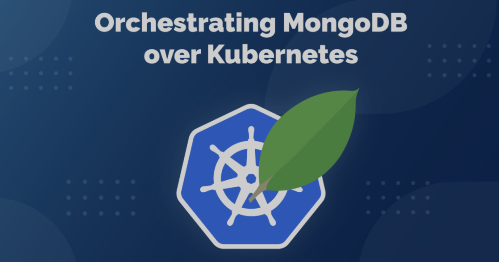
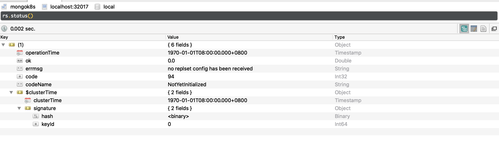
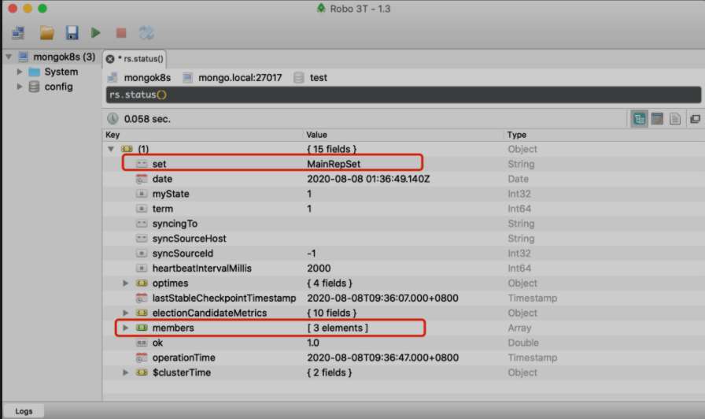
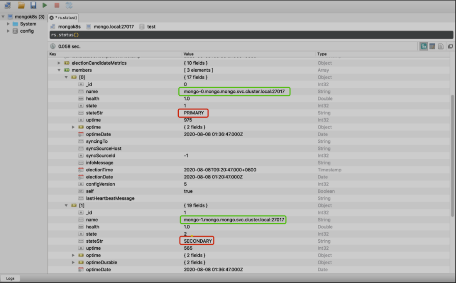
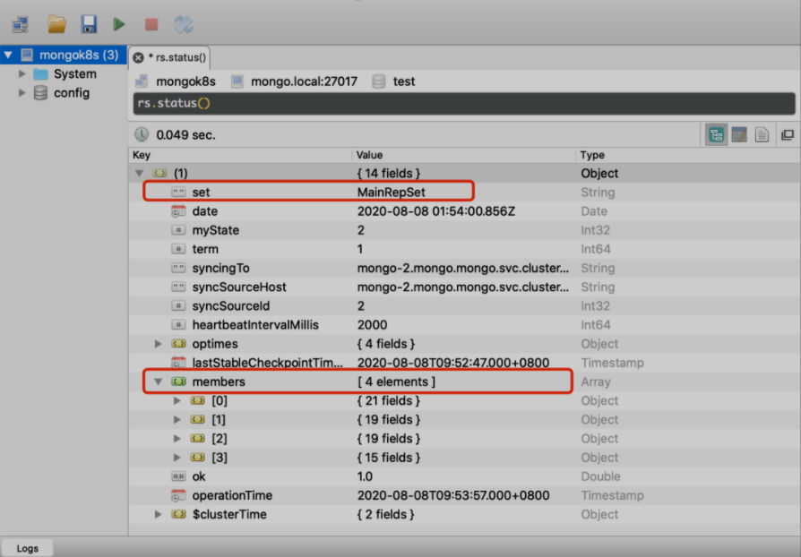
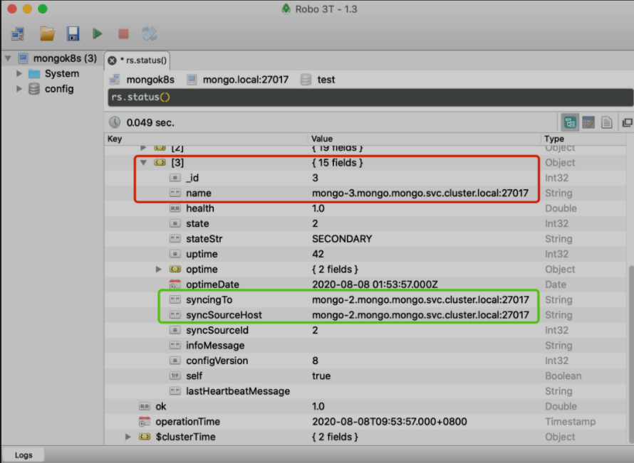

# 在 Kubernetes 上编排 MongoDB 集群


无状态应用在 `Kubernetes` 中的使用非常方便，但是对于一些有状态应用部署还是相对较麻烦，虽然也有单独的 StatefulSets 资源对象来处理有状态应用，但是毕竟不具有通用性，有状态应用的编排和具体的应用息息相关，比如 `MongoDB`、`ElasticSearch`、`Redis`、`Zookeeper` 等应用。我们这里不再对 `StatefulSets` 的具体使用展开介绍了，将通过部署一个可扩展的 `MongoDB` 集群为例进行说明。



首先我们运行一个 `DaemonSet` 的控制器来管理节点，禁用巨页，因为 MongoDB 是建议关闭掉 `Transparent Hugepage` 的，否则可能导致性能下降，内存锁，甚至系统重启等问题，当然最好的还是只调整 `MongoDB` 的 `Pod` 所在的节点：

**`hostvm-ds.yaml`**

```
apiVersion: apps/v1
kind: DaemonSet
metadata:
  name: hostvm-configurer
  labels:
    app: startup-script
spec:
  selector:
    matchLabels:
      app: startup-script
  template:
    metadata:
      labels:
        app: startup-script
    spec:
      hostPID: true
      containers:
      - name: hostvm-configurer
        image: cnych/startup-script:v1
        securityContext:
          privileged: true
        env:
        - name: STARTUP_SCRIPT
          value: |
            #! /bin/bash
            set -o errexit
            set -o pipefail
            set -o nounset
            
            # Disable hugepages
            echo 'never' > /sys/kernel/mm/transparent_hugepage/enabled
            echo 'never' > /sys/kernel/mm/transparent_hugepage/defrag
```


### Dev 实验配置


然后配置 `ServiceAccount`、`NodePort SVC` 和 `StatefulSet`，资源清单文件如下所示：

**`mongo.yaml`**

```
apiVersion: v1
kind: Namespace
metadata:
  name: mongo
---
apiVersion: v1
kind: ServiceAccount
metadata:
  name: mongo
  namespace: mongo
---
apiVersion: rbac.authorization.k8s.io/v1beta1
kind: ClusterRoleBinding
metadata:
  name: mongo
subjects:
  - kind: ServiceAccount
    name: mongo
    namespace: mongo
roleRef:
  kind: ClusterRole
  name: cluster-admin
  apiGroup: rbac.authorization.k8s.io
---
apiVersion: v1
kind: Service
metadata:
 name: mongo
 namespace: mongo
 labels:
   name: mongo
spec:
  selector:
   role: mongo
  type: NodePort
  ports:
  - port: 27017
    targetPort: 27017
    nodePort: 32017
---
apiVersion: apps/v1
kind: StatefulSet
metadata:
  name: mongo
  namespace: mongo
spec:
  serviceName: mongo
  replicas: 1
  selector:
    matchLabels:
      role: mongo
      environment: staging
  template:
    metadata:
      labels:
        role: mongo
        environment: staging
        replicaset: MainRepSet
    spec:
      affinity:
        podAntiAffinity:  # 添加 Pod 反亲和性，将副本打散在不同的节点
          preferredDuringSchedulingIgnoredDuringExecution:  # 软策略
          - weight: 100
            podAffinityTerm:
              labelSelector:
                matchExpressions:
                - key: replicaset
                  operator: In
                  values:
                  - MainRepSet
              topologyKey: kubernetes.io/hostname
      terminationGracePeriodSeconds: 10
      serviceAccountName: mongo
      containers:
        - name: mongo
          image: mongo:4.0
          command:
            - mongod
            - "--wiredTigerCacheSizeGB"
            - "0.25"
            - "--bind_ip"
            - "0.0.0.0"
            - "--replSet"
            - MainRepSet
            - "--smallfiles"
            - "--noprealloc"
          ports:
            - containerPort: 27017
          volumeMounts:
            - name: mongo-data
              mountPath: /data/db
          resources:
            requests:
              cpu: 1
              memory: 2Gi
        - name: mongo-sidecar
          image: cvallance/mongo-k8s-sidecar
          env:
            - name: MONGO_SIDECAR_POD_LABELS
              value: "role=mongo,environment=staging"
            - name: KUBE_NAMESPACE
              value: "mongo"
            - name: KUBERNETES_MONGO_SERVICE_NAME
              value: "mongo"
  volumeClaimTemplates:
  - metadata:
      name: mongo-data
    spec:
      accessModes: [ "ReadWriteOnce" ]
      storageClassName: hostpath  # 提供一个可用的 Storageclass
      resources:
        requests:
          storage: 2Gi
```

这里我们给 `Mongo` 的 `Pod` 添加了一个 `sidecar` 容器，主要用于副本集的配置，该 `sidecar` 会每5s检查一次新成员。通过几个环境变量配置指定了 `Pod` 的标签、命名空间和 `Service`。
为了保证应用的稳定性，我们通过 `podAntiAffinity` 指定了 `Pod` 的反亲和性，这样可以保证不会有两个副本出现在同一个节点上。

此外需要提供一个可用的 `StorageClass`，这样可以保证不同的副本数据持久化到不同的 PV。

直接运行上面的两个资源清单文件即可：

```

$ kubectl apply -f hostvm-ds.yaml
$ kubectl apply -f mongo.yaml
```

部署完成后可以通过如下命令检查应用运行状态：

```
 kubectl get all -n mongo 
NAME          READY   STATUS    RESTARTS   AGE
pod/mongo-0   2/2     Running   0          14h

NAME            TYPE       CLUSTER-IP     EXTERNAL-IP   PORT(S)           AGE
service/mongo   NodePort   10.99.236.50   <none>        27017:32017/TCP   14h

NAME                     READY   AGE
statefulset.apps/mongo   1/1     14h
```

我这里本地是 `Mac `系统，使用的是 Robo 3T 作为 `mongo` 客户端，连接到其中一个节点并运行 `rs.status()` 后，我们可以查看到副本集的详细信息，



### Stage-Prod 配置

然后配置 ServiceAccount、Headless SVC 和 StatefulSet，资源清单文件如下所示：

```
# mongo.yaml
apiVersion: v1
kind: Namespace
metadata:
  name: mongo
---
apiVersion: v1
kind: ServiceAccount
metadata:
  name: mongo
  namespace: mongo
---
apiVersion: rbac.authorization.k8s.io/v1beta1
kind: ClusterRoleBinding
metadata:
  name: mongo
subjects:
  - kind: ServiceAccount
    name: mongo
    namespace: mongo
roleRef:
  kind: ClusterRole
  name: cluster-admin
  apiGroup: rbac.authorization.k8s.io
---
apiVersion: v1
kind: Service
metadata:
 name: mongo
 namespace: mongo
 labels:
   name: mongo
spec:
 ports:
 - port: 27017
   targetPort: 27017
 clusterIP: None
 selector:
   role: mongo
---
apiVersion: apps/v1
kind: StatefulSet
metadata:
  name: mongo
  namespace: mongo
spec:
  serviceName: mongo
  replicas: 3
  selector:
    matchLabels:
      role: mongo
      environment: staging
  template:
    metadata:
      labels:
        role: mongo
        environment: staging
        replicaset: MainRepSet
    spec:
      affinity:
        podAntiAffinity:  # 添加 Pod 反亲和性，将副本打散在不同的节点
          preferredDuringSchedulingIgnoredDuringExecution:  # 软策略
          - weight: 100
            podAffinityTerm:
              labelSelector:
                matchExpressions:
                - key: replicaset
                  operator: In
                  values:
                  - MainRepSet
              topologyKey: kubernetes.io/hostname
      terminationGracePeriodSeconds: 10
      serviceAccountName: mongo
      containers:
        - name: mongo
          image: mongo:4.0
          command:
            - mongod
            - "--wiredTigerCacheSizeGB"
            - "0.25"
            - "--bind_ip"
            - "0.0.0.0"
            - "--replSet"
            - MainRepSet
            - "--smallfiles"
            - "--noprealloc"
          ports:
            - containerPort: 27017
          volumeMounts:
            - name: mongo-data
              mountPath: /data/db
          resources:
            requests:
              cpu: 1
              memory: 2Gi
        - name: mongo-sidecar
          image: cvallance/mongo-k8s-sidecar
          env:
            - name: MONGO_SIDECAR_POD_LABELS
              value: "role=mongo,environment=staging"
            - name: KUBE_NAMESPACE
              value: "mongo"
            - name: KUBERNETES_MONGO_SERVICE_NAME
              value: "mongo"
  volumeClaimTemplates:
  - metadata:
      name: mongo-data
    spec:
      accessModes: [ "ReadWriteOnce" ]
      storageClassName: hostpath  # 提供一个可用的 Storageclass
      resources:
        requests:
          storage: 10Gi
```

```
$ kubectl apply -f hostvm-ds.yaml
$ kubectl apply -f mongo.yaml
```

部署完成后可以通过如下命令检查应用运行状态：

```
$ kubectl -n mongo get all
kubectl -n mongo get all
NAME          READY   STATUS              RESTARTS   AGE
pod/mongo-0   2/2     Running             0          28m
pod/mongo-1   2/2     Running             0          23m
pod/mongo-2   2/2     Running             0          16m

NAME            TYPE        CLUSTER-IP   EXTERNAL-IP   PORT(S)     AGE
service/mongo   ClusterIP   None         <none>        27017/TCP   51m

NAME                     READY   AGE
statefulset.apps/mongo   3/3     28m
```

由于我们这里的 Service 是无头服务，没有 ClusterIP，也没有 ExternalIP，这个 Service 会直接解析到 Pod 的 IP 列表，**当应用完全部署到 Kubernetes 集群上后，我们就可以按照不同的节点来进行访问了**：

```
Node-0: mongo-0.mongo.mongo.svc.cluster.local:27017
Node-1: mongo-1.mongo.mongo.svc.cluster.local:27017
Node-2: mongo-2.mongo.mongo.svc.cluster.local:27017
```

当然如果想从集群外部访问 mongo，可以为这些 Pod 部署一些内部的负载均衡器，或者使用 nginx-ingress、traefik 这些 Ingress 控制器来创建 Ingress 暴露出去。

我们集群中部署了 Traefik v2.2 版本，该版本是支持 TCP 服务的，我们可以通过创建一个如下所示的 `IngressRoute` 对象来暴露 `mongo` 服务：

```
# ingressroute-tcp.yaml
apiVersion: traefik.containo.us/v1alpha1
kind: IngressRouteTCP
metadata:
  name: mongo
  namespapce: mongo
spec:
  entryPoints:
  - mongo  # 需要通过静态方式开启 mongo 的入口点
  routes:
  - match: HostSNI(`*`)
    services:
    - name: mongo
      port: 27017
```

由于 Traefik 暴露 TCP 服务需要 SNI 的支持，我们这里没有指定特定的域名，所以需要通过一个专门的入口点 mongo 来暴露，需要在 Traefik 中声明并开启这个入口点，类似于下面的这样静态配置：

```
......
- name: mongo
  containerPort: 27017
  hostPort: 27017
args:
- --entryPoints.mongo.address=:27017
......
```

直接运行上面的 IngressRouteTCP 对象即可：

```
$ kubectl apply -f ingressroute-tcp.yaml -n mongo
```

需要注意的是，应用程序至少要知道一个当前正在运行的 mongo 节点，这样才可以发现所有其他节点。

我这里本地是 Mac 系统，使用的是 Robo 3T 作为 mongo 客户端，连接到其中一个节点并运行 `rs.status()` 后，我们可以查看到副本集的详细信息，并检查其他两个 Pod 是否被配置并自动连接到副本集上。



在成员列表中也可以看到每个成员的 FQDN 名称和状态，不过需要注意的是 FQDN 只能在 Kubernetes 集群内部访问：



现在我们可以对 Mongo 进行扩容，以检查新的 Pod 是否被添加到副本集中去：

```
$ kubectl -n mongo scale statefulsets mongo --replicas=4
statefulset.apps/mongo scaled
$ kubectl -n mongo get pods -o wide
NAME      READY   STATUS    RESTARTS   AGE     IP             NODE         NOMINATED NODE   READINESS GATES
mongo-0   2/2     Running   0          32m     10.244.8.29    ydzs-node6   <none>           <none>
mongo-1   2/2     Running   0          27m     10.244.7.175   ydzs-node5   <none>           <none>
mongo-2   2/2     Running   0          20m     10.244.2.175   ydzs-node2   <none>           <none>
mongo-3   2/2     Running   0          4m29s   10.244.3.95    ydzs-node3   <none>           <none>
```

由于上面我们配置了 Pod 的反亲和性，但是是软策略，所以4个 Pod 会经量分散到不同的节点上。扩容后同样新的 Pod 也会自动提供一个持久券：

```
$ kubectl -n mongo get pvc
NAME                 STATUS   VOLUME                                     CAPACITY   ACCESS MODES   STORAGECLASS      AGE
mongo-data-mongo-0   Bound    pvc-ac306842-f6a9-413c-bf92-576dd6a3b092   10Gi       RWO            rook-ceph-block   56m
mongo-data-mongo-1   Bound    pvc-d319e5d2-ac99-4a2b-898c-feb4bdf0f256   10Gi       RWO            rook-ceph-block   27m
mongo-data-mongo-2   Bound    pvc-fc8ded1d-0649-4b64-963e-0b9e2fc1f27d   10Gi       RWO            rook-ceph-block   21m
mongo-data-mongo-3   Bound    pvc-762b4b91-432e-4409-8d8f-e3e809d6a159   10Gi       RWO            rook-ceph-block   4m51s
```

现在我们再去`Robo 3T` 客户端重新执行 `rs.status()`检查新的 `Pod`  是否被添加到副本集中了：



新增的 Pod 与之前的成员都采用相同的 FQDN 方案，并同步到同一个 Primary 节点去。



到这里我们就成功地将 MongoDB 部署到了 Kubernetes 集群，而且还是可伸缩的。后续我们还可以考虑针对应用部署 VPA，或者增加一些网络策略或 Istio 来控制应用，当然这种方式整体来说是可行的，但是可维护性还不是非常高，如果可以，我们应该去根据自己的业务需求开发对应的 Operator，或者使用第三方高质量的 Operator 来编排 MongoDB。


