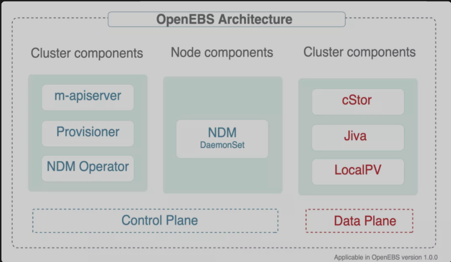
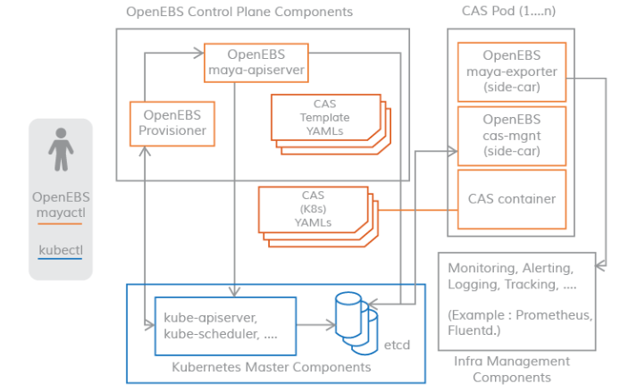
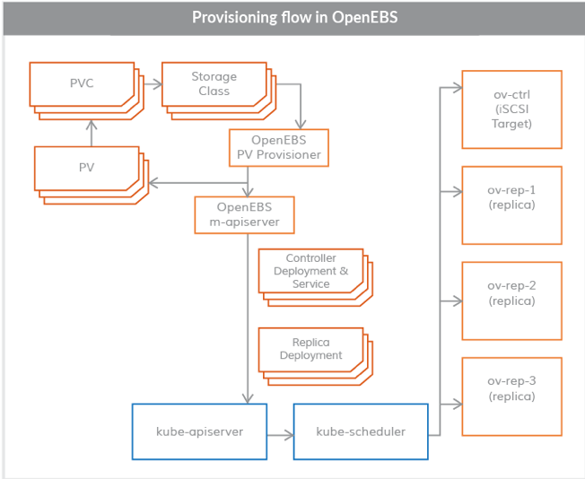
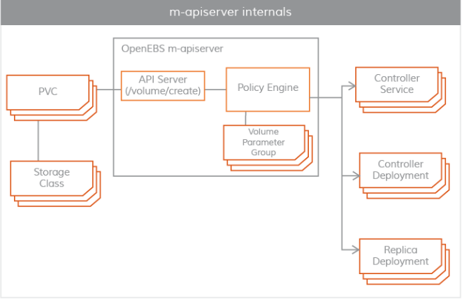
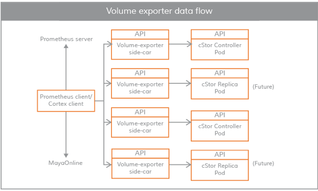
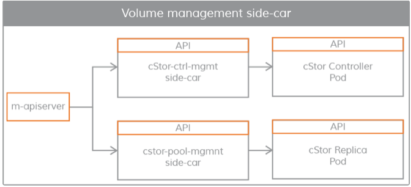
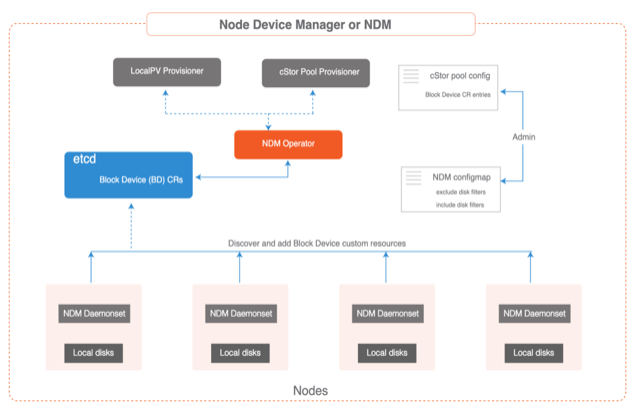
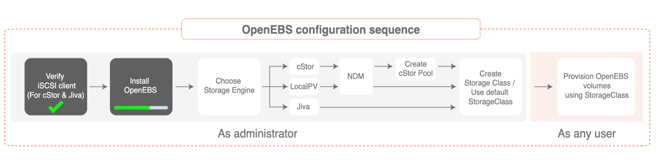

# **使用 OpenEBS 实现 Local PV 动态持久化存储**

OpenEBS([https://openebs.io](https://openebs.io)) 是一种模拟了 AWS 的 EBS、阿里云的云盘等块存储实现的基于容器的存储开源软件。

OpenEBS 是一种基于 CAS(Container Attached Storage) 理念的容器解决方案，其核心理念是存储和应用一样采用微服务架构，并通过 Kubernetes 来做资源编排。

其架构实现上，每个卷的 Controller 都是一个单独的 Pod，且与应用 Pod 在同一个节点，卷的数据使用多个 Pod 进行管理。



OpenEBS 有很多组件，可以分为以下几类：

* 控制平面组件 - **管理 OpenEBS 卷容器，通常会用到容器编排软件的功能**
* 数据平面组件 - **为应用程序提供数据存储，包含 Jiva 和 cStor 两个存储后端**
* 节点磁盘管理器 - 发现、监控和管理连接到 Kubernetes 节点的媒体
* 与云原生工具的整合 - 与 Prometheus、Grafana、Fluentd 和 Jaeger 进行整合。

## 控制平面

* **OpenEBS 集群的控制平面通常被称为 Maya**，
**控制平面负责供应卷、相关的卷操作，如快照、制作克隆、创建存储策略、执行存储策略、导出卷指标供 Prometheus/grafana 消费等**


* OpenEBS 控制平面 Maya 实现了创建超融合的 OpenEBS，并将其挂载到如 Kubernetes 调度引擎上，用来扩展特定的容器编排系统提供的存储功能；
* OpenEBS 的控制平面也是基于微服务的，通过不同的组件实现存储管理功能、监控、容器编排插件等功能。



**OpenEBS 提供了一个动态供应器**，它是标准的 Kubernetes 外部存储插件。

**OpenEBS PV 供应器的主要任务是向应用 Pod 发起卷供应，并实现Kubernetes 的 PV 规范。**

`m-apiserver` 暴露了存储 REST API，并承担了大部分的卷策略处理和管理。

控制平面和数据平面之间的连接采用 `Kubernetes sidecar` 模式。有如下几个场景，控制平面需要与数据平面进行通信。

* 对于 IOPS、吞吐量、延迟等卷统计 - 通过 **`volume-exporter sidecar`** 实现
* 用于通过卷控制器 Pod 执行卷策略，以及通过卷复制 Pod 进行 **`磁盘/池`** 管理 - 通过卷管理 sidecar 实现。

下面对上述控制平面的组成进行详细说明。

### OpenEBS PV Provisioner




***该组件作为一个 `Pod` 运行，并做出供应决策。***

1. 它的使用方式是开发者用所需的卷参数构建一个请求，选择合适的存储类，并在 YAML 规范上调用 `kubelet`。
2. `OpenEBS PV` 动态供应器与`maya-apiserver` 交互，在适当的节点上为卷控制器 `Pod` 和卷复制 `Pod` 创建部署规范。
3. **可以使用 PVC 规范中的注解来控制容量 Pod（控制器/副本）的调度。**

目前，OpenEBS 供应器只支持一种类型的绑定，即 `iSCSI`。

### Maya-ApiServer



### Maya Volume Exporter



**Maya Volume Exporter** 是每个存储控制器 Pod（cStor/Jiva）的 sidecar。

这些 sidecars 将控制平面与数据平面连接起来，以获取统计数据，比如：

* volume 读/写延迟
* 读/写 IOPS
* 读/写块大小
* 容量统计
* **OpenEBS volume exporter 数据流**

### Volume 管理 Sidecars

**Sidecars 还用于将控制器配置参数和卷策略传递给作为数据平面的卷控制器 Pod，以及将副本配置参数和副本数据保护参数传递给卷副本 Pod。**




## 数据平面


OpenEBS 持久化存储卷通过 Kubernetes 的 PV 来创建，使用 iSCSI 来实现，数据保存在节点上或者云存储中。

OpenEBS 的卷完全独立于用户的应用的生命周期来管理，和 Kuberentes 中 PV 的思路一致。OpenEBS 卷为容器提供持久化存储，具有针对系统故障的弹性，更快地访问存储，快照和备份功能。

**同时还提供了监控使用情况和执行 QoS 策略的机制。**

目前，OpenEBS 提供了两个可以轻松插入的存储引擎。

**这两个引擎分别叫做 Jiva 和 cStor。这两个存储引擎都完全运行在Linux 用户空间中，并且基于微服务架构。**


### Jiva

Jiva 存储引擎是基于 `Rancher` 的 `LongHorn` 和 `gotgt` 开发的,采用 `GO` 语言编写，运行在用户空间。

* `LongHorn` 控制器将传入的 `IO` 同步复制到 `LongHorn` 复制器上。
* 复制器考虑以 Linux 稀疏文件为基础，进行动态供应、快照、重建等存储功能。

### cStor

cStor 数据引擎是用C语言编写的，具有高性能的 iSCSI 目标和**Copy-On-Write** 块系统，可提供数据完整性、数据弹性和时间点快照和克隆。

cStor 具有池功能，可将节点上的磁盘以镜像式或 `RAIDZ` 模式聚合，以提供更大的容量和性能单位。


### Local PV

对于那些不需要存储级复制的应用，Local PV 可能是不错的选择，因为它能提供更高的性能。

`OpenEBS LocalPV` 与 `Kubernetes LocalPV` 类似，只不过它是由 `OpenEBS `控制平面动态调配的，就像其他常规 PV 一样。

* `OpenEBS LocalPV` 有两种类型--主机路径 LocalPV 或设备 LocalPV，主机路径 LocalPV 指的是主机上的一个子目录，设备 `LocalPV` 指的是节点上的一个被发现的磁盘（直接连接或网络连接）。
* OpenEBS 引入了一个LocalPV 供应器，用于根据 PVC 和存储类规范中的一些标准选择匹配的磁盘或主机路径。

## 节点磁盘管理器

`Node Disk Manager (NDM)`填补了使用 Kubernetes 管理有状态应用的持久性存储所需的工具链中的空白。

容器时代的 DevOps 架构师必须以自动化的方式服务于应用和应用开发者的基础设施需求，以提供跨环境的弹性和一致性。

这些要求意味着存储栈本身必须非常灵活，以便 Kubernetes 和云原生生态系统中的其他软件可以轻松使用这个栈。

NDM 在 Kubernetes 的存储栈中起到了基础性的作用，它将不同的磁盘统一起来，并通过将它们识别为 Kubernetes 对象来提供部分池化的能力。同时， NDM 还可以发现、供应、监控和管理底层磁盘，这样Kubernetes PV 供应器（如 OpenEBS 和其他存储系统和Prometheus）可以管理磁盘子系统。




## 安装

由于 `OpenEBS` 通过 iSCSI 协议提供存储支持，因此，需要在所有 `Kubernetes` 节点上都安装 iSCSI 客户端（启动器）。

**比如我们这里使用的是 CentOS 的系统，执行下面的命令安装启动 iSCSI 启动器**：

```
# 安装 iscsi
$ sudo yum install iscsi-initiator-utils -y

# 查看 InitiatorName 是否正常配置
$ cat /etc/iscsi/initiatorname.iscsi
InitiatorName=iqn.1994-05.com.redhat:dda48d579cd1

# 启动查看状态
$ sudo systemctl enable --now iscsid
$ sudo systemctl start iscsid.service
$ systemctl status iscsid.service
● iscsid.service - Open-iSCSI
   Loaded: loaded (/usr/lib/systemd/system/iscsid.service; enabled; vendor preset: disabled)
   Active: active (running) since Sat 2020-12-26 10:20:15 UTC; 1min 9s ago
     Docs: man:iscsid(8)
           man:iscsiuio(8)
           man:iscsiadm(8)
 Main PID: 241936 (iscsid)
   Status: "Ready to process requests"
    Tasks: 1
   Memory: 1.6M
   CGroup: /system.slice/iscsid.service
           └─241936 /sbin/iscsid -f
```

iSCSI 客户端启动完成后就可以开始安装 OpenEBS 了。



直接使用下面的命令安装 OpenEBS 即可：

```
$ kubectl apply -f https://openebs.github.io/charts/openebs-operator.yaml
```

该命令会将应用安装到名为 openebs 的命名空间中，安装成功后正常可以看到如下所示的 Pod：

```
$ kubectl get pods -n openebs         
NAME                                           READY   STATUS              RESTARTS   AGE
maya-apiserver-5db4c7f9bc-4hzvg                0/1     Running             4          12m
openebs-admission-server-6c64d9ff64-bhwnp      1/1     Running             0          12m
openebs-localpv-provisioner-784d8f9b56-d4zhs   1/1     Running             0          12m
openebs-ndm-operator-6d5978d6fb-gnkqs          1/1     Running             0          12m
openebs-ndm-tvsn4                              0/1     ContainerCreating   0          12m
openebs-provisioner-7b99c87dbf-85pww           1/1     Running             0          12m
openebs-snapshot-operator-69b9f8cd8b-4n85n     2/2     Running             0          12m
```

默认情况下 OpenEBS 还会安装一些内置的 StorageClass 对象：

```
$ kubectl get sc | grep openebs
openebs-device              openebs.io/local                                           Delete          WaitForFirstConsumer   false                  12m
openebs-hostpath            openebs.io/local                                           Delete          WaitForFirstConsumer   false                  12m
openebs-jiva-default        openebs.io/provisioner-iscsi                               Delete          Immediate              false                  12m
openebs-snapshot-promoter   volumesnapshot.external-storage.k8s.io/snapshot-promoter   Delete          Immediate              false                  12m
```

### 测试

接下来我们创建一个 PVC 资源对象，Pods 使用这个 PVC 就可以从 OpenEBS 动态 Local PV Provisioner 中请求 Hostpath Local PV 了。

直接使用上面自带的 openebs-hostpath 这个 StorageClass 来创建 PVC：

**local-hostpath-pvc.yaml**

```
# local-hostpath-pvc.yaml
apiVersion: v1
kind: PersistentVolumeClaim
metadata:
  name: local-hostpath-pvc
spec:
  storageClassName: openebs-hostpath
  accessModes:
    - ReadWriteOnce
  resources:
    requests:
      storage: 5Gi
```

直接创建这个 PVC 即可：

```
$ kubectl apply -f local-hostpath-pvc.yaml

$ kubectl get pvc local-hostpath-pvc
NAME                 STATUS    VOLUME   CAPACITY   ACCESS MODES   STORAGECLASS       AGE
local-hostpath-pvc   Pending                                      openebs-hostpath   9s
```

我们可以看到这个 `PVC` 的状态是 `Pending`，这是因为对应的 `StorageClass` 是延迟绑定模式，所以需要等到 `Pod` 消费这个 `PVC` 后才会去绑定，接下来我们去创建一个 `Pod` 来使用这个 `PVC`。

声明一个如下所示的 Pod 资源清单：

**local-hostpath-pod.yaml**

```

# local-hostpath-pod.yaml
apiVersion: v1
kind: Pod
metadata:
  name: hello-local-hostpath-pod
spec:
  volumes:
  - name: local-storage
    persistentVolumeClaim:
      claimName: local-hostpath-pvc
  containers:
  - name: hello-container
    image: busybox
    command:
       - sh
       - -c
       - 'while true; do echo "`date` [`hostname`] Hello from OpenEBS Local PV." >> /mnt/store/greet.txt; sleep $(($RANDOM % 5 + 300)); done'
    volumeMounts:
    - mountPath: /mnt/store
      name: local-storage
```

直接创建这个 Pod：

```
$  kubectl apply -f local-hostpath-pod.yaml
$ kubectl get pods hello-local-hostpath-pod 
NAME                       READY   STATUS    RESTARTS   AGE
hello-local-hostpath-pod   1/1     Running   0          2m42s

$ kubectl get pvc local-hostpath-pvc 
NAME                 STATUS   VOLUME                                     CAPACITY   ACCESS MODES   STORAGECLASS       AGE
local-hostpath-pvc   Bound    pvc-bab45e81-a0f3-4237-8fbd-1dded76a3f58   5Gi        RWO            openebs-hostpath   14m
```

可以看到 Pod 运行成功后，PVC 也绑定上了一个自动生成的 PV，我们可以查看这个 PV 的详细信息：

```
$ kubectl get pv pvc-bab45e81-a0f3-4237-8fbd-1dded76a3f58 -o yaml
apiVersion: v1
kind: PersistentVolume
metadata:
  annotations:
    pv.kubernetes.io/provisioned-by: openebs.io/local
  creationTimestamp: "2020-12-26T11:00:45Z"
  finalizers:
  - kubernetes.io/pv-protection
  labels:
    openebs.io/cas-type: local-hostpath
  managedFields:
  - apiVersion: v1
    fieldsType: FieldsV1
    fieldsV1:
      f:status:
        f:phase: {}
    manager: kube-controller-manager
    operation: Update
    time: "2020-12-26T11:00:45Z"
  - apiVersion: v1
    fieldsType: FieldsV1
    fieldsV1:
      f:metadata:
        f:annotations:
          .: {}
          f:pv.kubernetes.io/provisioned-by: {}
        f:labels:
          .: {}
          f:openebs.io/cas-type: {}
      f:spec:
        f:accessModes: {}
        f:capacity:
          .: {}
          f:storage: {}
        f:claimRef:
          .: {}
          f:apiVersion: {}
          f:kind: {}
          f:name: {}
          f:namespace: {}
          f:resourceVersion: {}
          f:uid: {}
        f:local:
          .: {}
          f:fsType: {}
          f:path: {}
        f:nodeAffinity:
          .: {}
          f:required:
            .: {}
            f:nodeSelectorTerms: {}
        f:persistentVolumeReclaimPolicy: {}
        f:storageClassName: {}
        f:volumeMode: {}
    manager: provisioner-localpv
    operation: Update
    time: "2020-12-26T11:00:45Z"
  name: pvc-bab45e81-a0f3-4237-8fbd-1dded76a3f58
  resourceVersion: "505096"
  selfLink: /api/v1/persistentvolumes/pvc-bab45e81-a0f3-4237-8fbd-1dded76a3f58
  uid: e8e5559d-7fc9-4369-99d9-9ed767fae6b0
spec:
  accessModes:
  - ReadWriteOnce
  capacity:
    storage: 5Gi
  claimRef:
    apiVersion: v1
    kind: PersistentVolumeClaim
    name: local-hostpath-pvc
    namespace: default
    resourceVersion: "505042"
    uid: bab45e81-a0f3-4237-8fbd-1dded76a3f58
  local:
    fsType: ""
    path: /var/openebs/local/pvc-bab45e81-a0f3-4237-8fbd-1dded76a3f58
  nodeAffinity:
    required:
      nodeSelectorTerms:
      - matchExpressions:
        - key: kubernetes.io/hostname
          operator: In
          values:
          - kind-control-plane
  persistentVolumeReclaimPolicy: Delete
  storageClassName: openebs-hostpath
  volumeMode: Filesystem
status:
  phase: Bound
```

我们可以看到这个自动生成的 PV 和我们前面自己手动创建的 Local PV 基本上是一致的，和  **`kind-control-plane` **节点是亲和关系，本地数据目录位于 `/var/openebs/local/pvc-bab45e81-a0f3-4237-8fbd-1dded76a3f58` 下面。

接着我们来验证下 volume 数据，前往  **`kind-control-plane` **节点查看下上面的数据目录中的数据：

```
$ docker ps
CONTAINER ID   IMAGE                  COMMAND                  CREATED       STATUS             PORTS                       NAMES
7bb7bf3a3539   kindest/node:v1.19.1   "/usr/local/bin/entr…"   8 weeks ago   Up About an hour   127.0.0.1:36842->6443/tcp   kind-control-plane

$ docker exec -it 7bb7bf3a3539 sh

# ls
bin  boot  dev  etc  home  kind  lib  lib32  lib64  libx32  media  mnt  opt  proc  root  run  sbin  srv  sys  tmp  usr  var

# cd var
# ls
backups  cache  lib  local  lock  log  mail  openebs  opt  run  spool  tmp
# cd openebs
# ls
local  ndm
# cd local
# ls 
pvc-bab45e81-a0f3-4237-8fbd-1dded76a3f58
# cd pvc-bab45e81-a0f3-4237-8fbd-1dded76a3f58
# ls
greet.txt
# cat greet.txt
Sat Dec 26 11:00:54 UTC 2020 [hello-local-hostpath-pod] Hello from OpenEBS Local PV.
Sat Dec 26 11:05:57 UTC 2020 [hello-local-hostpath-pod] Hello from OpenEBS Local PV.
Sat Dec 26 11:11:01 UTC 2020 [hello-local-hostpath-pod] Hello from OpenEBS Local PV.
Sat Dec 26 11:16:05 UTC 2020 [hello-local-hostpath-pod] Hello from OpenEBS Local PV.
Sat Dec 26 11:21:06 UTC 2020 [hello-local-hostpath-pod] Hello from OpenEBS Local PV.
```

可以看到 Pod 容器中的数据已经持久化到 Local PV 对应的目录中去了。但是需要注意的是 StorageClass 默认的数据回收策略是 Delete，所以如果将 PVC 删掉后数据会自动删除，我们可以 `Velero` 这样的工具来进行备份还原。


