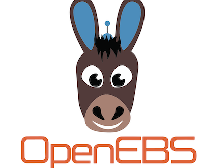
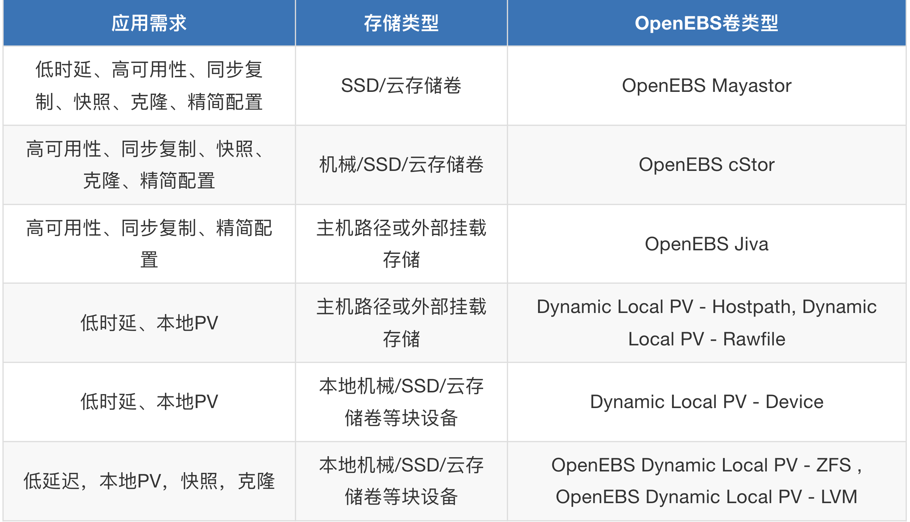
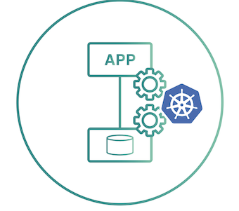
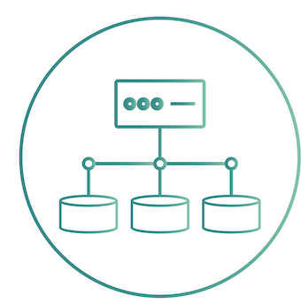
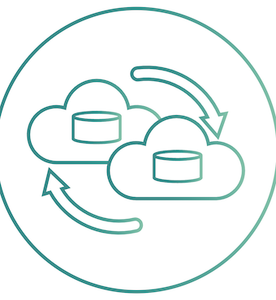
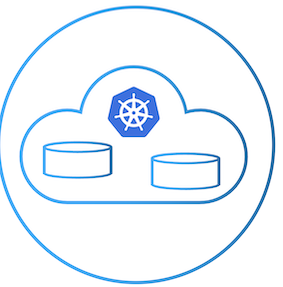
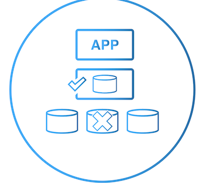
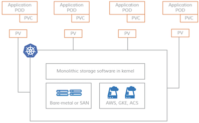
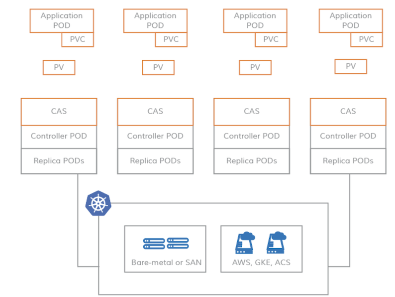

# 1 OpenEBS 简介 2022 

## **OpenEBS是什么？**

OpenEBS是一种开源云原生存储解决方案，托管于CNCF基金会，目前该项目处于沙箱阶段，

OpenEBS是一组存储引擎，允许您为有状态工作负载(StatefulSet)和Kubernetes平台类型选择正确的存储解决方案。 在高层次上，OpenEBS支持两大类卷——**本地卷和复制卷**

OpenEBS是Kubernetes本地超融合存储解决方案，它管理节点可用的本地存储，并为有状态工作负载提供本地或高可用的分布式持久卷。 作为一个完全的Kubernetes原生解决方案的另一个优势是，管理员和开发人员可以使用kubectl、Helm、 Prometheus、Grafana、Weave Scope等Kubernetes可用的所有优秀工具来交互和管理OpenEBS

## **OpenEBS能做什么？**

OpenEBS管理k8s节点上存储，并为k8s有状态负载（StatefulSet）提供本地存储卷或分布式存储卷。

**本地卷（Local Storage）**

* OpenEBS可以使用宿主机裸块设备或分区，或者使用Hostpaths上的子目录，或者使用LVM、ZFS来创建持久化卷
* 本地卷直接挂载到Stateful Pod中，而不需要OpenEBS在数据路径中增加任何开销
* OpenEBS为本地卷提供了额外的工具，用于监控、备份/恢复、灾难恢复、由ZFS或LVM支持的快照等

**对于分布式卷(即复制卷)**

* OpenEBS使用其中一个引擎(Mayastor、cStor或Jiva)为每个分布式持久卷创建微服务
* 有状态Pod将数据写入OpenEBS引擎，OpenEBS引擎将数据同步复制到集群中的多个节点。 OpenEBS引擎本身作为pod部署，并由Kubernetes进行协调。 当运行Stateful Pod的节点失败时，Pod将被重新调度到集群中的另一个节点，OpenEBS将使用其他节点上的可用数据副本提供对数据的访问
* 有状态的Pods使用iSCSI (cStor和Jiva)或NVMeoF (Mayastor)连接OpenEBS分布式持久卷
* OpenEBS cStor和Jiva专注于存储的易用性和持久性。它们分别使用自定义版本的ZFS和Longhorn技术将数据写入存储。 OpenEBS Mayastor是最新开发的以耐久性和性能为设计目标的引擎，高效地管理计算(大页面、核心)和存储(NVMe Drives)，以提供快速分布式块存储

**注意:**

**OpenEBS分布式块卷被称为复制卷，以避免与传统的分布式块存储混淆，传统的分布式块存储倾向于将数据分布到集群中的许多节点上。** 

复制卷是为云原生有状态工作负载设计的，这些工作负载需要大量的卷，这些卷的容量通常可以从单个节点提供，而不是使用跨集群中的多个节点分片的单个大卷

## **对比传统分布式存储**

OpenEBS与其他传统存储解决方案不同的几个关键方面:

* 使用微服务体系结构构建，就像它所服务的应用程序一样。 OpenEBS本身作为一组容器部署在Kubernetes工作节点上。使用Kubernetes本身来编排和管理OpenEBS组件
* 完全建立在用户空间，使其高度可移植性，以运行在任何操作系统/平台。
* 完全意图驱动，继承了Kubernetes易用性的相同原则
* OpenEBS支持一系列存储引擎，因此开发人员可以部署适合于其应用程序设计目标的存储技术。 像Cassandra这样的分布式应用程序可以使用LocalPV引擎进行最低延迟的写操作。 像MySQL和PostgreSQL这样的单片应用程序可以使用使用NVMe和SPDK构建的Mayastor或基于ZFS的cStor来实现弹性。 像Kafka这样的流媒体应用程序可以在边缘环境中使用NVMe引擎Mayastor以获得最佳性能。

驱使用户使用OpenEBS的主要原因是:

* 在所有的Kubernetes发行版上都是可移植的
* 提高了开发人员和平台SRE的生产力
* 与其他解决方案相比，易于使用
* 优秀的社区支持
* 免费开源

> 本地卷类型

**本地卷只能从集群中的单个节点访问。必须在提供卷的节点上调度使用Local Volume的Pods。**

本地卷通常是分布式工作负载的首选，比如Cassandra、MongoDB、Elastic等，这些工作负载本质上是分布式的，并且内置了高可用性（分片）

根据附加到Kubernetes工作节点上的存储类型，您可以从不同的动态本地PV进行选择——Hostpath、Device、LVM、ZFS或Rawfile

> 可复制卷类型

`复制卷` 顾名思义，是指将数据同步复制到多个节点的卷。**卷可以支持节点故障。还可以跨可用性区域设置复制，以帮助应用程序跨可用性区域移动。**

复制卷还能够提供像快照、克隆、卷扩展等企业存储特性。复制卷是有状态工作负载(如Percona/MySQL、Jira、GitLab等)的首选。

根据附加到Kubernetes工作节点的存储类型和应用程序性能需求，您可以从Jiva、cStor或Mayastor中进行选择

## **OpenEBS存储引擎建议**

总结：

* 多机环境，如果有额外的块设备（非系统盘块设备）作为数据盘，选用OpenEBS Mayastor、OpenEBS cStor
* 多机环境，如果没有额外的块设备（非系统盘块设备）作为数据盘，仅单块系统盘块设备，选用OpenEBS Jiva
* 单机环境，建议本地路径Dynamic Local PV - Hostpath, Dynamic Local PV - Rawfile，由于单机多用于测试环境，数据可靠性要求较低。

## **OpenEBS特性**

### **容器附加存储**

OpenEBS是一个容器附加存储(Container Attached Storage, CAS)的例子。 通过OpenEBS提供的卷总是被容器化。每个卷都有一个专用的存储控制器，用于提高有状态应用程序的持久性存储操作的敏捷性和粒度。

### **同步复制**

同步复制是OpenEBS的一个可选的流行特性。 当与Jiva、cStor和Mayastor存储引擎一起使用时，OpenEBS可以同步复制数据卷以实现高可用性。 跨Kubernetes区域进行复制，从而为跨AZ设置提供高可用性。 这个特性对于使用GKE、EKS和AKS等云提供商服务上的本地磁盘构建高可用状态应用程序特别有用

### **快照和克隆**

写时拷贝快照是OpenEBS另一个可选的流行特性。 **使用cStor引擎时，快照是瞬时创建的，并且不受快照个数的限制。** 

增量快照功能增强了跨Kubernetes集群和跨不同云提供商或数据中心的数据迁移和可移植性。 对快照和克隆的操作完全以Kubernetes原生方法执行，使用标准kubectl命令。 常见的用例包括用于备份的高效复制和用于故障排除或针对数据的只读副本进行开发的克隆

### **备份和恢复**

OpenEBS卷的备份和恢复可以通过开源的OpenEBS Velero插件与Kubernetes备份和恢复解决方案(如Velero(前身为Heptio Ark))协同工作。 

经常使用OpenEBS增量快照功能，将数据备份到AWS S3、GCP object storage、MinIO等对象存储目标。 这种存储级别的快照和备份只使用增量数据进行备份，节省了大量的带宽和存储空间。

### **真正的Kubernetes云原生存储**

OpenEBS是Kubernetes上有状态应用程序的云原生存储，云原生意味着遵循松散耦合的体系结构。 因此，云原生、松散耦合体系结构的一般好处是适用的。 例如，开发人员和DevOps架构师可以使用标准的Kubernetes技能和实用程序来配置、使用和管理持久存储需求

### **减少存储TCO高达50%**

在大多数云上，块存储的收费是基于购买的多少，而不是使用的多少; 

为了实现更高的性能，并在充分利用容量时消除中断的风险，容量经常被过度配置。 

OpenEBS的精简配置能力可以共享本地存储或云存储，然后根据需要增加有状态应用程序的数据量。 可以动态添加存储，而不会中断暴露给工作负载或应用程序的卷。 某些用户报告说，由于使用了OpenEBS的精简配置，节省了超过60%的资源。

### **高可用性**

由于OpenEBS遵循CAS架构，在节点故障时，Kubernetes将重新调度OpenEBS控制器，而底层数据则通过使用一个或多个副本来保护。

更重要的是——因为每个工作负载都可以利用自己的OpenEBS——不存在因存储丢失而导致系统大范围宕机的风险。 

例如，卷的元数据不是集中的，它可能会像许多共享存储系统那样受到灾难性的通用中断的影响。 相反，元数据保持在卷的本地。丢失任何节点都会导致只存在于该节点上的卷副本的丢失。 由于卷数据至少在其他两个节点上进行了同步复制，因此当一个节点出现故障时，这些数据将在相同的性能级别上继续可用

## **CAS介绍**

在CAS或容器附加存储(Container Attached Storage)体系结构中，**存储在容器中运行，并且与存储绑定到的应用程序密切相关**。 

**存储作为微服务运行，没有内核模块依赖关系**。 像Kubernetes这样的编排系统编排存储卷，就像任何其他微服务或容器一样。CAS具有DAS和NAS的优点

### **非CAS系统上的pv**

在非CAS模型中，Kubernetes持久卷仍然与内核模块紧密耦合，使得Kubernetes节点上的存储软件本质上是单片的

### **基于CAS系统上的pv**

相反，CAS使您能够利用云原生应用程序的灵活性和可伸缩性。 定义Kubernetes PV (Persistent Volume)的存储软件是基于微服务架构的。 存储软件的控制平面(存储控制器)和数据平面(存储副本)作为Kubernetes Pods运行，因此，使您能够将云原生的所有优势应用到CAS。

### **CAS优势**

**敏捷**

CAS中的每个存储卷都有一个容器化的存储控制器和相应的容器化副本。 因此，围绕这些组件的资源的维护和调优是真正敏捷的。 Kubernetes滚动升级功能可以实现存储控制器和存储副本的无缝升级。可以使用容器cGroups调优CPU和内存等资源配额。

* **存储策略粒度化**

将存储软件容器化并将存储控制器专用于每个卷可以带来最大的存储策略粒度。 在CAS体系结构中，可以按卷配置所有存储策略。 此外，您可以监视每个卷的存储参数，并动态更新存储策略，以实现每个工作负载的预期结果。 随着卷存储策略中这种额外粒度级别的增加，存储吞吐量、IOPS和延迟的控制也会增加。

* **云原生**

CAS将存储软件装入容器，并使用Kubernetes自定义资源定义(CRDs)来声明低级存储资源，如磁盘和存储池。 这个模型使存储能够无缝地集成到其他云原生工具中。 可以使用Prometheus、Grafana、Fluentd、Weavescope、Jaeger等云原生工具来供应、监控和管理存储资源

* PV是CAS中的一个微服务

如上图所示，在CAS架构中，存储控制器和副本的软件完全是基于微服务的，因此不涉及内核组件。 通常，存储控制器POD被调度在与持久卷相同的节点上，以提高效率，副本POD可以被调度在集群节点上的任何位置。 每个副本使用本地磁盘、SAN磁盘和云磁盘的任意组合完全独立于其他副本进行配置。 这为大规模管理工作负载的存储分配提供了巨大的灵活性。

* 超融合非分布式

CAS架构没有遵循典型分布式存储架构。通过从存储控制器到存储副本的同步复制，存储变得高度可用。 卷副本的元数据不是在节点之间共享的，而是在每个本地节点上独立管理。 如果一个节点故障，存储控制器(在本例中是一个无状态容器)将在一个节点上轮转，该节点上运行着第二个或第三个副本，数据仍然可用。

与超融合系统类似，CAS中的卷的存储和性能是可扩展的。由于每个卷都有自己的存储控制器，因此存储可以在一个节点的存储容量允许的范围内进行扩展。 在给定的Kubernetes集群中，随着容器应用程序数量的增加，会增加更多的节点，从而提高存储容量和性能的整体可用性，从而使存储对新的应用程序容器可用。 这一过程与Nutanix等成功的超融合系统非常相似。

