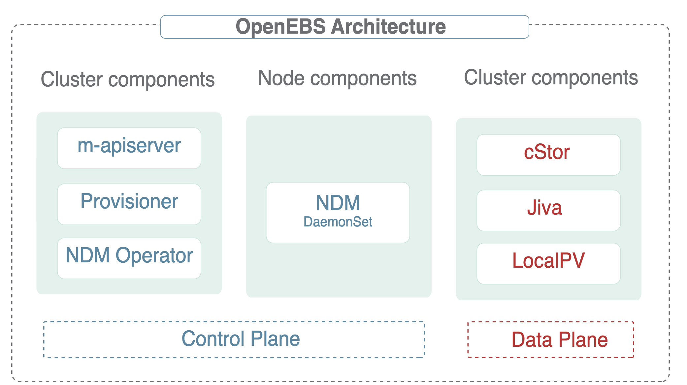
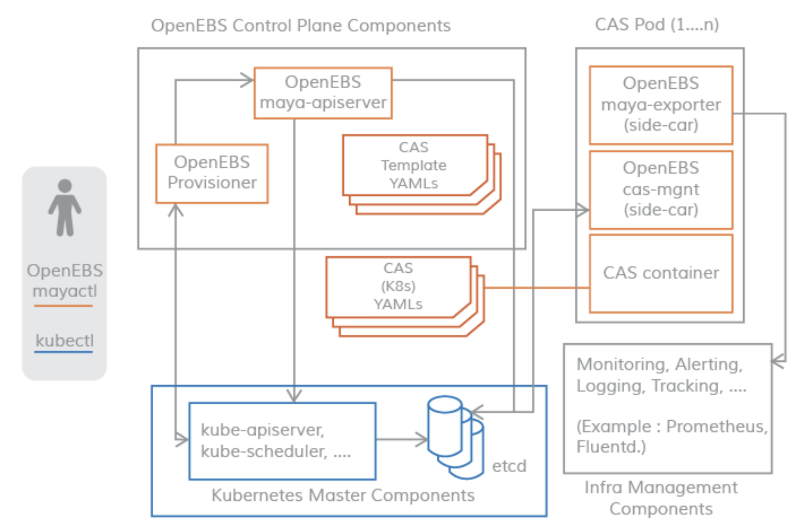
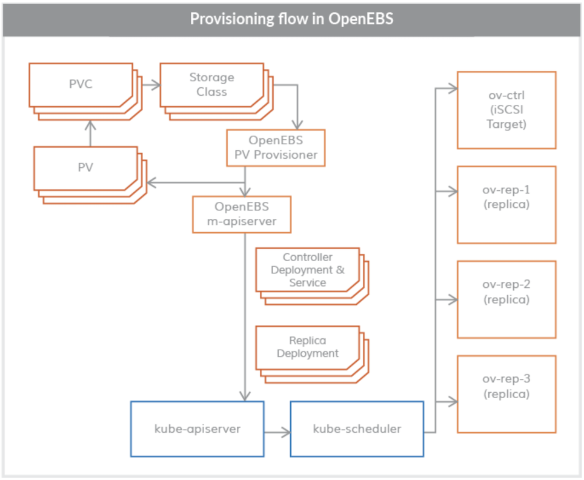
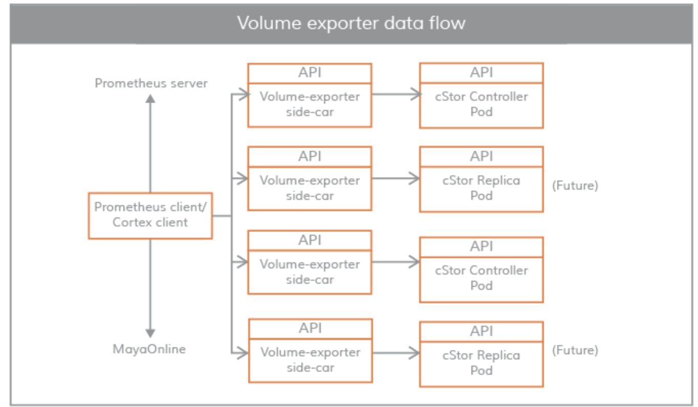
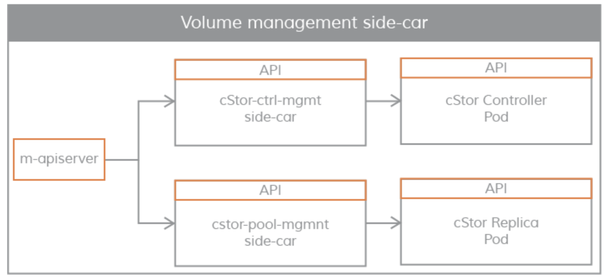
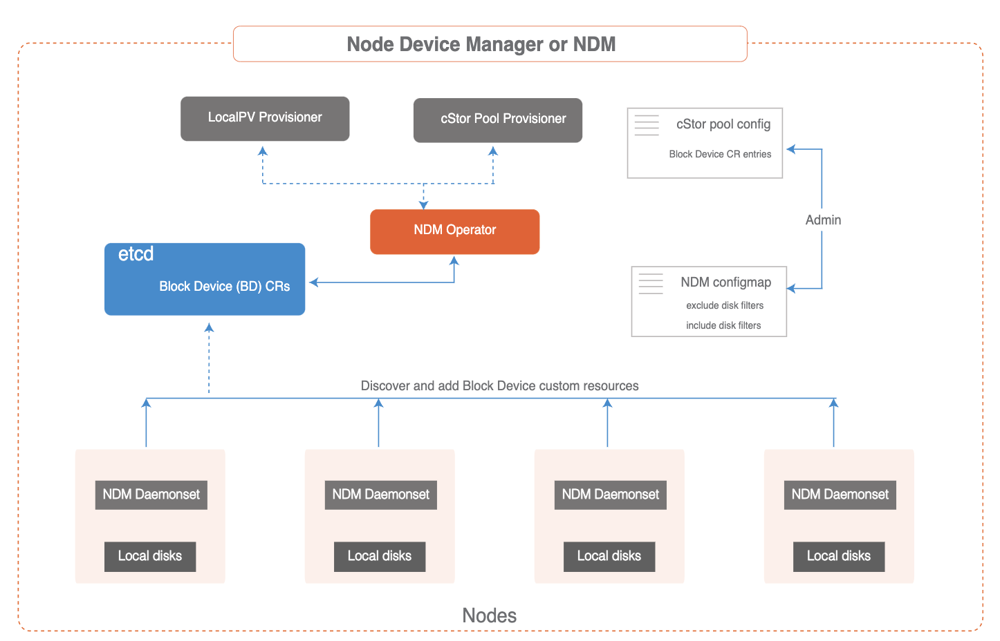

# **2 OpenESB架构介绍2022**

OpenESB遵循容器附加存储（CAS）模型，每个卷都有一个专用的控制器POD和一组副本POD。 CAS体系结构的优点在CNCF博客 上进行了讨论。 

OpenEBS操作和使用都很简单，因为它看起来和感觉上就像其他云原生和Kubernetes友好的项目。

OpenEBS有许多组件，可以分为以下类别:

* 控制面组件 - Provisioner, API Server, volume exports,volume sidecars
* 数据面组件 - Jiva、cStor
* 节点磁盘管理器 - Discover, monitor, 管理连接k8s的媒介
* 与云原生工具的集成 - 已经与Prometheus,Grafana, Fluentd、Jaeger集成

## **控制面**

OpenEBS集群的控制平面通常被称为Maya

OpenEBS控制平面负责提供卷、相关的卷操作，如快照、克隆、创建存储策略、执行存储策略、导出Prometheus/grafana使用的卷指标，等等。

OpenEBS提供了一个动态提供程序，这是Kubernetes的标准外部存储插件。 OpenEBS PV提供者的主要任务是向应用程序PODS启动卷供应，并实现PV的Kubernetes规范。

**`m-apiserver` 开放存储的REST API，并承担大量卷策略处理和管理工作**。

控制平面和数据平面之间的连通性使用Kubernetes sidecar模式。控制平面需要与数据平面通信的场景如下所示。

* 对于卷的统计，如IOPS，吞吐量，延迟等--通过卷暴漏的sidecar实现
* 使用卷控制器pod执行卷策略，使用卷副本pod进行磁盘/池管理-通过卷管理sidecar实现

### **OpenEBS PV Provisioner**

此组件作为POD运行，并做出配置决策,它的使用方式是:

开发人员用所需的卷参数构造一个声明，选择适当的存储类，并在YAML规范上调用kubelet。 OpenEBS PV动态提供程序与maya-apiserver交互，在适当的节点上为卷控制器pod和卷副本pod创建部署规范。 可以使用PVC规范中的注释来控制卷Pod(控制器/副本)的调度。

目前，OpenEBS Provisioner只支持一种绑定类型，即iSCSI。

### **Maya-ApiServer**

`m-apiserver`作为POD运行。顾名思义，m-apiserver公开OpenEBS REST api

`m-apiserver`还负责创建创建卷pod所需的部署规范文件。 

**在生成这些规范文件之后，它将调用`kube-apiserve`r来相应地调度这些pods**。 

OpenEBS PV提供者在卷发放结束时，将创建一个PV对象并将其挂载到应用程序pod上。 PV由控制器pod承载，控制器pod由不同节点中的一组副本pod支持。 控制器pod和复制pod是数据平面的一部分，在存储引擎部分有更详细的描述。

**m-apiserver的另一个重要任务是卷策略管理**。OpenEBS为表示策略提供了非常细粒度的规范。 m-apiserver解释这些YAML规范，将它们转换为可执行的组件，并通过容量管理sidecar来执行它们

### **Maya Volume Exporter**

Maya卷导出器是每个存储控制器pod的sidecar

这些sidecar将控制平面连接到数据平面以获取统计信息。统计信息的粒度在卷级别。一些统计数据示例如下：

* 卷读取延迟
* 卷写入延迟
* 卷每秒读取速度
* 卷每秒写入速度
* 读取块大小
* 写入块大小
* 容量统计

**这些统计信息通常由Prometheus客户端来拉取，该客户端在OpenBS安装期间安装和配置**

### **卷管理sidecar**

Sidecars还用于将控制器配置参数和卷策略传递给卷控制器pod(卷控制器pod是一个数据平面)， 并将副本配置参数和副本数据保护参数传递给卷副本pod。

## **数据面**

OpenEBS数据平面负责实际的卷IO路径。存储引擎在数据平面实现实际的IO路径。 

目前，OpenEBS提供了两个可以轻松插入的存储引擎。它们被称为Jiva和cStor。 这两个存储引擎都完全运行在Linux用户空间中，并基于微服务架构。

### **Jiva**

Jiva存储引擎基于Rancher's LongHorn与gotgt开发实现， 使用go语言开发，并运行于用户命名空间下。 LongHorn控制器将输入的IO同步复制到LongHorn副本。该副本将Linux稀疏文件视为构建存储特性(如精简配置、快照、重建等)的基础。

### **cStor**

cStor数据引擎使用C语言编写，具有高性能的`iSCSI target`和`Copy-On-Write`块系统，提供数据完整性、数据弹性和时间点的快照和克隆。

cStor有一个池特性，它以条带、镜像或RAIDZ模式聚合一个节点上的磁盘，以提供更大的容量和性能单位。 cStor还可以跨区域将数据同步复制到多个节点，从而避免节点丢失或节点重启导致数据不可用。

### **LocalPV**

对于那些不需要存储级复制的应用程序，LocalPV可能是很好的选择，因为它能提供更高的性能。 OpenEBS LocalPV与Kubernetes LocalPV类似，不同之处在于它是由OpenEBS控制平面动态提供的， 就像任何其他常规PV一样。

OpenEBS LocalPV有两种类型`:hostpath LocalPV`和`device LocalPV`。 hostpath LocalPV指的是主机上的子目录，LocalPV指的是在节点上发现的磁盘(可以是直接连接的，也可以是网络连接的)。 OpenEBS引入了一个LocalPV提供者，用于根据PVC和存储类规范中的一些标准选择匹配的磁盘或主机路径。

### **节点磁盘管理器**

节点磁盘管理器(NDM)填补了使用Kubernetes管理有状态应用程序的持久存储所需的工具链的空白。 

容器时代的DevOps架构师必须以一种自动化的方式满足应用程序和应用程序开发人员的基础设施需求， 这种方式可以跨环境提供弹性和一致性。这些要求意味着存储堆栈本身必须非常灵活， 以便Kubernetes和云原生生态系统中的其他软件可以轻松地使用这个堆栈。 

NDM在Kubernetes的存储堆栈中起着基础性的作用，它统一了不同的磁盘， 并通过将它们标识为Kubernetes对象，提供了将它们汇聚的能力。 

**此外，NDM发现、提供、监视和管理底层磁盘的方式，可以让Kubernetes PV提供者(如OpenEBS和其他存储系统)和Prometheus管理磁盘子系统**

