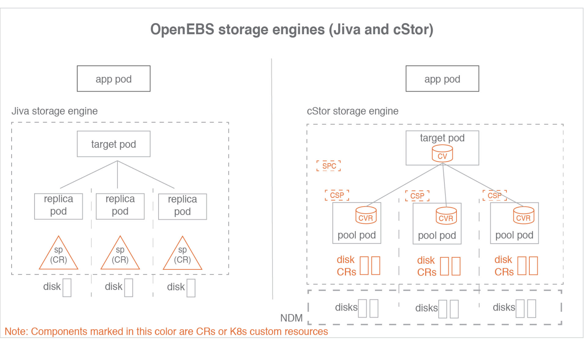
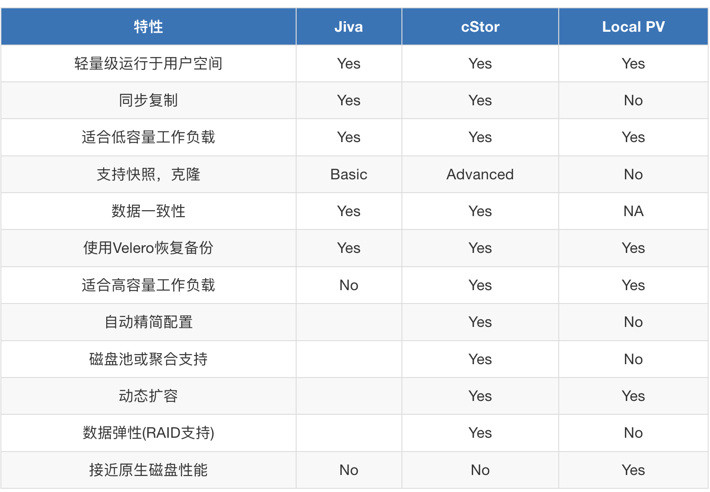
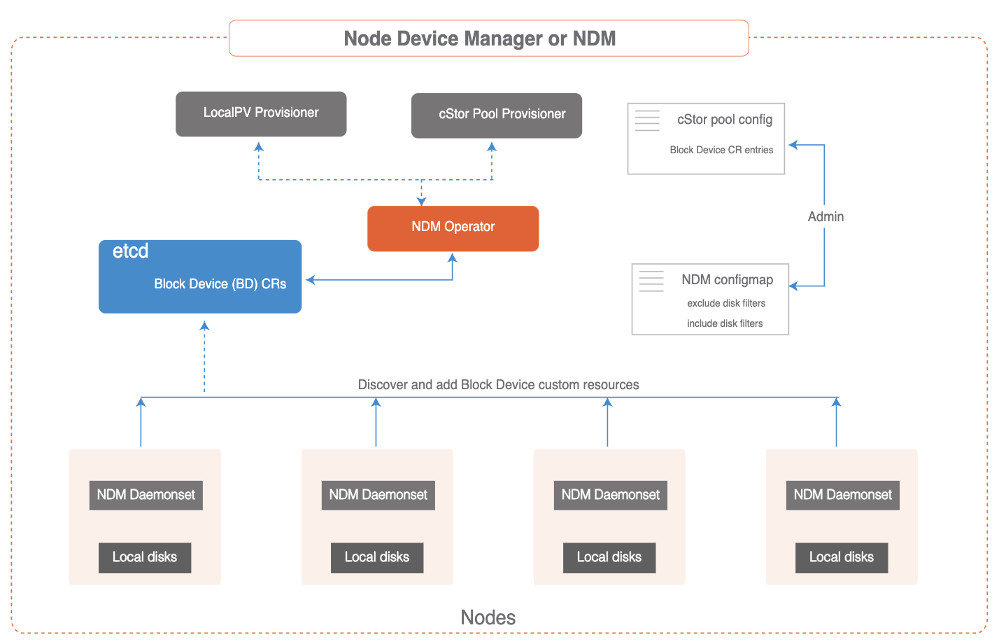

# **OpenEBS CAS引擎**

## **存储引擎概述**

存储引擎是持久化卷IO路径的数据平面组件。 在CAS架构中，用户可以根据不同的配置策略，为不同的应用工作负载选择不同的数据平面。 存储引擎可以通过特性集或性能优化给定的工作负载。

操作员或管理员通常选择具有特定软件版本的存储引擎，并构建优化的卷模板， 这些卷模板根据底层磁盘的类型、弹性、副本数量和参与Kubernetes集群的节点集进行微调。 用户可以在发放卷时选择最优的卷模板，从而在给定的Kubernetes集群上为所有存储卷运行最优的软件和存储组合提供最大的灵活性。

## **存储引擎类型**

OpenEBS提供了三种存储引擎

### **Jiva**

Jiva是OpenEBS 0.1版中发布的第一个存储引擎，使用起来最简单。它基于GoLang开发，内部使用LongHorn和gotgt堆栈。 Jiva完全在用户空间中运行，并提供同步复制等标准块存储功能。 Jiva通常适用于容量较小的工作负载，不适用于大量快照和克隆特性是主要需求的情况

### **cStor**

cStor是OpenEBS 0.7版本中最新发布的存储引擎。cStor非常健壮，提供数据一致性，很好地支持快照和克隆等企业存储特性。 它还提供了一个健壮的存储池特性，用于在容量和性能方面进行全面的存储管理。 cStor与NDM (Node Disk Manager)一起，为Kubernetes上的有状态应用程序提供完整的持久化存储特性

### **OpenEBS Local PV**

OpenEBS Local PV是一个新的存储引擎，它可以从本地磁盘或工作节点上的主机路径创建持久卷或PV。 CAS引擎可以从OpenEBS的1.0.0版本中获得。使用OpenEBS Local PV，性能将等同于创建卷的本地磁盘或文件系统(主机路径)。 许多云原生应用程序可能不需要复制、快照或克隆等高级存储特性，因为它们本身就提供了这些特性。这类应用程序需要以持久卷的形式访问管理的磁盘




* SP 存储池，表示Jiva自定义存储资源
* CV cStor卷，表示cStor卷自定义资源
* CVR cStor卷副本
* SPC 存储池声明，表示cStor池聚合的自定义资源
* CSP cStor存储池，表示cStor Pool每个节点上的自定义资源

一个SPC对应多个CSP，相应的一个CV对应多个CVR

##  **存储引擎声明**

通过指定注释`openebs`来选择存储引擎。 **StorageClass规范中的`io/cas-type`。StorageClass定义了提供程序的细节**。

为每个CAS引擎指定单独的供应程序。

### **cStor存储类规范文件内容**

```
---
apiVersion: storage.k8s.io/v1
kind: StorageClass
metadata:
  name: cStor-storageclass
  annotations:
    openebs.io/cas-type: cstor
    cas.openebs.io/config: |
      - name: StoragePoolClaim
        value: "cStorPool-SSD"
provisioner: openebs.io/provisioner-iscsi
---
```

### **Jiva存储类规范文件内容**

```
---
apiVersion: storage.k8s.io/v1
kind: StorageClass
metadata:
  name: jiva-storageclass
  annotations:
    openebs.io/cas-type: jiva
    cas.openebs.io/config: |
      - name: StoragePool
        value: default
provisioner: openebs.io/provisioner-iscsi
---
```

当cas类型为Jiva时，StoragePool的default值具有特殊含义。 

当`pool`为默认值时，Jiva引擎将从容器(副本pod)本身的存储空间中为副本pod开辟数据存储空间。 当所需的卷大小很小(比如5G到10G)时，StoragePool default工作得很好，因为它可以容纳在容器本身内。

### **Local PV存储类规范文件内容-主机路径**

```
---
apiVersion: storage.k8s.io/v1
kind: StorageClass
metadata:
  name: localpv-hostpath-sc
  annotations:
    openebs.io/cas-type: local
    cas.openebs.io/config: |
      - name: BasePath
        value: "/var/openebs/local"
      - name: StorageType
        value: "hostpath"
provisioner: openebs.io/local
---
```

### **Local PV存储类规范文件内容-主机设备**

```
---
apiVersion: storage.k8s.io/v1
kind: StorageClass
metadata:
  name: localpv-device-sc
  annotations:
    openebs.io/cas-type: local
    cas.openebs.io/config: |
      - name: StorageType
        value: "device"
      - name: FSType
        value: ext4
provisioner: openebs.io/local
---
```

cStor、Jiva、LocalPV特性比较：




大多数场景推荐cStor，因其提供了强大的功能，包括快照/克隆、存储池功能（如精简资源调配、按需扩容等）。

Jiva适用于低容量需求的工作负载场景，例如5到50G。 尽管使用Jiva没有空间限制，但建议将其用于低容量工作负载。 Jiva非常易于使用，并提供企业级容器本地存储，而不需要专用硬盘。 有快照和克隆功能的需求的场景，优先考虑使用cStor而不是Jiva。

## **CAS引擎使用场景**

如上表所示，每个存储引擎都有自己的优势。 选择引擎完全取决于应用程序的工作负载以及它当前和未来的容量和/或性能增长。 下面的指导原则在定义存储类时为选择特定的引擎提供一些帮助。

### **选择cStor的理想条件**

* 当需要同步复制数据并在节点上有多个磁盘时
* 当您从每个节点上的本地磁盘或网络磁盘池管理多个应用程序的存储时。 通过精简配置、存储池和卷的按需扩容、存储池的性能按需扩容等特性，实现对存储层的管理。 cStor用于在本地运行的Kubernetes集群上构建Kubernetes本地存储服务，类似于AWS EBS或谷歌PD。
* 当需要存储级快照和克隆能力时
* 当您需要企业级存储保护特性，如数据一致性、弹性(RAID保护)。
* 如果您的应用程序不需要存储级复制，那么使用OpenEBS主机路径LocalPV或OpenEBS设备LocalPV可能是更好的选择。

### **选择Jiva的理想条件:**

* 当您想要数据的同步复制，并且拥有单个本地磁盘或单个管理磁盘(如云磁盘(EBS、GPD))，并且不需要快照或克隆特性时
* Jiva是最容易管理的，因为磁盘管理或池管理不在这个引擎的范围内。Jiva池是本地磁盘、网络磁盘、虚拟磁盘或云磁盘的挂载路径。
* 以下场景Jiva更优于cStor:
	* 当程序不需要存储级的快照、克隆特性
	* 当节点上没有空闲磁盘时。Jiva可以在主机目录上使用，并且仍然可以实现复制。
	* 当不需要动态扩展本地磁盘上的存储时。将更多磁盘添加到Jiva池是不可能的，因此Jiva池的大小是固定的，如果它在物理磁盘上。 但是，如果底层磁盘是虚拟磁盘、网络磁盘或云磁盘，则可以动态地更改Jiva池的大小
	* 容量需求较小。大容量应用通常需要动态增加容量，cStor更适合这种需求

### **选择OpenEBS主机路径LocalPV的理想条件:**

* 当应用程序本身具备管理复制能力（例如：es）时，不需要在存储层进行复制。在大多数这样的情况下，应用程序是作为statefulset部署的
* 高于Jiva与cStor的读写性能需求
* 当特定应用程序没有专用的本地磁盘或特定应用程序不需要专用的存储时，建议使用Hostpath。 如果您想跨多个应用程序共享一个本地磁盘，主机路径LocalPV是正确的方法

### **选择OpenEBS主机设备LocalPV的理想条件:**

* 当应用程序管理复制本身，不需要在存储层进行复制时。在大多数这种情况下，应用程序被部署为有状态集
* 高于Jiva与cStor的读写性能需求
* 高于OpenEBS主机路径LocalPV的读写性能需求
* 当需要接近磁盘性能时。该卷专用于写入单个SSD或NVMe接口以获得最高性能

### **总结**

* 如果应用程序处于生产中，并且不需要存储级复制，那么首选LocalPV
* 如果您的应用程序处于生产状态，并且需要**存储级复制**，那么首选cStor
* **如果应用程序较小，需要存储级复制，但不需要快照或克隆，**则首选Jiva


## **节点磁盘管理器（NDM）**

节点磁盘管理器(NDM)是OpenEBS体系结构中的一个重要组件。 NDM将块设备视为需要监视和管理的资源，就像CPU、内存和网络等其他资源一样。 它是一个在每个节点上运行的守护进程，基于过滤器检测附加的块设备，并将它们作为块设备自定义资源加载到Kubernetes中。这些定制资源旨在通过提供类似于:

* 轻松访问Kubernetes集群中可用的块设备清单
* 预测磁盘的故障，以帮助采取预防措施
* 允许动态地将磁盘挂载/卸载到存储Pod中，而无需重新启动在磁盘挂载/卸载的节点上运行的相应NDM Pod

尽管做了上述所有工作，NDM还是有助于提供持久卷的总体简化。



NDM是在OpenEBS安装期间作为守护进程部署的。NDM daemonset发现每个节点上的磁盘，并创建一个名为Block Device或BD的自定义资源。

### **访问权限说明**

NDM守护进程运行在容器中，必须访问底层存储设备并以特权模式运行。 NDM需要特权模式，因为它需要访问`/dev`、`/proc`和`/sys`目录来监视附加设备，还需要使用各种探测器获取附加设备的详细信息。 NDM负责发现块设备并过滤掉不应该被OpenEBS使用的设备;

例如，检测有OS文件系统的磁盘。 NDM pod默认情况下在容器中挂载主机的`/proc`目录，然后加载`/proc/1/mounts`，以找到操作系统使用的磁盘

### **NDM守护程序功能**

发现Kubernetes节点上的块设备

* 在启动时发现块设备-创建和/或更新状态。
* 维护集群范围内磁盘的唯一id: 对WWN / PartitionUUID / FileSystemUUID / DeviceMapperUUID进行Hash计算


检测节点中添加/移除块设备，并更新块设备状态

添加块设备作为Kubernetes自定义资源，具有以下属性：

* spec: 如果可用，将更新以下内容

	* 设备路径
	* 设备链接
	* 供应商和型号信息
	* WWN和序列号
	* 容量
	* 扇区和区块大小

* labels:

	* 主机名称(kubernetes.io/hostname)
	* 块设备类型(ndm.io/blockdevice-type)
	* Managed (ndm.io/managed)

* status: 状态可以有以下值

	* Active : 节点上存在块设备
	* Inactive : 给定节点上不存在块设备
	* Unknown : NDM在块设备最后被检测到的节点上停止/无法确定状态

* **过滤器**

* 为要创建块设备CR的块设备类型配置过滤器。过滤器可以通过供应商类型、设备路径模式或挂载点进行配置
* 过滤器可以是包含过滤器，也可以是排除过滤器。它们被配置为configmap。 管理员用户可以在OpenEBS安装时通过更改OpenEBS操作员yaml文件或helm值中的NDM configmap来配置这些过滤器。 yaml文件。如果这些过滤器需要在安装后更新，那么可以遵循以下方法之一:
	* 使用operator方式安装OpenEBS。在Yaml文件中，更新configmap中的过滤器并应用operator.yaml
	* 如果OpenEBS是使用helm安装的，更新values.yaml中的configmap并使用helm进行升级
	* 或者，使用kubectl编辑NDM configmap，更新过滤器