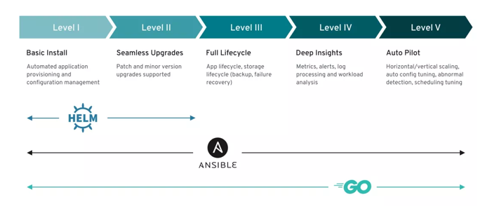

# Ansible Operator

Operator Framework是由CoreOS开发，后被RedHat收购的一个开源工具包，它可以有效的、自动化的和可扩展的方式管理 Kubernetes原生应用程序。


**该框架下包含Operator SDK，可协助开发人员利用自己的专业知识来引导和构建Operator，而无需了解 Kubernetes API复杂性。**

**今天我们就学习它，用于创建一个基于Ansible的Operator应用，它可以利用现有 Ansible playbook和模块来部署和管理Kubernetes资源作为统一应用程序的生命周期，**而无需编写任何Go代码。



## 安装

* Homebrew安装 (MacOS)

如果你使用的是Homebrew，你可以用以下命令安装SDK CLI工具。

```
$ brew install operator-sdk
```

* 二进制安装

```
$ export ARCH=$(case $(uname -m) in x86_64) echo -n amd64 ;; aarch64) echo -n  arm64 ;; *) echo -n $(uname -m) ;; esac)
$ export OS=$(uname | awk '{print tolower($0)}')
$ export OPERATOR_SDK_DL_URL=https://github.com/operator-framework/operator-sdk/releases/download/v1.10.0

#下载operator-sdk
$ curl -LO ${OPERATOR_SDK_DL_URL}/operator-sdk_${OS}_${ARCH}

$ chmod +x operator-sdk_${OS}_${ARCH} && sudo mv operator-sdk_${OS}_${ARCH} /usr/local/bin/operator-sdk
```

* 编译安装

```
$ git clone https://github.com/operator-framework/operator-sdk
$ cd operator-sdk
$ git checkout master
$ make install
```

## 初始化

### 1. 初始化项目

使用operator-sdk命令来快速初始化这个项目的空间。

```
$ mkdir loki-operator
$ cd loki-operator
$ operator-sdk init --plugins=ansible --domain cloudxiaobai.com
```

这条命令生成的文件中有一个Kubebuilder的PROJECT描述文件。从里面我们可以得知，该工程是一个基于Ansible实现的项目

```
$ cat PROJECT

domain: loki.cloudxiaobai.com
layout:
- ansible.sdk.operatorframework.io/v1
plugins:
  manifests.sdk.operatorframework.io/v2: {}
  scorecard.sdk.operatorframework.io/v2: {}
projectName: cloudxiaobai
version: "3"
```

2. 创建API

```
$ operator-sdk create api \
      --group=plugins --version=v1 --kind=Loki \
      --generate-playbook \
      --generate-role
```

上面这条命令可以快速帮助我们生成这个项目的脚手架。其中包含如下内容：


* 生成了Loki这个CRD的定义，和一个Loki CR的样例；
* 生成了Controller，用于管理CR的的服务在Kubernetes集群上的状态
* 生成了`Ansible Playbook`的目录结构
* 生成了一个` watches.yaml`文件，它用来将`CR`资源与`Ansible Playbook`关联起来。
	
## Ansible Playbook

在完成项目的初始化后，我们在项目下就得到了以下主要的目录。

```
├── Dockerfile
├── config
│   ├── samples
│   │   └── plugins_v1_loki.yaml //Loki的CR样例
├── playbooks    //playbook的入口
│   └── loki.yml
├── roles       //playbook文件
│   └── loki
│       ├── README.md
│       ├── defaults
│       │   └── main.yml
│       ├── files
│       ├── handlers
│       │   └── main.yml
│       ├── meta
│       │   └── main.yml
│       ├── tasks
│       │   └── main.yml
│       ├── templates
│       └── vars
│           └── main.yml
```

熟悉Ansible的朋友看到这个就比较眼熟了，接下来我们就开始写入一个Loki服务简单playbook文件来演示它的基本逻辑。

**1. 修改`roles/loki/tasks/main.yaml`**

```
- name: Loki Operator | Loki | StatefulSet
  community.kubernetes.k8s:
    definition: "{{ lookup('template', 'statefulset.yaml') | from_yaml }}"
```

可以看到ansible是通过`community.kubernetes`的k8s模块来跟kubernetes交互的。

上面这条task的意思是让ansible去templates目录下去寻找statefulset.yaml文件，然后将它渲染成yaml文件后提交给kubernetes。

**2.创建 roles/loki/template/statefulset.yaml**

`statefulset.yaml`是真正需要部署的ansible模版文件，我们需要创建的内容如下：

```
#jinja2:lstrip_blocks: True
apiVersion: apps/v1
kind: StatefulSet
metadata:
  name: '{{ansible_operator_meta.name}}'
  namespace: '{{ansible_operator_meta.namespace}}'
  labels:
     app.kubernetes.io/name: '{{ ansible_operator_meta.name }}-loki-system'
spec:
  replicas: {{ replicas }}
  serviceName:  '{{ansible_operator_meta.name}}-headless'
  selector:
    matchLabels:
       app.kubernetes.io/name: '{{ ansible_operator_meta.name }}-loki-system'
  template:
    metadata:
      labels:
         app.kubernetes.io/name: '{{ ansible_operator_meta.name }}-loki-system'
    spec:
      containers:
      - name: loki-system
        image: grafana/loki:2.2.1
        imagePullPolicy: IfNotPresent
        ports:
        - containerPort: 3100
          name: http-3100
          protocol: TCP
```

上面的Ansible应用模版中有几点信息值得强调：


* `#jinja2:lstrip_blocks: True`保留yaml文件中的空格、缩进等语句
* `{{ansible_operator_meta.name}}`定义了CR里面控制的Loki资源名称
* `{{ansible_operator_meta.namespace}}`定义了CR作用的命名空间
* `{{ replicas }}`自定义的CR变量

可以看到我们声明了一个名replicas的自定义变量，我们需要通过它来控制服务的副本数。Ansible中的变量取值由用户创建的CR来控制。


> Ansible的roles文件中task实际上定义了CR的状态，在Kubernetes在创建资源时，由于允许输入任意字段，所以我们不需要在CRD中实际定义CR字段类型的声明。虽然在Operator SDK中它不能被自动生成，不过还是建议在实际使用时最好添加上CRD的字段说明，以便Kubernetes用户在使用CR时可以看到它对应的描述信息。


**3. 创建CR**

默认情况下`Operator SDK`会创建一个默认的CR样例文件，它位于`config/samples/`目录下。在本文中，我们的CR文件名称为`plugins_v1_loki.yaml`

```
apiVersion: plugins.cloudxiaobai.com/v1
kind: Loki
metadata:
  name: loki
spec:
  replicas: 1
```

## 构建与部署

当完成应用的playbook编写后，我们就可以使用make命令进行镜像的构建和上传。我们可以提前编辑Makefile来自定义镜像的名称,

```
IMAGE_TAG_BASE ?= cloudxiaobai.com/cloudxiaobai
IMG ?= $(IMAGE_TAG_BASE):$(VERSION)
```

这样，当我们每次build镜像时，产生固定的镜像名称。

**1. 构建Operator镜像**

```
$ make docker-build docker-push VERSION="0.1"
```

构建和上传operator镜像。

**2. 部署Operator服务**

```
$ make deploy
# kustomize build config/default | kubectl apply -f -
```

可以看到在部署时调用了kustomize将`config/default`目录下的文件进行构建后提交到kubernetes。这里面需要注意的是，默认情况下，kustomize会创建一个名为`<project-name>-system`的新命名空间用于部署Operator。

当部署完成后，我们就可以用kubectl进行验证服务状态。

```

$ kubectl get deployment -n cloudxiaobai--system

NAME                      READY   UP-TO-DATE   AVAILABLE   AGE
loki-controller-manager   1/1     1            1           8m
```

**3. 提交CR**

将上文的CR声明文件提交到kubernetes

```
$ cat config/samples/plugins_v1_loki.yaml

apiVersion: plugins.cloudxiaobai.com/v1
kind: Loki
metadata:
  name: loki
spec:
  replicas: 1

$ kubectl apply -f config/samples/plugins_v1_loki.yaml
```

之后我们就可以通过以下命令进行验证服务是否达到预期

```
$ kubectl get deployment

NAME                                     READY   UP-TO-DATE   AVAILABLE   AGE
cloudxiaobai-31e1d3526-a1klm             1/1     1            1           1m
```
如果我们要调整Loki的副本数，我们只需有修改CR中的replicas变量即可，也可以通过patch的方式修改。


```
$ kubectl patch loki cloudxiaobai  -p '{"spec":{"size": 2    }}' --type=merge
```

**4. 删除资源**

直接执行下列命令就能分别删除CR和Operator关联的所有资源

```
$ kubectl delete -f config/samples/plugins_v1_loki.yaml
$ make undeploy
```

## 小技巧

### 1. Ansible变量转化


自定义CR中的spec字段中所有变量的名称均被操作符转换为`snake_case`（下横线）命名格式。例如，我们在spec中写入了一个变量`serviceAccount`，那么在ansible中会被转成service_account。小白建议可以在watches.yaml中将`snakeCaseParameters`设置为false来禁用这种大小写转换。

### 2. 使用默认值

为了能将ansible template适配大部分场景，小白建议在模版中使用默认值，避免在CR中没有定义变量而造成的playbook执行报错。例如，我们在CR中定义了Loki的镜像信息如下。

```
spec:
  image:
    repository: grafana/loki
    tag: 2.1.1
```

那我们在template就可以如下编写：


```
containers:
      - name: loki-system
        image: '{{service.cluster.loki.image | default('grafana/loki')}}:{{version | default('latest')}}'
```

这里，如果我们没在CR中定义image的变量，当playbook执行到这里时，就会采用`grafana/loki:latest`镜像。

### 3. 巧用items


由于`community.kubernetes.k8s`模块不允许提交一个`allinone`的yaml文件，所以当在实际编写playbook时，如果想在一个task时里面完成所有yaml提交时，我们可以使用如下语句：

```
- name: Loki Operator | Loki | Deploy
  community.kubernetes.k8s:
    definition: "{{ lookup('template', item) | from_yaml }}"
  with_items:
    - statefulset.yaml
    - service.yaml
```

### 4. 控制模块启用或关闭

如果我们的CR中希望能够控制某些服务的启用或关闭时，通常情况下会直接使用`enabled: true`来做明确的定义，例如下面这个CR

```
spec:
  redis:
    enabled: true
```

那么，我们在写playbook时，可以通过在state中判断CR中的该变量来决定是否执行，如下：

```
- name: Loki Operator | Reids Cache | PVC
  community.kubernetes.k8s:
    state: '{{"present" if redis is defined and redis.enabled else "absent"}}'
    definition: "{{ lookup('template', 'redis/pvc.yaml') | from_yaml }}
```

### 5. Owner References

Owner References是Kubernetes中的垃圾删除机制，它能够在删除CR后进行后续清理。默认情况下，`ownerReferences`由代理在ansible执行时注入。

在当CR和被管理的资源在同一个命名空间下时，ownerReferences会在资源中如下显示：

```
metadata:
  ownerReferences:
    - apiVersion: loki.cloudxiaobai.com/v1
      kind: loki
      name: loki
      uid:fda3b711-1f25-4d14-bf84-cf70f48e7ff4
```

CR和被管理的资源不在一个命名空间下时，ownerReferences便是通过如下的annotation字段来定义的：

```
operator-sdk/primary-resource: {metadata.namespace}/{metadata.name}
operator-sdk/primary-resource-type: {kind}.{group}
```

当然，如果你要禁用ownerReferences的话，如下修改dockerfile即可：

```
ENTRYPOINT ["/usr/local/bin/entrypoint", "--inject-owner-ref=false"]
```

### 6. 任务并发


默认情况下，ansible调用的`runtime.NumCPU()`来设置最大并发协调值，可以看到它取决于你主机的CPU核心数。增加并发协调的数量和允许并发处理事件，可以提高ansible执行任务时的协调性能。我们可以在operator的启动参数来手动设置

```
- name: manager
  args:
    - "--max-concurrent-reconciles"
    - "3"
```

## 总结

本文通过一个小例子介绍了如何通过Operator SDK快速构建、管理Loki应用。并通过6个小技巧让读者在使用过程中尽量避坑。

目前小白在实际工作中，将Ansible Operator主要应用在kubernetes平台初始化时各种插件、三方服务的安装管理，如prometheus、loki、grafna等等，希望它也能在其它方面帮助到大家。
