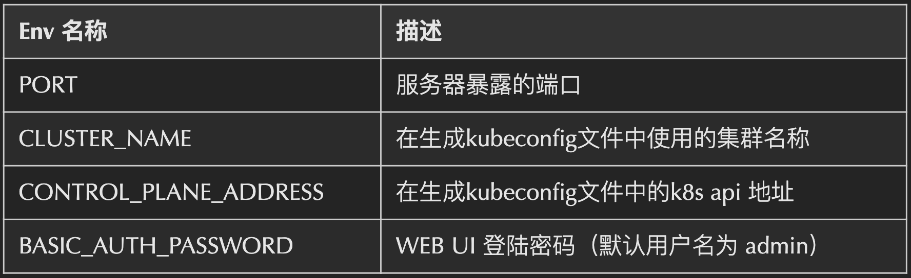
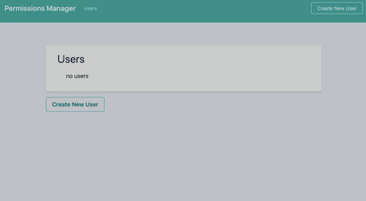
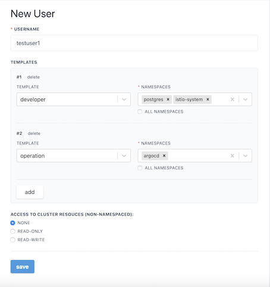
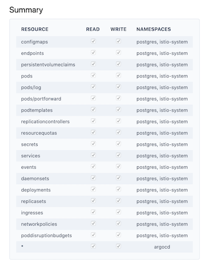
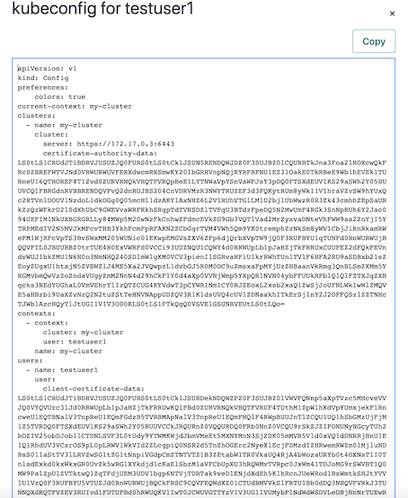

# `Permission Manager`设置的`K8S RBAC`

对于K8S新手来说，`K8S RBAC` 不能很好的掌握，今天推荐一款非常不错的 `K8S RBAC` 配置工具 `permission-manager`，小白都能配置，并且提供 `Web UI` 界面。

详细的RBAC介绍，可以参考 [深入理解 Kubernetes RBAC 的用法](https://github.com/Chao-Xi/JacobTechBlog/blob/master/k8s_tutorial/k8s_adv13_RBAC.md)

### permission-manager 简介

`permission-manager` 是一个用于 `Kubernetes RBAC` 和 用户管理工具。

### permission-manager 部署

**项目地址**

* https://github.com/sighupio/permission-manager
* https://github.com/sighupio/permission-manager/blob/master/docs/installation.md
* [Install Code](seed-install)

**部署依赖**

* Edit  `seed-install/auth-secret.yml` to set your password (admin)
* Then apply these manifests

```
kubectl apply -f auth-secret.yml
kubectl apply -f seed.yml
kubectl apply -f user-crd-definition.yml
```

修改 `Deploy` 必填 `Env` 参数



部署

```
$ kubectl apply -f deploy.yaml
```

访问 WEB UI

```
kubectl port-forward svc/permission-manager-service 4000 --namespace permission-manager
```

the username is `admin` the password is mounted as a secret as `admin`

the application can now be accessed by http://localhost:4000


### 如何添加新权限模板

默认只有 `developer` 和 `operation` 模板，模板都是以 `template-namespaced-resources___` 为开头。

### WEB UI 展示



**创建一个用户**



**创建的用户摘要**



**用户 `Kubeconfig` 文件预览**

