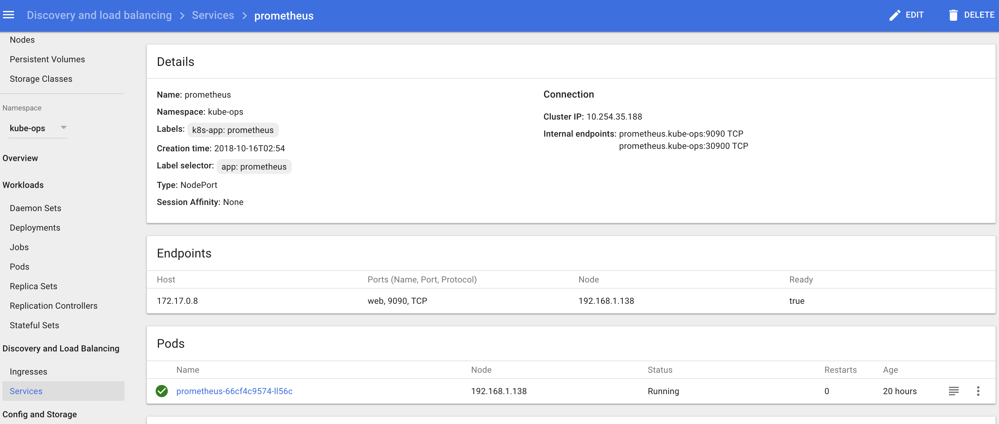
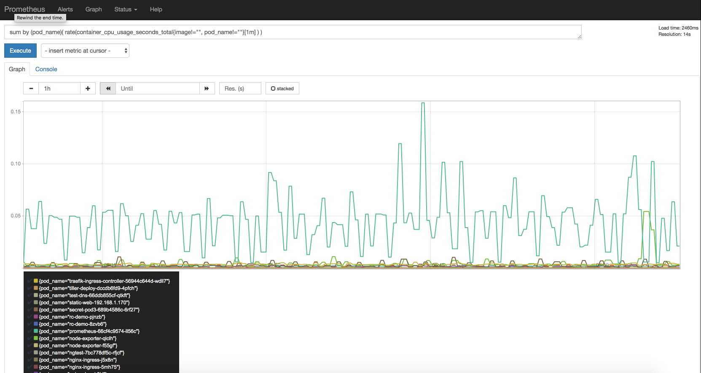
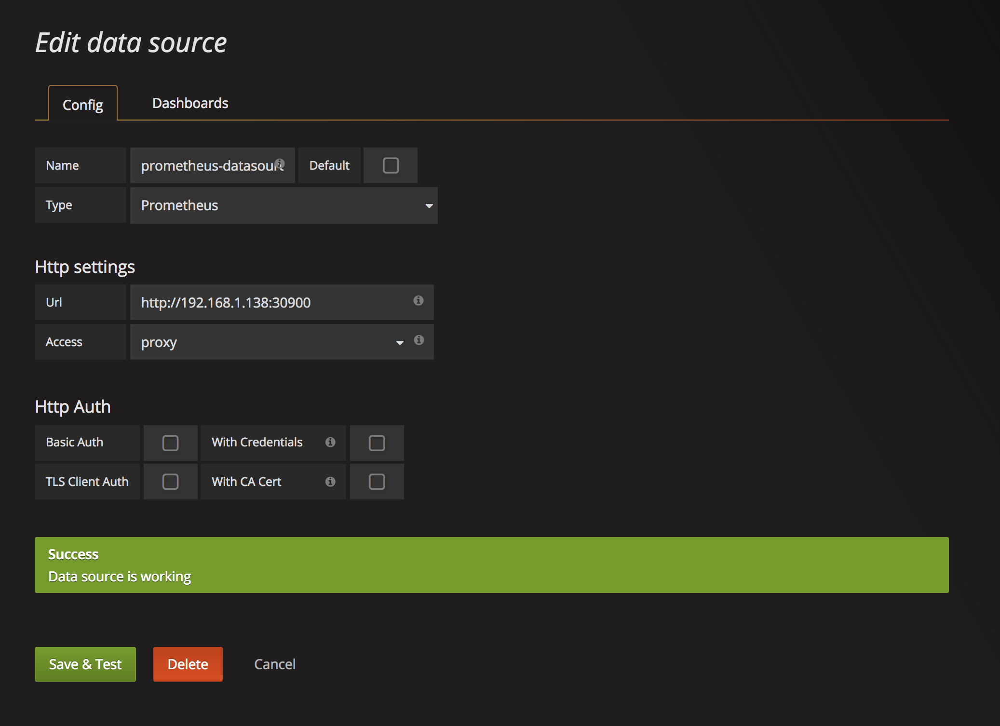
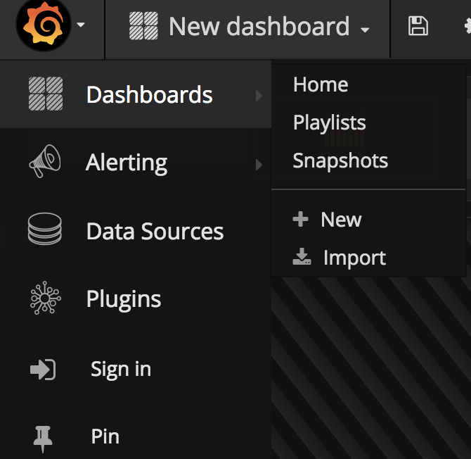
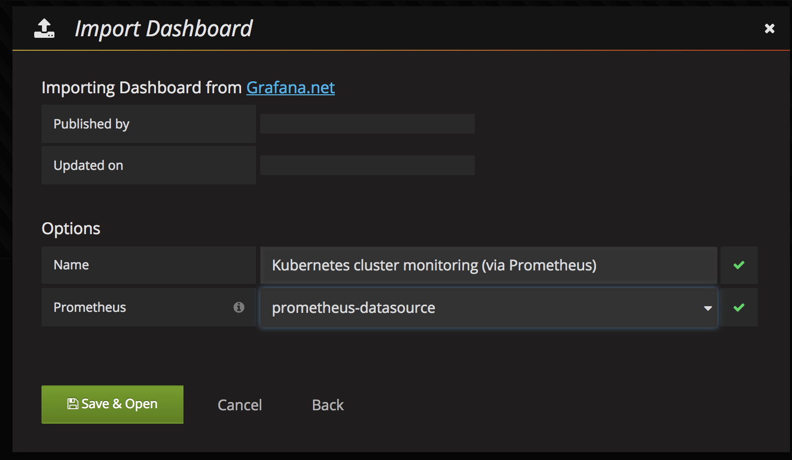
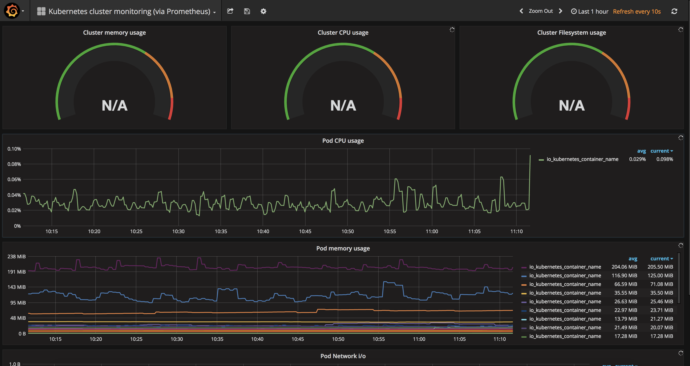

# `Kubernetes` 使用 `Prometheus`搭建监控平台

最近在测试环境搭建了Kubernetes集群环境，一般情况下我们是直接通过Dashboard的资源统计图标进行观察的，但是很显然如果要上到生产环境，就需要更自动化的方式来对集群、Pod甚至容器进行监控了。Kubernetes内置了一套监控方案：**`influxdb+grafana+heapster`**。我们这里使用**`Prometheus`**来完成k8s的集群监控。

## Prometheus 简介

`Prometheus`是`SoundCloud`开源的一款开源软件。它的实现参考了`Google`内部的监控实现，与源自`Google`的`Kubernetes`结合起来非常合适。另外相比`influxdb`的方案，性能更加突出，而且还内置了报警功能。它针对大规模的集群环境设计了拉取式的数据采集方式，你只需要在你的应用里面实现一个`metrics`接口，然后把这个接口告诉`Prometheus`就可以完成数据采集了。

## 安装Prometheus

首先我们使用`namespace`来设置一个新的`kube-ops`的`namespace`用来管理`Prometheus`。(`namespace.yaml`)

```
---
apiVersion: v1
kind: Namespace
metadata:
  name: kube-ops
```

```
$ kubectl create -f namespace.yaml
```
然后我们使用`ConfigMap`的形式来设置`Prometheus`的配置文件，如下(`prometheus-config.yaml`)

```
apiVersion: v1
kind: ConfigMap
metadata:
  name: prometheus-config
  namespace: kube-ops
data:
  prometheus.yml: |
    global:
      scrape_interval: 30s
      scrape_timeout: 30s
    scrape_configs:
    - job_name: 'prometheus'
      static_configs:
        - targets: ['localhost:9090']
    - job_name: 'kubernetes-nodes-cadvisor'
      tls_config:
        ca_file: /var/run/secrets/kubernetes.io/serviceaccount/ca.crt
      bearer_token_file: /var/run/secrets/kubernetes.io/serviceaccount/token
      kubernetes_sd_configs:
      - api_servers:
        - 'https://10.254.0.1'
        in_cluster: true
        role: node
      relabel_configs:
      - action: labelmap
        regex: __meta_kubernetes_node_label_(.+)
      - source_labels: [__meta_kubernetes_role]
        action: replace
        target_label: kubernetes_role
      - source_labels: [__address__]
        regex: '(.*):10250'
        replacement: '${1}:4194'
        target_label: __address__
    - job_name: 'kubernetes-apiserver-cadvisor'
      tls_config:
        ca_file: /var/run/secrets/kubernetes.io/serviceaccount/ca.crt
      bearer_token_file: /var/run/secrets/kubernetes.io/serviceaccount/token
      kubernetes_sd_configs:
      - api_servers:
        - 'https://10.254.0.1'
        in_cluster: true
        role: apiserver
      relabel_configs:
      - action: labelmap
        regex: __meta_kubernetes_node_label_(.+)
      - source_labels: [__meta_kubernetes_role]
        action: replace
        target_label: kubernetes_role
      - source_labels: [__address__]
        regex: '(.*):10250'
        replacement: '${1}:10255'
        target_label: __address__
    - job_name: 'kubernetes-node-exporter'
      tls_config:
        ca_file: /var/run/secrets/kubernetes.io/serviceaccount/ca.crt
      bearer_token_file: /var/run/secrets/kubernetes.io/serviceaccount/token
      kubernetes_sd_configs:
      - api_servers:
        - 'https://10.254.0.1'
        in_cluster: true
        role: node
      relabel_configs:
      - action: labelmap
        regex: __meta_kubernetes_node_label_(.+)
      - source_labels: [__meta_kubernetes_role]
        action: replace
        target_label: kubernetes_role
      - source_labels: [__address__]
        regex: '(.*):10250'
        replacement: '${1}:31672'
        target_label: __address__
```

将以上配置文件保存为`prometheus-config.yaml`，然后执行命令：

```
$ kubectl create -f prometheus-config.yaml
```

### 注意：

1.其中`api_servers`的地址可以通过`kubectl get services`查看`kubernetes`的地址，注意`https`的证书路径

```
$ kubectl get services
NAME            TYPE        CLUSTER-IP      EXTERNAL-IP   PORT(S)        AGE
kubernetes      ClusterIP   10.254.0.1      <none>        443/TCP        34d
```
2.`job_name=kubernetes-apiserver-cadvisor`需要将`10250`端口替换成`10255`，`10255`端口是`kubelet`实现的`metrics`，可以在节点上面`curl`查看内容，`curl http://<node_ip>:10255/metrics`

3.`job_name=kubernetes-nodes-cadvisor`需要将`10250`端口替换成`4194`，`4194`同样是kubernetes集成的容器监控服务，在**k8s 1.7**版本之前的用`10255`端口即可，但是`1.7`版本后`cadvisor`监控的数据没有集成到`kubelet`的实现里面去了, [After upgrading to 1.7.0, Kubelet no longer reports cAdvisor stats](https://github.com/kubernetes/kubernetes/issues/48483)

4.`job_name=kubernetes-node-exporter`中替换`10250`的端口是`31672`，该端口是`node-exporter`暴露的`NodePort`端口，这里需要根据实际情况填写。


然后我们使用`ServiceAccount`, `ClusterRole`, `ClusterRoleBinding` 的形式来设置`Prometheus`的`SA`，如下(`prometheus-sa.yaml`)

```
apiVersion: v1
kind: ServiceAccount
metadata:
  name: prometheus
  namespace: kube-ops

---
apiVersion: rbac.authorization.k8s.io/v1beta1
kind: ClusterRole
metadata:
  name: prometheus
  namespace: kube-ops
rules:
- apiGroups: [""]
  resources:
  - nodes
  - nodes/proxy
  - services
  - endpoints
  - pods
  verbs: ["get", "list", "watch"]
- nonResourceURLs: ["/metrics"]
  verbs: ["get"]

---
apiVersion: rbac.authorization.k8s.io/v1beta1
kind: ClusterRoleBinding
metadata:
  name: prometheus
  namespace: kube-ops
roleRef:
  apiGroup: rbac.authorization.k8s.io
  kind: ClusterRole
  name: prometheus
subjects:
- kind: ServiceAccount
  name: prometheus
  namespace: kube-ops
```

```
$ kubectl create -f prometheus-sa.yaml
```

部署`node-exporter`，为了能够收集每个节点的信息，所以我们这里使用`DaemonSet`的形式部署`PODS`：(`node-exporter.yaml`)

```
---
apiVersion: extensions/v1beta1
kind: DaemonSet
metadata:
  name: node-exporter
  namespace: kube-ops
  labels:
    k8s-app: node-exporter
spec:
  template:
    metadata:
      labels:
        k8s-app: node-exporter
    spec:
      containers:
      - image: prom/node-exporter
        name: node-exporter
        ports:
        - containerPort: 9100
          protocol: TCP
          name: http
---
apiVersion: v1
kind: Service
metadata:
  labels:
    k8s-app: node-exporter
  name: node-exporter
  namespace: kube-ops
spec:
  ports:
  - name: http
    port: 9100
    nodePort: 31672
    protocol: TCP
  type: NodePort
  selector:
    k8s-app: node-exporter
```

将以上文件保存为`node-exporter.yaml`，然后执行命令：

```
$ kubectl create -f node-exporter.yaml
```

接下来通过`Deployment`部署`Prometheus.yaml`文件如下：(`prometheus-deploy.yaml`)

```
apiVersion: extensions/v1beta1
kind: Deployment
metadata:
  labels:
    name: prometheus-deployment
  name: prometheus
  namespace: kube-ops
spec:
  replicas: 1
  template:
    metadata:
      labels:
        app: prometheus
    spec:
      serviceAccountName: prometheus
      containers:
      - image: prom/prometheus:v1.0.1
        name: prometheus
        command:
        - "/bin/prometheus"
        args:
        - "-config.file=/etc/prometheus/prometheus.yml"
        - "-storage.local.path=/prometheus"
        - "-storage.local.retention=24h"
        ports:
        - containerPort: 9090
          protocol: TCP
        volumeMounts:
        - mountPath: "/prometheus"
          name: data
          subPath: prometheus
        - mountPath: "/etc/prometheus"
          name: config-volume
        resources:
          requests:
            cpu: 100m
            memory: 100Mi
          limits:
            cpu: 200m
            memory: 1Gi
      volumes:
      - name: data
        emptyDir: {}
      - configMap:
          name: prometheus-config
        name: config-volume
```

将以上文件保存为`prometheus-deploy.yaml`，然后执行命令：

### 注意：

一定要加上 `serviceAccountName: prometheus`, 否则会出现在 **Prometheus pod log** 中:

```
Cannot initialize nodes collection: unable to list Kubernetes nodes; unexpected response: 403 
403 Forbidden
```

```
$ kubectl create -f prometheus-deploy.yaml
```

## Output Prometheus Service

### option 1

把 `prometheus`的 `pod` 服务暴露出来, 用`svc` 把 `nodeport` 暴露出来(`prometheus-svc.yaml`):

```
apiVersion: v1
kind: Service
metadata:
  name: prometheus
  namespace: kube-ops
  labels:
    k8s-app: prometheus
spec:
  selector:
    app: prometheus
  type: NodePort
  ports:
  - name: web
    port: 9090
    protocol: TCP
    nodePort: 30900
```

```
$ kubectl create -f prometheus-svc.yaml
```



### option 2

```
$ screen
$ POD=`kubectl get pod -l app=prometheus -n kube-ops -o go-template --template '{{range .items}}{{.metadata.name}}{{end}}'`
$ kubectl port-forward $POD 9090:9090
$ ctrl + a + d
$ curl http://localhost:9090
$ screen –ls
$ screen -XS [session # you want to quit] quit
```

然后用浏览器访问`http://localhost:9090`就可以访问到Prometheus的界面了。

### option 3

在创建 `cluserIP Service` 之后
 
我这里通过`ingress`暴露到外网，`yaml`文件如下：

```
apiVersion: extensions/v1beta1
kind: Ingress
metadata:
  name: traefik-default-ingress
  annotations:
    kubernetes.io/ingress.class: "traefik"
spec:
  tls:
    - secretName: traefik-ssl
  rules:
  - host: prometheus.local  # 替换成你的域名
    http:
      paths:
      - path: /
        backend:
          serviceName: prometheus
          servicePort: 9090
```

将以上文件保存为`prometheus-ingress.yaml`，然后执行命令：

```
$ kubectl create -f prometheus-ingress.yaml
```


然后就可以通过上面 **option1** : `nodeport`中配置的端口进行访问了，可以切换到`Status`下面的`targets`查看我们采集的数据是否正常：

```
$ kubectl get svc -n kube-ops
NAME            TYPE       CLUSTER-IP       EXTERNAL-IP   PORT(S)                          AGE
node-exporter   NodePort   10.254.125.138   <none>        9100:31672/TCP                   34d
prometheus      NodePort   10.254.35.188    <none>        9090:30900/TCP                   3h
```

我们可以访问 `http://192.168.1.138:30900`


可以根据`targets`下面的提示信息对采集失败的数据进行修正。

## 查询监控数据

`Prometheus`提供了`API`的方式进行数据查询，同样可以使用`query`语言进行复杂的查询任务，在上面的WEB界面上提供了基本的查询和图形化的展示功能。


比如查询每个`POD`的**CPU**使用情况，查询条件如下：

```
sum by (pod_name)( rate(container_cpu_usage_seconds_total{image!="", pod_name!=""}[1m] ) )
```

注意其中的`pod_name`和`image`要根据自己采集的数据进行区分。



更多的查询条件可以参考`Prometheus的文档`，将来也会逐步介绍，这里就不详细展开了。

这样通过在`Kubernetes`上部署`Prometheus`，在不修改集群的任何配置情况下实现了集群的基本监控功能。


Reference: [Prometheus的文档](https://prometheus.io/docs/introduction/overview/)


## 安装Grafana

`Prometheus`以及获取到了我们采集的数据，现在我们需要一个更加强大的图标展示工具，毫无疑问选择`grafana`。

我的 `Grafana` 原来已经安装过了，可以参考[安装文档](https://github.com/Chao-Xi/JacobTechBlog/blob/master/k8s_dev/build_k8s18/11-%E9%83%A8%E7%BD%B2Heapster%E6%8F%92%E4%BB%B6.md)

同样的，在`Kubernetes`环境下面进行安装，`yaml`文件如下:

```
apiVersion: extensions/v1beta1
kind: Deployment
metadata:
  name: grafana
  namespace: kube-ops
spec:
  replicas: 1
  template:
    metadata:
      labels:
        k8s-app: grafana
        task: monitoring
    spec:
      containers:
      - name: grafana
        image: gcr.io/google_containers/heapster-grafana-amd64:v4.4.3
        ports:
        - containerPort: 3000
          protocol: TCP
        resources:
          limits:
            cpu: 200m
            memory: 256Mi
          requests:
            cpu: 100m
            memory: 100Mi
        volumeMounts:
        - name: ca-certificates
          mountPath: /etc/ssl/certs
          readOnly: true
        - name: grafana-data
          mountPath: /var
          subPath: grafana
        env:
        - name: INFLUXDB_HOST
          value: influxdb
        - name: INFLUXDB_SERVICE_URL
          value: http://influxdb.kube-ops.svc.cluster.local:8086
        - name: GF_SERVER_HTTP_PORT
          value: "3000"
        - name: GF_AUTH_BASIC_ENABLED
          value: "false"
        - name: GF_AUTH_ANONYMOUS_ENABLED
          value: "true"
        - name: GF_AUTH_ANONYMOUS_ORG_ROLE
          value: Admin
        - name: GF_SERVER_ROOT_URL
          # If you're only using the API Server proxy, set this value instead:
          # value: /api/v1/proxy/namespaces/kube-system/services/monitoring-grafana/
          value: /
      volumes:
      - name: ca-certificates
        hostPath:
          path: /etc/ssl/certs
      - name: grafana-data
        emptyDir: {}

---
apiVersion: v1
kind: Service
metadata:
  labels:
    kubernetes.io/cluster-service: 'true'
    kubernetes.io/name: grafana
  name: grafana
  namespace: kube-ops
spec:
  ports:
  - port: 3000
    targetPort: 3000
  selector:
    k8s-app: grafana
```

将以上文件保存为`grafana.yaml`，然后执行命令：

```
$ kubectl create -f grafana.yaml
```

同样的你可以选择使用`kubectl port-forward`把端口暴露在本地，或者用`ingress`将服务暴露在外网进行访问。 访问`grafanaWEB`界面，将我们上面的`Prometheus`添加到`grafana`数据源中去

```
$ kubectl get svc -n kube-system
NAME                      TYPE        CLUSTER-IP       EXTERNAL-IP   PORT(S)             AGE
kubernetes-dashboard      NodePort    10.254.64.44     <none>        80:31042/TCP        34d
monitoring-grafana        NodePort    10.254.77.179    <none>        80:30425/TCP        34d
monitoring-influxdb       ClusterIP   10.254.82.61     <none>        8086/TCP            34d
```



然后添加我们的`Dashboard`，推荐使用[https://grafana.com/dashboards/162](https://grafana.com/dashboards/162)，可以下载该页面的`dashboard`的`json`文件，然后直接导入到`grafana`中去。





但是需要注意其中的一些参数，需要根据`prometheus`中采集到实际数据进行填写，比如我们这里采集到容器名是`name`，而不是`io_kubernetes_container_name`,

[kubernetes-pod-monitoring_rev1.json](kubernetes-pod-monitoring_rev1.json)

最终展示界面如下



