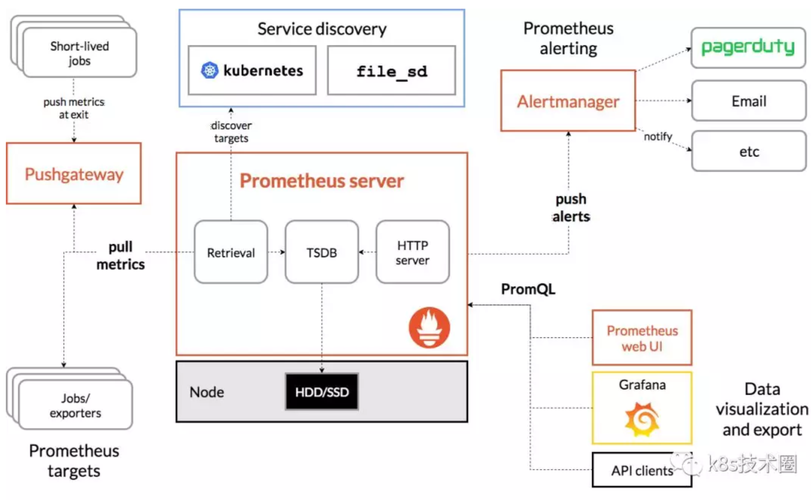
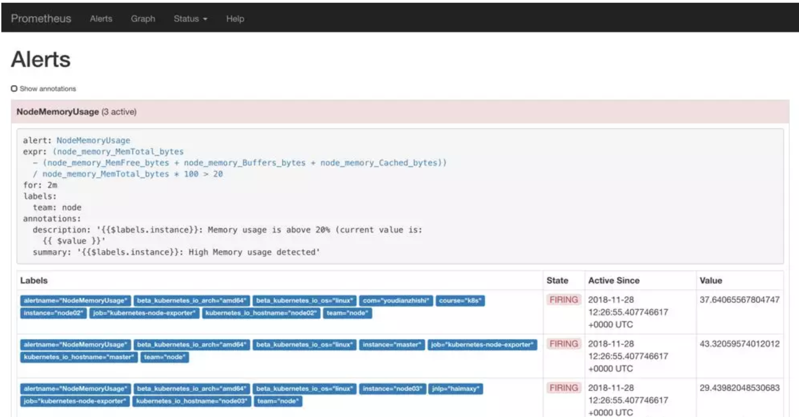
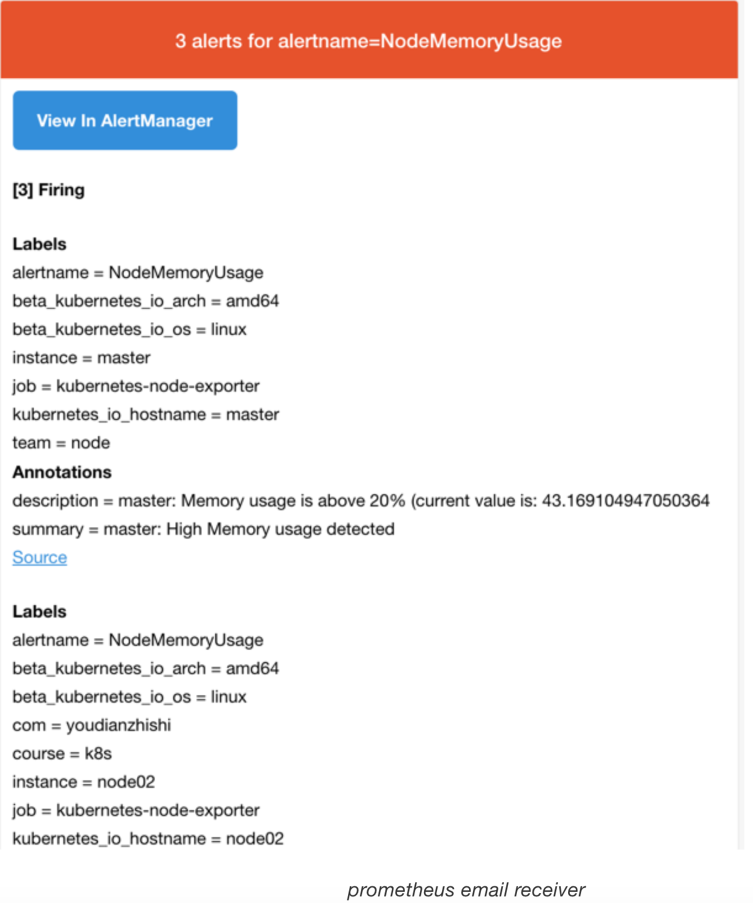
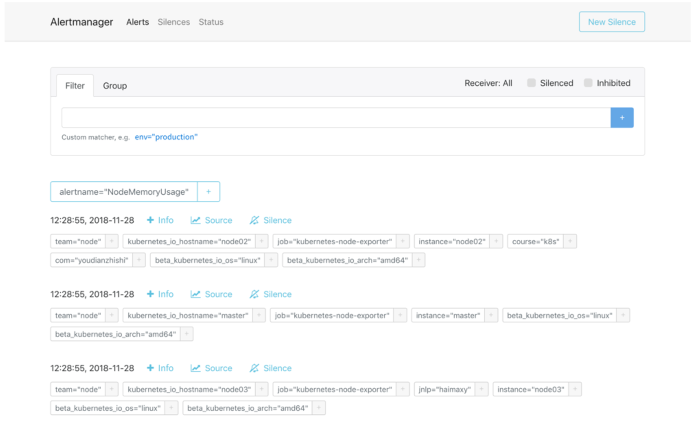
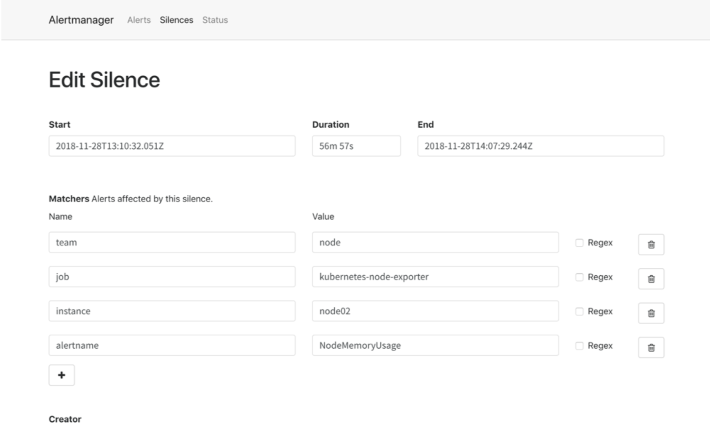
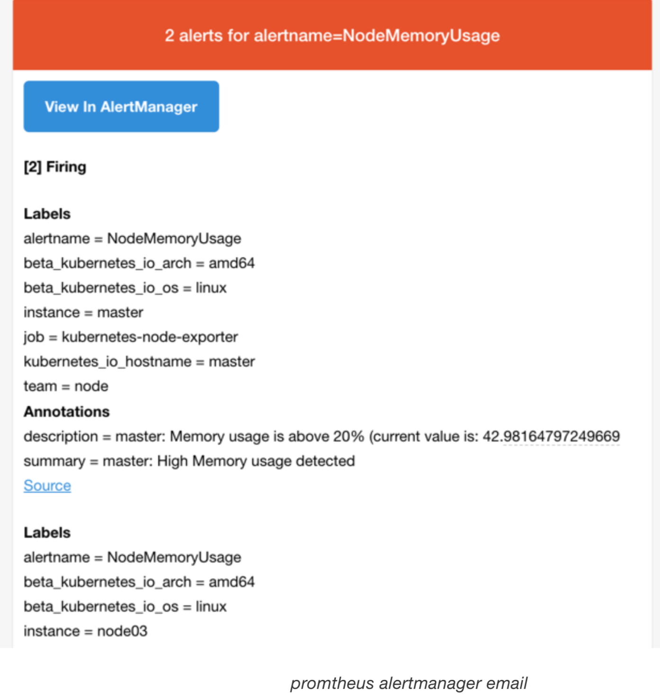
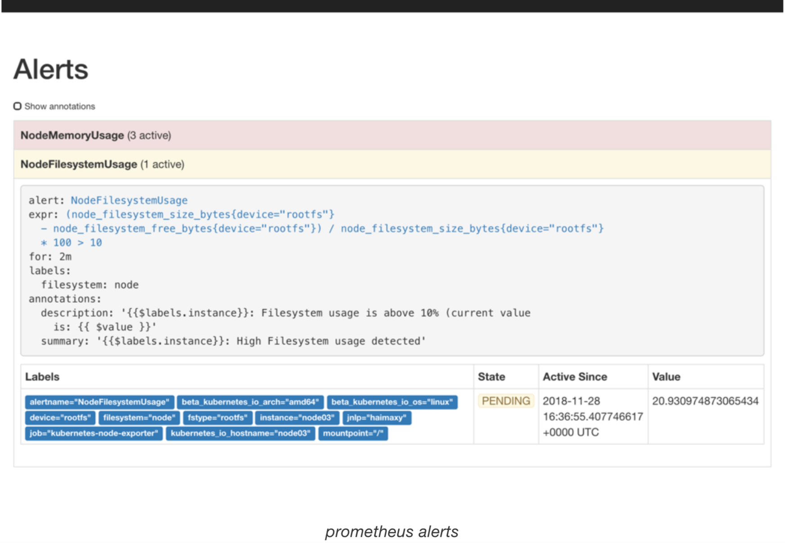
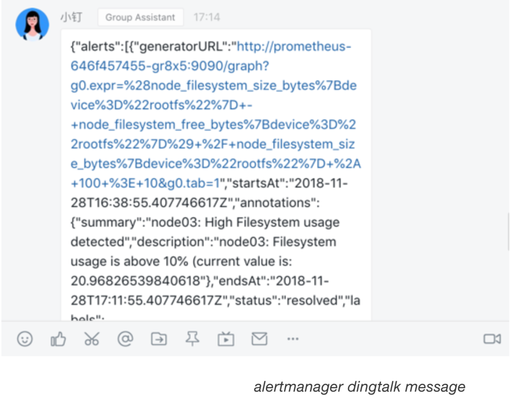

# 报警神器 AlertManager 的使用

## 简介

之前我们学习 `Prometheus` 的时候就了解到 `Prometheus` 包含一个**报警模块**，就是我们的 `AlertManager`，`Alertmanager` 主要用于接收 `Prometheus` 发送的告警信息，它支持丰富的告警通知渠道，而且很容易做到告警信息进行**去重，降噪，分组**等，是一款前卫的告警通知系统。



接下来我们就来学习下 AlertManager 的具体使用方法。

## 安装

从官方文档`https://prometheus.io/docs/alerting/configuration/`中我们可以看到下载`AlertManager`二进制文件后，可以通过下面的命令运行：

```
$ ./alertmanager --config.file=simple.yml
```

其中 `-config.file` 参数是用来指定对应的配置文件的，由于我们这里同样要运行到 Kubernetes 集群中来. 所以我们使用 `docker` 镜像的方式来安装，使用的镜像是：`prom/alertmanager:v0.15.3`。

首先，指定配置文件，同样的，我们这里使用一个 `ConfigMap` 资源对象：(`alertmanager-conf.yaml`)

```
apiVersion: v1
kind: ConfigMap
metadata:
  name: alert-config  
  namespace: kube-ops
data:
  config.yml: |-
    global:
      # 在没有报警的情况下声明为已解决的时间
      resolve_timeout: 5m      # 配置邮件发送信息
      smtp_smarthost: 'smtp.gmail.com'
      smtp_from: 'xichao2014@gmail.com'
      smtp_auth_username: 'xichao2014@gmail.com'
      smtp_auth_password: '<邮箱密码>'
      smtp_hello: 'gmail.com'
      smtp_require_tls: false
    # 所有报警信息进入后的根路由，用来设置报警的分发策略
    route:
      # 这里的标签列表是接收到报警信息后的重新分组标签，例如，接收到的报警信息里面有许多具有 cluster=A 和 alertname=LatncyHigh 这样的标签的报警信息将会批量被聚合到一个分组里面
      group_by: ['alertname', 'cluster']
      # 当一个新的报警分组被创建后，需要等待至少group_wait时间来初始化通知，这种方式可以确保您能有足够的时间为同一分组来获取多个警报，然后一起触发这个报警信息。
      group_wait: 30s      # 当第一个报警发送后，等待'group_interval'时间来发送新的一组报警信息。
      group_interval: 5m      # 如果一个报警信息已经发送成功了，等待'repeat_interval'时间来重新发送他们
      repeat_interval: 5m      # 默认的receiver：如果一个报警没有被一个route匹配，则发送给默认的接收器
      receiver: default      # 上面所有的属性都由所有子路由继承，并且可以在每个子路由上进行覆盖。
      routes:
      - receiver: email        
        group_wait: 10s        
        match:
          team: node    
    receivers:
    - name: 'default'
      email_configs:
      - to: 'xichao2017@gmail.com'
        send_resolved: true
    - name: 'email'
      email_configs:
      - to: 'xichao2017@gmail.com'
        send_resolved: true
```

这是 `AlertManager` 的配置文件，我们先直接创建这个 ConfigMap 资源对象：

```
$ kubectl create -f alertmanager-conf.yaml
configmap "alert-config" created
```

然后配置 `AlertManager` 的容器，我们可以直接在之前的 `Prometheus` 的 Pod 中添加这个容器，对应的 YAML 资源声明如下：

```
 - name: alertmanager    
    image: prom/alertmanager:v0.15.3    
    imagePullPolicy: IfNotPresent    
    args:
    - "--config.file=/etc/alertmanager/config.yml"
    ports:
    - containerPort: 9093
      name: http    
    volumeMounts:
    - mountPath: "/etc/alertmanager"
      name: alertcfg    
    resources:
      requests:
        cpu: 100m        
        memory: 256Mi      
      limits:
        cpu: 100m        
        memory: 256Mi
volumes:
- name: alertcfg  
  configMap:
    name: alert-config
```

这里我们将上面创建的 `alert-config` 这个 `ConfigMap` 资源对象以 `Volume` 的形式挂载到 `/etc/alertmanager` 目录下去，然后在启动参数中指定了配置文件 `--config.file=/etc/alertmanager/config.yml`，然后我们可以来更新这个 Prometheus 的 Pod：

```
$ kubectl apply -f prome-deploy.yaml
deployment.extensions "prometheus" configured
```
当然我们也可以将 AlertManager 的配置文件内容直接放入到之前的 `Prometheus` 的 `ConfigMap` 的资源对象中，也可以用一个单独的 Pod 来运行 `AlertManager` 这个容器，完整的资源清单文件可以参考这里：

`AlertManager` 的容器启动起来后，我们还需要在 `Prometheus` 中配置下 `AlertManager` 的地址，让 `Prometheus` 能够访问到 `AlertManager`，在 `Prometheus` 的 `ConfigMap` 资源清单中添加如下配置：

```
alerting:
  alertmanagers:
    - static_configs:
      - targets: ["localhost:9093"]
```

更新这个资源对象后，稍等一小会儿，执行 reload 操作：

```
$ kubectl delete -f prome-cm.yaml
configmap "prometheus-config" deleted
$ kubectl create -f prome-cm.yaml
configmap "prometheus-config" created

# 隔一会儿后
$ kubectl get svc -n kube-ops
NAME         TYPE       CLUSTER-IP     EXTERNAL-IP   PORT(S)                          AGE
prometheus   NodePort   10.102.74.90   <none>        9090:30358/TCP                   3d
$ curl -X POST "http://10.102.74.90:9090/-/reload"
```

更新完成后，我们查看 `Pod` 发现有错误，查看下 `alertmanager` 容器的日志，发现有如下错误信息：

```
$ kubectl get pods -n kube-ops
NAME                          READY     STATUS             RESTARTS   AGE
prometheus-56d64bf6f7-rpz9j   1/2       CrashLoopBackOff   491        1d
$ kubectl logs -f prometheus-56d64bf6f7-rpz9j alertmanager -n kube-ops
level=info ts=2018-11-28T10:33:51.830071513Z caller=main.go:174 msg="Starting Alertmanager" version="(version=0.15.3, branch=HEAD, revision=d4a7697cc90f8bce62efe7c44b63b542578ec0a1)"level=info ts=2018-11-28T10:33:51.830362309Z caller=main.go:175 build_context="(go=go1.11.2, user=root@4ecc17c53d26, date=20181109-15:40:48)"level=error ts=2018-11-28T10:33:51.830464639Z caller=main.go:179 msg="Unable to create data directory" err="mkdir data/: read-only file system"
```
这个是因为新版本 `dockerfile` 中的默认 `WORKDIR` 发生了变化，变成了 `/etc/alertmanager` 目录，默认情况下存储路径 `--storage.path` 是相对目录 `data/`，因此，`alertmanager` 会在我们上面挂载的 `ConfigMap` 中去创建这个目录，所以会报错，我们可以通过覆盖 `--storage.path` 参数来解决这个问题，在容器启动参数中添加该参数：(`prome-deploy.yaml`)

```
- name: alertmanager
  image: prom/alertmanager:v0.15.3
  imagePullPolicy: IfNotPresent
  args:
  - "--config.file=/etc/alertmanager/config.yml"
  - "--storage.path=/alertmanager/data"
```

#### 重新更新 Pod，可以发现 Prometheus 已经是 Running 状态了：

```
$ kubectl apply -f prome-deploy.yaml
deployment.extensions "prometheus" configured

$ kubectl get pods -n kube-ops
NAME                          READY     STATUS      RESTARTS   AGE
prometheus-646f457455-gr8x5   2/2       Running     0          3m
$ kubectl logs -f prometheus-646f457455-gr8x5 alertmanager -n kube-ops
level=info ts=2018-11-28T11:03:16.054633463Z caller=main.go:174 msg="Starting Alertmanager" version="(version=0.15.3, branch=HEAD, revision=d4a7697cc90f8bce62efe7c44b63b542578ec0a1)"level=info ts=2018-11-28T11:03:16.054931931Z caller=main.go:175 build_context="(go=go1.11.2, user=root@4ecc17c53d26, date=20181109-15:40:48)"level=info ts=2018-11-28T11:03:16.351058702Z caller=cluster.go:155 component=cluster msg="setting advertise address explicitly" addr=10.244.2.217 port=9094
level=info ts=2018-11-28T11:03:16.456683857Z caller=main.go:322 msg="Loading configuration file" file=/etc/alertmanager/config.yml
level=info ts=2018-11-28T11:03:16.548558156Z caller=cluster.go:570 component=cluster msg="Waiting for gossip to settle..." interval=2s
level=info ts=2018-11-28T11:03:16.556768564Z caller=main.go:398 msg=Listening address=:9093
level=info ts=2018-11-28T11:03:18.549158865Z caller=cluster.go:595 component=cluster msg="gossip not settled" polls=0 before=0 now=1 elapsed=2.000272112s
level=info ts=2018-11-28T11:03:26.558221484Z caller=cluster.go:587 component=cluster msg="gossip settled; proceeding" elapsed=10.009335611s
```

## 报警规则

现在我们只是把 AlertManager 容器运行起来了，也和 Prometheus 进行了关联，但是现在我们并不知道要做什么报警，因为没有任何地方告诉我们要报警，所以我们还需要配置一些报警规则来告诉我们对哪些数据进行报警。

警报规则允许你基于 Prometheus 表达式语言的表达式来定义报警报条件，并在触发警报时发送通知给外部的接收者。

同样在 **Prometheus 的配置文件**中添加如下报警规则配置：

```
rule_files:
  - /etc/prometheus/rules.yml
```
其中 `rule_files` 就是用来指定报警规则的，这里我们将`rules.yml` 用ConfigMap的形式挂载到`/etc/prometheus`目录下面即可:

```
apiVersion: v1
kind: ConfigMap
metadata:
  name: prometheus-config  
  namespace: kube-ops
data:
  prometheus.yml: |
...
  rules.yml: |
    groups:
    - name: test-rule
      rules:
      - alert: NodeMemoryUsage
        expr: (node_memory_MemTotal_bytes - (node_memory_MemFree_bytes + node_memory_Buffers_bytes + node_memory_Cached_bytes)) / node_memory_MemTotal_bytes * 100 > 20
        for: 2m
        labels:
          team: node
        annotations:
          summary: "{{$labels.instance}}: High Memory usage detected"
          description: "{{$labels.instance}}: Memory usage is above 20% (current value is: {{ $value }}"
```

上面我们定义了一个名为 `NodeMemoryUsage` 的报警规则，其中：

* `for` 语句会使 `Prometheus` 服务等待指定的时间, 然后执行查询表达式。
* `labels` 语句允许指定额外的标签列表，把它们附加在告警上。
* `annotations` 语句指定了另一组标签，它们不被当做告警实例的身份标识，它们经常用于存储一些额外的信息，用于报警信息的展示之类的。
  
为了方便演示，我们将的表达式判断报警临界值设置为**20**，重新更新 `ConfigMap` 资源对象，由于我们在 `Prometheus` 的 `Pod` 中已经通过 `Volume` 的形式将 `prometheus-config` 这个一个 `ConfigMap` 对象挂载到了`/etc/prometheus`目录下面，所以更新后，该目录下面也会出现`rules.yml`文件，所以前面配置的`rule_files`路径也是正常的，更新完成后，重新执行`reload`操作，这个时候我们去 `Prometheus` 的 `Dashboard` 中切换到alerts路径下面就可以看到有报警配置规则的数据了：



*prometheus alerts*

我们可以看到页面中出现了我们刚刚定义的报警规则信息，而且报警信息中还有状态显示。一个报警信息在生命周期内有下面3种状态：

* `inactive`: 表示当前报警信息既不是firing状态也不是pending状态
* `pending`: 表示在设置的阈值时间范围内被激活了
* `firing`: 表示超过设置的阈值时间被激活了

我们这里的状态现在是 `firing` 就表示这个报警已经被激活了，我们这里的报警信息有一个 `team=node` 这样的标签，而最上面我们配置 `alertmanager` 的时候就有如下的路由配置信息了：

```
routes:
- receiver: email
  group_wait: 10s
  match:
    team: node
```

所以我们这里的报警信息会被`email`这个接收器来进行报警，我们上面配置的是邮箱，所以正常来说这个时候我们会收到一封如下的报警邮件：



我们可以看到收到的邮件内容中包含一个`View In AlertManager`的链接，我们同样可以通过 NodePort 的形式去访问到 `AlertManager` 的 `Dashboard` 页面：

```
$ kubectl get svc -n kube-ops
NAME         TYPE        CLUSTER-IP      EXTERNAL-IP   PORT(S)                          AGE
prometheus   NodePort    10.102.74.90    <none>        9093:31788/TCP,9090:30358/TCP    34d
```

然后通过`<任一Node节点>:31788`进行访问，我们就可以查看到 `AlertManager` 的 `Dashboard`页面：



在这个页面中我们可以进行一些操作，比如过滤、分组等等，里面还有两个新的概念：`Inhibition(抑制)`和 `Silences(静默)`。

* **Inhibition**：如果某些其他警报已经触发了，则对于某些警报，Inhibition 是一个抑制通知的概念。例如：一个警报已经触发，它正在通知整个集群是不可达的时，Alertmanager 则可以配置成关心这个集群的其他警报无效。这可以防止与实际问题无关的数百或数千个触发警报的通知，Inhibition 需要通过上面的配置文件进行配置。
* **Silences**：静默是一个非常简单的方法，可以在给定时间内简单地忽略所有警报。Silences 基于 matchers配置，类似路由树。来到的警告将会被检查，判断它们是否和活跃的 Silences 相等或者正则表达式匹配。如果匹配成功，则不会将这些警报发送给接收者。

由于全局配置中我们配置的 `group_interval: 5m`，也就是每5分钟一个分组的报警将会重新触发，所以正常来说，上面的测试报警如果一直满足报警条件(CPU使用率大于20%)的话，那么每5分钟我们就可以收到一条报警邮件。

现在我们添加一个 `Silences`，如下图所示，匹配 `node02` 节点的内存报警：



*prometheus alertmanager Silences*

添加完成后，等下一次的报警信息触发后，我们可以看到报警信息里面已经没有了节点 node02 的报警信息了：



#### 由于我们上面添加的 Silences 是有过期时间的，所以在这个时间段过后，node02 的报警信息就会恢复了。

## webhook接收器

上面我们配置的是 AlertManager 自带的邮件报警模板，我们也说了 AlertManager 支持很多中报警接收器，比如 slack、微信之类的，其中最为灵活的方式当然是使用 `webhook` 了，我们可以定义一个 `webhook` 来接收报警信息，然后在 `webhook` 里面去进行处理，需要发送怎样的报警信息我们自定义就可以。

比如我们这里用 `Flask` 编写了一个简单的处理钉钉报警的 `webhook` 的程序：

```
import os
import requests

from flask import Flask
from flask import request

app = Flask(__name__)


@app.route('/', methods=['POST', 'GET'])
def send():
    if request.method == 'POST':
        post_data = request.get_data()
        send_alert(post_data)
        return 'success'
    else:
        return 'weclome to use prometheus alertmanager dingtalk webhook server!'


def send_alert(data):
    token = os.getenv('ROBOT_TOKEN')
    if not token:
        print('you must set ROBOT_TOKEN env')
        return
    url = 'https://oapi.dingtalk.com/robot/send?access_token=%s' % token
    send_data = {
        "msgtype": "text",
        "text": {
            "content": data
        }
    }
    req = requests.post(url, json=send_data)
    result = req.json()
    if result['errcode'] != 0:
        print('notify dingtalk error: %s' % result['errcode'])

if __name__ == '__main__':
    from waitress import serve
    serve(app, listen='0.0.0.0:5000')
```

代码非常简单，通过一个 `ROBOT_TOKEN` 的环境变量传入群机器人的 `TOKEN`，然后直接将 `webhook` 发送过来的数据直接以文本的形式转发给群机器人。

当然我们得将上面这个服务部署到集群中来，对应的资源清单如下：(`dingtalk-hook.yaml`)

```
apiVersion: extensions/v1beta1
kind: Deployment
metadata:
  name: dingtalk-hook
  namespace: kube-ops
spec:
  template:
    metadata:
      labels:
        app: dingtalk-hook
    spec:
      containers:
      - name: dingtalk-hook
        image: cnych/alertmanager-dingtalk-hook:v0.2
        imagePullPolicy: IfNotPresent
        ports:
        - containerPort: 5000
          name: http
        env:
        - name: ROBOT_TOKEN
          valueFrom:
            secretKeyRef:
              name: dingtalk-secret
              key: token
        resources:
          requests:
            cpu: 50m
            memory: 100Mi
          limits:
            cpu: 50m
            memory: 100Mi

---
apiVersion: v1
kind: Service
metadata:
  name: dingtalk-hook
  namespace: kube-ops
spec:
  selector:
    app: dingtalk-hook
  ports:
  - name: hook
    port: 5000
    targetPort: http
```

要注意上面我们声明了一个 `ROBOT_TOKEN` 的环境变量，由于这是一个相对于私密的信息，所以我们这里从一个 `Secret` 对象中去获取，通过如下命令创建一个名为 `dingtalk-secret` 的 `Secret` 对象，然后部署上面的资源对象即可：

```
$ kubectl create secret generic dingtalk-secret --from-literal=token=替换成钉钉群聊的机器人TOKEN -n kube-ops
secret "dingtalk-secret" created
$ kubectl create -f dingtalk-hook.yaml
deployment.extensions "dingtalk-hook" created
service "dingtalk-hook" created
$ kubectl get pods -n kube-ops
NAME                            READY     STATUS      RESTARTS   AGE
dingtalk-hook-c4fcd8cd6-6r2b6   1/1       Running     0          45m
......
```

部署成功后，现在我们就可以给 `AlertManager` 配置一个 `webhook` 了，在上面的配置中增加一个路由接收器

```
  routes:
  - receiver: webhook
    match:
      filesystem: node
receivers:
- name: 'webhook'
  webhook_configs:
  - url: 'http://dingtalk-hook:5000'
    send_resolved: true
```

我们这里配置了一个名为 webhook 的接收器，地址为：`http://dingtalk-hook:5000`，这个地址当然就是上面我们部署的钉钉的 `webhook` 的接收程序的 `Service` 地址。

然后我们也在报警规则中添加一条关于节点文件系统使用情况的报警规则，注意 `labels` 标签要带上`alertname=NodeFilesystem`，这样报警信息就会被 `webook` 这一个接收器所匹配：

```
- alert: NodeFilesystemUsage
  expr: (node_filesystem_size_bytes{device="rootfs"} - node_filesystem_free_bytes{device="rootfs"}) / node_filesystem_size_bytes{device="rootfs"} * 100 > 10
  for: 2m
  labels:
    filesystem: node
  annotations:
    summary: "{{$labels.instance}}: High Filesystem usage detected"
    description: "{{$labels.instance}}: Filesystem usage is above 10% (current value is: {{ $value }}"
```

更新 `AlertManager` 和 `Prometheus` 的 `ConfigMap` 资源对象（先删除再创建），更新完成后，隔一会儿执行 `reload` 操作是更新生效：

```
$ kubectl get svc -n kube-ops
NAME            TYPE        CLUSTER-IP      EXTERNAL-IP   PORT(S)                          AGE
prometheus      NodePort    10.102.74.90    <none>        9093:31788/TCP,9090:30358/TCP    34d
$ curl -X POST "http://10.102.74.90:9093/-/reload"
$ curl -X POST "http://10.102.74.90:9090/-/reload"
```
#### `AlertManager` 和 `Prometheus` 都可以通过上面的 reload 操作进行重新加载

都完成更新后，再次去 Prometheus 的 Alert 路径下面查看报警信息：



隔一会儿关于这个节点文件系统的报警就会被触发了，由于这个报警信息包含一个 `filesystem=node` 的 `label` 标签，所以会被路由到 `webhook` 这个接收器中，也就是上面我们自定义的这个 `dingtalk-hook` ，触发后可以观察这个 Pod 的日志：

```
$ kubectl logs -f dingtalk-hook-cc677c46d-gf26f -n kube-ops
 * Serving Flask app "app" (lazy loading)
 * Environment: production
   WARNING: Do not use the development server in a production environment.
   Use a production WSGI server instead.
 * Debug mode: off
 * Running on http://0.0.0.0:5000/ (Press CTRL+C to quit)

10.244.2.217 - - [28/Nov/2018 17:14:09] "POST / HTTP/1.1" 200 -
```

可以看到 POST 请求已经成功了，同时这个时候正常来说就可以收到一条钉钉消息了：




