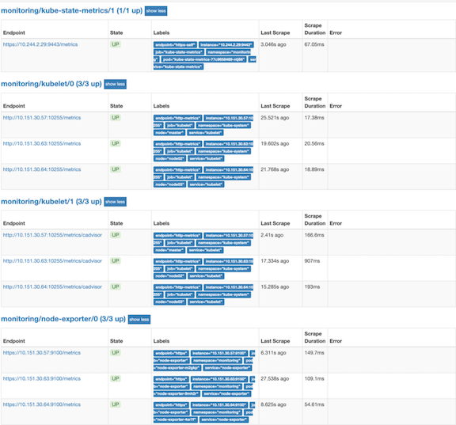
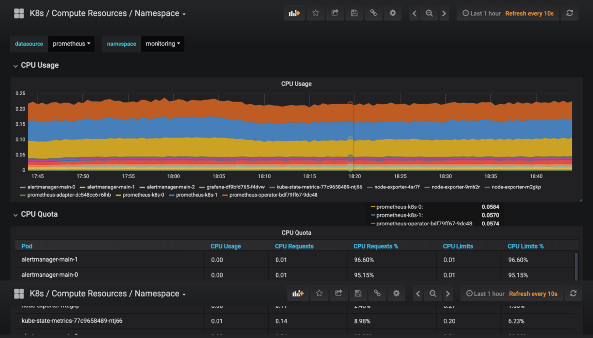
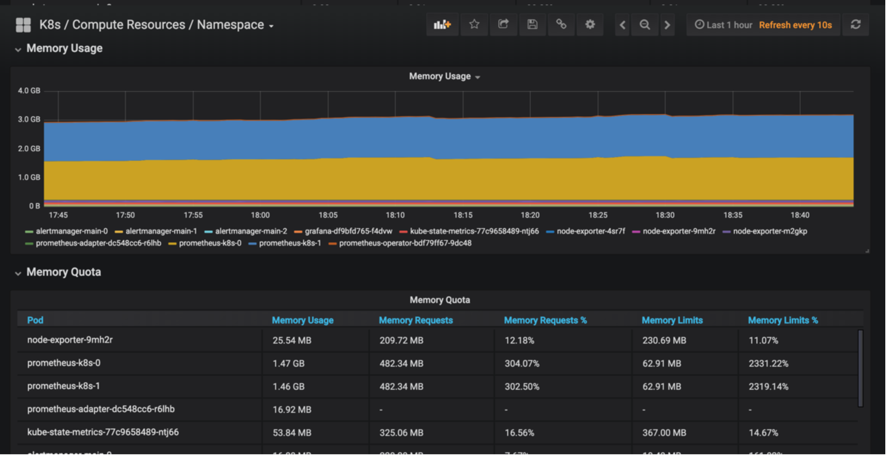

# Prometheus Operator 初体验

前面的课程中我们学习了用自定义的方式来对 Kubernetes 集群进行监控，但是还是有一些缺陷，比如 `Prometheus`、`AlertManager` 这些组件服务本身的高可用，当然我们也完全可以用自定义的方式来实现这些需求，我们也知道 `Promethues` 在代码上就已经对 `Kubernetes` 有了原生的支持，可以通过服务发现的形式来自动监控集群，

**因此我们可以使用另外一种更加高级的方式来部署 `Prometheus：Operator` 框架。**


## Operator

`Operator` 是由 CoreOS 公司开发的，用来扩展 `Kubernetes API`，特定的应用程序控制器，**它用来创建、配置和管理复杂的有状态应用，如数据库、缓存和监控系统。**

`Operator`基于 `Kubernetes` 的资源和控制器概念之上构建，但同时又包含了应用程序特定的一些专业知识，比如创建一个数据库的`Operator` ，则必须对创建的数据库的各种运维方式非常了解，创建`Operator`的关键是`CRD`（自定义资源）的设计。

	`CRD` 是对 `Kubernetes API` 的扩展，`Kubernetes` 中的每个资源都是一个 `API` 对象的集合，例如我们在 
	`YAML` 文件里定义的那些 `spec` 都是对 `Kubernetes` 中的资源对象的定义，所有的自定义资源可以跟 
	`Kubernetes ` 中内建的资源一样使用 `kubectl` 操作。


`Operator` 是将运维人员对软件操作的知识给**代码化**，同时利用 Kubernetes 强大的抽象来管理大规模的软件应用。目前CoreOS官方提供了**几种Operator的实现**，其中就包括我们今天的主角：`Prometheus Operator`，`Operator`的核心实现就是基于 Kubernetes 的以下两个概念：

* 资源：对象的状态定义
* 控制器：观测、分析和行动，以调节资源的分布

当然我们如果有对应的需求也完全可以自己去实现一个`Operator`，接下来我就来给大家详细介绍下`Prometheus-Operator`的使用方法。

## 介绍

首先我们先来了解下 `Prometheus-Operator`的架构图：


上图是 `Prometheus-Operator` 官方提供的架构图，其中 `Operator`是最核心的部分，作为一个**控制器**，他会去创建`Prometheus`、`ServiceMonitor`、`AlertManager` 以及 `PrometheusRule` **4个`CRD`资源对象**，然后会一直监控并维持这`4`个资源对象的状态。

* 其中创建的 `prometheus` 这种资源对象就是作为`Prometheus Server`存在，
* 而`ServiceMonitor`就是`exporter`的各种抽象，
* `exporter`前面我们已经学习了，是用来提供专门提供`metrics`数据接口的工具，

**`Prometheus`就是通过 `ServiceMonitor` 提供的 `metrics` 数据接口去 `pull` 数据的，当然 `alertmanager` 这种资源对象就是对应的 `AlertManager` 的抽象，而 `PrometheusRule` 是用来被 `Prometheus` 实例使用的报警规则文件。**

这样我们要在集群中监控什么数据，就变成了直接去操作 `Kubernetes` 集群的资源对象了，是不是方便很多了。上图中的 `Service` 和 `ServiceMonitor` 都是 `Kubernetes` 的资源，一个 `ServiceMonitor` 可以通过 `labelSelector` 的方式去匹配一类 `Service`，`Prometheus` 也可以通过 `labelSelector `去匹配多个`ServiceMonitor`。

## 安装

我们这里直接通过 `Prometheus-Operator` 的源码来进行安装，当然也可以用 `Helm` 来进行一键安装，我们采用源码安装可以去了解更多的实现细节。首页将源码 `Clone` 下来：

```
$ git clone https://github.com/coreos/prometheus-operator
$ cd contrib/kube-prometheus/manifests/
$ ls
00namespace-namespace.yaml                                         node-exporter-clusterRole.yaml
0prometheus-operator-0alertmanagerCustomResourceDefinition.yaml    node-exporter-daemonset.yaml
......
```

进入到 `manifests`目录下面，这个目录下面包含我们所有的资源清单文件，我们需要对其中的文件 `prometheus-serviceMonitorKubelet.yaml` 进行简单的修改.

因为默认情况下，这个 `ServiceMonitor` 是关联的 `kubelet` 的 `10250` 端口去采集的节点数据，而我们前面说过为了安全，这个 `metrics `数据已经迁移到`10255`这个只读端口上面去了，我们只需要将文件中的`https-metrics`更改成`http-metrics`即可，这个在 `Prometheus-Operator` 对节点端点同步的代码中有相关定义，感兴趣的可以[点此查看完整代码](https://github.com/coreos/prometheus-operator/blob/7a8bc75512e39a984f46b2788b5fa9bf64999571/pkg/prometheus/operator.go#L400)：

```
Subsets: []v1.EndpointSubset{
    {
        Ports: []v1.EndpointPort{
            {
                Name: "https-metrics",
                Port: 10250,
            },
            {
                Name: "http-metrics",
                Port: 10255,
            },
            {
                Name: "cadvisor",
                Port: 4194,
            },
        },
    },
},
```

修改完成后，直接在该文件夹下面执行创建资源命令即可：

```
$ kubectl apply -f .
```

部署完成后，会创建一个名为`monitoring`的 `namespace`，所以资源对象对将部署在改命名空间下面，此外 `Operator` 会自动创建4个 `CRD` 资源对象：

```
$ kubectl get crd |grep coreos
alertmanagers.monitoring.coreos.com     5d
prometheuses.monitoring.coreos.com      5d
prometheusrules.monitoring.coreos.com   5d
servicemonitors.monitoring.coreos.com   5d
```

可以在 `monitoring` 命名空间下面查看所有的 `Pod`，其中 `alertmanager` 和 `prometheus` 是用 `StatefulSet` 控制器管理的，其中还有一个比较核心的 `prometheus-operator` 的 Pod，用**来控制其他资源对象和监听对象变化的：**

```
$ kubectl get pods -n monitoring
NAME                                  READY     STATUS    RESTARTS   AGE
alertmanager-main-0                   2/2       Running   0          21h
alertmanager-main-1                   2/2       Running   0          21h
alertmanager-main-2                   2/2       Running   0          21h
grafana-df9bfd765-f4dvw               1/1       Running   0          22h
kube-state-metrics-77c9658489-ntj66   4/4       Running   0          20h
node-exporter-4sr7f                   2/2       Running   0          21h
node-exporter-9mh2r                   2/2       Running   0          21h
node-exporter-m2gkp                   2/2       Running   0          21h
prometheus-adapter-dc548cc6-r6lhb     1/1       Running   0          22h
prometheus-k8s-0                      3/3       Running   1          21h
prometheus-k8s-1                      3/3       Running   1          21h
prometheus-operator-bdf79ff67-9dc48   1/1       Running   0          21h
```

查看创建的 `Service`:

```
$ kubectl get svc -n monitoring
NAME                    TYPE        CLUSTER-IP       EXTERNAL-IP   PORT(S)             AGE
alertmanager-main       ClusterIP   10.110.204.224   <none>        9093/TCP            23h
alertmanager-operated   ClusterIP   None             <none>        9093/TCP,6783/TCP   23h
grafana                 ClusterIP   10.98.191.31     <none>        3000/TCP            23h
kube-state-metrics      ClusterIP   None             <none>        8443/TCP,9443/TCP   23h
node-exporter           ClusterIP   None             <none>        9100/TCP            23h
prometheus-adapter      ClusterIP   10.107.201.172   <none>        443/TCP             23h
prometheus-k8s          ClusterIP   10.107.105.53    <none>        9090/TCP            23h
prometheus-operated     ClusterIP   None             <none>        9090/TCP            23h
prometheus-operator     ClusterIP   None             <none>        8080/TCP            23h
```

可以看到上面针对 `grafana` 和 `prometheus` 都创建了一个类型为 `ClusterIP` 的 `Service`，当然如果我们想要在外网访问这两个服务的话可以通过创建对应的 `Ingress` 对象或者使用 `NodePort` 类型的 `Service`，我们这里为了简单，直接使用 `NodePort` 类型的服务即可，编辑 `grafana` 和 `prometheus-k8s `这两个 `Service`，将服务类型更改为 `NodePort`:

```
$ kubectl edit svc grafana -n monitoring
$ kubectl edit svc prometheus-k8s -n monitoring
$ kubectl get svc -n monitoring
NAME                    TYPE        CLUSTER-IP       EXTERNAL-IP   PORT(S)             AGE
grafana                 NodePort    10.98.191.31     <none>        3000:32333/TCP      23h
prometheus-k8s          NodePort    10.107.105.53    <none>        9090:30166/TCP      23h
......
```

```
kubectl edit svc -n   # 直接将service的clusterIP改为nodeport
```
更改完成后，我们就可以通过 `NodeIP:NodePort` 去访问上面的两个服务了，比如查看 prometheus 的 targets 页面：





## 配置


我们可以看到大部分的配置都是正常的，只有两三个没有管理到对应的监控目标，比如 `kube-controller-manager` 和 `kube-scheduler` 这两个系统组件，这就和 `ServiceMonitor` 的定义有关系了，我们先来查看下 `kube-scheduler ` 组件对应的 `ServiceMonitor` 资源的定义：(`prometheus-serviceMonitorKubeScheduler.yaml`)

```
apiVersion: monitoring.coreos.com/v1
kind: ServiceMonitor
metadata:
  labels:
    k8s-app: kube-scheduler
  name: kube-scheduler
  namespace: monitoring
spec:
  endpoints:
  - interval: 30s # 每30s获取一次信息
    port: http-metrics  # 对应service的端口名
  jobLabel: k8s-app
  namespaceSelector: # 表示去匹配某一命名空间中的service，如果想从所有的namespace中匹配用any: true
    matchNames:
    - kube-system
  selector:  # 匹配的 Service 的labels，如果使用mathLabels，则下面的所有标签都匹配时才会匹配该service，如果使用matchExpressions，则至少匹配一个标签的service都会被选择
    matchLabels:
      k8s-app: kube-scheduler
```

上面是一个典型的 `ServiceMonitor` 资源文件的声明方式，上面我们通过 `selector.matchLabels` 在 `kube-system` 这个命名空间下面匹配具有 `k8s-app=kube-scheduler` 这样的 `Service`，但是我们系统中根本就没有对应的 `Service`，所以我们需要手动创建一个 `Service`：（`prometheus-kubeSchedulerService.yaml`）

```
apiVersion: v1
kind: Service
metadata:
  namespace: kube-system
  name: kube-scheduler
  labels:
    k8s-app: kube-scheduler
spec:
  selector:
    component: kube-scheduler
  ports:
  - name: http-metrics
    port: 10251
    targetPort: 10251
    protocol: TCP
```

	`10251` 是 `kube-scheduler` 组件 `metrics` 数据所在的端口，`10252` 是 `kube-controller-manager` 
	组件的监控数据所在端口。
	
其中最重要的是上面 `labels` 和 `selector` 部分，`labels` 区域的配置必须和我们上面的 `ServiceMonitor` 对象中的 `selector` 保持一致，`selector` 下面配置的是 `component=kube-scheduler`，为什么会是这个 `label` 标签呢，我们可以去 `describe` 下 `kube-scheduler` 这个 `Pod`：

```
$ kubectl describe pod kube-scheduler-master -n kube-system
Name:         kube-scheduler-master
Namespace:    kube-system
Node:         master/10.151.30.57
Start Time:   Sun, 05 Aug 2018 18:13:32 +0800
Labels:       component=kube-scheduler
              tier=control-plane
......
```

我们可以看到这个 `Pod` 具有`component=kube-scheduler`和`tier=control-plane`这两个标签，而前面这个标签具有更唯一的特性，所以使用前面这个标签较好，这样上面创建的 `Service` 就可以和我们的 `Pod` 进行关联了，直接创建即可：

```
$ kubectl create -f prometheus-kubeSchedulerService.yaml
$ kubectl get svc -n kube-system -l k8s-app=kube-scheduler
NAME             TYPE        CLUSTER-IP       EXTERNAL-IP   PORT(S)     AGE
kube-scheduler   ClusterIP   10.102.119.231   <none>        10251/TCP   18m
```

创建完成后，隔一小会儿后去 `prometheus` 查看 `targets` 下面 `kube-scheduler` 的状态：


我们可以看到现在已经发现了 `target`，但是抓取数据结果出错了，这个错误是因为我们集群是使用 `kubeadm` 搭建的，其中 `kube-scheduler` 默认是绑定在`127.0.0.1`上面的，而上面我们这个地方是想通过节点的 `IP` 去访问，所以访问被拒绝了，我们只要把 `kube-scheduler` 绑定的地址更改成`0.0.0.0`即可满足要求，由于 `kube-scheduler` 是以静态 `Pod` 的形式运行在集群中的，所以我们只需要更改静态 `Pod` 目录下面对应的 `YAML` 文件即可：

```
$ ls /etc/kubernetes/manifests/
etcd.yaml  kube-apiserver.yaml  kube-controller-manager.yaml  kube-scheduler.yaml
```

将 `kube-scheduler.yaml` 文件中 `-command` 的 `--address` 地址更改成 `0.0.0.0`：

```
containers:
- command:
- kube-scheduler
- --leader-elect=true
- --kubeconfig=/etc/kubernetes/scheduler.conf
- --address=0.0.0.0
```

**修改完成后我们将该文件从当前文件夹中移除，隔一会儿再移回该目录，就可以自动更新了**，然后再去看 `prometheus` 中 `kube-scheduler` 这个 `target` 是否已经正常了：


大家可以按照上面的方法尝试去修复下 kube-controller-manager 组件的监控。

上面的监控数据配置完成后，现在我们可以去查看下 `grafana` 下面的  `dashboard`，同样使用上面的 `NodePort` 访问即可，**第一次登录使用 `admin:admin` 登录即可**，进入首页后，可以发现已经和我们的 `Prometheus` 数据源关联上了，正常来说可以看到一些监控图表了：




