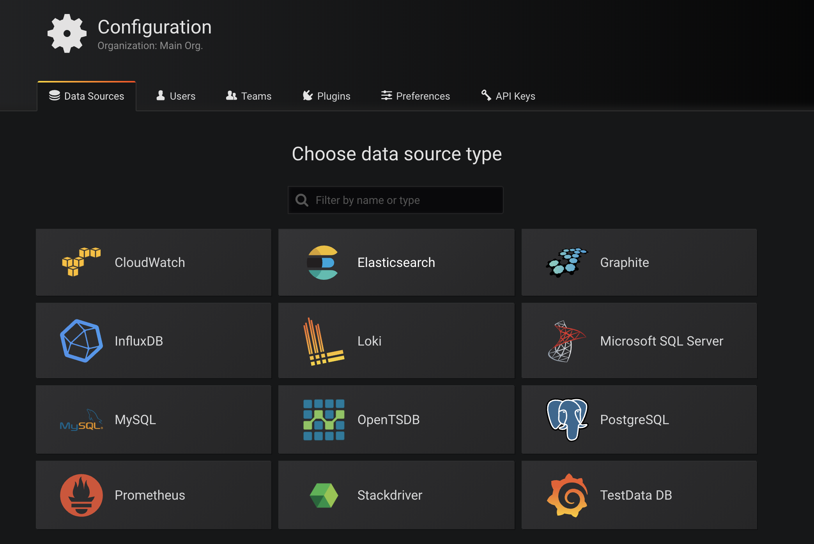
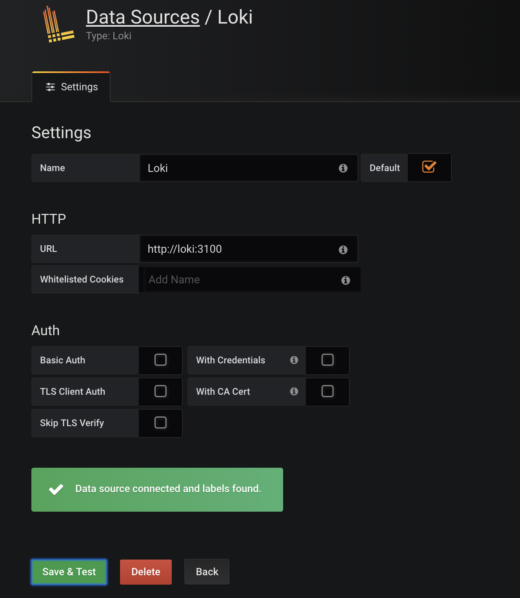
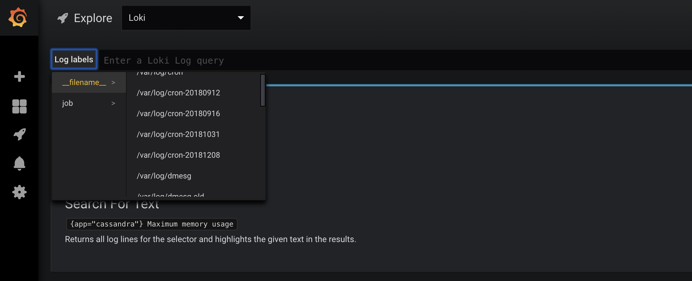
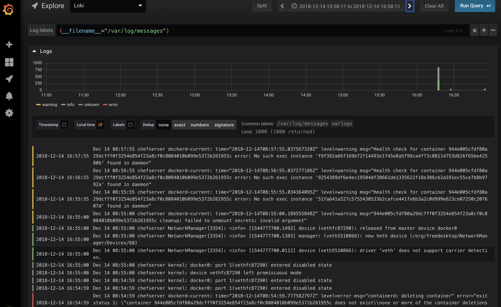

# Grafana 日志聚合工具 Loki

`Loki` 是 `Grafana Labs` 团队最新的开源项目，是一个水平可扩展，高可用性，多租户的日志聚合系统。它的设计非常经济高效且易于操作，因为它不会为日志内容编制索引，而是为每个日志流编制一组标签。项目受 `Prometheus` 启发，官方的介绍就是：`Like Prometheus, but for logs`.，类似于 `Prometheus` 的日志系统。

## 介绍

与其他日志聚合系统相比，`Loki`具有下面的一些特性：

* 不对日志进行全文索引。通过存储压缩非结构化日志和仅索引元数据，Loki 操作起来会更简单，更省成本。
* 通过使用与 `Prometheus` 相同的标签记录流对日志进行索引和分组，这使得日志的扩展和操作效率更高。
* 特别适合储存 `Kubernetes Pod` 日志; 诸如 **Pod 标签之类的元数据会被自动删除和编入索引**。
* 受 `Grafana` 原生支持。

Loki 由以下3个部分组成：

* `loki`是**主服务器，负责存储日志和处理查询**。
* `promtail`是**代理，负责收集日志并将其发送给** `loki` 。
* `Grafana`用于 UI 展示。

## 安装

DockerHub 上提供了[Loki](https://hub.docker.com/r/grafana/loki/)和[Promtail](https://hub.docker.com/r/grafana/promtail/)的 `Docker` 镜像，为了方便我们这里直接使用 `docker-compose` 进行一键安装，其他方式可以参考[Loki的文档介绍](https://github.com/grafana/loki)。

首先直接 `Clone` 源代码：

```
$ git clone https://github.com/grafana/loki.git
# 进入 docs 目录
$ cd loki/docs
```

在 `docs` 目录下面有我们运行的 `yaml` 文件：(`docker-compose.yaml`)

```
version: "3"

networks:
  loki:

services:
  loki:
    image: grafana/loki:master
    ports:
      - "3100:3100"
    volumes:
      - $PWD:/etc/loki
    command: -config.file=/etc/loki/loki-local-config.yaml
    networks:
      - loki

  promtail:
    image: grafana/promtail:make-images-static-26a87c9
    volumes:
      - $PWD:/etc/promtail
      - /var/log:/var/log
    command:
      -config.file=/etc/promtail/promtail-docker-config.yaml
    networks:
      - loki

  grafana:
    image: grafana/grafana:master
    ports:
      - "3000:3000"
    environment:
      GF_EXPLORE_ENABLED: "true"
    networks:
      - loki
```

然后直接使用 `docker-compose` 启动即可：

```
$ docker-compose up -d
Pulling grafana (grafana/grafana:master)...
Trying to pull repository docker.io/grafana/grafana ...
master: Pulling from docker.io/grafana/grafana
a5a6f2f73cd8: Pull complete
e808160b15db: Pull complete
d2e899342e37: Pull complete
cf0517eba5d4: Pull complete
78a1a89b591c: Pull complete
6766c88a2c3d: Pull complete
Digest: sha256:437b421ef8726a3956ba032771f80968920c315978d4c992effbf0046de0f84f
Status: Downloaded newer image for docker.io/grafana/grafana:master
Creating docs_grafana_1  ... done
Creating docs_loki_1     ... done
Creating docs_promtail_1 ... done
```


上面的命令会去默认使用当前文件夹下面的 `docker-compose.yaml` 文件创建，创建完成后查看创建的容器：

```
$ docker-compose ps
     Name                    Command               State               Ports
-----------------------------------------------------------------------------------------
docs_grafana_1    /run.sh                          Up      0.0.0.0:3000->3000/tcp
docs_loki_1       /bin/loki -config.file=/et ...   Up      0.0.0.0:3100->3100/tcp, 80/tcp
docs_promtail_1   /usr/bin/promtail -config. ...   Up
```

到这里证明已经安装成功了。

## 使用

安装完成后，访问上面节点的 `3000` 端口访问 `grafana`，默认情况下使用(`admin:admin`)访问 -> 选择添加数据源：



在数据源列表中选择`Loki`，配置 Loki 源地址：





源地址配置`http://loki:3100`即可，保存。

保存完成后，切换到 `grafana` 左侧区域的`Explore`，即可进入到Loki的页面：


然后我们点击`Log labels`就可以把当前系统采集的日志标签给显示出来，可以根据这些标签进行日志的过滤查询：



比如我们这里选择`/var/log/messages`，就会把该文件下面的日志过滤展示出来，不过由于时区的问题，可能还需要设置下时间才可以看到数据：



## 选择器

对于查询表达式的标签部分，将其包装在花括号中`{}`，然后使用键值对的语法来选择标签，多个标签表达式用逗号分隔，比如：

```
{app="mysql",name="mysql-backup"}
```

目前支持以下标签匹配运算符

* `=`等于
* `!=`不相等
* `=~`正则表达式匹配
* `!~`不匹配正则表达式

比如:

```
{name=~"mysql.+"}
{name!~"mysql.+"}
```

适用于Prometheus标签选择器规则同样也适用于Loki日志流选择器。

想要了解Loki的原始设计文档的可以点击查看这里的文档：[Loki设计文档](https://docs.google.com/document/d/11tjK_lvp1-SVsFZjgOTr1vV3-q6vBAsZYIQ5ZeYBkyM/view)

