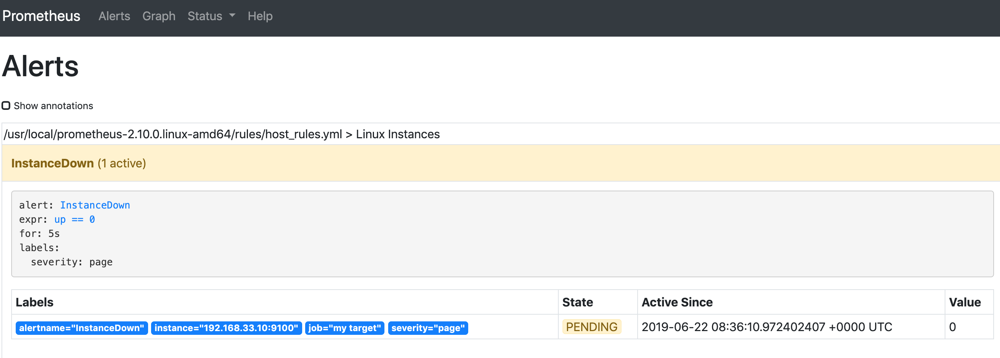

# Prometheus安装部署+监控+绘图+告警

### 部署架构图


### 准备机器

```
master machine: 192.168.33.10

$ cat /etc/os-release
NAME="CentOS Linux"
VERSION="7 (Core)"
ID="centos"
ID_LIKE="rhel fedora"
VERSION_ID="7"
PRETTY_NAME="CentOS Linux 7 (Core)"
ANSI_COLOR="0;31"
CPE_NAME="cpe:/o:centos:centos:7"
HOME_URL="https://www.centos.org/"
BUG_REPORT_URL="https://bugs.centos.org/"

CENTOS_MANTISBT_PROJECT="CentOS-7"
CENTOS_MANTISBT_PROJECT_VERSION="7"
REDHAT_SUPPORT_PRODUCT="centos"
REDHAT_SUPPORT_PRODUCT_VERSION="7"
```

## 安装部分

在官网下载对应的压缩包文件，解压、添加系统服务器、启动。

### `Node_exporter`

```
$ wget https://github.com/prometheus/node_exporter/releases/download/v0.18.1/node_exporter-0.18.1.linux-amd64.tar.gz
$ sudo tar zxf node_exporter-0.18.1.linux-amd64.tar.gz -C /usr/local
$ sudo vim /etc/systemd/system/node_exporter.service
```
```
[Unit]
Description=node_exporter
After=network.target

[Service]
Restart=on-failure
ExecStart=/usr/local/node_exporter-0.18.1.linux-amd64/node_exporter

[Install]
WantedBy=multi-user.target
```

```
$ sudo systemctl start node_exporter
$ systemctl status node_exporter
$ sudo systemctl enable node_exporter
```
```
$ systemctl status node_exporter
● node_exporter.service - node_exporter
   Loaded: loaded (/etc/systemd/system/node_exporter.service; enabled; vendor preset: disabled)
   Active: active (running) since Sun 2019-06-23 07:56:53 UTC; 6min ago
 Main PID: 7492 (node_exporter)
   CGroup: /system.slice/node_exporter.service
           └─7492 /usr/local/node_exporter-0.18.1.linux-amd64/node_exporter
```

#### 验证


## AlertManager

### 安装命令

```
$ wget https://github.com/prometheus/alertmanager/releases/download/v0.17.0/alertmanager-0.17.0.linux-amd64.tar.gz
$ sudo tar zxf alertmanager-0.17.0.linux-amd64.tar.gz  -C /usr/local
$ sudo vim /etc/systemd/system/alertmanager.service
```

```
[Unit]
Description=Alertmanager
After=network-online.target

[Service]
Restart=on-failure
ExecStart=/usr/local/alertmanager-0.17.0.linux-amd64/alertmanager --config.file=/usr/local/alertmanager-0.17.0.linux-amd64/alertmanager.yml

[Install]
WantedBy=multi-user.target
```

```
$ sudo systemctl start alertmanager
$ systemctl status alertmanager
$ sudo systemctl enable alertmanager

$ netstat -anlpt | grep 9093
tcp        0      0 192.168.33.10:39518     192.168.33.10:9093      ESTABLISHED -
tcp6       0      0 :::9093                 :::*                    LISTEN      -
```

```
$ systemctl status alertmanager
● alertmanager.service - Alertmanager
   Loaded: loaded (/etc/systemd/system/alertmanager.service; enabled; vendor preset: disabled)
   Active: active (running) since Sun 2019-06-23 07:50:39 UTC; 22min ago
 Main PID: 7404 (alertmanager)
   CGroup: /system.slice/alertmanager.service
           └─7404 /usr/local/alertmanager-0.17.0.linux-amd64/alertmanager --config.file=/usr/local/alertmanager-0.17.0.linux-amd64/alertmanager.yml
```

### 验证

```
192.168.33.10:9093 
```


## Prometheus

```
$ wget https://github.com/prometheus/prometheus/releases/download/v2.10.0/prometheus-2.10.0.linux-amd64.tar.gz
$ sudo tar zxf prometheus-2.9.2.linux-amd64.tar.gz -C /usr/local
$ sudo vim /etc/systemd/system/prometheus.service
```
```
[Unit]
Description=Prometheus Server
Documentation=https://prometheus.io/docs/introduction/overview/
After=network-online.target

[Service]
Restart=on-failure
ExecStart=/usr/local/prometheus-2.10.0.linux-amd64/prometheus --config.file=/usr/local/prometheus-2.10.0.linux-amd64/prometheus.yml --storage.tsdb.path=/var/lib/prometheus --web.external-url=http://0.0.0.0:9090

[Install]
WantedBy=multi-user.target
```

```
$ sudo systemctl start prometheus
$ systemctl status prometheus
$ sudo systemctl enable prometheus
```


## Grafana

### 安装

```
$ wget https://mirrors.tuna.tsinghua.edu.cn/grafana/yum/el7/grafana-5.4.2-1.x86_64.rpm
$ sudo yum install initscripts fontconfig
$ sudo yum install -y urw-fonts
```

* 缺少 `urw-fonts`
* `initscripts fontconfig`


```
$ rpm -ivh grafana-5.4.2-1.x86_64.rpm

$ sudo systemctl start grafana-server
$ systemctl status grafana-server
$ systemctl enable grafana-server
```

### 验证


```
$ sudo vim /etc/grafana/grafana.ini
/security
```

## 配置部分

### AlertManager

* 配置文件

```
global:
  resolve_timeout: 5m
  smtp_smarthost: 'smtp-mail.outlook.com:587'
  smtp_from: 'xichao2015@outlook.com'
  smtp_auth_username: '###'
  smtp_auth_password: '###'
  smtp_require_tls: false

route:
  group_by: ['alertname']
  group_wait: 10s
  group_interval: 10s
  repeat_interval: 1h
  receiver: 'toemail'
receivers:
- name: 'toemail'
  email_configs:
  - to: 'jacob.xi@sap.com'
    send_resolved: true
- name: 'web.hook'
  webhook_configs:
  - url: 'http://192.168.33.10:5001/'
inhibit_rules:
  - source_match:
      severity: 'critical'
    target_match:
      severity: 'warning'
    equal: ['alertname', 'dev', 'instance']
```

### Prometheus


```
$ sudo vim /usr/local/prometheus-2.10.0.linux-amd64/prometheus.yml
```
```
# my global config
global:
  scrape_interval:     15s # Set the scrape interval to every 15 seconds. Default is every 1 minute.
  evaluation_interval: 15s # Evaluate rules every 15 seconds. The default is every 1 minute.
  # scrape_timeout is set to the global default (10s).

# Alertmanager configuration
alerting:
  alertmanagers:
  - static_configs:
    - targets:
       - 192.168.33.10:9093

# Load rules once and periodically evaluate them according to the global 'evaluation_interval'.
rule_files:
  - "rules/host_rules.yml"
  # - "first_rules.yml"
  # - "second_rules.yml"

# A scrape configuration containing exactly one endpoint to scrape:
# Here it's Prometheus itself.
scrape_configs:
  # The job name is added as a label `job=<job_name>` to any timeseries scraped from this config.
  - job_name: 'prometheus'

    # metrics_path defaults to '/metrics'
    # scheme defaults to 'http'.
    scrape_interval: 5s
    static_configs:
    - targets: ['192.168.33.10:9090']
  - job_name: 'my target'
    static_configs:
    - targets: ['192.168.33.10:9100']
```

```
$ cd /usr/local/prometheus-2.10.0.linux-amd64
$ sudo mkdir {configs,rules}
$ sudo vim host_rules.yml

groups:
- name: 'Linux Instances'
  rules:
  - alert: InstanceDown
    expr: up == 0
    for: 5s
    labels:
      severity: page
    # Prometheus templates apply here in the annotation and label fields of the alert.
    #     annotations:
    #           description: '{{ $labels.instance }} of job {{ $labels.job }} has been down for more than 5 s.'
```

```
$ sudo systemctl restart prometheus
```

## 验证

#### 查看目标 

```
Prometheus  =>  status => rules
```


```
Prometheus  =>  Alerts
```


#### 查看监控数据

`https://grafana.com/dashboards/9276`

**Import Data sources**


**Import Dashboard**

`https://grafana.com/dashboards/9276` 


## 告警

#### 模拟`node_exporter`宕机

```
$ sudo systemctl stop node_exporter
```




#### 查看邮箱收件箱

### 参考文章

`https://www.jianshu.com/p/e59cfd15612e`

## 报错

####  Grafana showing ‘No data points’

```
We need sync datetime
```

```
$ sudo reboot
```