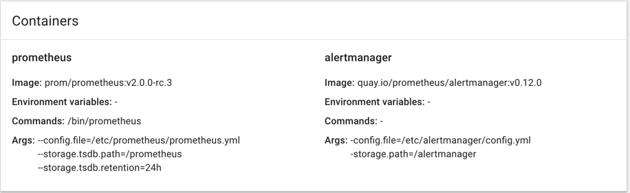
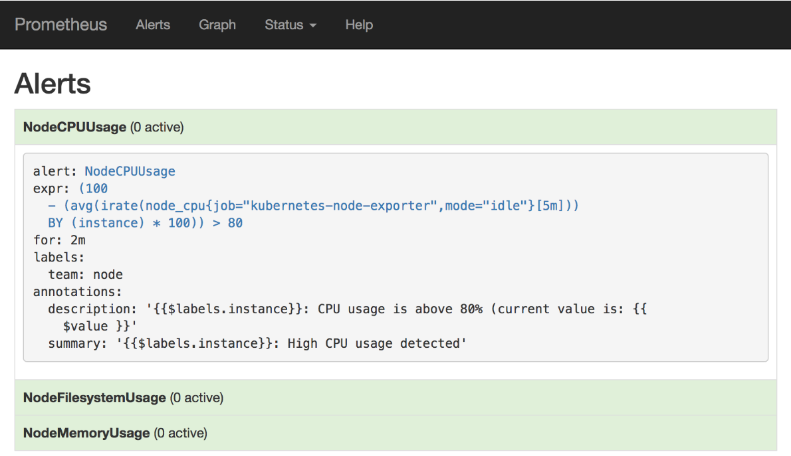
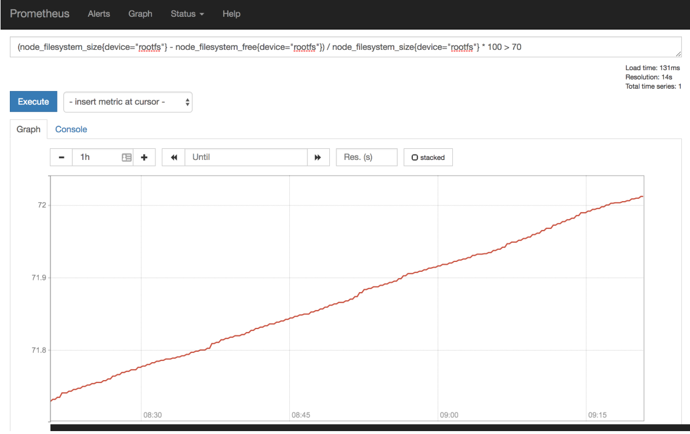

# Prometheus报警 && AlertManager实战

## AlertManager 简介

`Prometheus`将**数据采集**和**报警**分成了两个模块。

报警规则配置在`Prometheus Servers`上，然后发送报警信息到`AlertManger`，然后我们的`AlertManager`就来管理这些报警信息，包括`silencing`、`inhibition`，聚合报警信息过后通过`email`、`PagerDuty`、`HipChat`、`Slack` 等方式发送消息提示。

让`AlertManager`提供服务总的来说就下面3步： 

* 安装和配置`AlertManger` 
* 配置`Prometheus`来和`AlertManager`通信 
* 在`Prometheus`中创建报警规则

## 安装和配置`AlertManager`

从官方文档[https://prometheus.io/docs/alerting/configuration/](https://prometheus.io/docs/alerting/configuration/)中我们可以看到下载`alertmanager`二进制文件过后，通过下面的命令就可运行

```
$ ./alertmanager -config.file=simple.yml
```

* 可以通过`-config.file`来指定相应的配置文件，我们这里在`kubernetes`平台上面来运行我们的`AlertManager`，所以我们直接用`docker`镜像的方式来安装.
* 使用的镜像是：`quay.io/prometheus/alertmanager:v0.12.0`
* 如果你因为某些原因不能拉取该镜像，可以直接去下载`AlertManager`的[源代码](https://github.com/prometheus/alertmanager)，然后自己构建打包一个`docker`镜像也是一样的。


通过`ConfigMap`来指定配置文件，如下:

```
kind: ConfigMap
apiVersion: v1
metadata:
  name: alertmanager
  namespace: kube-ops
data:
  config.yml: |-
    global:
      resolve_timeout: 5m
    route:
      receiver: webhook
      group_wait: 30s
      group_interval: 5m
      repeat_interval: 4h
      group_by: [alertname]
      routes:
      - receiver: webhook
        group_wait: 10s
        match:
          team: node
    receivers:
    - name: webhook
      webhook_configs:
      - url: 'http://apollo/hooks/dingtalk/'
        send_resolved: true
      - url: 'http://apollo/hooks/prome/'
        send_resolved: true
```

我们这里定义了两个`webhook`，其中一个是`钉钉`，另外一个是`email`。

## 配置`Prometheus`来和`AlertManager`通信

在我们之前的`Prometheus`的 `ConfigMap`中增加 `AlertManager`的配置：

```
alerting:
  alertmanagers:
    - static_configs:
      - targets: ["localhost:9093"]
```

### 由于我们这个地方将`Prometheus`和`AlertManager`部署在同一个POD中，而`AlertManager`的默认端口是`9093`，所以直接使用`localhost:9093`就可以互相通信了。



 
## 在`Prometheus`中创建报警规则

同样的我们还需要添加报警规则：

```
rule_files:
    - /etc/prometheus/rules.yml
```

其中`rule_files`就是用来指定报警规则的，这里我们将`rules.yml`用`ConfigMap`的形式挂载到`/etc/prometheus`目录下面即可:

```
rules.yml: |
    groups:
    - name: test-rule
      rules:
      - alert: NodeFilesystemUsage
        expr: (node_filesystem_size{device="rootfs"} - node_filesystem_free{device="rootfs"}) / node_filesystem_size{device="rootfs"} * 100 > 80
        for: 2m
        labels:
          team: node
        annotations:
          summary: "{{$labels.instance}}: High Filesystem usage detected"
          description: "{{$labels.instance}}: Filesystem usage is above 80% (current value is: {{ $value }}"
      - alert: NodeMemoryUsage
        expr: (node_memory_MemTotal - (node_memory_MemFree+node_memory_Buffers+node_memory_Cached )) / node_memory_MemTotal * 100 > 80
        for: 2m
        labels:
          team: node
        annotations:
          summary: "{{$labels.instance}}: High Memory usage detected"
          description: "{{$labels.instance}}: Memory usage is above 80% (current value is: {{ $value }}"
      - alert: NodeCPUUsage
        expr: (100 - (avg by (instance) (irate(node_cpu{job="kubernetes-node-exporter",mode="idle"}[5m])) * 100)) > 80
        for: 2m
        labels:
          team: node
        annotations:
          summary: "{{$labels.instance}}: High CPU usage detected"
          description: "{{$labels.instance}}: CPU usage is above 80% (current value is: {{ $value }}"
```

我们这里添加了**3**条测试的报警规则，分别是节点的**文件系统**、**节点内存**和**CPU**的使用量，如果大于了80%的话就触发`label`为`team=node`的`receiver`(上面`alertmanager` 配置文件中)，我们可以看到上面的配置就会匹配`webhook`这个`receiver`，然后会将报警信息`POST`到我们提供的两个`HOOK` 接口中


一个报警信息在生命周期内有下面3中状态：

* `inactive`: 表示当前报警信息既不是`firing`状态也不是`pending`状态
* `pending`: 表示在设置的阈值时间范围内被激活了
* `firing`: 表示超过设置的阈值时间被激活了




我们直接点击上面的`expr`会直接跳转到`graph`页面查询，我们在制定报警规则的时候同样可以先在`Prometheus`里面先测试我们的表达式: `alert-info`



## 全部配置


整体的`ConfigMap`配置文件如下`cm.yaml`:

```
apiVersion: v1
kind: ConfigMap
metadata:
  name: prometheus-config
  namespace: kube-ops
data:
  prometheus.yml: |
    global:
      scrape_interval: 30s
      scrape_timeout: 30s
    rule_files:
    - /etc/prometheus/rules.yml
    alerting:
      alertmanagers:
        - static_configs:
          - targets: ["localhost:9093"]
    scrape_configs:
    - job_name: 'prometheus'
      static_configs:
        - targets: ['localhost:9090']
    - job_name: 'kubernetes-apiservers'
      kubernetes_sd_configs:
      - role: endpoints
      scheme: https
      tls_config:
        ca_file: /var/run/secrets/kubernetes.io/serviceaccount/ca.crt
      bearer_token_file: /var/run/secrets/kubernetes.io/serviceaccount/token
      relabel_configs:
      - source_labels: [__meta_kubernetes_namespace, __meta_kubernetes_service_name, __meta_kubernetes_endpoint_port_name]
        action: keep
        regex: default;kubernetes;https
    - job_name: 'kubernetes-nodes'
      scheme: https
      tls_config:
        ca_file: /var/run/secrets/kubernetes.io/serviceaccount/ca.crt
      bearer_token_file: /var/run/secrets/kubernetes.io/serviceaccount/token
      kubernetes_sd_configs:
      - role: node
      relabel_configs:
      - action: labelmap
        regex: __meta_kubernetes_node_label_(.+)
      - target_label: __address__
        replacement: kubernetes.default.svc:443
      - source_labels: [__meta_kubernetes_node_name]
        regex: (.+)
        target_label: __metrics_path__
        replacement: /api/v1/nodes/${1}/proxy/metrics
    - job_name: 'kubernetes-cadvisor'
      scheme: https
      tls_config:
        ca_file: /var/run/secrets/kubernetes.io/serviceaccount/ca.crt
      bearer_token_file: /var/run/secrets/kubernetes.io/serviceaccount/token
      kubernetes_sd_configs:
      - role: node
      relabel_configs:
      - action: labelmap
        regex: __meta_kubernetes_node_label_(.+)
      - target_label: __address__
        replacement: kubernetes.default.svc:443
      - source_labels: [__meta_kubernetes_node_name]
        regex: (.+)
        target_label: __metrics_path__
        replacement: /api/v1/nodes/${1}/proxy/metrics/cadvisor
    - job_name: 'kubernetes-node-exporter'
      scheme: http
      tls_config:
        ca_file: /var/run/secrets/kubernetes.io/serviceaccount/ca.crt
      bearer_token_file: /var/run/secrets/kubernetes.io/serviceaccount/token
      kubernetes_sd_configs:
      - role: node
      relabel_configs:
      - action: labelmap
        regex: __meta_kubernetes_node_label_(.+)
      - source_labels: [__meta_kubernetes_role]
        action: replace
        target_label: kubernetes_role
      - source_labels: [__address__]
        regex: '(.*):10250'
        replacement: '${1}:31672'
        target_label: __address__
    - job_name: 'kubernetes-service-endpoints'
      kubernetes_sd_configs:
      - role: endpoints
      relabel_configs:
      - source_labels: [__meta_kubernetes_service_annotation_prometheus_io_scrape]
        action: keep
        regex: true
      - source_labels: [__meta_kubernetes_service_annotation_prometheus_io_scheme]
        action: replace
        target_label: __scheme__
        regex: (https?)
      - source_labels: [__meta_kubernetes_service_annotation_prometheus_io_path]
        action: replace
        target_label: __metrics_path__
        regex: (.+)
      - source_labels: [__address__, __meta_kubernetes_service_annotation_prometheus_io_port]
        action: replace
        target_label: __address__
        regex: ([^:]+)(?::\d+)?;(\d+)
        replacement: $1:$2
      - action: labelmap
        regex: __meta_kubernetes_service_label_(.+)
      - source_labels: [__meta_kubernetes_namespace]
        action: replace
        target_label: kubernetes_namespace
      - source_labels: [__meta_kubernetes_service_name]
        action: replace
        target_label: kubernetes_name
    - job_name: 'kubernetes-services'
      metrics_path: /probe
      params:
        module: [http_2xx]
      kubernetes_sd_configs:
      - role: service
      relabel_configs:
      - source_labels: [__meta_kubernetes_service_annotation_prometheus_io_probe]
        action: keep
        regex: true
      - source_labels: [__address__]
        target_label: __param_target
      - target_label: __address__
        replacement: blackbox-exporter.example.com:9115
      - source_labels: [__param_target]
        target_label: instance
      - action: labelmap
        regex: __meta_kubernetes_service_label_(.+)
      - source_labels: [__meta_kubernetes_namespace]
        target_label: kubernetes_namespace
      - source_labels: [__meta_kubernetes_service_name]
        target_label: kubernetes_name
  rules.yml: |
    groups:
    - name: test-rule
      rules:
      - alert: NodeFilesystemUsage
        expr: (node_filesystem_size{device="rootfs"} - node_filesystem_free{device="rootfs"}) / node_filesystem_size{device="rootfs"} * 100 > 80
        for: 2m
        labels:
          team: node
        annotations:
          summary: "{{$labels.instance}}: High Filesystem usage detected"
          description: "{{$labels.instance}}: Filesystem usage is above 80% (current value is: {{ $value }}"
      - alert: NodeMemoryUsage
        expr: (node_memory_MemTotal - (node_memory_MemFree+node_memory_Buffers+node_memory_Cached )) / node_memory_MemTotal * 100 > 80
        for: 2m
        labels:
          team: node
        annotations:
          summary: "{{$labels.instance}}: High Memory usage detected"
          description: "{{$labels.instance}}: Memory usage is above 80% (current value is: {{ $value }}"
      - alert: NodeCPUUsage
        expr: (100 - (avg by (instance) (irate(node_cpu{job="kubernetes-node-exporter",mode="idle"}[5m])) * 100)) > 80
        for: 2m
        labels:
          team: node
        annotations:
          summary: "{{$labels.instance}}: High CPU usage detected"
          description: "{{$labels.instance}}: CPU usage is above 80% (current value is: {{ $value }}"
---
kind: ConfigMap
apiVersion: v1
metadata:
  name: alertmanager
  namespace: kube-ops
data:
  config.yml: |-
    global:
      resolve_timeout: 5m
    route:
      receiver: webhook
      group_wait: 30s
      group_interval: 5m
      repeat_interval: 4h
      group_by: [alertname]
      routes:
      - receiver: webhook
        group_wait: 10s
        match:
          team: node
    receivers:
    - name: webhook
      webhook_configs:
      - url: 'http://apollo/hooks/dingtalk/'
        send_resolved: true
      - url: 'http://apollo/hooks/prome/'
        send_resolved: true
```

执行下面的命令即可：

```
$ kubectl apply -f cm.yaml
```

然后部署的文件`deploy.yaml`如下：

```
apiVersion: extensions/v1beta1
kind: Deployment
metadata:
  labels:
    k8s-app: prometheus
  name: prometheus
  namespace: kube-ops
spec:
  replicas: 1
  template:
    metadata:
      labels:
        k8s-app: prometheus
    spec:
      serviceAccountName: prometheus
      containers:
      - image: prom/prometheus:v2.0.0-rc.3
        name: prometheus
        command:
        - "/bin/prometheus"
        args:
        - "--config.file=/etc/prometheus/prometheus.yml"
        - "--storage.tsdb.path=/prometheus"
        - "--storage.tsdb.retention=24h"
        ports:
        - containerPort: 9090
          protocol: TCP
          name: http
        volumeMounts:
        - mountPath: "/prometheus"
          name: data
        - mountPath: "/etc/prometheus"
          name: config-volume
        resources:
          requests:
            cpu: 100m
            memory: 100Mi
          limits:
            cpu: 200m
            memory: 1Gi
      - image: quay.io/prometheus/alertmanager:v0.12.0
        name: alertmanager
        args:
        - "-config.file=/etc/alertmanager/config.yml"
        - "-storage.path=/alertmanager"
        ports:
        - containerPort: 9093
          protocol: TCP
          name: http
        volumeMounts:
        - name: alertmanager-config-volume
          mountPath: /etc/alertmanager
        resources:
          requests:
            cpu: 50m
            memory: 50Mi
          limits:
            cpu: 200m
            memory: 200Mi
      volumes:
      - name: data
        emptyDir: {}
      - configMap:
          name: prometheus-config
        name: config-volume
      - name: alertmanager-config-volume
        configMap:
          name: alertmanager

```

执行下面的命令即可： 执行下面的命令即可：

```
$ kubectl apply -f deploy.yaml
```

注意：本文章的实现都是针对Prometheus2.x版本，1.x 版本配置会有所不同

[Prometheus: understanding the delays on alerting](https://pracucci.com/prometheus-understanding-the-delays-on-alerting.html)
