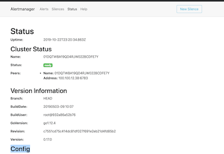

# Add Custom Alert and Send Alert Email with Alertmanager (SAP - Converged Cloud - Ubertest Cluster)


## Add Custom Alert (prometheus operator)

### Step one: Check `ruleSelector` from prometheus-operator 

**Why Should I do this, please check reference** [配置 PrometheusRule](https://github.com/Chao-Xi/JacobTechBlog/blob/master/k8s_dev/prometheus/14Adv_Prometheus_Operator_alarm.md#%E9%85%8D%E7%BD%AE-prometheusrule)

```
kubectl get Prometheus monitoring-prometheus-oper-prometheus -n monitoring -oyaml

...
ruleSelector:
    matchLabels:
      app: prometheus-operator
      release: monitoring
...
```

### Step two: Custom Alert info for `git_proxy` in Ubertest Cluster

```
apiVersion: monitoring.coreos.com/v1
kind: PrometheusRule
metadata:
  labels:
    app: prometheus-operator
    release: monitoring
  name: gitproxy-memory-rules
  namespace: monitoring
spec:
  groups:
  - name: gitproxy
    rules:
    - alert: GitproxyMemoryHigh
      annotations:
        summary: gitproxy memory is over 2gb in 30 minutes
        description: gitproxy pod memory is unusually high and normally below 1gb
      expr: | 
        (avg_over_time(container_memory_usage_bytes{namespace="management", container_name="gitproxy"}[30m]) / (1024*1024)) > 2048
      labels:
        severity: critical
```

```
$ kubectl apply -f gitproxy_memory_rule.yaml 
prometheusrule.monitoring.coreos.com/gitproxy-memory-rules configured
```

### Step Three: Check alert works or not

* **Option one**

```
$ kubectl -n monitoring port-forward prometheus-monitoring-prometheus-oper-prometheus-0 9090:9090
```


* **Option two**

```
$ kubectl exec prometheus-monitoring-prometheus-oper-prometheus-0 -n monitoring -it sh

# cd /etc/prometheus/rules/prometheus-monitoring-prometheus-oper-prometheus-rulefiles-0/

# ls -la 
```

### Reference: 

1. [PromQL]()
2. [https://timber.io/blog/promql-for-humans/](https://timber.io/blog/promql-for-humans/)

## Send alert email

### Step one Check origin alert email config

```
$ kubectl get secret -n monitoring alertmanager-monitoring-prometheus-oper-alertmanager -oyaml

apiVersion: v1
data:
  alertmanager.yaml: Z2xvYmFsOgogIHJlc29sdmVfdGltZW91dDogNW0KcmVjZWl2ZXJzOgotIG5hbWU6ICJudWxsIgpyb3V0ZToKICBncm91cF9ieToKICAtIGpvYgogIGdyb3VwX2ludGVydmFsO
iA1bQogIGdyb3VwX3dhaXQ6IDMwcwogIHJlY2VpdmVyOiAibnVsbCIKICByZXBlYXRfaW50ZXJ2YWw6IDEyaAogIHJvdXRlczoKICAtIG1hdGNoOgogICAgICBhbGVydG5hbWU6IFdhdGNoZG9nCiAgICB
yZWNlaXZlcjogIm51bGwiCg==
kind: Secret
metadata:
  creationTimestamp: "2019-08-07T07:42:14Z"
  labels:
    app: prometheus-operator-alertmanager
    chart: prometheus-operator-6.2.0
    heritage: Tiller
    release: monitoring
  name: alertmanager-monitoring-prometheus-oper-alertmanager
  namespace: monitoring
  resourceVersion: "69027563"
  selfLink: /api/v1/namespaces/monitoring/secrets/alertmanager-monitoring-prometheus-oper-alertmanager
  uid: dfca9306-b8e6-11e9-9cbe-fe2458f1cc65
type: Opaque
```

**alertmanager.yaml**

```
$ echo Z2xvYmFsOgogIHJlc29sdmVfdGltZW91dDogNW0KcmVjZWl2ZXJzOgotIG5hbWU6ICJudWxsIgpyb3V0ZToKICBncm91cF9ieToKICAtIGpvYgogIGdyb3VwX2ludGVydmFsOiA1bQogIGdyb3VwX3dhaXQ6IDMwcwogIHJlY2VpdmVyOiAibnVsbCIKICByZXBlYXRfaW50ZXJ2YWw6IDEyaAogIHJvdXRlczoKICAtIG1hdGNoOgogICAgICBhbGVydG5hbWU6IFdhdGNoZG9nCiAgICByZWNlaXZlcjogIm51bGwiCg== |  base64 -D

global:
  resolve_timeout: 5m
receivers:
- name: "null"
route:
  group_by:
  - job
  group_interval: 5m
  group_wait: 30s
  receiver: "null"
  repeat_interval: 12h
  routes:
  - match:
      alertname: Watchdog
    receiver: "null"
```

### Step two: Custom own email config

```
# https://prometheus.io/docs/alerting/configuration/
global:
  resolve_timeout: 5m
  smtp_from: 'noreply@sap.com'
  # can only be set up as noreply@sap.com, otherwise the email will not sent
  smtp_smarthost: 'mailhost.pgdev.sap.corp:25' 
  # public smtp server for sap   
  smtp_require_tls: false
route:
  # group_by: ['prometheus']
  group_wait: 30s
  group_interval: 1h
  repeat_interval: 12h
  # Set repeat_interval as 6h, since ubertest is internal tool for us
  receiver: jam_devops
  routes:
  - receiver: jam_devops
    match:
      alertname: GitproxyMemoryHigh

receivers:
- name: 'jam_devops'
  email_configs:
  # - to: 'DL_@global.corp.sap'  # This is Jam Devops Team DL
  - to: 'j@sap.com'
    send_resolved: true
    headers:
      Subject: 'Ubertest-Alert{{ template "email.default.subject" . }}' # Special header for ubertest cluster

# 
inhibit_rules:
- source_match:
    severity: 'critical'
  target_match_re:
    severity: 'warning|none'
  # Since prometheus is common label in alertmanager, so critical will inhibit all "warning|none" severity 
  equal:  ['prometheus']
# Since severity cannot inhibit severity, 
# I need change policy from severity to alertname which inside severity 
- source_match:
    alertname: 'KubeControllerManagerDown'
  target_match:
    alertname: 'KubeDaemonSetRolloutStuck'
  equal: ['prometheus']
# KubeSchedulerDown and KubeControllerManagerDown inhibit each other 
- source_match:
    alertname: 'KubeControllerManagerDown'
  target_match:
    alertname: 'KubeSchedulerDown'
  equal: ['prometheus']
- source_match:
    alertname: 'KubeSchedulerDown'
  target_match:
    alertname: 'KubeControllerManagerDown'
  equal: ['prometheus']
- source_match:
    alertname: 'GitproxyMemoryHigh'
  target_match_re:
    severity: 'critical'
  equal: ['prometheus']
```

#### Speical settings 

* `smtp_from: 'noreply@sap.com'`
* `Subject: 'Ubertest-Alert{{ template "email.default.subject" . }}'`
* `inhibit_rules:`


### Step three: Delete old and apply new


**Why Should I do this, please check reference** [配置报警](https://github.com/Chao-Xi/JacobTechBlog/blob/master/k8s_dev/prometheus/14Adv_Prometheus_Operator_alarm.md#%E9%85%8D%E7%BD%AE-prometheusrule)

```
$ kubectl create secret generic alertmanager-monitoring-prometheus-oper-alertmanager -n monitoring --from-file=alertmanager.yaml

$ kubectl delete secret alertmanager-monitoring-prometheus-oper-alertmanager -n monitoring

$ kubectl logs alertmanager-monitoring-prometheus-oper-alertmanager-0 -n monitoring -c alertmanager
```

### Step four: Check works or not

```
$ kubectl logs alertmanager-monitoring-prometheus-oper-alertmanager-0 -n monitoring -c alertmanager

...
level=info ts=2019-11-08T05:18:34.894500263Z caller=coordinator.go:131 component=configuration msg="Completed loading of configuration file" file=/etc/alertmanager/config/alertmanager.yaml
...
```

```
$ kubectl -n monitoring port-forward alertmanager-monitoring-prometheus-oper-alertmanager-0 9093:9093
```


**`http://localhost:9093/#/status`**




**Config**
 
```
global:
  resolve_timeout: 5m
  http_config: {}
  smtp_from: noreply@sap.com
  smtp_hello: localhost
  smtp_smarthost: mailhost.pgdev.sap.corp:25
  pagerduty_url: https://events.pagerduty.com/v2/enqueue
  hipchat_api_url: https://api.hipchat.com/
  opsgenie_api_url: https://api.opsgenie.com/
  wechat_api_url: https://qyapi.weixin.qq.com/cgi-bin/
  victorops_api_url: https://alert.victorops.com/integrations/generic/20131114/alert/
route:
  receiver: jam_devops
  routes:
  - receiver: jam_devops
    match:
      alertname: GitproxyMemoryHigh
  group_wait: 30s
  group_interval: 5m
  repeat_interval: 6h
inhibit_rules:
- source_match:
    severity: critical
  target_match_re:
    severity: warning|none
  equal:
  - prometheus
- source_match:
    alertname: KubeControllerManagerDown
  target_match:
    alertname: KubeDaemonSetRolloutStuck
  equal:
  - prometheus
- source_match:
    alertname: KubeControllerManagerDown
  target_match:
    alertname: KubeSchedulerDown
  equal:
  - prometheus
- source_match:
    alertname: KubeSchedulerDown
  target_match:
    alertname: KubeControllerManagerDown
  equal:
  - prometheus
receivers:
- name: jam_devops
  email_configs:
  - send_resolved: true
    to: ***
    from: noreply@sap.com
    hello: localhost
    smarthost: mailhost.pgdev.sap.corp:25
    headers:
      From: noreply@sap.com
      Subject: Ubertest-Alert{{ template "email.default.subject" . }}
      To: ***
    html: '{{ template "email.default.html" . }}'
    require_tls: false
templates: []
```

### Reference: 

* [alert-example-github](https://github.com/prometheus/alertmanager/blob/master/doc/examples/simple.yml)


[]()


