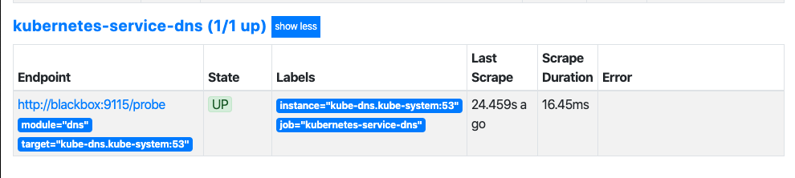
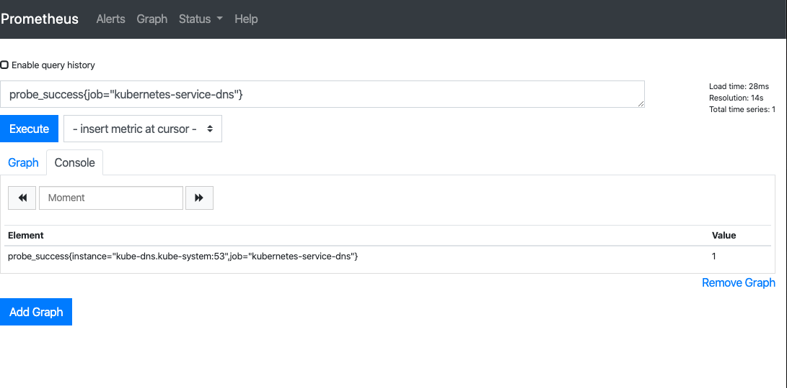
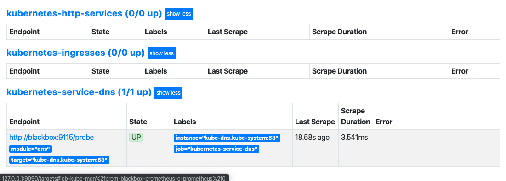
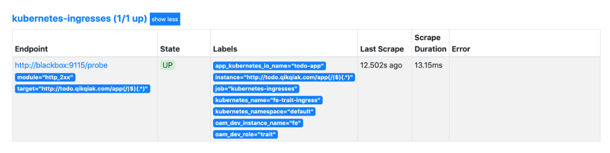
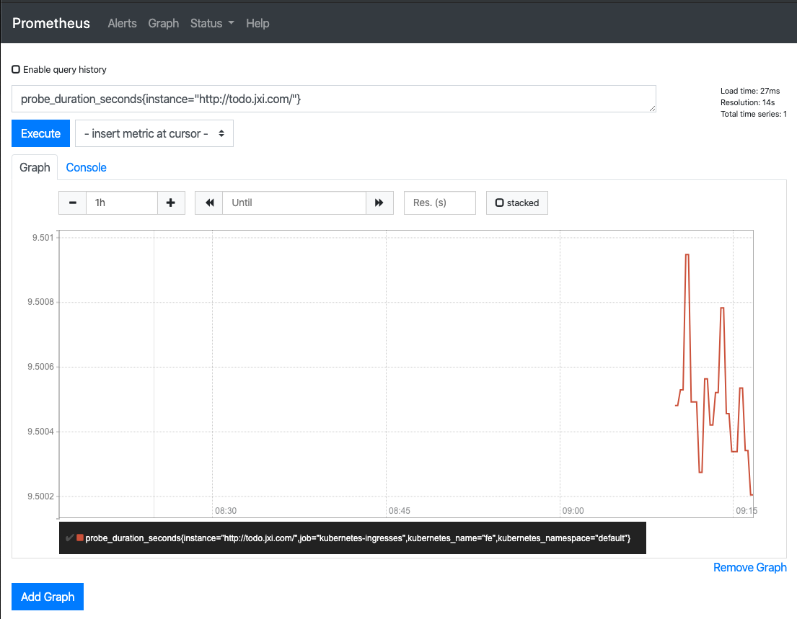

# Prometheus 黑盒监控

前面我们主要介绍了 `Prometheus` 下如何进行**白盒监控**，我们监控主机的资源用量、容器的运行状态、数据库中间件的运行数据、自动发现 `Kubernetes` 集群中的资源等等，

这些都是支持业务和服务的基础设施，通过白盒能够了解其内部的实际运行状态，通过对监控指标的观察能够预判可能出现的问题，从而对潜在的不确定因素进行优化

而从完整的监控逻辑的角度，除了大量的应用白盒监控以外，**还应该添加适当的 `Blackbox`（黑盒）监控，黑盒监控即以用户的身份测试服务的外部可见性，常见的黑盒监控包括 `HTTP 探针`、`TCP 探针` 等用于检测站点或者服务的可访问性，以及访问效率等**。

黑盒监控相较于白盒监控最大的不同在于黑盒监控是以故障为导向当故障发生时，黑盒监控能快速发现故障，而白盒监控则侧重于主动发现或者预测潜在的问题。一个完善的监控目标是要能够从白盒的角度发现潜在问题，能够在黑盒的角度快速发现已经发生的问题。

[`Blackbox Exporter`](https://github.com/prometheus/blackbox_exporter) 是`Prometheus` 社区提供的官方黑盒监控解决方案，其允许用户通过：`HTTP`、`HTTPS`、`DNS`、`TCP` 以及 `ICMP` 的方式对网络进行探测

[Marvelous Prometheus Blackbox alerts](https://github.com/Chao-Xi/JacobTechBlog/blob/master/k8s_dev/prometheus/prom-alerts/26Blackbox.md)

### 快速安装 `helm-prometheus-operator`

```
kubectl create ns kube-mon
helm install prom-blackbox stable/prometheus-operator -f prometheus-operator-values.yml --namespace kube-mon
```

**`prometheus-operator-values.yml`**

```
# We don't need the alertmanager for this demo
alertmanager:
  enabled: false

# This configuration means all ServiceMonitors in the namespsace will be picked up
# Use with caution!
prometheus: 
  prometheusSpec:
    serviceMonitorSelectorNilUsesHelmValues: false
    serviceMonitorSelector: {}
```


```
$ helm install prom-blackbox stable/prometheus-operator -f prometheus-operator-values.yml --namespace kube-mon
NAME: prom-blackbox
LAST DEPLOYED: Tue Dec 17 10:17:02 2019
NAMESPACE: kube-mon
STATUS: deployed
REVISION: 1
NOTES:
The Prometheus Operator has been installed. Check its status by running:
  kubectl --namespace kube-mon get pods -l "release=prom-blackbox"

Visit https://github.com/coreos/prometheus-operator for instructions on how
```


### 快速安装 `blackbox-exporter` 服务

同样首先需要在 `Kubernetes` 集群中运行 `blackbox-exporter` 服务，同样通过一个 `ConfigMap` 资源对象来为 `Blackbox` 提供配置，如下所示：（`prome-blackbox.yaml`）

```
apiVersion: v1
kind: ConfigMap
metadata:
  name: blackbox-config
  namespace: kube-mon
data:
  blackbox.yml: |-
    modules:
      http_2xx:  # http 检测模块  Blockbox-Exporter 中所有的探针均是以 Module 的信息进行配置
        prober: http
        timeout: 10s
        http:
          valid_http_versions: ["HTTP/1.1", "HTTP/2"]   
          valid_status_codes: [200]  # 这里最好作一个返回状态码，在grafana作图时，有明示---陈刚注释。
          method: GET
          preferred_ip_protocol: "ip4"
      http_post_2xx: # http post 监测模块
        prober: http
        timeout: 10s
        http:
          valid_http_versions: ["HTTP/1.1", "HTTP/2"]
          method: POST
          preferred_ip_protocol: "ip4"
      tcp_connect:  # TCP 检测模块
        prober: tcp
        timeout: 10s
      dns:  # DNS 检测模块
        prober: dns
        dns:
          transport_protocol: "tcp"  # 默认是 udp
          preferred_ip_protocol: "ip4"  # 默认是 ip6
          query_name: "kubernetes.default.svc.cluster.local"
---
apiVersion: apps/v1
kind: Deployment
metadata:
  name: blackbox
  namespace: kube-mon
spec:
  selector:
    matchLabels:
      app: blackbox
  template:
    metadata:
      labels:
        app: blackbox
    spec:
      containers:
      - image: prom/blackbox-exporter:v0.16.0
        name: blackbox
        args:
        - --config.file=/etc/blackbox_exporter/blackbox.yml # ConfigMap 中的配置文件
        - --log.level=error  # 错误级别控制
        ports:
        - containerPort: 9115
        volumeMounts:
        - name: config
          mountPath: /etc/blackbox_exporter
      volumes:
      - name: config
        configMap:
          name: blackbox-config
---
apiVersion: v1
kind: Service
metadata:
  name: blackbox
  namespace: kube-mon
spec:
  selector:
    app: blackbox
  ports:
  - port: 9115
    targetPort: 9115
```

直接创建上面的资源清单：

```
$ kubectl apply -f content/monitor/manifests/install/prome-blackbox.yaml 
configmap/blackbox-config created
deployment.apps/blackbox created
service/blackbox created
```

然后需要在 `Prometheus` 的配置文件中加入对 `BlackBox` 的抓取设置，

##  传统 ` k8s-Prometheus`  方式

```
apiVersion: v1
kind: ConfigMap
metadata:
  name: prometheus-config
  namespace: kube-mon
data:
  prometheus.yml: |
    global:
      scrape_interval: 15s
      scrape_timeout: 15s
    scrape_configs:
    - job_name: 'prometheus'
      static_configs:
      - targets: ['localhost:9090']
      
    - job_name: "kubernetes-service-dns"
      metrics_path: /probe # 不是 metrics，是 probe
      params:
        module: [dns] # 使用 DNS 模块
      static_configs:
      - targets:
        - kube-dns.kube-system:53  # 不要省略端口号
      relabel_configs:
      - source_labels: [__address__]
        target_label: __param_target
      - source_labels: [__param_target]
        target_label: instance
      - target_label: __address__
        replacement: blackbox:9115  # 服务地址，和上面的 Service 定义保持一致
```

* 首先获取 `targets` 实例的 `__address__ ` 值写进 `__param_target`, 
*  `__param_<name>  `形式的标签里的 `name `和它的值会被添加到发送到黑盒的 `http` 的 `header `的 `params` 当作键值，例如 `__param_module` 对应 `params` 里的 `module`。
*  然后获取 `__param_target` 的值，并覆写到 `instance` 标签中，
*  覆写 `Target` 实例的 `__address__ `标签值为 `BlackBox Exporter` 实例的访问地址，向 `blackbox:9115` 发送请求获取实例的 `metrics` 信息。


然后更新配置：

```
$ kubectl apply -f prometheus-cm.yaml
configmap/prometheus-config configured


# 隔一会儿执行 reload 操作
$ curl -X POST "http://10.244.3.174:9090/-/reload"  # promethues pod ip  and suppose hot reload
```

打开 `Prometheus` 的 `Target` 页面，就会看到 上面定义的 `kubernetes-service-dns` 任务了：


##  `Prometheus-Opeartor` 绕过 `ServiceMonitor` 方式

**Reference:**

[Additional Scrape Configuration](https://github.com/coreos/prometheus-operator/blob/master/Documentation/additional-scrape-config.md)

**Creating an additional configuration:**

**`prometheus-additional.yaml`**

```
- job_name: "kubernetes-service-dns"
      metrics_path: /probe # 不是 metrics，是 probe
      params:
        module: [dns] # 使用 DNS 模块
      static_configs:
      - targets:
        - kube-dns.kube-system:53  # 不要省略端口号
      relabel_configs:
      - source_labels: [__address__]
        target_label: __param_target
      - source_labels: [__param_target]
        target_label: instance
      - target_label: __address__
        replacement: blackbox:9115  # 服务地址，和上面的 Service 定义保持一致
```

```
kubectl create secret --namesapce kube-mon generic additional-scrape-configs --from-file=prometheus-additional.yaml --dry-run -oyaml > additional-scrape-configs.yaml
```

**`additional-scrape-configs.yaml`**

```
apiVersion: v1
data:
  prometheus-additional.yaml: ......
kind: Secret
metadata:
  creationTimestamp: null
  name: additional-scrape-configs
  namespace: kube-mon   
```

```
$ kubectl apply -f additional-scrape-configs.yaml
secret/additional-scrape-configs created
```

**Finally, reference this additional configuration in your `prometheus.yaml` CRD**.

```
$ kubectl get prometheus -n kube-mon
NAME                                    AGE
prom-blackbox-prometheus-o-prometheus   6h34m
```

```
$ kubectl edit Prometheus prom-blackbox-prometheus-o-prometheus -n kube-mon
...
ruleNamespaceSelector: {}
  ruleSelector:
    matchLabels:
      app: prometheus-operator
      release: prom-blackbox
  securityContext:
...
```
```
# 隔一会儿执行 
kubectl port-forward svc/prom-blackbox-prometheus-o-prometheus -n kube-mon 9090:9090
```



回到 `Graph` 页面，可以使用 `probe_success{job="kubernetes-service-dns"}` 来查看检测结果，这样就实现了对 DNS 的黑盒监控。




**除了 `DNS` 的配置外，上面我们还配置了一个 `http_2xx` 的模块，也就是 `HTTP` 探针，`HTTP` 探针是进行黑盒监控时最常用的探针之一，通过 `HTTP` 探针能够对网站或者 `HTTP` 服务建立有效的监控，包括其本身的可用性，以及用户体验相关的如响应时间等等。除了能够在服务出现异常的时候及时报警，还能帮助系统管理员分析和优化网站体验。**

这里我们可以使用他来对 `http` 服务进行检测。

因为前面已经给 `Blackbox` 配置了 `http_2xx` 模块，所以这里只需要在 `Prometheus` 中加入抓取任务，这里我们可以结合前面的 `Prometheus` 的服务发现功能来做黑盒监控，对于 `Service` 和 `Ingress` 类型的服务发现，用来进行黑盒监控是非常合适的，配置如下所示：

**`prometheus-additional.yaml`**


```
- job_name: "kubernetes-service-dns"
  metrics_path: /probe 
  params:
    module: [dns]
  static_configs:
  - targets:
    - kube-dns.kube-system:53
  relabel_configs:
  - source_labels: [__address__]
    target_label: __param_target
  - source_labels: [__param_target]
    target_label: instance
  - target_label: __address__
    replacement: blackbox:9115

- job_name: 'kubernetes-http-services'
  metrics_path: /probe
  params:
    module: [http_2xx]  # 使用定义的http模块
  kubernetes_sd_configs:
  - role: service  # service 类型的服务发现
  relabel_configs:
  # 只有service的annotation中配置了 prometheus.io/http_probe=true 的才进行发现
  - source_labels: [__meta_kubernetes_service_annotation_prometheus_io_http_probe]
    action: keep
    regex: true
  - source_labels: [__address__]
    target_label: __param_target
  - target_label: __address__
    replacement: blackbox:9115
  - source_labels: [__param_target]
    target_label: instance
  - action: labelmap
    regex: __meta_kubernetes_service_label_(.+)
  - source_labels: [__meta_kubernetes_namespace]
    target_label: kubernetes_namespace
  - source_labels: [__meta_kubernetes_service_name]
    target_label: kubernetes_name

- job_name: 'kubernetes-ingresses'
  metrics_path: /probe
  params:
    module: [http_2xx]  # 使用定义的http模块
  kubernetes_sd_configs:
  - role: ingress  # ingress 类型的服务发现
  relabel_configs:
  # 只有ingress的annotation中配置了 prometheus.io/http_probe=true的才进行发现
  - source_labels: [__meta_kubernetes_ingress_annotation_prometheus_io_http_probe]
    action: keep
    regex: true
  - source_labels: [__meta_kubernetes_ingress_scheme,__address__,__meta_kubernetes_ingress_path]
    regex: (.+);(.+);(.+)
    replacement: ${1}://${2}${3}
    target_label: __param_target
  - target_label: __address__
    replacement: blackbox:9115
  - source_labels: [__param_target]
    target_label: instance
  - action: labelmap
    regex: __meta_kubernetes_ingress_label_(.+)
  - source_labels: [__meta_kubernetes_namespace]
    target_label: kubernetes_namespace
  - source_labels: [__meta_kubernetes_ingress_name]
    target_label: kubernetes_name
```

我们结合前面的服务发现功能，通过过滤 `prometheus.io/http_probe=true` 的 `Service` 和 `Ingress` 才进行 `HTTP` 探针类型的黑盒监控，其他配置和上面配置 `dns` 监控的时候是一致的。然后更新配置：

```
kubectl delete secret additional-scrape-configs -n kube-mon
```

```
kubectl create secret --namespace kube-mon generic additional-scrape-configs --from-file=prometheus-additional.yaml --dry-run -oyaml > additional-scrape-configs.yaml
```

**`additional-scrape-configs.yaml`**

```
apiVersion: v1
data:
  prometheus-additional.yaml: LSBqb2JfbmFtZTogImt1YmVybmV0ZXMtc2VydmljZS1kbnMiCiAgbWV0cmljc19wYXRoOiAvcHJvYmUgCiAgcGFyYW1zOgogICAgbW9kdWxlOiBbZG5zXQogIHN0YXRpY19jb25maWdzOgogIC0gdGFyZ2V0czoKICAgIC0ga3ViZS1kbnMua3ViZS1zeXN0ZW06NTMKICByZWxhYmVsX2NvbmZpZ3M6CiAgLSBzb3VyY2VfbGFiZWxzOiBbX19hZGRyZXNzX19dCiAgICB0YXJnZXRfbGFiZWw6IF9fcGFyYW1fdGFyZ2V0CiAgLSBzb3VyY2VfbGFiZWxzOiBbX19wYXJhbV90YXJnZXRdCiAgICB0YXJnZXRfbGFiZWw6IGluc3RhbmNlCiAgLSB0YXJnZXRfbGFiZWw6IF9fYWRkcmVzc19fCiAgICByZXBsYWNlbWVudDogYmxhY2tib3g6OTExNQoKLSBqb2JfbmFtZTogJ2t1YmVybmV0ZXMtaHR0cC1zZXJ2aWNlcycKICBtZXRyaWNzX3BhdGg6IC9wcm9iZQogIHBhcmFtczoKICAgIG1vZHVsZTogW2h0dHBfMnh4XSAgIyDkvb/nlKjlrprkuYnnmoRodHRw5qih5Z2XCiAga3ViZXJuZXRlc19zZF9jb25maWdzOgogIC0gcm9sZTogc2VydmljZSAgIyBzZXJ2aWNlIOexu+Wei+eahOacjeWKoeWPkeeOsAogIHJlbGFiZWxfY29uZmlnczoKICAjIOWPquaciXNlcnZpY2XnmoRhbm5vdGF0aW9u5Lit6YWN572u5LqGIHByb21ldGhldXMuaW8vaHR0cF9wcm9iZT10cnVlIOeahOaJjei/m+ihjOWPkeeOsAogIC0gc291cmNlX2xhYmVsczogW19fbWV0YV9rdWJlcm5ldGVzX3NlcnZpY2VfYW5ub3RhdGlvbl9wcm9tZXRoZXVzX2lvX2h0dHBfcHJvYmVdCiAgICBhY3Rpb246IGtlZXAKICAgIHJlZ2V4OiB0cnVlCiAgLSBzb3VyY2VfbGFiZWxzOiBbX19hZGRyZXNzX19dCiAgICB0YXJnZXRfbGFiZWw6IF9fcGFyYW1fdGFyZ2V0CiAgLSB0YXJnZXRfbGFiZWw6IF9fYWRkcmVzc19fCiAgICByZXBsYWNlbWVudDogYmxhY2tib3g6OTExNQogIC0gc291cmNlX2xhYmVsczogW19fcGFyYW1fdGFyZ2V0XQogICAgdGFyZ2V0X2xhYmVsOiBpbnN0YW5jZQogIC0gYWN0aW9uOiBsYWJlbG1hcAogICAgcmVnZXg6IF9fbWV0YV9rdWJlcm5ldGVzX3NlcnZpY2VfbGFiZWxfKC4rKQogIC0gc291cmNlX2xhYmVsczogW19fbWV0YV9rdWJlcm5ldGVzX25hbWVzcGFjZV0KICAgIHRhcmdldF9sYWJlbDoga3ViZXJuZXRlc19uYW1lc3BhY2UKICAtIHNvdXJjZV9sYWJlbHM6IFtfX21ldGFfa3ViZXJuZXRlc19zZXJ2aWNlX25hbWVdCiAgICB0YXJnZXRfbGFiZWw6IGt1YmVybmV0ZXNfbmFtZQoKLSBqb2JfbmFtZTogJ2t1YmVybmV0ZXMtaW5ncmVzc2VzJwogIG1ldHJpY3NfcGF0aDogL3Byb2JlCiAgcGFyYW1zOgogICAgbW9kdWxlOiBbaHR0cF8yeHhdICAjIOS9v+eUqOWumuS5ieeahGh0dHDmqKHlnZcKICBrdWJlcm5ldGVzX3NkX2NvbmZpZ3M6CiAgLSByb2xlOiBpbmdyZXNzICAjIGluZ3Jlc3Mg57G75Z6L55qE5pyN5Yqh5Y+R546wCiAgcmVsYWJlbF9jb25maWdzOgogICMg5Y+q5pyJaW5ncmVzc+eahGFubm90YXRpb27kuK3phY3nva7kuoYgcHJvbWV0aGV1cy5pby9odHRwX3Byb2JlPXRydWXnmoTmiY3ov5vooYzlj5HnjrAKICAtIHNvdXJjZV9sYWJlbHM6IFtfX21ldGFfa3ViZXJuZXRlc19pbmdyZXNzX2Fubm90YXRpb25fcHJvbWV0aGV1c19pb19odHRwX3Byb2JlXQogICAgYWN0aW9uOiBrZWVwCiAgICByZWdleDogdHJ1ZQogIC0gc291cmNlX2xhYmVsczogW19fbWV0YV9rdWJlcm5ldGVzX2luZ3Jlc3Nfc2NoZW1lLF9fYWRkcmVzc19fLF9fbWV0YV9rdWJlcm5ldGVzX2luZ3Jlc3NfcGF0aF0KICAgIHJlZ2V4OiAoLispOyguKyk7KC4rKQogICAgcmVwbGFjZW1lbnQ6ICR7MX06Ly8kezJ9JHszfQogICAgdGFyZ2V0X2xhYmVsOiBfX3BhcmFtX3RhcmdldAogIC0gdGFyZ2V0X2xhYmVsOiBfX2FkZHJlc3NfXwogICAgcmVwbGFjZW1lbnQ6IGJsYWNrYm94OjkxMTUKICAtIHNvdXJjZV9sYWJlbHM6IFtfX3BhcmFtX3RhcmdldF0KICAgIHRhcmdldF9sYWJlbDogaW5zdGFuY2UKICAtIGFjdGlvbjogbGFiZWxtYXAKICAgIHJlZ2V4OiBfX21ldGFfa3ViZXJuZXRlc19pbmdyZXNzX2xhYmVsXyguKykKICAtIHNvdXJjZV9sYWJlbHM6IFtfX21ldGFfa3ViZXJuZXRlc19uYW1lc3BhY2VdCiAgICB0YXJnZXRfbGFiZWw6IGt1YmVybmV0ZXNfbmFtZXNwYWNlCiAgLSBzb3VyY2VfbGFiZWxzOiBbX19tZXRhX2t1YmVybmV0ZXNfaW5ncmVzc19uYW1lXQogICAgdGFyZ2V0X2xhYmVsOiBrdWJlcm5ldGVzX25hbWU=
kind: Secret
metadata:
  creationTimestamp: null
  name: additional-scrape-configs
  namespace: kube-mon

```

```
$ kubectl apply -f additional-scrape-configs.yaml 
secret/additional-scrape-configs created
```

打开 Prometheus 的 Target 页面，等一会儿就会看到 上面定义的两个任务了：




但是现在还没有任何数据，这是因为上面是匹配 `__meta_kubernetes_ingress_annotation_prometheus_io_http_probe `这个元信息，所以如果我们需要让这两个任务发现的话需要在 `Service` 或者 `Ingress` 中配置对应的 `annotation`：

```
annotation:
  prometheus.io/http-probe: "true"
```

比如在我们自己的一个 Ingress 对象中添加上面这个 annotation：

```
$ kubectl edit ingress fe
```
```
apiVersion: extensions/v1beta1
kind: Ingress
metadata:
  annotations:
    ...
    kubernetes.io/ingress.class: nginx
    prometheus.io/http-probe: "true"   # 用于黑盒监控
  creationTimestamp: "2019-11-29T08:41:58Z"
  generation: 1
  name: fe
  namespace: default
  resourceVersion: "909843"
  selfLink: /apis/extensions/v1beta1/namespaces/default/ingresses/fe
  uid: 146e0a5d-b934-42f0-9534-fa790714b5f2
   ...
``` 

这个时候我们查看到 Ingress 这个任务下面已经有抓取任务了：




比如现在我们可以使用 `probe_duration_seconds` 来检查监控结果：

`probe_duration_seconds{instance="http://todo.jxi.com/"}`



对于 Service 是一样的，当然如果你需要对监控的路径、端口这些做控制，我们可以自己在 `relabel_configs` 中去做相应的配置，比如我们想对 Service 的黑盒做自定义配置，可以想下面这样配置：

```
- source_labels: [__meta_kubernetes_service_name, __meta_kubernetes_namespace, __meta_kubernetes_service_annotation_prometheus_io_http_probe_port, __meta_kubernetes_service_annotation_prometheus_io_http_probe_path]
  action: replace
  target_label: __param_target
  regex: (.+);(.+);(.+);(.+)
  replacement: $1.$2:$3$4
 ```
这样我们就需要在 Service 中配置这样的 annotation 了：

```
annotation:
  prometheus.io/http-probe: "true"
  prometheus.io/http-probe-port: "8080"
  prometheus.io/http-probe-path: "/healthz"
```

这样我们就完成了 HTTP 探针的黑盒监控，除此之外，我们还可以配置 TCP 的监控，上面我们已经配置了这个模块，大家可以自己尝试去配置下。

* Prometheus 配置文件可以参考官方仓库：https://github.com/prometheus/prometheus/blob/master/documentation/examples/prometheus-kubernetes.yml

* Blackbox 的配置文件可以参考官方参考：https://github.com/prometheus/blackbox_exporter/blob/master/example.yml