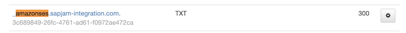
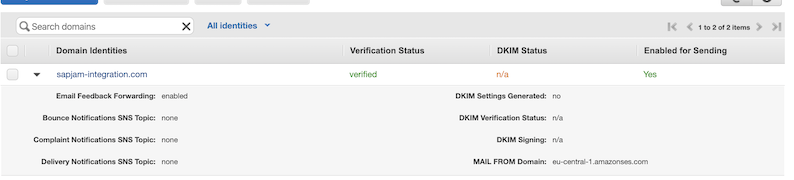
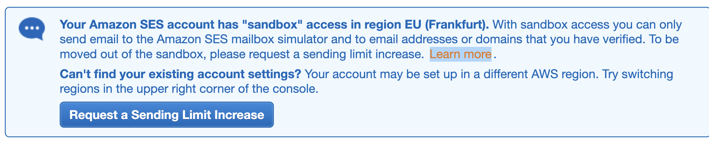
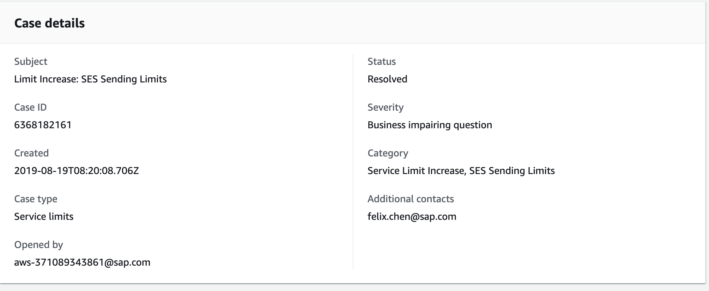
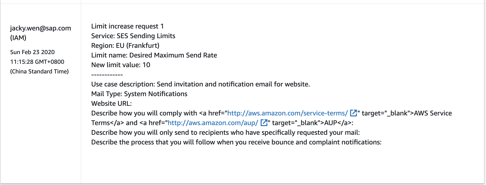
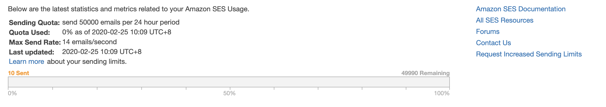
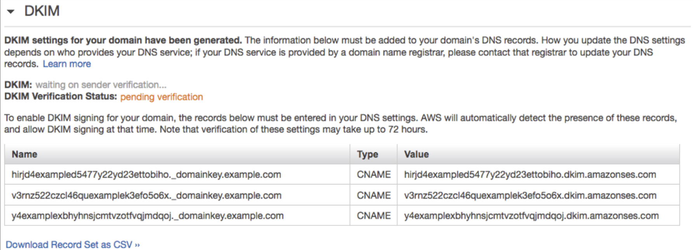

# Alertmanager alerts with Amazon SES SMTP


### 1. [Verify your domain name](https://docs.aws.amazon.com/ses/latest/DeveloperGuide/verify-domain-procedure.html) to send email at `example.com` with SES

* Add domain name into SES: `sapjam-integration.com`
* Which generate records name: `_amazonses.sapjam-integration.com`
* Which generate records TXT: `...`
* Add **TXT records and 300 TTL to CCloud** and **Verify this Domain**





### 2. [Request your SMTP credentials and download credentials](https://docs.aws.amazon.com/ses/latest/DeveloperGuide/smtp-credentials.html)

### 3. [Testing Email Sending Using the Command Line](https://docs.aws.amazon.com/ses/latest/DeveloperGuide/send-email-smtp-client-command-line.html)

* To connect to the SMTP interface using implicit SSL(without)

```
openssl s_client -crlf -quiet -connect email-smtp.eu-central-1.amazonaws.com:465
```

* Using the Command Line to Send Email Using the Amazon SES SMTP Interface

```
echo -n "SMTPUsername" | openssl enc -base64
echo -n "SMTPPassword" | openssl enc -base64
```

**`input.txt`**

```
EHLO example.com
AUTH LOGIN
Base64EncodedSMTPUserName
Base64EncodedSMTPPassword
MAIL FROM: sender@example.com
RCPT TO: recipient@example.com
DATA
From: sender@example.com
To: recipient@example.com
Subject: Amazon SES SMTP Test

This message was sent using the Amazon SES SMTP interface.
.
QUIT
```

```
$ openssl s_client -crlf -quiet -connect email-smtp.eu-central-1.amazonaws.com:465 < input.txt
depth=4 C = US, O = "Starfield Technologies, Inc.", OU = Starfield Class 2 Certification Authority
verify return:1
depth=3 C = US, ST = Arizona, L = Scottsdale, O = "Starfield Technologies, Inc.", CN = Starfield Services Root Certificate Authority - G2
verify return:1
depth=2 C = US, O = Amazon, CN = Amazon Root CA 1
verify return:1
depth=1 C = US, O = Amazon, OU = Server CA 1B, CN = Amazon
verify return:1
depth=0 CN = email-smtp.eu-central-1.amazonaws.com
verify return:1
220 email-smtp.amazonaws.com ESMTP SimpleEmailService-d-GI38EMLB2 hkD7YwduxMJw9KrXpof7
250-email-smtp.amazonaws.com
250-8BITMIME
250-SIZE 10485760
250-AUTH PLAIN LOGIN
250 Ok
334 VXNlcm5hbWU6
334 UGFzc3dvcmQ6
235 Authentication successful.
250 Ok
250 Ok
354 End data with <CR><LF>.<CR><LF>
250 Ok 0107017033dbb64d-be13a01e-dbf1-44b7-b876-3622165dacc1-000000
451 4.4.2 Timeout waiting for data from client.
```


## Moveout SMTP from sandbox






My ticket template is like this:



After you received an email replied your ticket from AWS support team, you can check your current SMTP **Sending Statistics and your SMTP can send email to anyone without verification**.




## Add SMTP with Alertmanger

**`alertmanager.yaml`**

```
---
global:
  resolve_timeout: 5m
  http_config: {}
  smtp_from: alertmanager@sapjam-integration.com
  smtp_hello: sapjam-integration.com
  smtp_smarthost: email-smtp.eu-central-1.amazonaws.com:25
  smtp_auth_username: A...
  smtp_auth_password: B...
  smtp_require_tls: true
...
```


### Set up DKIM for your verified domain to authenticate email in Amazon SES (Production only)

Reference: https://docs.aws.amazon.com/ses/latest/DeveloperGuide/send-email-authentication-dkim-easy-setup-domain.html

DomainKeys Identified Mail (DKIM) is a standard that allows senders to sign their email messages with a cryptographic key. Email providers then use these signatures to verify that the messages weren't modified by a third party while in transit. The reason why we need to authenticate emails for production environment is mentioned at https://docs.aws.amazon.com/ses/latest/DeveloperGuide/send-email-authentication.html.

* To set up Easy DKIM for a domain
* Open the Amazon SES console at https://console.aws.amazon.com/ses/.
* In the navigation pane, under **Identity Management**, choose **Domains**.
* In the list of domains, choose the domain that you want to set up Easy DKIM for.
* Under **DKIM**, choose **Generate DKIM Settings**.
* Copy the three CNAME records that appear in this section like below screenshot as example.



* Add the CNAME records to the DNS configuration for your domain in your domain's DNS serve