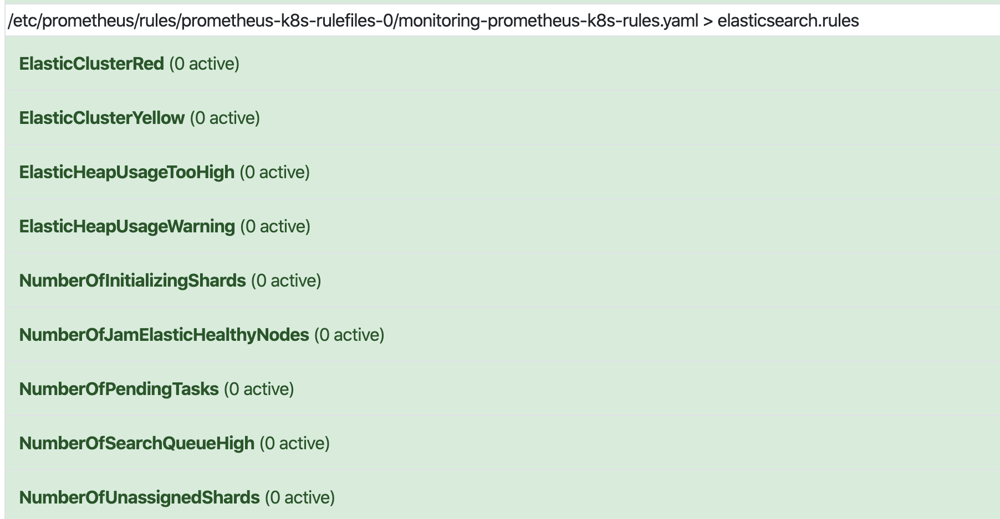

# 2. Prometheus Operator Monitor on ElasticSearch


1. 第一步建立一个 `ServiceMonitor` 对象，用于 `Prometheus` 添加监控项
2. 第二步为 `ServiceMonitor` 对象关联 `metrics` 数据接口的一个 `Service` 对象
3. 第三步确保 `Service` 对象可以正确获取到 `Exporter` 数据

## 安装`elasticsearch-exporter`

```
helm install jam-elasticsearch-exporter --set es.uri=http://elasticsearch-jam:9200,es.all=true,es.indices=true stable/elasticsearch-exporter -n $JAM_INSTANCE
```

* name: `jam-elasticsearch-exporter`
* `es.uri`: `es.uri=http://elasticsearch-jam:9200`
* `es.all`: true
* `es.indices`: true


## 创建 ServiceMonitor 

### `servicemonitors/elasticsearch.yaml`

```
apiVersion: monitoring.coreos.com/v1
kind: ServiceMonitor
metadata:
  name: elasticsearch
  labels:
    prometheus: kube-prometheus
spec:
  selector:
    # note, this matches on the service, not the deployment or pod
    matchLabels:
      app: elasticsearch-exporter
  jobLabel: app
  endpoints:
  - targetPort: 9108
    path: /metrics
```

* 具有 `app: elasticsearch-exporter` 这个 `label` 标签的 `Service`，`jobLabel` 表示用于检索 `job` 任务名称的标签，

```
$ kubectl get servicemonitor --all-namespaces | grep elas
default      elasticsearch                44d
```


## 查看 Service

`ServiceMonitor` 创建完成了，可以查看一下关联的对应的 `Service` 对象，

```
$ kubectl get svc -n integration701 | grep elasticsearch
elasticsearch                            ClusterIP      None             <none>              9200/TCP,9300/TCP                         65d
elasticsearch-internal                   ClusterIP      None             <none>           9300/TCP                                  2d23h
elasticsearch-jam                        ClusterIP      None             <none>           9200/TCP,9300/TCP                         65d
elasticsearch-jam-internal               ClusterIP      None             <none>         9300/TCP                                  2d23h
jam-elasticsearch-exporter               ClusterIP      100.65.144.114   <none>     9108/TCP                              44d
```

## 配置 `PrometheusRule` (Applied after received exporter data)

`es_rule.yaml`

```
apiVersion: monitoring.coreos.com/v1
kind: PrometheusRule
metadata:
  labels:
    prometheus: k8s
    role: alert-rules
  name: elasticsearch-rules
  namespace: monitoring
spec:
  groups:
  - name: elasticsearch.rules
    rules:
    - alert: ElasticHeapUsageTooHigh
      expr: (elasticsearch_jvm_memory_used_bytes{area="heap"} / elasticsearch_jvm_memory_max_bytes{area="heap"}) * 100 > 95
      for: 5m
      labels:
        severity: critical
      annotations:
        summary: "Elastic Heap Usage Too High (instance: {{ $labels.instance }}) "
        message: "The heap usage is over 95% for 5m VALUE = {{ $value }} for pod {{ $labels.name }}"
    - alert: ElasticHeapUsageWarning
      expr: (elasticsearch_jvm_memory_used_bytes{area="heap"} / elasticsearch_jvm_memory_max_bytes{area="heap"}) * 100 > 80
      for: 5m
      labels:
        severity: warning
      annotations:
        summary: "Elastic Heap Usage warning (instance {{ $labels.instance }})"
        message: "The heap usage is over 80% for 5m VALUE = {{ $value }} for pod {{ $labels.name }}"
    - alert: ElasticClusterRed
      expr: elasticsearch_cluster_health_status{color="red"} == 1
      for: 5m
      labels:
        severity: critical
      annotations:
        summary: "Elastic Cluster Red (instance {{ $labels.instance }})"
        message: "Elastic Cluster Red status VALUE = {{ $value }} fetched by Service Monitor {{ $labels.service }}"
    - alert: ElasticClusterYellow
      expr: elasticsearch_cluster_health_status{color="yellow"} == 1
      for: 5m
      labels:
        severity: warning
      annotations:
        summary: "Elastic Cluster Yellow (instance {{ $labels.instance }})"
        message: "Elastic Cluster Yellow status VALUE = {{ $value }} fetched by Service Monitor: {{ $labels.service }}"
    - alert: NumberOfJamElasticHealthyNodes
      expr: elasticsearch_cluster_health_number_of_nodes < kube_statefulset_replicas{namespace=~"^(jam|integration|stage|dev).*", statefulset=~"elasticsearch-jam"}
      for: 5m
      labels:
        severity: critical
      annotations:
        summary: "Number of Jam Elastic Healthy Nodes (instance {{ $labels.instance }})"
        message: "Number of Healthy Nodes less then Jam Elasticsearch sts desired replicas in elasticsearch6 VALUE = {{ $value }}"
    - alert: NumberOfInitializingShards
      expr: elasticsearch_cluster_health_initializing_shards > 0
      for: 10m
      labels:
        severity: critical
      annotations:
        summary: "Number of initializing shards (instance {{ $labels.instance }})"
        message: "Number of initializing shards for 10 min VALUE = {{ $value }}, The initializing shards value fetched by Service Monitor: {{ $labels.service }} "
    - alert: NumberOfUnassignedShards
      expr: elasticsearch_cluster_health_unassigned_shards > 0
      for: 5m
      labels:
        severity: critical
      annotations:
        summary: "Number of unassigned shards (instance {{ $labels.instance }})"
        message: "Number of unassigned shards for 5 min VALUE = {{ $value }}\n The unassigned shards value fetched by Service Monitor: {{ $labels.service }}"
    - alert: NumberOfSearchQueueHigh
      expr: elasticsearch_thread_pool_queue_count > 800
      for: 2m
      labels:
        severity: critical
      annotations:
        summary: "Number of search queue (Instance {{ $labels.instance }}, Name {{ $labels.name }} and Type {{ $labels.type }})"
        message: "Number of high search queue for 2 min VALUE = {{ $value }}"
    - alert: NumberOfPendingTasks
      expr: elasticsearch_cluster_health_number_of_pending_tasks > 0
      for: 10m
      labels:
        severity: warning
      annotations:
        summary: "Number of pending tasks (instance {{ $labels.instance }})"
        message: "Number of pending tasks for 10 min. Cluster works slowly, VALUE = {{ $value }} fetched by Service Monitor {{ $labels.service }} "
```


