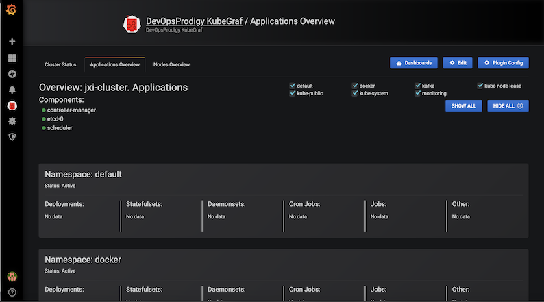
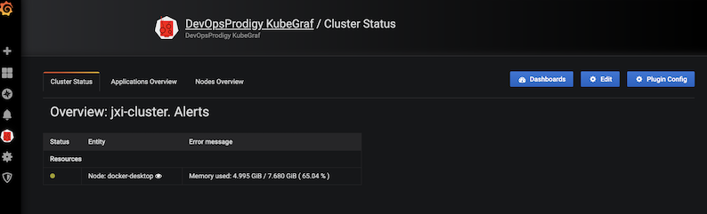
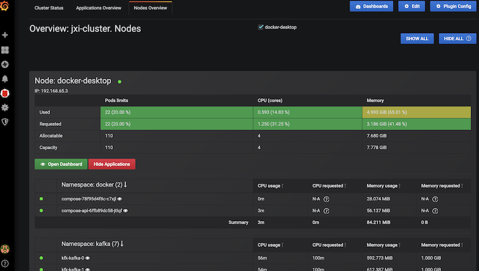
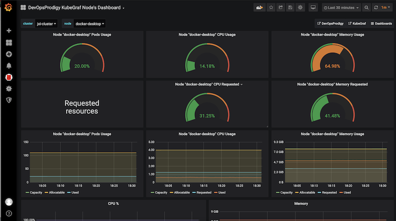
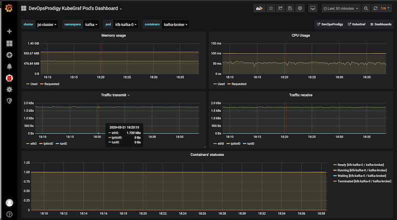
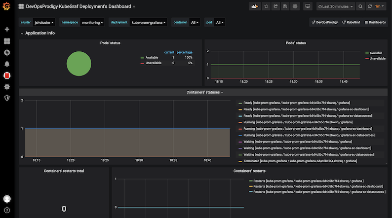

# 优秀的 Grafana K8S 插件 - DevOpsProdigy KubeGraf

[DevOpsProdigy KubeGraf](https://github.com/devopsprodigy/kubegraf/) 是一个非常优秀的 Grafana Kubernetes 插件，是 Grafana 官方的 [Kubernetes 插件](https://grafana.com/plugins/grafana-kubernetes-app) 的升级版本，该插件可以用来可视化和分析 `Kubernetes` 集群的性能，通过各种图形直观的展示了 `Kubernetes` 集群的主要服务的指标和特征，还可以用于检查应用程序的生命周期和错误日志。

### 环境要求

要安装使用 `DevOpsProdigy KubeGraf` 插件需要满足以下要求：

* Grafana > 5.0.0 版本
* 需要在 `Kubernetes` 集群上部署 `Prometheus + node-exporter + kube-state-metrics`
* 依赖 `Grafana-piechart-panel` 插件

## 安装 Prometheus Operator

我们这里来使用 `Prometheus Operator`，这个 `Operator` 通过抽象化 `Prometheus` 的部署来我们提供了更加简单方便的方法来使用 `Prometheus`，执行如下命令在 `monitoring` 命名空间下面安装 `Prometheus Operator`：

```
kubectl create ns monitoring
```

* **<span style="color:red">Enable grafana with peristent volume</span>**

`prometheus-operator-values.yml `

```
# We don't need the alertmanager for this demo
alertmanager:
  enabled: false

# This configuration means all ServiceMonitors in the namespsace will be picked up
# Use with caution!
prometheus: 
  prometheusSpec:
    serviceMonitorSelectorNilUsesHelmValues: false
    serviceMonitorSelector: {}
grafana:
  persistence:
    enabled: true
    type: pvc
    size: 5G
    storageClassName: 
```

### 安装

```
$ cd /k8s_sap/test/k8s-prometheus-custom-scaling
$ helm install kube-prom stable/prometheus-operator -f helm-values/prometheus-operator-values.yml --namespace monitoring
```

```
$ kubectl get pods -n monitoring 
NAME                                                   READY   STATUS    RESTARTS   AGE
kube-prom-grafana-6d4c5bc7f4-qzk78                     3/3     Running   0          15m
kube-prom-kube-state-metrics-76558456fc-gfmcd          1/1     Running   0          15m
kube-prom-prometheus-node-exporter-r72xd               1/1     Running   0          15m
kube-prom-prometheus-opera-operator-5c7bd49d7c-5xfs9   2/2     Running   0          15m
prometheus-kube-prom-prometheus-opera-prometheus-0     3/3     Running   1          15m
```

```
$ kubectl get svc -n monitoring 
NAME                                    TYPE        CLUSTER-IP      EXTERNAL-IP   PORT(S)            AGE
kube-prom-grafana                       ClusterIP   10.102.30.65    <none>        80/TCP             16m
kube-prom-kube-state-metrics            ClusterIP   10.99.95.81     <none>        8080/TCP           16m
kube-prom-prometheus-node-exporter      ClusterIP   10.98.248.155   <none>        9100/TCP           16m
kube-prom-prometheus-opera-operator     ClusterIP   10.107.123.72   <none>        8080/TCP,443/TCP   16m
kube-prom-prometheus-opera-prometheus   ClusterIP   10.99.222.171   <none>        9090/TCP           16m
prometheus-operated                     ClusterIP   None            <none>        9090/
```

```
kubectl port-forward svc/grafana -n monitoring 3000:3000
admin
prom-operator
```

## 特性

该插件包含3个主要的信息页面，其中包含有关 Kubernetes 集群的详细信息。

### 应用概述

该插件可以显示 Kubernetes 集群上面的应用的一些基本监控信息：

* 应用程序逻辑图
* `Kubernetes` 对象的分布
* 可视化应用程序的生命周期和基本特征信息
* 在集群中允许访问的服务端口的描述信息



### 集群状态

* 集群和集群节点的状态信息
* 监控的应用程序生命周期的详细信息
* 集群中服务所在位置的可视化



### 节点概述

* 集群节点信息
* 已使用和已分配资源（内存、CPU 利用率）以及容器数量的信息
* `Pods` 的物理分布



### Dashboards

除了在插件主页上提供了常见的信息之外，该插件还提供了另外5个` Dashboard `供我们来跟踪集群的各种性能指标。

* node dashboard

这是一个带有节点指标的 `Dashboard`，它可以显示资源的使用情况，例如 CPU 利用率、内存消耗、空闲`/iowait` 模式下的 `CPU` 时间百分比以及磁盘和网络的状态。




* pod dashboard

可以根据所选择的 `Pod` 来显示对应的资源使用情况。



* deployments dashboard

以 Deployment 为维度来显示对应的资源对象相关的资源使用情况。



* statefulsets dashboard
* daemonsets dashboard

上面三个 `Dashboard` 显示了可用/不可用的应用程序的副本数量以及这些应用程序的容器状态，还会跟踪容器的重启。

## 安装

我们这里的 `Grafana` 同样是安装在 `Kubernetes ` 集群上面的，所以我们需要进入到容器中进行安装：

```
$ kubectl exec -it kube-prom-grafana-6d4c5bc7f4-qzk78  -n monitoring sh -c grafana

/app $  grafana-cli plugins ls

Restart grafana after installing plugins . <service grafana-server restart>

usr/share/grafana $ grafana-cli plugins install devopsprodigy-kubegraf-app
installing devopsprodigy-kubegraf-app @ 1.3.0
from: https://grafana.com/api/plugins/devopsprodigy-kubegraf-app/versions/1.3.0/download
into: /var/lib/grafana/plugins

✔ Installed devopsprodigy-kubegraf-app successfully 

Restart grafana after installing plugins . <service grafana-server restart>


#  如果没有安装 Grafana-piechart-panel 插件同样需要安装
$ grafana-cli plugins install Grafana-piechart-panel
installing Grafana-piechart-panel @ 1.4.0
from: https://grafana.com/api/plugins/Grafana-piechart-panel/versions/1.4.0/download
into: /var/lib/grafana/plugins

✔ Installed Grafana-piechart-panel successfully 

Restart grafana after installing plugins . <service grafana-server restart>
```

插件安装完成后需要重启 `Grafana` 才会生效，我们这里是 `Pod`，所以直接删除 `Pod` 重建即可（当然前提是需要对插件目录做好持久化）:

```
kubectl scale deployment kube-prom-grafana  --replicas=0 -n monitoring

kubectl scale deployment kube-prom-grafana  --replicas=1 -n monitoring
```

Pod 删除重建完成后插件就安装成功了。然后通过浏览器打开 Grafana 找到该插件，点击 enable 启用插件。


### 点击 `Set up your first k8s-cluster` 创建一个新的 Kubernetes 集群:


* URL 使用 `Kubernetes Service` 地址即可：**`https://kubernetes.default:443`**
* Access 访问模式使用：`Server(default)`
* 由于插件访问 `Kubernetes` 集群的各种资源对象信息，所以我们需要配置访问权限，这里我们可以简单使用 `kubectl` 的 `kubeconfig` 来进行配置即可。
* **勾选 `Auth` 下面的 `TLS Client Auth` 和 `With CA Cert` 两个选项**
* 其中 `TLS Auth Details` 下面的值就对应 `kubeconfig` 里面的证书信息。比如我们这里的 `kubeconfig` 文件格式如下所示：

```
$  cat config 
apiVersion: v1
clusters:
- cluster:
    certificate-authority-data: <certificate-authority-data>
    server: https://kubernetes.docker.internal:6443
  name: docker-desktop
contexts:
- context:
    cluster: docker-desktop
    user: docker-desktop
  name: docker-desktop
- context:
    cluster: docker-desktop
    user: docker-desktop
  name: docker-for-desktop
current-context: docker-desktop
kind: Config
preferences: {}
users:
- name: docker-desktop
  user:
    client-certificate-data: <client-certificate-data>
    client-key-data: <client-key-data>
```

* 那么 `CA Cert` 的值就对应 `kubeconfig` 里面的 `<certificate-authority-data> `进行 `base64` 解码过后的值；
* `Client Cert` 的值对应 `<client-certificate-data>` 进行 `base64` 解码过后的值；
* `Client Key` 的值就对应 `<client-key-data>` 进行 `base64` 解码过后的值。


> 对于 base64 解码推荐使用一些在线的服务，比如 https://www.base64decode.org/，非常方便。

* 最后在 `additional datasources` 下拉列表中选择 `prometheus` 的数据源。
* 点击 `Save & Test` 正常就可以保存成功了。

插件配置完成后，在左侧侧边栏就会出现 `DevOpsProdigy KubeGraf` 插件的入口，通过插件页面可以查看整个集群的状态以及相关的 `Dashboard` 监控图表。

