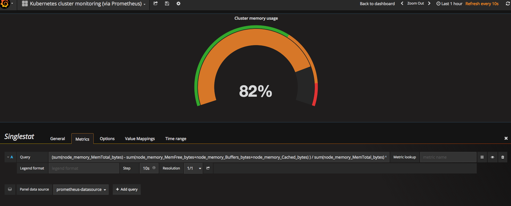
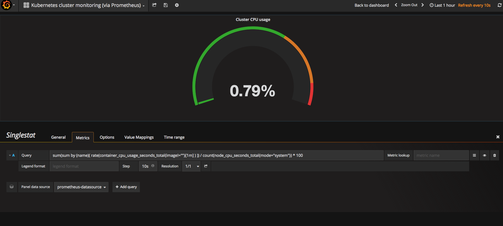
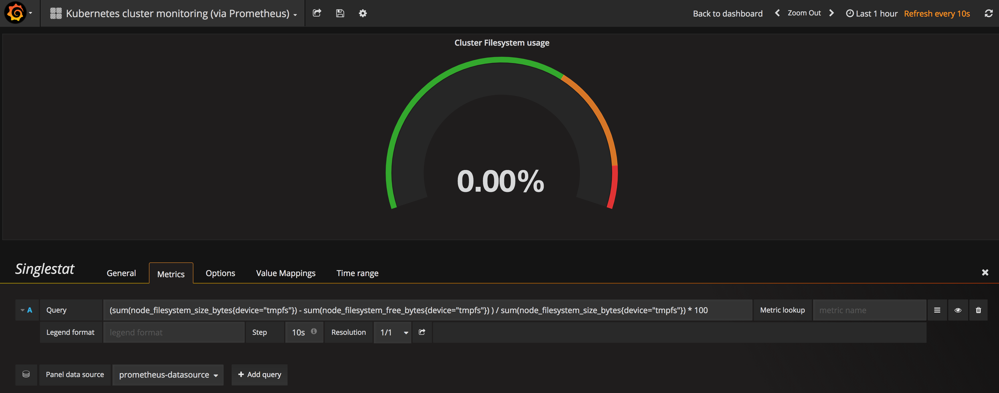
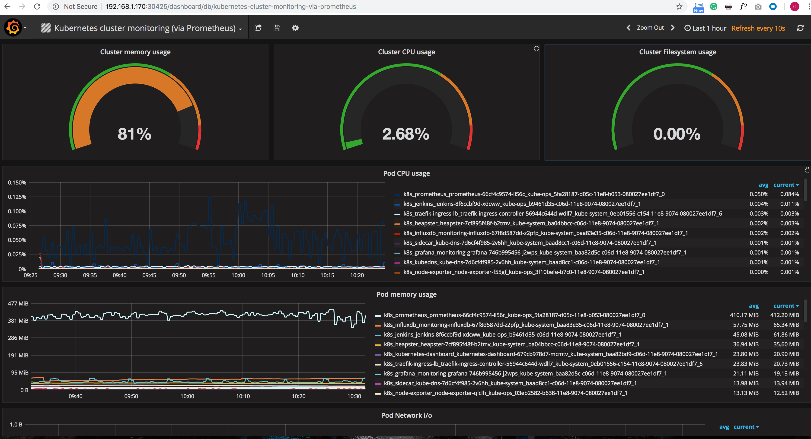
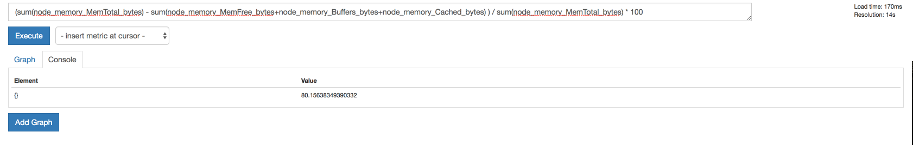
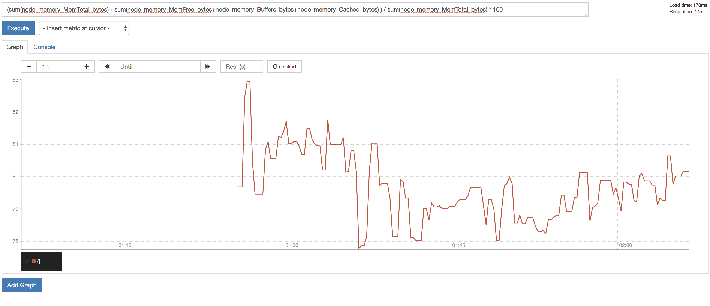
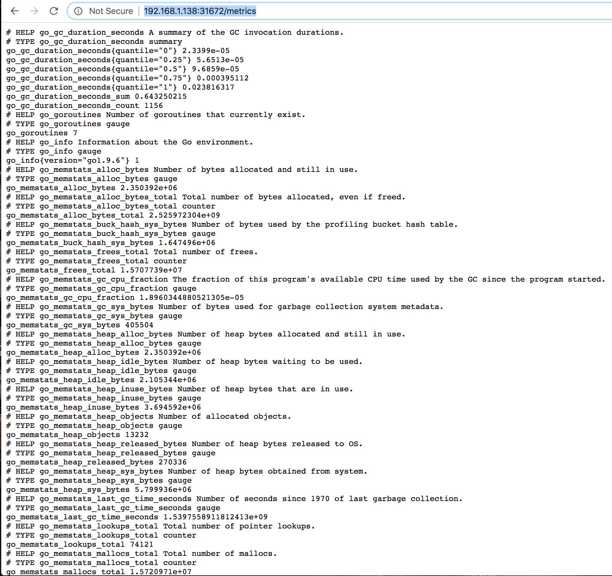
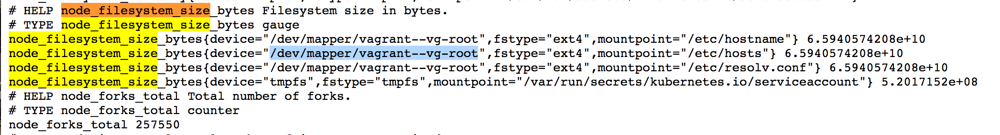

# Grafana 显示参数设置

根据 `kubernetes json` 文件的参数设置， 显示如下:


需要重新设置 Grafana 中的 `Cluster memory usage`, `Cluster CPU usage`, `Cluster filesystem usage`


### Option 1 

在 `json` 文件中修改

[kubernetes-pod-monitoring_rev1.json](kubernetes-pod-monitoring_rev1.json)


### Option 2

在界面中直接修改







### Cluster memory usage

```
(sum(node_memory_MemTotal_bytes) - sum(node_memory_MemFree_bytes+node_memory_Buffers_bytes+node_memory_Cached_bytes) ) / sum(node_memory_MemTotal_bytes) * 100
```

### Cluster CPU usage

```
sum(sum by (name)( rate(container_cpu_usage_seconds_total{image!=""}[1m] ) )) / count(node_cpu_seconds_total{mode="system"}) * 100
```

### Cluster filesystem usage

```
(sum(node_filesystem_size_bytes{device="tmpfs"}) - sum(node_filesystem_free_bytes{device="tmpfs"}) ) / sum(node_filesystem_size_bytes{device="tmpfs"}) * 100
```


### 显示如下:




如何验证这些函数的正确性，`Prometheus`提供了API的方式进行数据查询，同样可以使用query语言进行复杂的查询任务，在上面的WEB界面上提供了基本的查询和图形化的展示功能。：






如何查询某些函数的写法， 可以再 `node` 上的 `node-exporter` 端口访问, 例如 

`http://192.168.1.138:31672/metrics`



