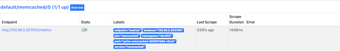
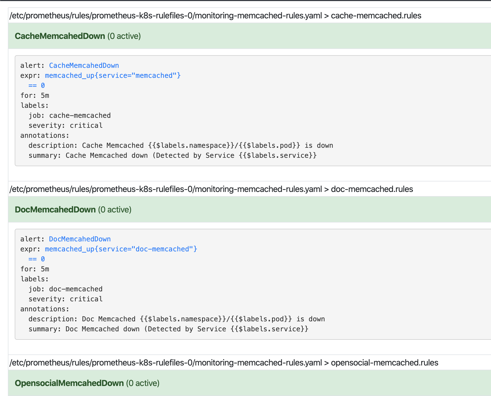

# 4. Prometheus Operator Monitor on Memcached

### Reference

1. [Memcached Exporter for Prometheus(docker)](https://github.com/prometheus/memcached_exporter)
2. [Helm stable/memcached](https://github.com/helm/charts/tree/master/stable/memcached)

### Check stable monitor way from offical

```
helm template memcached > memcached-stable.yaml

---
# Source: memcached/templates/svc.yaml
apiVersion: v1
kind: Service
metadata:
  name: RELEASE-NAME-memcached
  namespace: default
  ...
spec:
  clusterIP: None
  ports:
  - name: memcache
    port: 11211
    targetPort: memcache
  - name: metrics           ### Port for memcache metrics
    port: 9150
    targetPort: metrics
  selector:
    app.kubernetes.io/name: memcached
    app.kubernetes.io/instance: RELEASE-NAME
---
# Source: memcached/templates/statefulset.yaml
apiVersion: apps/v1
kind: StatefulSet
metadata:
  name: RELEASE-NAME-memcached
  namespace: default
  ...
      containers:
      - name: RELEASE-NAME-memcached
        image: memcached:1.5.20
        imagePullPolicy: ""
        securityContext:
          runAsUser: 1001
        command:
        - memcached
        - -m 64
        - -o
        - modern
        - -v
        ports:
        - name: memcache
          containerPort: 11211
        livenessProbe:
          tcpSocket:
            port: memcache
          initialDelaySeconds: 30
          timeoutSeconds: 5
        readinessProbe:
          tcpSocket:
            port: memcache
          initialDelaySeconds: 5
          timeoutSeconds: 1
        resources:
          requests:
            cpu: 50m
            memory: 64Mi
      - name: metrics
        image: quay.io/prometheus/memcached-exporter:v0.6.0
        imagePullPolicy: ""
        securityContext:
          runAsUser: 1001
        ports:
        - name: metrics
          containerPort: 9150
        resources:
          {}
  ...
---
# Source: memcached/templates/servicemonitor.yaml
apiVersion: monitoring.coreos.com/v1
kind: ServiceMonitor
metadata:
  name: RELEASE-NAME-memcached
  namespace: default
  labels:
    app.kubernetes.io/name: memcached
    helm.sh/chart: memcached-3.2.3
    app.kubernetes.io/instance: RELEASE-NAME
    app.kubernetes.io/version: "1.5.20"
    app.kubernetes.io/managed-by: Helm
spec:
  selector:
    matchLabels:
      app.kubernetes.io/name: memcached
      app.kubernetes.io/instance: RELEASE-NAME
  endpoints:
  - port: metrics
    interval: 15s
---
# Source: memcached/templates/pdb.yaml
apiVersion: policy/v1beta1
kind: PodDisruptionBudget
...
```

## Enable Monitor on Memcached with Memcached metrics

1. Install **memcached-exporter** as **sidecar** for jam memcached app pod
2. Add new metrics port and label for **memcached app service** 
3. Create **ServiceMonitor** to fetched the data from memcached app service by selector
4. Create `Prometheusrules` for Jam memcached


### Install memcached-exporter in memcached Deployment

```
---
# ----- [ memcached ] --------------------
#
apiVersion: apps/v1
kind: Deployment
metadata:
  name: cache-memcached
  namespace: {{ .Values.jam.namespace }}
spec:
  selector:
    matchLabels:
      app: memcached # has to match .spec.template.metadata.labels
  replicas: 1
  revisionHistoryLimit: 3
  template:
    metadata:
      labels:
        app: memcached # has to match .spec.selector.matchLabels
        scope: cache
    spec:
      containers:
      - name: memcached
        image: memcached:1.5-alpine
        args: ["-p", "11211", "-l", "0.0.0.0:11211,0.0.0.0:11212"]
      - name: memcached-metrics
        image: quay.io/prometheus/memcached-exporter:v0.6.0
        ports:
        - name: metrics
          containerPort: 9150
```

```
- name: memcached-metrics
  image: quay.io/prometheus/memcached-exporter:v0.6.0
  ports:
  - name: metrics
    containerPort: 9150
```

### Add new metrics `port` and `label` for **memcached app service** 

```
#
# Service heads for dependencies
#
---
# ----- [ memcached ] --------------------
#
apiVersion: v1
kind: Service
metadata:
  name: memcached
  namespace: {{ .Values.jam.namespace }}
  labels:
    app: memcached
    component: memcached-metrics
spec:
  selector:
    app: memcached
    scope: cache
  ports:
  - name: memcached
    protocol: TCP
    port: 11211
    targetPort: 11211
  - name: memcached-img
    protocol: TCP
    port: 11212
    targetPort: 11212
  - name: memcached-metrics
    port: 9150
    targetPort: metrics
```


```
...
labels:
  app: memcached
  component: memcached-metrics
...
spec:
  selector:
    app: memcached
    scope: cache
  ports:
  ...
  - name: memcached-metrics
    port: 9150
    targetPort: metrics
```

**Upgrade helm chart**

```
$ helm upgrade jam-ct-memcached helm/jam/memcached/ -f instances/$JAM_INSTANCE-k8s.yaml --namespace $JAM_INSTANCE
```
```
$ kubectl get svc -n dev902 --show-labels | grep mem
doc-memcached         ClusterIP      100.70.244.225   <none>     11211/TCP,11212/TCP   36d   app=memcached
memcached             ClusterIP      100.69.109.250   <none>      11211/TCP,11212/TCP,9150/TCP      36d   app=memcached,component=memcached-metrics
memcached-opensocial  ClusterIP      100.68.136.232   <none>      11211/TCP,11212/TCP   36d   app=memcached
```


> Note, I don't konw why my metric works or not
> 
> Therefore, exec in a pod and curl the metrics port to verify

```
$ kubectl exec -it ps-7bcbd5fcd9-cb8dq -n dev902 sh
$ sh-4.2#  curl http://100.69.109.250:9150
<html>
             <head><title>Memcached Exporter</title></head>
             <body>
             <h1>Memcached Exporter</h1>
             <p><a href='/metrics'>Metrics</a></p>
             </body>
             </html>sh-4.2#
### Looks like it works, let's curl the metrics out
```

```
h-4.2#  curl http://100.69.109.250:9150/metrics
# HELP go_gc_duration_seconds A summary of the GC invocation durations.
# TYPE go_gc_duration_seconds summary
go_gc_duration_seconds{quantile="0"} 0
go_gc_duration_seconds{quantile="0.25"} 0
go_gc_duration_seconds{quantile="0.5"} 0
go_gc_duration_seconds{quantile="0.75"} 0
go_gc_duration_seconds{quantile="1"} 0
go_gc_duration_seconds_sum 0
go_gc_duration_seconds_count 0
...
promhttp_metric_handler_requests_total{code="200"} 0
promhttp_metric_handler_requests_total{code="500"} 0
promhttp_metric_handler_requests_total{code="503"} 0
```

### Create **ServiceMonitor**


```
apiVersion: monitoring.coreos.com/v1
kind: ServiceMonitor
metadata:
  name: memcached
  labels:
    prometheus: kube-prometheus
spec:
  selector:
    # note, this matches on the service, not the deployment or pod
    matchLabels:
      app: memcached
      component: memcached-metrics  
  jobLabel: app
  namespaceSelector:
	matchNames:
		- dev902
  endpoints:
  - targetPort: metrics
    path: /metrics
    interval: 10s
``` 


```
$ kubectl get ServiceMonitor
NAME               AGE
...
memcached          26s
...
```

### Verify the ServiceMonitor works or not

```
kubectl port-forward svc/prometheus-operated -n monitoring 9090:9090
```

**Status -> targets**




### `Prometheusrules` for Jam memcached

```
apiVersion: monitoring.coreos.com/v1
kind: PrometheusRule
metadata:
  labels:
    prometheus: k8s
    role: alert-rules
  name: memcached-rules
  namespace: monitoring
spec:
  groups:
  - name: cache-memcached.rules
    rules:
    - alert: CacheMemcahedDown
      annotations:
        description: Cache Memcached {{$labels.namespace}}/{{$labels.pod}} is down
        summary: 'Cache Memcached down (Detected by Service {{$labels.service}}'
      expr: memcached_up{service="memcached"} == 0
      for: 5m
      labels:
        job: cache-memcached
        severity: critical
  - name: doc-memcached.rules
    rules:
    - alert: DocMemcahedDown
      annotations:
        description: Doc Memcached {{$labels.namespace}}/{{$labels.pod}} is down
        summary: 'Doc Memcached down (Detected by Service {{$labels.service}}'
      expr: memcached_up{service="doc-memcached"} == 0
      for: 5m
      labels:
        job: doc-memcached
        severity: critical
  - name: opensocial-memcached.rules
    rules:
    - alert: OpensocialMemcahedDown
      annotations:
        description: Doc Memcached {{$labels.namespace}}/{{$labels.pod}} is down
        summary: 'Doc Memcached down (Detected by Service {{$labels.service}}'
      expr: memcached_up{service="memcached-opensocial"} == 0
      for: 5m
      labels:
        job: opensocial-memcached
        severity: critical
```


