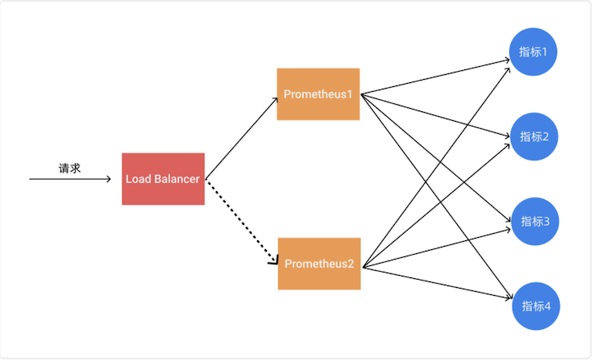
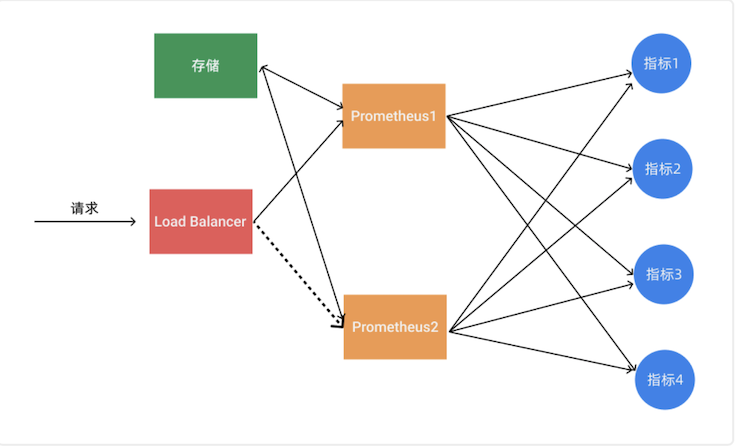
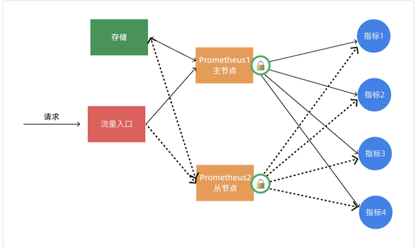
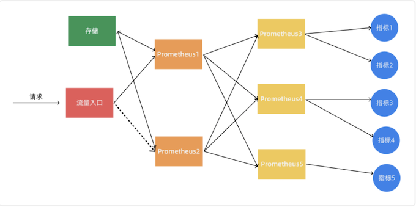
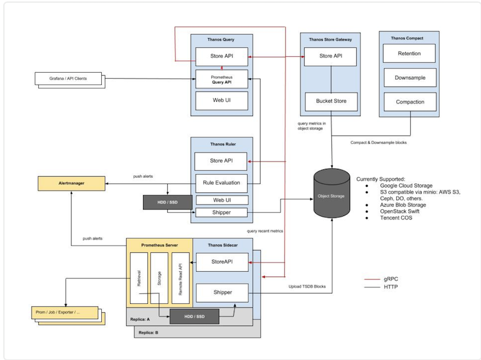

# 使用 Thanos 实现 Prometheus 的高可用介绍
 
前面我们已经学习了 Prometheus 的使用，了解了基本的 PromQL 语句以及结合 Grafana 来进行监控图表展示，通过 AlertManager 来进行报警，这些工具结合起来已经可以帮助我们搭建一套比较完整的监控报警系统了，但是也仅仅局限于测试环境，对于生产环境来说则还有许多需要改进的地方，其中一个非常重要的就是 Prometheus 的高可用。

单台的 `Prometheus` 存在单点故障的风险，随着监控规模的扩大，`Prometheus` 产生的数据量也会非常大，性能和存储都会面临问题。毋庸置疑，我们需要一套高可用的 `Prometheus` 集群。


## 可用性

**我们知道 `Prometheus` 是采用的 `Pull` 机制获取监控数据**，即使使用 **`PushGateway`** 对于 `Prometheus` 也是` Pull`，为了确保 `Prometheus `服务的可用性，我们只需要部署多个 `Prometheus` 实例，然后采集相同的 `metrics` 数据即可：



这个方式来满足服务的可用性应该是平时我们使用得最多的一种方式，当一个实例挂掉后从` LB ` 里面自动剔除掉，而且还有负载均衡的作用，可以降低一个 `Prometheus` 的压力，但**这种模式缺点也是非常明显的，就是不满足数据一致性以及持久化问题，因为 `Prometheus` 是 `Pull` 的方式，即使多个实例抓取的是相同的监控指标，也不能保证抓取过来的值就是一致的，更何况在实际的使用过程中还会遇到一些网络延迟问题，所以会造成数据不一致的问题**，

不过对于监控报警这个场景来说，一般也不会要求数据强一致性，所以这种方式从业务上来说是可以接受的，因为这种数据不一致性影响基本上没什么影响。这种场景适合监控规模不大，只需要保存短周期监控数据的场景。

## 数据持久化

使用上面的基本 `HA` 的模式基本上是可以满足监控这个场景，但是还有一个数据持久化的问题，如果其中一个实例数据丢了就没办法呢恢复回来了，这个时候我们就可以为 `Prometheus` 添加远程存储来保证数据持久化。



在给 Prometheus 配置上远程存储过后，我们就不用担心数据丢失的问题了，即使当一个 Prometheus 实例宕机或者数据丢失过后，也可以通过远程存储的数据进行恢复。


## 通过锁获取 Leader

其实上面的基本 `HA` 加上远程存储的方式基本上可以满足 `Prometheus` 的高可用了，这种方式的多个 `Prometheus` 实例都会去定时拉取监控指标数据，然后将热数据存储在本地，然后冷数据同步到远程存储中去，对于大型集群来说频繁的去拉取指标数据势必会对网络造成更大的压力。所以我们也通过服务注册的方式来实现 `Prometheus` 的高可用性，**集群启动的时候每个节点都尝试去获取锁，获取成功的节点成为 `Leader` 执行任务，若主节点宕机，从节点获取锁成为 Leader 并接管服务。**




不过这种方案需要我们通过去写代码进行改造，如果在 `Kubernetes` 中我们完全可以使用自带的 `Lease` 对象来获取分布式锁🔒，这不是很困难，只是以后要更新版本稍微麻烦点。

上面的几种方案基本上都可以满足基本的 `Prometheus` 高可用，但是对于大型集群来说，一个 `Prometheus` 实例的压力始终非常大。

## 联邦集群

当单个 `Promthues` 实例 无法处理大量的采集任务时，这个时候我们就可以使用基于 `Prometheus` 联邦集群的方式来将监控任务划分到不同的 `Prometheus` 实例中去。



我们可以将不同类型的采集任务划分到不同的 `Prometheus` 实例中去执行，进行功能分片，比如一个 `Prometheus` 负责采集节点的指标数据，另外一个 `Prometheus` 负责采集应用业务相关的监控指标数据，最后在上层通过一个 `Prometheus` 对数据进行汇总。

具体的采集任务如何去进行分区也没有固定的标准，需要结合实际的业务进行考虑，除了上面的方式之外，还有一种情况就是单个的采集数据量就非常非常大，比如我们要采集上万个节点的监控指标数据，这种情况即使我们已经进行了分区，但是对于单个 `Prometheus` 来说压力也是非常大的，这个时候我们就需要按照任务的不同实例进行划分，我们通过 `Prometheus` 的 **`relabel` 功能**，通过 `hash` 取模的方式可以确保当前 `Prometheus` 只采集当前任务的一部分实例的监控指标。

```
# 省略其他配置......
relabel_configs:
-	source_labels: [__address__]
	modulus: 4   # 将节点分片成 4 个组
     target_label： __tmp_hash
     action： hashmod
-   source_labels： [__tmp_hash]
	regex: ^1$   # 只抓第2个组中节点的数据(序号0为第1个组)
	action: keep
```

到这里我们基本上就完成了 `Prometheus` 高可用的改造。对于小规模集群和大规模集群可以采用不同的方案，但是其中有一个非常重要的部分就是远程存储，**我们需要保证数据的持久化就必须使用远程存储。**

所以下面我们将重点介绍下远程存储的时候，这里我们主要讲解目前比较流行的方案：`Thanos`，它完全兼容 P`rometheus API`，**提供统一查询聚合分布式部署 `Prometheus` 数据的能力，同时也支持数据长期存储到各种对象存储（比如 S3、阿里云 OSS 等**）以及降低采样率来加速大时间范围的数据查询。


## Thanos

Thanos 是一个基于 Prometheus 实现的监控方案，其主要设计目的是解决原生 Prometheus 上的痛点，并且做进一步的提升，主要的特性有：**全局查询，高可用，动态拓展，长期存储**。下图是 Thanos 官方的架构图：



Thanos 主要由如下几个特定功能的组件组成：

* 边车组件（`Sidecar`）：连接 `Prometheus`，并把 `Prometheus` 暴露给查询网关（`Querier/Query`），以供实时查询，并且可以上传 `Prometheus` 数据给云存储，以供长期保存
* 查询网关（`Querier/Query`）：实现了 `Prometheus API`，与汇集底层组件（如边车组件 Sidecar，或是存储网关 Store Gateway）的数据
* 存储网关（`Store Gateway`）：将云存储中的数据内容暴露出来
* 压缩器（`Compactor`）：将云存储中的数据进行压缩和下采样
* 接收器（`Receiver`）：从 `Prometheus` 的 `remote-write WAL`（Prometheus 远程预写式日志）获取数据，暴露出去或者上传到云存储
* 规则组件（`Ruler`）：针对监控数据进行评估和报警
* `Bucket`：主要用于展示对象存储中历史数据的存储情况，查看每个指标源中数据块的压缩级别，解析度，存储时段和时间长度等信息。


## 工作流程

Thanos 是同时支持 `Prometheus` 读和写的远程存储方案，首先我们先看下指标写入的整个流程：

* 首先 `Prometheus` 从所采集服务的 `metrics` 接口抓取指标数据，同时根据自身所配置的 `recording rules` 定期对抓取到的指标数据进行评估，将结果以 `TSDB` 格式分块存储到本地，每个数据块的存储时长为2小时，且默认禁用了压缩功能。
* 然后 `sidecar` 嗅探到` Prometheus` 的数据存储目录生成了新的只读数据块时，会将该数据块上传到对象存储桶中做为长期历史数据保存，在上传时会将数据块中的 `meta.json `进行修改添加 `thanos` 相关的字段，如 `external_labels`。
* `rule` 根据所配置的 `recording rules` 定期地向 `query` 发起查询获取评估所需的指标值，并将结果以 `TSDB` 格式分块存储到本地。每个数据块的存储时长为`2`小时，且默认禁用了压缩功能，每个数据块的 `meta.json` 也附带了 `thanos` 拓展的 `external_lables` 字段。当本地生成了新的只读数据块时，其自身会将该数据块上传到远端对象存储桶中做为长期历史数据保存。
* `compact` 定期将对象存储中地数据块进行压缩和降准采样，进行压缩时数据块中的 `truck`会进行合并，对应的 `meta.json` 中的 `level` 也会一同增长，每次压缩累加`1`，初始值为`1`。在进行降准采样时会创建新的数据块，根据采样步长从原有的数据块中抽取值存储到新的数据块中，在 `meta.json `中记录 `resolution` 为采样步长。

**读取指标的流程为：**

* 首先客户端通过 `query API` 向 `query` 发起查询， `query` 将请求转换成 `StoreAPI `发送到其他的 `query`、 `sidecar`、 `rule` 和 `store` 上。
* `sidecar` 接收到来自于 `query` 发起的查询请求后将其转换成 `query API` 请求，发送给其绑定的 `Prometheus`，由`Prometheus` 从本地读取数据并响应，返回短期的本地采集和评估数据。
* `rule` 接收到来自于 `query` 发起的查询请求后直接从本地读取数据并响应，返回短期的本地评估数据。
* `store` 接收到来自于 `query` 发起的查询请求后首先从对象存储桶中遍历数据块的 `meta.json`，根据其中记录的时间范围和标签先进行一次过滤。接下来从对象存储桶中读取数据块的 `index `和 `chunks` 进行查询，部分查询频率较高的 `index` 会被缓存下来，下次查询使用到时可以直接读取。最终返回长期的历史采集和评估指标。

**对于发送报警的流程如下所示：**

* `Prometheus` 根据自身配置的 `alerting` 规则定期地对自身采集的指标进行评估，当告警条件满足的情况下发起告警到 `Alertmanager` 上。
* `rule` 根据自身配置的 `alerting` 规则定期的向 `query` 发起查询请求获取评估所需的指标，当告警条件满足的情况下发起告警到 `Alertmanage`r 上。
* `Alertmanager` 接收到来自于 `Prometheus` 和 `rule` 的告警消息后进行分组合并后发出告警通知。


