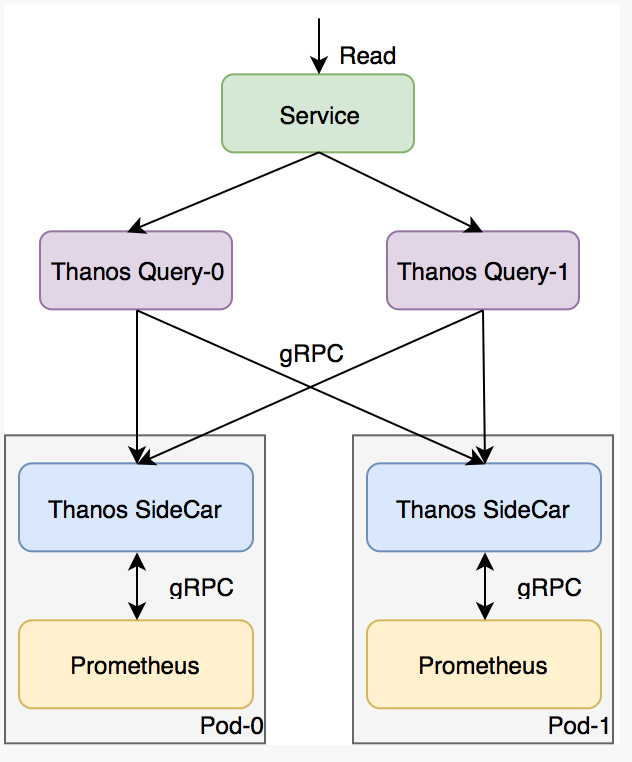

# Prometheus高可用Thanos学习-sidercar和query & Thanos部署

`kubectl create namespace thanos`

最近工作中的主要任务都是在业务的高可用上，由于项目中使用到了Promethues，所以也花了一些时间研究了一下Promethues的高可用方案。发现也没有blog告诉怎么去deploy一个Thanos的集群，所以本文也会给出deploy的方法和源文件

由于`Promethues`本身仅是一个采样系统，如果做成`master-slave模`式，存在切换开销，并且增加系统的复杂性。因此官方给出的高可用建议方案如下图，使用多个对等的`Promethues`，对所有的`DataSource`均进行采样。这里的`Service`是`K8S`的`Service`，所以理论上访问该`Service`会随机地访问后端的两个`Promethues`。


上面方案中，当其中一个`Promethues pod`中断时，`K8S`会将流量仅导向另外一个`pod`。但是`pod`中断期间，其无法获取数据，因此当中断的`pod`恢复之后，在存储端，需要进行`sync`。可是，何时`sync`，怎么`sync`是一个比较复杂的问题，就算能解决这两个问题，实际生产环境中进行文件`sync`，本身也会存在各式各样的风险。

**所以`Thanos`就没有使用存储端`Sync`的方法来保证数据的一致性，而是采用才`query`端对查询到的数据进行合并**。下面会简单介绍一下Thanos的原理。

## 1. Thanos基本原理

基于官方的介绍，我将`Thanos`的架构简化，仅保存最基本的，我所关心的部分如下， 主要包含3部分：

1. **Thanos Query.** 主要是对从`Promethues Pod`采集来的数据进行`merge`，提供查询接口给客户端（官方文档上暂时没看到`merge`的原理，这篇总结之后需要花些时间看源码学习一下）；
2. **Thanos SideCar**. **将`Promethues container`的数据进行封装，以提供接口给`Thanos Query`**（实际上SideCar还能提供更多用处，但是这里暂时我们仅关心数据查询，后面再进一步研究，暂时不要图多）
3. **`Prometheus Container`.** 采集数据，通过`Remote Read API`提供接口给`Thanos SideCar`。



## 2. Thanos部署

通过修改官网的demo文件，这里我成功的部署了`sidecar`和`query,` 能够实现一个最`basic`的`Promethues`高可用集群。你可以直接下载我的源文件部署一个`thanos`的实验环境。

### 2.1 `Prometheus`和`SideCar`

由于涉及的`yaml`文件比较多，这里我只是截取最重要的部分解释一下， 首先我们创建一个`replicas`为`2`的`statefulset`， 每个`pod`里面包含一个`Promethues`和`SideCar`容器。

```
---
apiVersion: apps/v1beta1
kind: StatefulSet
metadata:
  name: prometheus
  labels:
    app: prometheus
spec:
  serviceName: "prometheus"
  replicas: 2
  selector:
    matchLabels:
      app: prometheus
  template:
    metadata:
      labels:
        app: prometheus
        # We will use this label to put all StoreAPis
        # under the same headless service for
        # SRV lookup: thanos-store-api.default.svc
        thanos-store-api: "true"
    spec:
      securityContext:
        runAsUser: 1000
        fsGroup: 2000
        runAsNonRoot: true
      serviceAccountName: prometheus
      containers:
      - name: prometheus
        image: quay.io/prometheus/prometheus:v2.6.1
        args:
          - --config.file=/etc/prometheus-shared/prometheus.yaml
          - --storage.tsdb.path=/var/prometheus
          - --web.enable-lifecycle
          # TODO: Make retention shorter once all old blocks will be uploaded (!)
          - --storage.tsdb.retention=2w
          # Disable compaction.
          - --storage.tsdb.min-block-duration=2h
          - --storage.tsdb.max-block-duration=2h
          - --web.enable-admin-api
        ports:
          - name: http-prometheus
            containerPort: 9090
        volumeMounts:
          - name: config-shared
            mountPath: /etc/prometheus-shared
          - name: rules
            mountPath: /etc/prometheus/rules
          - name: prometheus
            mountPath: /var/prometheus
      - name: thanos
        image: improbable/thanos:v0.3.0
        args:
          - sidecar
          - --log.level=debug
          - --tsdb.path=/var/prometheus
          - --prometheus.url=http://localhost:9090
          - --cluster.disable
          - --reloader.config-file=/etc/prometheus/prometheus.yaml.tmpl
          - --reloader.config-envsubst-file=/etc/prometheus-shared/prometheus.yaml
        env:
          - name: POD_NAME
            valueFrom:
              fieldRef:
                fieldPath: metadata.name
        ports:
          - name: http-sidecar
            containerPort: 10902
          - name: grpc
            containerPort: 10901
```


