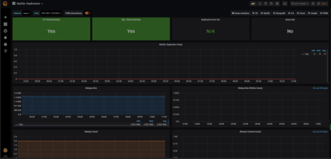
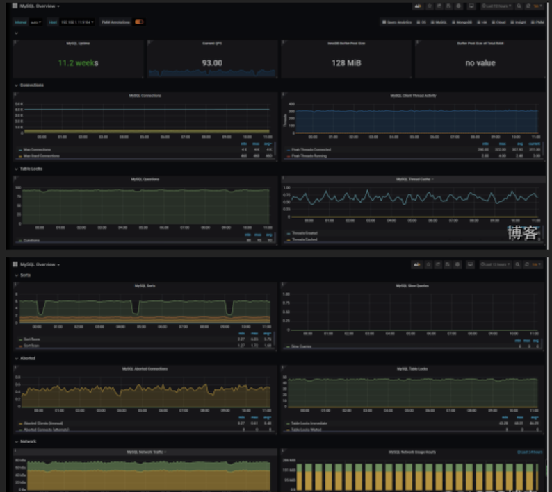
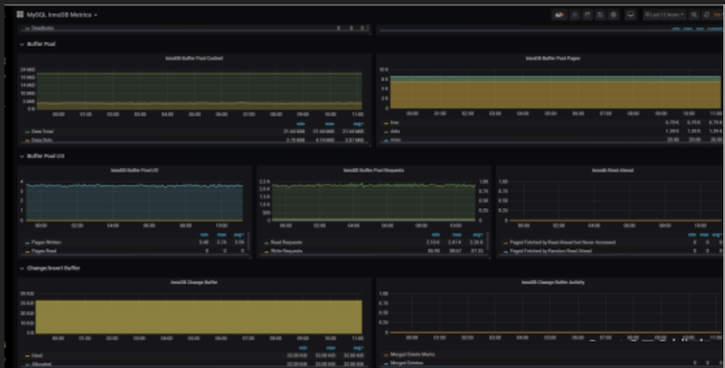

# 基于Prometheus构建MySQL可视化监控平台


选型是`Prometheus + Grafana`的实现方式。简而言之就是我现在的生产环境使用的是`Prometheus`，还有就是`Grafana`满足的我的日常工作需要。

首先看下我们的监控效果、MySQL主从：



MySQL状态： 



缓冲池状态：



## exporter 相关部署

### 1、安装exporter

```
$ https://github.com/prometheus/mysqld_exporter/releases/download/v0.10.0/mysqld_exporter-0.10.0.linux-amd64.tar.gz
$  tar -xf mysqld_exporter-0.10.0.linux-amd64.tar.gz 
```

### 2、添加mysql 账户：

```
GRANT SELECT, PROCESS, SUPER, REPLICATION CLIENT, RELOAD ON *.* TO 'exporter'@'%' IDENTIFIED BY 'localhost';
flush privileges;
```

### 3、编辑配置文件：

```
mysqld_exporter-0.10.0.linux-amd64# cat /opt/mysqld_exporter-0.10.0.linux-amd64/.my.cnf 
[client]
user=exporter
password=123456
```

### 4、设置配置文件：

```
# cat /etc/systemd/system/mysql_exporter.service 
[Unit]
Description=mysql Monitoring System
Documentation=mysql Monitoring System

[Service]
ExecStart=/opt/mysqld_exporter-0.10.0.linux-amd64/mysqld_exporter \
         -collect.info_schema.processlist \
         -collect.info_schema.innodb_tablespaces \
         -collect.info_schema.innodb_metrics  \
         -collect.perf_schema.tableiowaits \
         -collect.perf_schema.indexiowaits \
         -collect.perf_schema.tablelocks \
         -collect.engine_innodb_status \
         -collect.perf_schema.file_events \
         -collect.info_schema.processlist \
         -collect.binlog_size \
         -collect.info_schema.clientstats \
         -collect.perf_schema.eventswaits \
         -config.my-cnf=/opt/mysqld_exporter-0.10.0.linux-amd64/.my.cnf

[Install]
WantedBy=multi-user.target
```

### 5、添加配置到prometheus server

```
- job_name: 'mysql'
static_configs:
  - targets: ['192.168.1.11:9104','192.168.1.12:9104']
```

### 6、测试看有没有返回数值：

`http://192.168.1.12:9104/metrics`

正常我们通过`mysql_up`可以查询倒mysql监控是否已经生效，是否起起来

```
#HELP mysql_up Whether the MySQL server is up.
#TYPE mysql_up gauge
mysql_up 1
```

## 监控相关指标

在做任何一个东西监控的时候，我们要时刻明白我们要监控的是什么，指标是啥才能更好的去监控我们的服务，在mysql里面我们通常可以通过一下指标去衡量`mysql`的运行情况：

* mysql主从运行情况、
* 查询吞吐量、
* 慢查询情况、
* 连接数情况、
* 缓冲池使用情况以及查询执行性能等。

### 主从复制运行指标：

**1、主从复制线程监控：**

大部分情况下，很多企业使用的都是主从复制的环境，监控两个线程是非常重要的，在mysql里面我们通常是通过命令：

```
MariaDB [(none)]> show slave status\G;
*************************** 1. row ***************************
               Slave_IO_State: Waiting for master to send event
                  Master_Host: 172.16.1.1
                  Master_User: repl
                  Master_Port: 3306
                Connect_Retry: 60
              Master_Log_File: mysql-bin.000045
          Read_Master_Log_Pos: 72904854
               Relay_Log_File: mariadb-relay-bin.000127
                Relay_Log_Pos: 72905142
        Relay_Master_Log_File: mysql-bin.000045
             Slave_IO_Running: Yes
            Slave_SQL_Running: Yes
```

* `#Slave_IO_Running`、`Slave_SQL_Running`两个线程正常那么说明我们的复制集群是健康状态的。
* `MySQLD Exporter`中返回的样本数据中通过`mysql_slave_status_slave_sql_running`来获取主从集群的健康状况。

```
# HELP mysql_slave_status_slave_sql_running Generic metric from SHOW SLAVE STATUS.
# TYPE mysql_slave_status_slave_sql_running untyped
mysql_slave_status_slave_sql_running{channel_name="",connection_name="",master_host="172.16.1.1",master_uuid=""} 1
```

**2、主从复制落后时间：**

在使用`show slave status` 里面还有一个关键的参数`Seconds_Behind_Master`。

**`Seconds_Behind_Master`表示`slave`上`SQL thread`与`IO thread`之间的延迟，我们都知道在`MySQL`的复制环境中，`slave`先从`master`上将`binlog`拉取到本地（通过IO thread），然后通过`SQL thread`将`binlog`重放, 而`Seconds_Behind_Master`表示本地`relaylog`中未被执行完的那部分的差值。**

所以如果`slave`拉取到本地的`relaylog`（实际上就是`binlog`，只是在`slave`上习惯称呼`relaylog`而已）都执行完，此时通过`show slave status`看到的会是`0`

`Seconds_Behind_Master: 0`

`MySQLD Exporter`中返回的样本数据中通过`mysql_slave_status_seconds_behind_master `来获取相关状态。

```
# HELP mysql_slave_status_seconds_behind_master Generic metric from SHOW SLAVE STATUS.
# TYPE mysql_slave_status_seconds_behind_master untyped
mysql_slave_status_seconds_behind_master{channel_name="",connection_name="",master_host="172.16.1.1",master_uuid=""} 0
```

## 查询吞吐量：

说到吞吐量，那么我们如何从那方面来衡量呢？
通常来说我们可以根据mysql 的插入、查询、删除、更新等操作来

为了获取吞吐量，`MySQL` 有一个名为 `Questions` 的内部计数器（根据 `MySQL `用语，这是一个服务器状态变量），**客户端每发送一个查询语句，其值就会加一。由 `Questions `指标带来的以客户端为中心的视角常常比相关的`Queries` 计数器更容易解释**。

作为存储程序的一部分，后者也会计算已执行语句的数量，以及诸如`PREPARE` 和 `DEALLOCATE PREPARE` 指令运行的次数，作为服务器端预处理语句的一部分。可以通过命令来查询：

```
MariaDB [(none)]> SHOW GLOBAL STATUS LIKE "Questions";
+---------------+-------+
| Variable_name | Value |
+---------------+-------+
| Questions     | 15071 |
+---------------+-------+
```

`MySQLD Exporter`中返回的样本数据中通过`mysql_global_status_questions`反映当前`Questions`计数器的大小：

```
# HELP mysql_global_status_questions Generic metric from SHOW GLOBAL STATUS.
# TYPE mysql_global_status_questions untyped
mysql_global_status_questions 13253
```

当然由于prometheus 具有非常丰富的查询语言，我们可以通过这个累加的计数器来查询某一短时间内的查询增长率情况，可以做相关的阈值告警处理、例如一下查询2分钟时间内的查询情况：

```
rate(mysql_global_status_questions[2m])
```

当然上面是总量，我们可以分别从监控读、写指令的分解情况，从而更好地理解数据库的工作负载、找到可能的瓶颈。通常，通常，读取查询会由 `Com_select` 指标抓取，而写入查询则可能增加三个状态变量中某一个的值，这取决于具体的指令：

```
Writes = Com_insert + Com_update + Com_delete
```

下面我们通过命令获取插入的情况：

```
MariaDB [(none)]> SHOW GLOBAL STATUS LIKE "Com_insert";
+---------------+-------+
| Variable_name | Value |
+---------------+-------+
| Com_insert    | 10578 |
+---------------+-------+
```

从`MySQLD Exporter`的`/metrics`返回的监控样本中，可以通过`global_status_commands_total`获取当前实例各类指令执行的次数：

```
# HELP mysql_global_status_commands_total Total number of executed MySQL commands.
# TYPE mysql_global_status_commands_total counter
mysql_global_status_commands_total{command="create_trigger"} 0
mysql_global_status_commands_total{command="create_udf"} 0
mysql_global_status_commands_total{command="create_user"} 1
mysql_global_status_commands_total{command="create_view"} 0
mysql_global_status_commands_total{command="dealloc_sql"} 0
mysql_global_status_commands_total{command="delete"} 3369
mysql_global_status_commands_total{command="delete_multi"} 0
```

## 慢查询性能

查询性能方面，慢查询也是查询告警的一个重要的指标。`MySQL`还提供了一个`Slow_queries`的计数器，当查询的执行时间超过`long_query_time`的值后，计数器就会`+1`，其默认值为`10`秒，可以通过以下指令在`MySQL`中查询当前`long_query_time`的设置：

```
MariaDB [(none)]> SHOW VARIABLES LIKE 'long_query_time';
+-----------------+-----------+
| Variable_name   | Value     |
+-----------------+-----------+
| long_query_time | 10.000000 |
+-----------------+-----------+
1 row in set (0.00 sec)
```

当然我们也可以修改时间

```
MariaDB [(none)]> SET GLOBAL long_query_time = 5;
Query OK, 0 rows affected (0.00 sec)
```

然后我们而已通过sql语言查询MySQL实例中`Slow_queries`的数量：

```
MariaDB [(none)]> SHOW GLOBAL STATUS LIKE "Slow_queries";
+---------------+-------+
| Variable_name | Value |
+---------------+-------+
| Slow_queries  | 0     |
+---------------+-------+
1 row in set (0.00 sec)
```
`MySQLD Exporter`返回的样本数据中，通过`mysql_global_status_slow_queries`指标展示当前的`Slow_queries`的值：

```
# HELP mysql_global_status_slow_queries Generic metric from SHOW GLOBAL STATUS.
# TYPE mysql_global_status_slow_queries untyped
mysql_global_status_slow_queries 0
```

同样的，更具根据Prometheus 慢查询语句我们也可以查询倒他某段时间内的增长率：

```
rate(mysql_global_status_slow_queries[5m])
```

## 连接数监控

监控客户端连接情况相当重要，因为一旦可用连接耗尽，新的客户端连接就会遭到拒绝。MySQL 默认的连接数限制为 `151`。

```
MariaDB [(none)]> SHOW VARIABLES LIKE 'max_connections';
+-----------------+-------+
| Variable_name   | Value |
+-----------------+-------+
| max_connections | 151   |
+-----------------+-------+
```

当然我们可以修改配置文件的形式来增加这个数值。与之对应的就是当前连接数量，当我们当前连接出来超过系统设置的最大值之后常会出现我们看到的`Too many connections`(连接数过多)，下面我查找一下当前连接数：

```
MariaDB [(none)]> SHOW GLOBAL STATUS LIKE "Threads_connected";
+-------------------+-------+
| Variable_name     | Value |
+-------------------+-------+
| Threads_connected | 41     |
+-------------------+-------
```

当然`mysql` 还提供`Threads_running` 这个指标，帮助你分隔在任意时间正在积极处理查询的线程与那些虽然可用但是闲置的连接。

```
MariaDB [(none)]> SHOW GLOBAL STATUS LIKE "Threads_running";
+-----------------+-------+
| Variable_name   | Value |
+-----------------+-------+
| Threads_running | 10     |
+-----------------+-------+
```

如果服务器真的达到 `max_connections`限制，它就会开始拒绝新的连接。在这种情况下，`Connection_errors_max_connections` 指标就会开始增加，同时，追踪所有失败连接尝试的`Aborted_connects` 指标也会开始增加。

`MySQLD Exporter`返回的样本数据中:

```
# HELP mysql_global_variables_max_connections Generic gauge metric from SHOW GLOBAL VARIABLES.
# TYPE mysql_global_variables_max_connections gauge
mysql_global_variables_max_connections 151     
```

**表示最大连接数**

```
# HELP mysql_global_status_threads_connected Generic metric from SHOW GLOBAL STATUS.
# TYPE mysql_global_status_threads_connected untyped
mysql_global_status_threads_connected 41
```

**表示当前的连接数**

```
# HELP mysql_global_status_threads_running Generic metric from SHOW GLOBAL STATUS.
# TYPE mysql_global_status_threads_running untyped
mysql_global_status_threads_running 1
```

**表示当前活跃的连接数**

```
# HELP mysql_global_status_aborted_connects Generic metric from SHOW GLOBAL STATUS.
# TYPE mysql_global_status_aborted_connects untyped
mysql_global_status_aborted_connects 31
```

**累计所有的连接数**

```
# HELP mysql_global_status_connection_errors_total Total number of MySQL connection errors.
# TYPE mysql_global_status_connection_errors_total counter
mysql_global_status_connection_errors_total{error="internal"} 0
#服务器内部引起的错误、如内存硬盘等
mysql_global_status_connection_errors_total{error="max_connections"} 0
#超出连接处引起的错误
```

当然根据`prom`表达式，我们可以查询当前剩余可用的连接数：

```
mysql_global_variables_max_connections - mysql_global_status_threads_connected
```

查询`mysql`拒绝连接数

```
mysql_global_status_aborted_connects
```

## 缓冲池情况：

`MySQL` 默认的存储引擎 `InnoDB` 使用了一片称为缓冲池的内存区域，用于缓存数据表与索引的数据。缓冲池指标属于资源指标，而非工作指标，前者更多地用于调查（而非检测）性能问题。如果数据库性能开始下滑，而磁盘` I/O` 在不断攀升，扩大缓冲池往往能带来性能回升。

默认设置下，缓冲池的大小通常相对较小，为 `128MiB`。不过，`MySQL` 建议可将其扩大至专用数据库服务器物理内存的 `80%` 大小。我们可以查看一下：

```
MariaDB [(none)]> show global variables like 'innodb_buffer_pool_size';
+-------------------------+-----------+
| Variable_name           | Value     |
+-------------------------+-----------+
| innodb_buffer_pool_size | 134217728 |
+-------------------------+-----------+
```

`MySQLD Exporter`返回的样本数据中，使用`mysql_global_variables_innodb_buffer_pool_size`来表示。

```
# HELP mysql_global_variables_innodb_buffer_pool_size Generic gauge metric from SHOW GLOBAL VARIABLES.
# TYPE mysql_global_variables_innodb_buffer_pool_size gauge
mysql_global_variables_innodb_buffer_pool_size 1.34217728e+08

Innodb_buffer_pool_read_requests记录了正常从缓冲池读取数据的请求数量。可以通过以下指令查看

MariaDB [(none)]> SHOW GLOBAL STATUS LIKE "Innodb_buffer_pool_read_requests";
+----------------------------------+-------------+
| Variable_name                    | Value       |
+----------------------------------+-------------+
| Innodb_buffer_pool_read_requests | 38465 |
+----------------------------------+-------------+
```

`MySQLD Exporter`返回的样本数据中，使用`mysql_global_status_innodb_buffer_pool_read_requests`来表示

```
# HELP mysql_global_status_innodb_buffer_pool_read_requests Generic metric from SHOW GLOBAL STATUS.
# TYPE mysql_global_status_innodb_buffer_pool_read_requests untyped
mysql_global_status_innodb_buffer_pool_read_requests 2.7711547168e+10
```

当缓冲池无法满足时，`MySQL`只能从磁盘中读取数据。`Innodb_buffer_pool_reads`即记录了从磁盘读取数据的请求数量。通常来说从内存中读取数据的速度要比从磁盘中读取快很多，因此，如果`Innodb_buffer_pool_reads`的值开始增加，可能意味着数据库的性能有问题。 可以通过以下只能查看`Innodb_buffer_pool_reads`的数量


```
MariaDB [(none)]> SHOW GLOBAL STATUS LIKE "Innodb_buffer_pool_reads";
+--------------------------+-------+
| Variable_name            | Value |
+--------------------------+-------+
| Innodb_buffer_pool_reads | 138  |
+--------------------------+-------+
1 row in set (0.00 sec)
```

MySQLD Exporter返回的样本数据中，使用`mysql_global_status_innodb_buffer_pool_read_requests`来表示。

```
# HELP mysql_global_status_innodb_buffer_pool_reads Generic metric from SHOW GLOBAL STATUS.
# TYPE mysql_global_status_innodb_buffer_pool_reads untyped
mysql_global_status_innodb_buffer_pool_reads 138
```

通过以上监控指标，以及实际监控的场景，我们可以利用`PromQL`快速建立多个监控项。可以查看两分钟内读取磁盘的增长率的增长率：

```
rate(mysql_global_status_innodb_buffer_pool_reads[2m])
```

## 官方模板ID

上面是我们简单列举的一些指标，下面我们使用granafa给` MySQLD_Exporter`添加监控图表：

* 主从主群监控(模板7371)：
* 相关mysql 状态监控7362：
* 缓冲池状态7365：

### 简单的告警规则

除了相关模板之外，没有告警规则那么我们的监控就是不完美的，下面列一下我们的监控告警规则

```
groups:
- name: MySQL-rules
  rules:
  - alert: MySQL Status 
    expr: up == 0
    for: 5s 
    labels:
      severity: warning
    annotations:
      summary: "{{$labels.instance}}: MySQL has stop !!!"
      description: "检测MySQL数据库运行状态"

  - alert: MySQL Slave IO Thread Status
    expr: mysql_slave_status_slave_io_running == 0
    for: 5s 
    labels:
      severity: warning
    annotations: 
      summary: "{{$labels.instance}}: MySQL Slave IO Thread has stop !!!"
      description: "检测MySQL主从IO线程运行状态"

  - alert: MySQL Slave SQL Thread Status 
    expr: mysql_slave_status_slave_sql_running == 0
    for: 5s 
    labels:
      severity: warning
    annotations: 
      summary: "{{$labels.instance}}: MySQL Slave SQL Thread has stop !!!"
      description: "检测MySQL主从SQL线程运行状态"

  - alert: MySQL Slave Delay Status 
    expr: mysql_slave_status_sql_delay == 30
    for: 5s 
    labels:
      severity: warning
    annotations: 
      summary: "{{$labels.instance}}: MySQL Slave Delay has more than 30s !!!"
      description: "检测MySQL主从延时状态"

  - alert: Mysql_Too_Many_Connections
    expr: rate(mysql_global_status_threads_connected[5m]) > 200
    for: 2m
    labels:
      severity: warning
    annotations:
      summary: "{{$labels.instance}}: 连接数过多"
      description: "{{$labels.instance}}: 连接数过多，请处理 ,(current value is: {{ $value }})"  

  - alert: Mysql_Too_Many_slow_queries
    expr: rate(mysql_global_status_slow_queries[5m]) > 3
    for: 2m
    labels:
      severity: warning
    annotations:
      summary: "{{$labels.instance}}: 慢查询有点多，请检查处理"
      description: "{{$labels.instance}}: Mysql slow_queries is more than 3 per second ,(current value is: {{ $value }})"
```

2.添加规则到prometheus：

```
rule_files:
  - "rules/*.yml" 
```

3.打开web ui我们可以看到规则生效了：

