# 大规模场景下 Prometheus 的优化手段 & Thanos 架构详解

## 概述

Prometheus 几乎已成为监控领域的事实标准，它自带高效的时序数据库存储，可以让单台 Prometheus 能够高效的处理大量的数据，还有友好并且强大的 PromQL 语法，可以用来灵活的查询各种监控数据以及配置告警规则。

同时它的 pull 模型指标采集方式被广泛采纳，非常多的应用都实现了 Prometheus 的 metrics 接口以暴露自身各项数据指标让 Prometheus 去采集，很多没有适配的应用也会有第三方 exporter 帮它去适配 Prometheus，所以监控系统我们通常首选用 Prometheus。


### 大规模场景下`Prometheus`的痛点

`Prometheus` 本身只支持单机部署，没有自带支持集群部署，也就不支持高可用以及水平扩容，在大规模场景下，最让人关心的问题是它的存储空间也受限于单机磁盘容量。

**磁盘容量决定了单个 Prometheus 所能存储的数据量，数据量大小又取决于被采集服务的指标数量、服务数量、采集速率以及数据过期时间**。在数据量大的情况下，我们可能就需要做很多取舍，比如丢弃不重要的指标、降低采集速率、设置较短的数据过期时间（默认只保留15天的数据，看不到比较久远的监控数据）。

这些痛点实际也是可以通过一些优化手段来改善的，下面我们来细讲一下。

### 从服务维度拆分`Prometheus`

`Prometheus` 主张根据功能或服务维度进行拆分，即如果要采集的服务比较多，一个 `Prometheus` 实例就配置成仅采集和存储某一个或某一部分服务的指标，这样根据要采集的服务将 `Prometheus` 拆分成多个实例分别去采集，也能一定程度上达到水平扩容的目的。

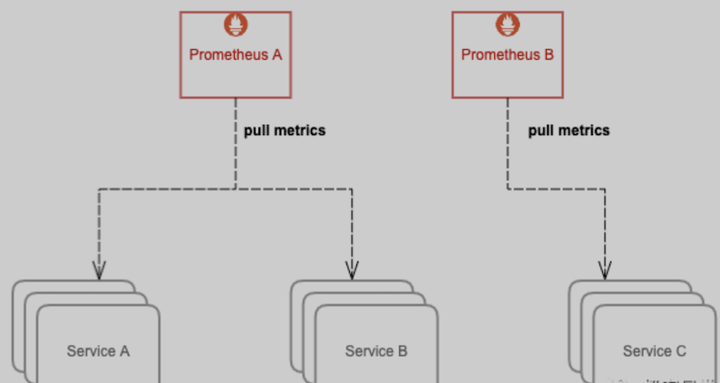

通常这样的扩容方式已经能满足大部分场景的需求了，毕竟单机 `Prometheus` 就能采集和处理很多数据了，很少有 `Prometheus` 撑不住单个服务的场景。


不过在超大规模集群下，有些单个服务的体量也很大，就需要进一步拆分了，我们下面来继续讲下如何再拆分。

### 对超大规模额服务做分片

想象一下，如果集群节点数量达到上千甚至几千的规模，对于一些节点级服务暴露的指标，比如 `kubelet` 内置的 `cadvisor `暴露的容器相关的指标，又或者部署的 `DeamonSet node-exporter` 暴露的节点相关的指标，**在集群规模大的情况下，它们这种单个服务背后的指标数据体量往往非常大**。

包括一些用户量超大的业务，单个服务的 Pod 副本数就可能过千，这种服务背后的指标数据也非常大。当然这是最罕见的场景，对于绝大多数的人来说这种场景都只敢 YY 一下，实际很少有单个服务就达到这么大规模的业务。

针对上面这些大规模场景，一个 Prometheus 实例可能连这单个服务的采集任务都扛不住。Prometheus 需要向这个服务所有后端实例发请求采集数据，由于后端实例数量规模太大，采集并发量就会很高，**一方面对节点的带宽、CPU、磁盘 IO 都有一定的压力，另一方面 Prometheus 使用的磁盘空间有限，采集的数据量过大很容易就将磁盘塞满了**，通常要做一些取舍才能将数据量控制在一定范围，但这种取舍也会降低数据完整和精确程度，不推荐这样做。


那么如何优化呢？**我们可以给这种大规模类型的服务做一下分片（`Sharding`），将其拆分成多个 `group`，让一个 `Prometheus` 实例仅采集这个服务背后的某一个 `group` 的数据，这样就可以将这个大体量服务的监控数据拆分到多个 `Prometheus` 实例上**。

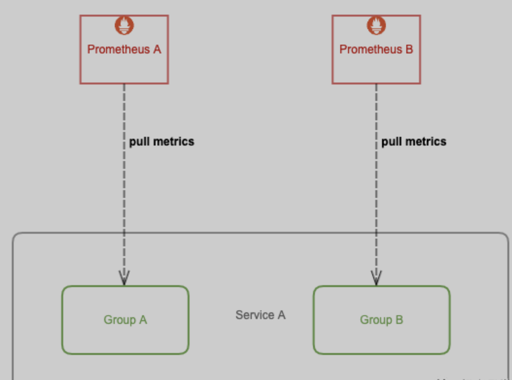


如何将一个服务拆成多个 group 呢？下面介绍两种方案，以对 kubelet cadvisor 数据做分片为例。

第一，我们可以不用 `Kubernetes` 的服务发现，自行实现 `sharding` 算法。

比如针对节点级的服务，可以将某个节点 `shard` 到某个 `group `里，然后再将其注册到 `Prometheus` 所支持的服务发现注册中心，推荐 `consul`，最后在 `Prometheus` 配置文件加上 `consul_sd_config` 的配置，指定每个 `Prometheus` 实例要采集的 `group`。

```
- job_name: 'cadvisor-1'
  consul_sd_configs:
    - server: 10.0.0.3:8500
      services:
        - cadvisor-1 # This is the 2nd slave
```

在未来，你甚至可以直接利用 `Kubernetes` 的 `EndpointSlice` 特性来做服务发现和分片处理，在超大规模服务场景下就可以不需要其它的服务发现和分片机制。不过暂时此特性还不够成熟，没有默认启用，不推荐用（当前 Kubernentes 最新版本为 v1.18）。

**第二，用 `Kubernetes` 的 `node` 服务发现，再利用 `Prometheus relabel` 配置的 `hashmod `来对 `node` 做分片。** 每个 `Prometheus` 实例仅抓其中一个分片中的数据:

```
- job_name: 'cadvisor-1'
  metrics_path: /metrics/cadvisor
  scheme: https

  # 请求 kubelet metrics 接口也需要认证和授权，通常会用 webhook 方式让 apiserver 代理进行 RBAC 校验，所以还是用 ServiceAccount 的 token
  bearer_token_file: /var/run/secrets/kubernetes.io/serviceaccount/token

  kubernetes_sd_configs:
  - role: node

  # 通常不校验 kubelet 的 server 证书，避免报 x509: certificate signed by unknown authority
  tls_config:
    insecure_skip_verify: true

  relabel_configs:
  - source_labels: [__address__]
    modulus:       4    # 将节点分片成 4 个 group
    target_label:  __tmp_hash
    action:        hashmod
  - source_labels: [__tmp_hash]
    regex:         ^1$  # 只抓第 2 个 group 中节点的数据(序号 0 为第 1 个 group)
    action:        keep
```

## 拆分引入的新问题

前面我们通过不通层面对 Prometheus 进行了拆分部署，一方面使得 Prometheus 能够实现水平扩容，另一方面也加剧了监控数据落盘的分散程度，使用 Grafana 查询监控数据时我们也需要添加许多数据源，而且不同数据源之间的数据还不能聚合查询，监控页面也看不到全局的视图，造成查询混乱的局面。

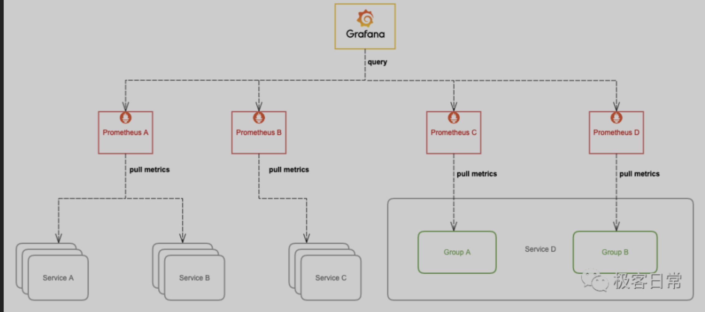

要解决这个问题，我们可以从下面的两方面入手，任选其中一种方案。

### 集中数据库存储

我们可以让 `Prometheus` 不负责存储，仅采集数据并通过 `remote write` 方式写入远程存储的 `adapter`，远程存储使用 `OpenTSDB` 或 `InfluxDB` 这些支持集群部署的时序数据库，`Prometheus` 配置:

```
remote_write:
- url: http://10.0.0.2:8888/write
```

然后 Grafana 添加我们使用的时序数据库作为数据源来查询监控数据来展示，架构图:

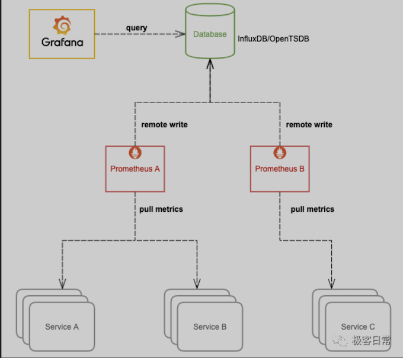

这种方式相当于更换了存储引擎，由其它支持存储水平扩容的时序数据库来存储庞大的数据量，这样我们就可以将数据集中到一起。`OpenTSDB` 支持 `HBase,` `BigTable `作为存储后端，`InfluxDB` 企业版支持集群部署和水平扩容（开源版不支持）。**不过这样的话，我们就无法使用友好且强大的 `PromQL` 来查询监控数据了，必须使用我们存储数据的时序数据库所支持的语法来查询**。

### Prometheus 联邦

除了上面更换存储引擎的方式，还可以将 Prometheus 进行联邦部署。

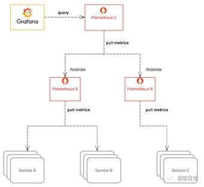

**简单来说，就是将多个 Prometheus 实例采集的数据再用另一个 `Prometheus` 采集汇总到一起，这样也意味着需要消耗更多的资源。**

通常我们只把需要聚合的数据或者需要在一个地方展示的数据用这种方式采集汇总到一起，比如 `Kubernetes` 节点数过多，`cadvisor` 的数据分散在多个 `Prometheus` 实例上，我们就可以用这种方式将 `cadvisor` 暴露的容器指标汇总起来，以便于在一个地方就能查询到集群中任意一个容器的监控数据或者某个服务背后所有容器的监控数据的聚合汇总以及配置告警。

又或者多个服务有关联，比如通常应用只暴露了它应用相关的指标，但它的资源使用情况（比如 CPU 和 内存）由 cadvisor 来感知和暴露，这两部分指标由不同的 Prometheus 实例所采集，这时我们也可以用这种方式将数据汇总，在一个地方展示和配置告警。

更多说明和配置示例请参考官方文档:

https://prometheus.io/docs/prometheus/latest/federation/

### Prometheus 高可用

虽然上面我们通过一些列操作将 `Prometheus` 进行了分布式改造，但并没有解决 Prometheus 本身的高可用问题，即如果其中一个实例挂了，数据的查询和完整性都将受到影响。

我们可以将所有 `Prometheus` 实例都使用两个相同副本，分别挂载数据盘，它们都采集相同的服务，所以它们的数据是一致的，查询它们之中任意一个都可以，所以可以在它们前面再挂一层负载均衡（比如 `Nginx` 或 `HAProxy`），所有查询都先经过这个负载均衡再到其中一台 `Prometheus`，如果其中一台挂掉就从负载列表里踢掉不再转发。

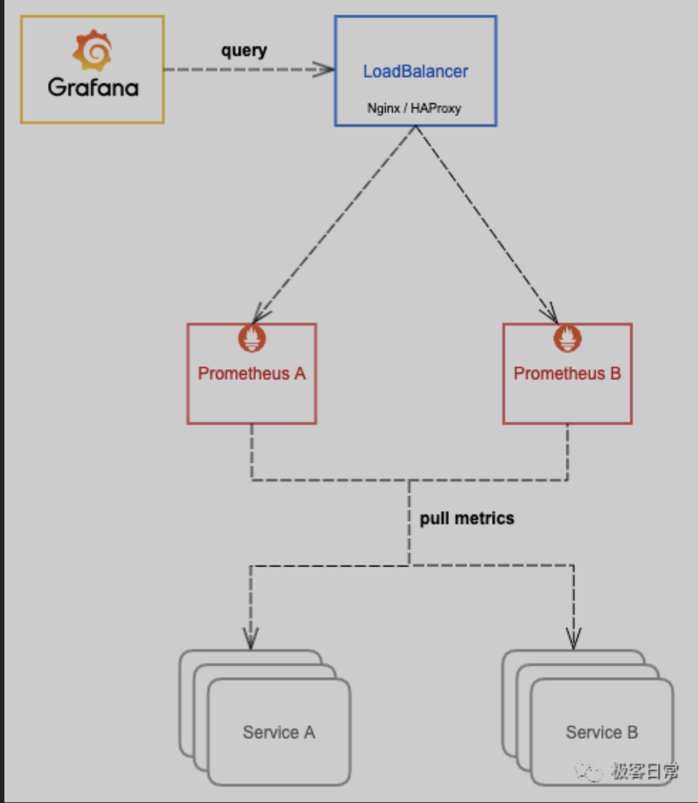

这样就实现了 Prometheus 的高可用，简单起见，上面的图仅展示单个 Prometheus 的高可用，当你可以将其拓展，代入应用到上面其它的优化手段中，实现整体的高可用。

我们在一定程度上解决了单机 Prometheus 在大规模场景下的痛点，**但操作和运维复杂度比较高，并且不能够很好的支持数据的长期存储（long term storage）**。

对于一些时间比较久远的监控数据，我们通常查看的频率很低，但也希望能够低成本地保留足够长时间，数据如果全部落盘到磁盘成本是很高的，并且容量有限，即便利用水平扩容可以增加存储容量，但这在同时也增大了资源成本，不可能无限扩容，**所以需要设置一个数据过期策略，也就会丢失时间比较久远的监控数**据。

对于这种不常用的冷数据，最理想的方式是存到廉价的对象存储中，等需要查询的时候能够自动加载出来。`Thanos` 可以帮我们解决这些问题，它完全兼容 `Prometheus API`，提供统一查询聚合分布式部署的 `Prometheus` 数据的能力，同时也支持数据长期存储到各种对象存储（无限存储能力）以及降低采样率来加速大时间范围的数据查询。

## Thanos 架构详解

Thanos（没错，就是灭霸）可以帮我们简化分布式 Prometheus 的部署与管理，并提供了一些的高级特性：全局视图、长期存储、高可用。下面我们来详细讲解一下。

### Thanos  机构

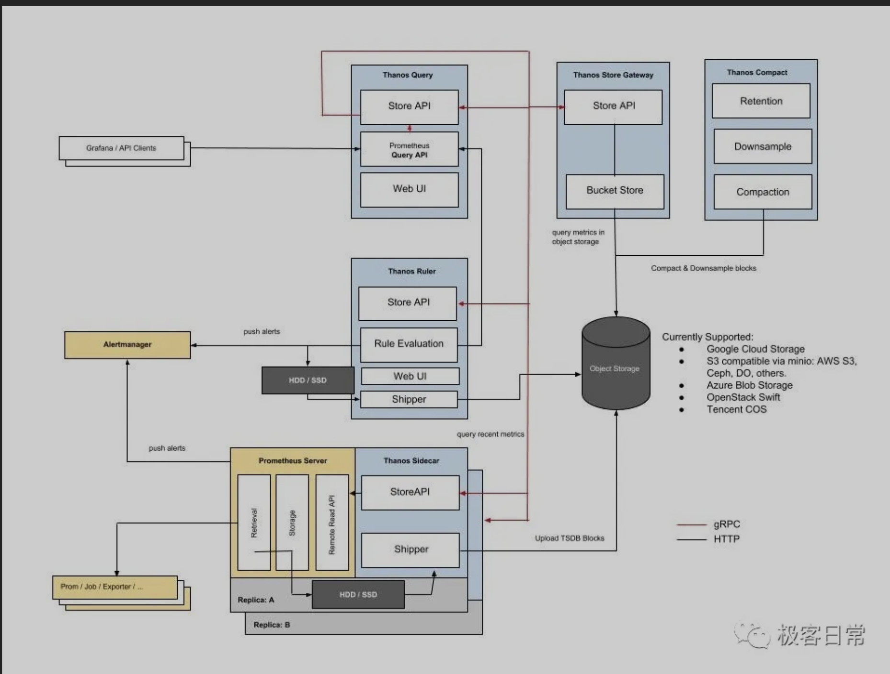

简单介绍下图中这几个组件的作用：

* **`Thanos Query`**：实现了 Prometheus API，将来自下游组件提供的数据进行聚合最终返回给查询数据的 client （如 grafana），类似数据库中间件。
* **`Thanos Sidecar`**：连接 Prometheus，将其数据提供给 Thanos Query 查询，并且/或者将其上传到对象存储，以供长期存储。
* **`Thanos Store Gateway`**：将对象存储的数据暴露给 `Thanos Query` 去查询。
* **`Thanos Ruler`**：对监控数据进行评估和告警，还可以计算出新的监控数据，将这些新数据提供给 Thanos Query 查询并且/或者上传到对象存储，以供长期存储。
* **`Thanos Compact`**：将对象存储中的数据进行压缩和降低采样率，加速大时间区间监控数据查询的速度。


### 机构设计剖析

如何理解 Thanos 的架构设计的？我们可以自己先 YY 一下，要是自己来设计一个分布式 Prometheus 管理应用，会怎么做？

**Query 与 Sidecar**

首先，监控数据的查询肯定不能直接查 Prometheus 了，因为会存在许多个 Prometheus 实例，每个 Prometheus 实例只能感知它自己所采集的数据。

我们可以比较容易联想到数据库中间件，每个数据库都只存了一部分数据，中间件能感知到所有数据库，数据查询都经过数据库中间件来查，这个中间件收到查询请求再去查下游各个数据库中的数据，最后将这些数据聚合汇总返回给查询的客户端，这样就实现了将分布式存储的数据集中查询。

实际上，`Thanos` 也是使用了类似的设计思想，**`Thanos Query` 就是这个 “中间价” 的关键入口，它实现了 `Prometheus `的 `HTTP API`，能够 “看懂” `PromQL`**。


这样，查询 `Prometheus` 监控数据的 `client `就不直接查询 `Prometheus` 本身了，而是去查询 `Thanos Query`，`Thanos Query` 再去下游多个存储了数据的地方查数据，最后将这些数据聚合去重后返回给 client，也就实现了分布式 Prometheus 的数据查询。


那么` Thanos Query` 又如何去查下游分散的数据呢？`Thanos` 为此抽象了一套叫 `Store API` 的内部 `gRPC` 接口，其它一些组件通过这个接口来暴露数据给 `Thanos Query`，它自身也就可以做到完全无状态部署，实现高可用与动态扩展。


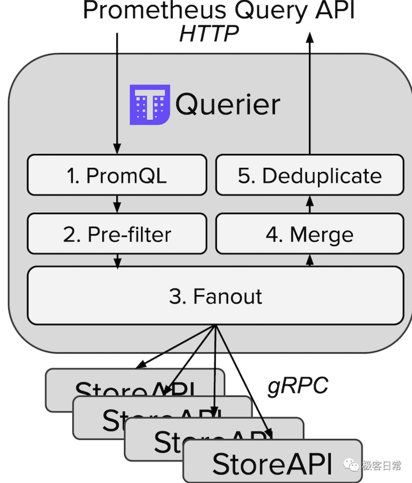

这些分散的数据可能来自哪些地方呢？

首先，`Prometheus` 会将采集的数据存到本机磁盘上，如果我们直接用这些分散在各个磁盘上的数据，**可以给每个 `Prometheus` 附带部署一个 `Sidecar`，这个 `Sidecar `实现 `Thanos Store API`，当 `Thanos Query` 对其发起查询时，`Sidecar` 就读取跟它绑定部署的 `Prometheus` 实例上的监控数据返回给 `Thanos Query`**。


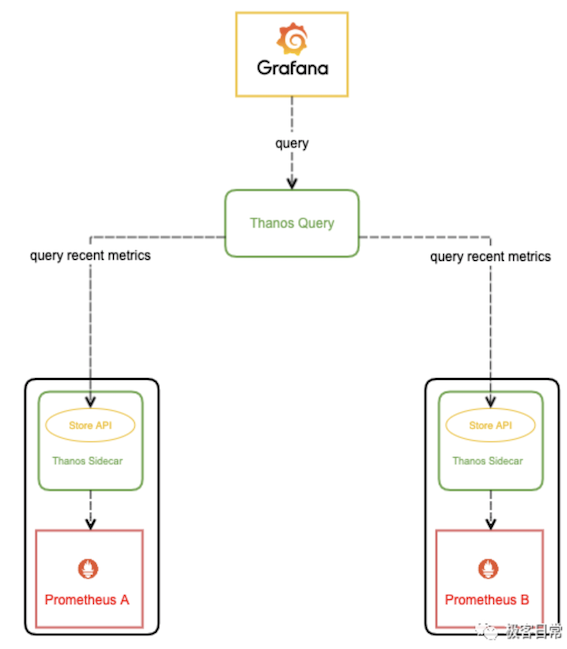

由于 `Thanos Query` 可以对数据进行聚合与去重，所以可以很轻松实现高可用：相同的 `Prometheus` 部署多个副本（都附带 `Sidecar`），**然后 `Thanos Query` 去所有 `Sidecar` 查数据，即便有一个 Prometheus 实例挂掉过一段时间，数据聚合与去重后仍然能得到完整数据。**

这种高可用做法还弥补了我们上篇文章中用**负载均衡去实现 `Prometheus` 高可用方法的缺陷**：如果其中一个 `Prometheus` 实例挂了一段时间然后又恢复了，它的数据就不完整，当负载均衡转发到它上面去查数据时，返回的结果就可能会有部分缺失。

不过因为磁盘空间有限，`Prometheus` 存储监控数据的能力也是有限的，通常会给 `Prometheus` 设置一个数据过期时间（默认 15 天）或者最大数据量大小，不断清理旧数据以保证磁盘不被撑爆。因此，我们无法看到时间比较久远的监控数据，有时候这也给我们的问题排查和数据统计造成一些困难。

对于需要长期存储的数据，并且使用频率不那么高，最理想的方式是存进对象存储，各大云厂商都有对象存储服务，特点是不限制容量，价格非常便宜。

Thanos 有几个组件都支持将数据上传到各种对象存储以供长期保存（`Prometheus TSDB` 数据格式），比如我们刚刚说的 Sidecar:

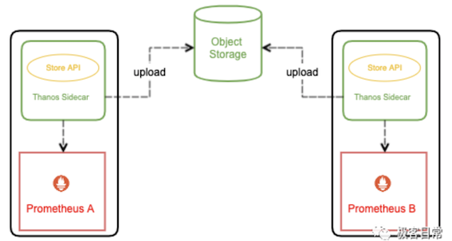

**Store Gateway**

那么这些被上传到了对象存储里的监控数据该如何查询呢？理论上 `Thanos Query` 也可以直接去对象存储查，但这会让 `Thanos Query` 的逻辑变的很重。

我们刚才也看到了，`Thanos` 抽象出了` Store API`，只要实现了该接口的组件都可以作为 `Thanos Query` 查询的数据源，**`Thanos Store Gateway` 这个组件也实现了 `Store API`，向 `Thanos Query `暴露对象存储的数据**。

**`Thanos Store Gateway` 内部还做了一些加速数据获取的优化逻辑，一是缓存了 `TSDB` 索引，二是优化了对象存储的请求** (用尽可能少的请求量拿到所有需要的数据)。

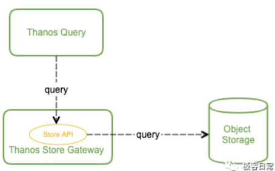

这样就实现了监控数据的长期储存，由于对象存储容量无限，所以理论上我们可以存任意时长的数据，监控历史数据也就变得可追溯查询，便于问题排查与统计分析。

**Ruler**

有一个问题，	**`Prometheus` 不仅仅只支持将采集的数据进行存储和查询的功能，还可以配置一些 `rules`:**

**根据配置不断计算出新指标数据并存储，后续查询时直接使用计算好的新指标，这样可以减轻查询时的计算压力，加快查询速度。**

不断计算和评估是否达到告警阀值，当达到阀值时就通知 `AlertManager `来触发告警。

由于我们将 `Prometheus` 进行分布式部署，每个 `Prometheus` 实例本地并没有完整数据，有些有关联的数据可能存在多个 `Prometheus `实例中，单机 `Prometheus` 看不到数据的全局视图，这种情况我们就不能依赖 `Prometheus` 来做这些工作。

**这时，`Thanos Ruler` 就能大显身手了。它通过查询 `Thanos Query` 获取全局数据，然后根据 `rules` 配置计算新指标并存储，同时也通过 `Store API` 将数据暴露给 `Thanos Query`，同样还可以将数据上传到对象存储以供长期保存**（这里上传到对象存储中的数据一样也是通过 `Thanos Store Gateway` 暴露给` Thanos Query`）。

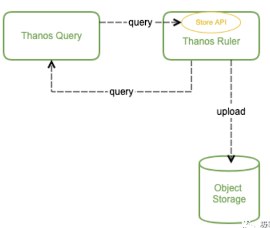


**看起来 `Thanos Query` 跟` Thanos Ruler` 之间会相互查询，不过这个不冲突，`Thanos Ruler` 为 `Thanos Query` 提供计算出的新指标数据，而 `Thanos Query` 为 `Thanos Ruler` 提供计算新指标所需要的全局原始指标数据。**

至此，`Thanos` 的核心能力基本实现了，完全兼容 `Prometheus` 情况下提供数据查询的全局视图、高可用以及数据的长期保存。

那我们还可以怎么进一步做优化呢？


**Compact**

由于我们有数据长期存储的能力，也就可以实现查询较大时间范围的监控数据，当时间范围很大时，查询的数据量也会很大，这会导致查询速度非常慢。

通常在查看较大时间范围的监控数据时，我们并不需要那么详细的数据，只需要看到大致就行。这时我们可以用到 **`Thanos Compact`，它可以读取对象存储的数据，对其进行压缩以及降采样再上传到对象存储**，这样在查询大时间范围数据时就可以只读取压缩和降采样后的数据，极大地减少了查询的数据量，从而加速查询

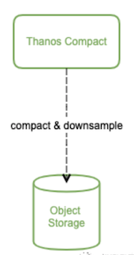

**再看架构图**


上面我们剖析了官方架构图中各个组件的设计，现在再来回味一下这张图：


另外还有 `Thanos Bucket` 和 `Thanos Checker` 两个辅助性的工具组件没画出来，它们不是核心组件，这里也就不再赘述。

### Sidecat 和 Receiver 模式

前面我们理解了官方的架构图，但其中还缺失一个核心组件 Thanos Receiver，因为它是一个还未完全发布的组件。

设计文档:  https://thanos.io/proposals/201812_thanos-remote-receive.md/


**这个组件可以完全消除 `Sidecar`，所以 Thanos 实际有两种架构图，只是因为没有完全发布，官方的架构图只给的 `Sidecar` 模式。**

`Receiver` 是做什么的呢？为什么需要 `Receiver`？它跟 Sidecar 有什么区别？

**它们都可以将数据上传到对象存储以供长期保存，区别在于最新数据的存储。**

由于数据上传不可能实时，`Sidecar` 模式将最新的监控数据存到 `Prometheus` 本机，`Query` 通过调所有 `Sidecar` 的` Store API` 来获取最新数据，这就成一个问题：如果 `Sidecar `数量非常多或者 `Sidecar` 跟 `Query` 离的比较远，每次查询 `Query` 都调所有 `Sideca`r 会消耗很多资源，并且速度很慢，而我们查看监控大多数情况都是看的最新数据。

为了解决这个问题，`Thanos Receiver` 组件被提出，它适配了 `Prometheus` 的 `remote write API`，**也就是所有 `Prometheus` 实例可以实时将数据 `push `到 `Thanos Receiver`，最新数据也得以集中起来，然后 `Thanos Query` 也不用去所有 `Sidecar` 查最新数据了，直接查 `Thanos Receiver` 即可。**

**另外，`Thanos Receiver` 也将数据上传到对象存储以供长期保存，当然，对象存储中的数据同样由 `Thanos Store Gateway` 暴露给 `Thanos Query`。**

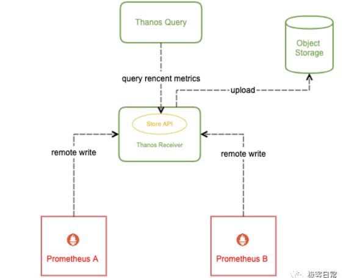

有同学可能会问：**如果规模很大，Receiver 压力会不会很大，成为性能瓶颈？当然，设计者在设计这个组件时肯定会考虑这个问题，Receiver 实现了一致性哈希，支持集群部署，所以即使规模很大也不会成为性能瓶颈。**
