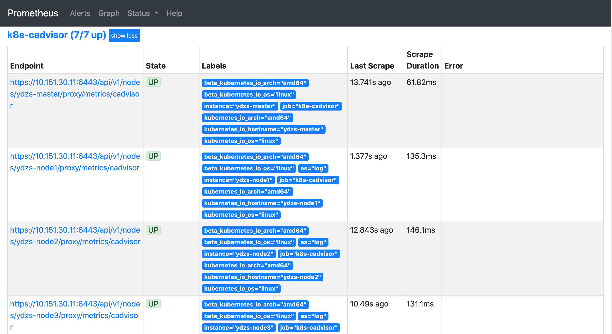

# Prometheus 监控外部 Kubernetes 集群

前面我们的文章中都是将 Prometheus 安装在 Kubernetes 集群中来采集数据，但是在实际环境中很多企业是将 Prometheus 单独部署在集群外部的，甚至直接监控多个 Kubernetes 集群，虽然不推荐这样去做，因为 Prometheus 采集的数据量太大，或大量消耗资源，比较推荐的做法是用不同的 `Prometheus `实例监控不同的集群，然后用联邦的方式进行汇总。但是使用 `Prometheus` 监控外部的 `Kubernetes` 集群这个需求还是非常有必要的。

比如现在我们要去采集 `Kubernetes` 集群 `cAdvisor` 的监控数据，我们就可以利用 `APIServer` 通过 `kubelet` 去获取到对应的数据。

如果我们对集群内部的 `Prometheus` 自动发现 `Kubernetes` 的数据比较熟悉的话，那么监控外部集群的原理也是一样的，**只是访问 `APIServer` 的形式有 `inCluster` 模式变成了 `KubeConfig` 的模式，`inCluster` 模式下在 `Pod` 中就已经自动注入了访问集群的 `token` 和 `ca.crt` 文件，所以非常方便，那么在集群外的话就需要我们手动提供这两个文件，才能够做到自动发现了**。


**接下来就首先构造 `Prometheus` 连接 `APIServer` 的信息，在通过 `kubernetes_sd_configs `做服务发现的时候只需要填入 `Kubernetes` 集群的 `api_server`、`ca_file`、`bearer_token_file` 信息即可**，要想获得这几个文件信息也比较简单。


创建用于 `Prometheus` 访问 `Kubernetes` 资源对象的 `RBAC` 对象：

```
# prom.rbac.yaml
apiVersion: v1
kind: ServiceAccount
metadata:
  name: prometheus
  namespace: kube-mon
---
apiVersion: rbac.authorization.k8s.io/v1
kind: ClusterRole
metadata:
  name: prometheus
rules:
- apiGroups:
  - ""
  resources:
  - nodes
  - services
  - endpoints
  - pods
  - nodes/proxy
  verbs:
  - get
  - list
  - watch
- apiGroups:
  - "extensions"
  resources:
    - ingresses
  verbs:
  - get
  - list
  - watch
- apiGroups:
  - ""
  resources:
  - configmaps
  - nodes/metrics
  verbs:
  - get
- nonResourceURLs:
  - /metrics
  verbs:
  - get
---
apiVersion: rbac.authorization.k8s.io/v1beta1
kind: ClusterRoleBinding
metadata:
  name: prometheus
roleRef:
  apiGroup: rbac.authorization.k8s.io
  kind: ClusterRole
  name: prometheus
subjects:
- kind: ServiceAccount
  name: prometheus
  namespace: kube-mon
```

在 Kubernetes 集群中创建上面的资源对象：

```
$ kubectl apply -f prom.rbac.yaml
```

然后获取上面的 `Prometheus` 对应的 `Secret` 的信息：

```
$ kubectl get sa prometheus -n kube-mon -o yaml
......
secrets:
- name: prometheus-token-wj7fb

$ kubectl describe secret prometheus-token-wj7fb -n kube-mon
Name:         prometheus-token-wj7fb
Namespace:    kube-mon
......

Data
====
namespace:  8 bytes
token:      <token string>
ca.crt:     1025 bytes
```

**上面的 `token` 和 `ca.crt` 信息就是我们用于访问 `APIServer` 的数据，可以将 `token` 信息保存到一个名为 `k8s.token` 的文本文件中。**

现在我们添加一个 `Prometheus` 监控外部 `Kubernetes` 集群数据的任务，如下所示：

```
# prometheus.yml
global:
  scrape_interval: 15s
  scrape_timeout: 15s
scrape_configs:
- job_name: k8s-cadvisor
  honor_timestamps: true
  metrics_path: /metrics
  scheme: https
  kubernetes_sd_configs:  # kubernetes 自动发现
  - api_server: https://10.151.30.11:6443  # apiserver 地址
    role: node  # node 类型的自动发现
    bearer_token_file: k8s.token
    tls_config:
      insecure_skip_verify: true
  bearer_token_file: k8s.token  # 上面生成的token
  tls_config:
    insecure_skip_verify: true
  relabel_configs:
  - action: labelmap
    regex: __meta_kubernetes_node_label_(.+)
  - separator: ;
    regex: (.*)
    target_label: __address__
    replacement: 10.151.30.11:6443
    action: replace
  - source_labels: [__meta_kubernetes_node_name]
    separator: ;
    regex: (.+)
    target_label: __metrics_path__
    replacement: /api/v1/nodes/${1}/proxy/metrics/cadvisor
    action: replace
```

这里 `bearer_token_file` 就是上面生成的 `k8s.token` 文件，当然我们也可以直接用 `bearer_token` 直接将对应的字符串放置在这里，另外要记得将 `api_server` 替换成你 `Prometheus` 所在的节点能访问到的 `APIServer` 地址。

**我们这里监控 `cAdvisor`，同样可以通过 `relabel_configs` 来配置，将 `__metrics_path__` 转换为 `/api/v1/nodes/${1}/proxy/metrics/cadvisor`，相当于通过 `APIServer` 代理到 `Kubelet` 上获取数据。**

当然如果你的 `Prometheus` 能够直接访问到 `kubelet`，也可以配置成直接请求，这样就相当于服务发现使用 `APIServer`，采集直接走 `Kubelet`。

配置完成后，直接启动 Prometheus 即可生效：

```
$ ./prometheus --config.file=prometheus.yaml
.......
level=info ts=2020-06-29T07:31:44.438Z caller=main.go:695 msg="TSDB started"
level=info ts=2020-06-29T07:31:44.438Z caller=main.go:799 msg="Loading configuration file" filename=prometheus.yaml
level=info ts=2020-06-29T07:31:44.448Z caller=main.go:827 msg="Completed loading of configuration file" filename=prometheus.yaml
level=info ts=2020-06-29T07:31:44.448Z caller=main.go:646 msg="Server is ready to receive web requests."
```

现在去 Prometheus 页面就可以看到采集的外部 Kubernetes 集群的数据了：



如果你要采集 `node-exporter` 或者自动发现 `Endpoints`、`Pods` 都是一样的原理。

