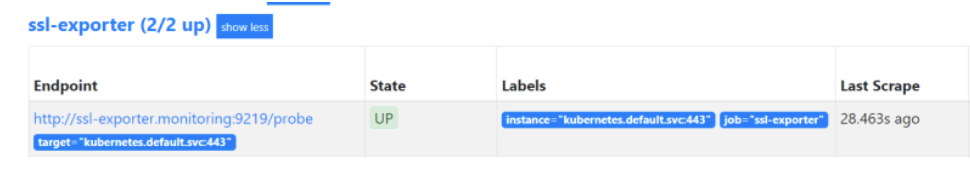

# **使用`ssl_exporter`监控K8S集群证书**


使用kubeadm搭建的集群默认证书有效期是1年，续费证书其实是一件很快的事情。但是就怕出事了才发现，毕竟作为专业搬砖工程师，每天都很忙的。

鉴于此，监控集群证书有效期是一件不得不做的事情。Prometheus作为云原生领域的王者，如果能用它来监控证书有效期并能及时告警，那就再好不过了。

`ssl_exporter`就是来做这个事情的。`ssh_exporter`是一个Prometheus Exporter能提供多种针对 SSL 的检测手段，**包括：https 证书生效/失效时间、文件证书生效/失效时间，OCSP 等相关指标。**

下面就来监听集群证书的有效期。

### 安装

```
apiVersion: v1
kind: Service
metadata:
  labels:
    name: ssl-exporter
  name: ssl-exporter
spec:
  ports:
    - name: ssl-exporter
      protocol: TCP
      port: 9219
      targetPort: 9219
  selector:
    app: ssl-exporter
---
apiVersion: apps/v1
kind: Deployment
metadata:
  name: ssl-exporter
spec:
  replicas: 1
  selector:
    matchLabels:
      app: ssl-exporter
  template:
    metadata:
      name: ssl-exporter
      labels:
        app: ssl-exporter
    spec:
      initContainers:
        # Install kube ca cert as a root CA
        - name: ca
          image: alpine
          command:
            - sh
            - -c
            - |
              set -e
              apk add --update ca-certificates
              cp /var/run/secrets/kubernetes.io/serviceaccount/ca.crt /usr/local/share/ca-certificates/kube-ca.crt
              update-ca-certificates
              cp /etc/ssl/certs/* /ssl-certs
          volumeMounts:
            - name: ssl-certs
              mountPath: /ssl-certs
      containers:
        - name: ssl-exporter
          image: ribbybibby/ssl-exporter:v0.6.0
          ports:
            - name: tcp
              containerPort: 9219
          volumeMounts:
            - name: ssl-certs
              mountPath: /etc/ssl/certs
      volumes:
        - name: ssl-certs
          emptyDir: {}
```
 
执行`kubectl apply -f .`安装即可。 

待Pod正常运行，如下：

```
# kubectl get po -n monitoring -l app=ssl-exporter
NAME                            READY   STATUS    RESTARTS   AGE
ssl-exporter-7ff4759679-f4qbs   1/1     Running   0          21m
```

然后配置prometheus抓取规则。

> !! 由于我的Prometheus是通过Prometheus Operator部署的，所以通过additional的方式进行抓取。

首先创建一个文件`prometheus-additional.yaml`，其内容如下：

```
- job_name: ssl-exporter
  metrics_path: /probe
  static_configs:
  - targets:
    - kubernetes.default.svc:443
  relabel_configs:
  - source_labels: [__address__]
    target_label: __param_target
  - source_labels: [__param_target]
    target_label: instance
  - target_label: __address__
    replacement: ssl-exporter.monitoring:9219
```

然后创建secret，命令如下：

```
kubectl delete secret additional-config -n monitoring
kubectl -n monitoring create secret generic additional-config --from-file=prometheus-additional.yaml
```

然后修改`prometheus-prometheus.yaml`配置文件，新增如下内容：

```
  additionalScrapeConfigs:
    name: additional-config 
    key: prometheus-additional.yaml 
```

`prometheus-prometheus.yaml`的整体配置如下：

```
apiVersion: monitoring.coreos.com/v1
kind: Prometheus
metadata:
  labels:
    prometheus: k8s
  name: k8s
  namespace: monitoring
spec:
  alerting:
    alertmanagers:
    - name: alertmanager-main
      namespace: monitoring
      port: web
  baseImage: quay.io/prometheus/prometheus
  nodeSelector:
    kubernetes.io/os: linux
  podMonitorNamespaceSelector: {}
  podMonitorSelector: {}
  replicas: 2
  resources:
    requests:
      memory: 400Mi
  ruleSelector:
    matchLabels:
      prometheus: k8s
      role: alert-rules
  securityContext:
    fsGroup: 2000
    runAsNonRoot: true
    runAsUser: 1000
  additionalScrapeConfigs:
    name: additional-config 
    key: prometheus-additional.yaml 
  serviceAccountName: prometheus-k8s
  serviceMonitorNamespaceSelector: {}
  serviceMonitorSelector: {}
  version: v2.11.0
  storage:
    volumeClaimTemplate:
      spec:
        storageClassName: managed-nfs-storage 
        resources:
          requests:
            storage: 10Gi
```

然后重新执行`prometheus-prometheus.yaml`文件，命令如下：

```
kubectl apply -f prometheus-prometheus.yaml
```
现在可以在prometheus的web界面看到正常的抓取任务了，如下：



然后通过`(ssl_cert_not_after-time())/3600/24`即可看到证书还有多久失效。


通过`ssl_tls_connect_success`可以观测ssl链接是否正常。


## 告警

上面已经安装`ssl_exporter`成功，并且能正常监控数据了，下面就配置一些告警规则，以便于运维能快速知道这个事情。

```
apiVersion: monitoring.coreos.com/v1
kind: PrometheusRule
metadata:
  name: monitoring-ssl-tls-rules
  namespace: monitoring
  labels:
    prometheus: k8s
    role: alert-rules
spec:
  groups:
  - name: check_ssl_validity
    rules:
    - alert: "K8S集群证书在30天后过期"
      expr: (ssl_cert_not_after-time())/3600/24 <30
      for: 1h
      labels:
        severity: critical
      annotations:
        description: 'K8S集群的证书还有{{ printf "%.1f" $value }}天就过期了,请尽快更新证书'
        summary: "K8S集群证书证书过期警告"
  - name: ssl_connect_status
    rules:
    - alert: "K8S集群证书可用性异常"
      expr: ssl_tls_connect_success == 0
      for: 1m
      labels:
        severity: critical
      annotations:
        summary: "K8S集群证书连接异常"
        description: "K8S集群 {{ $labels.instance }}  证书连接异常"
```

如下展示规则正常，在异常的时候就可以接收到告警了。


